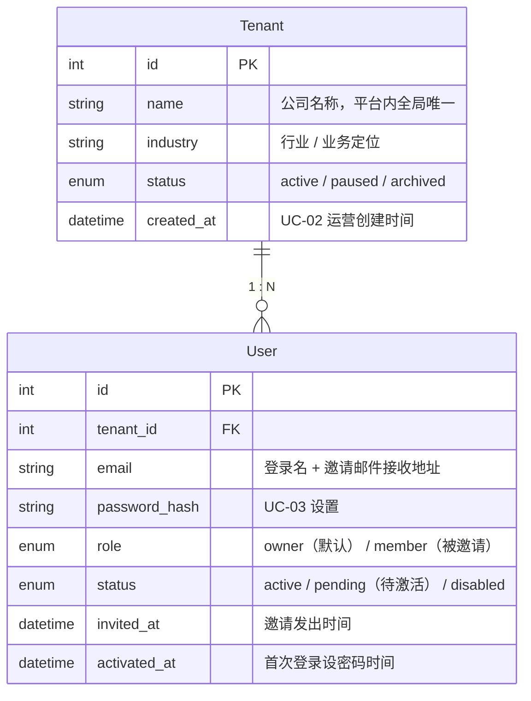
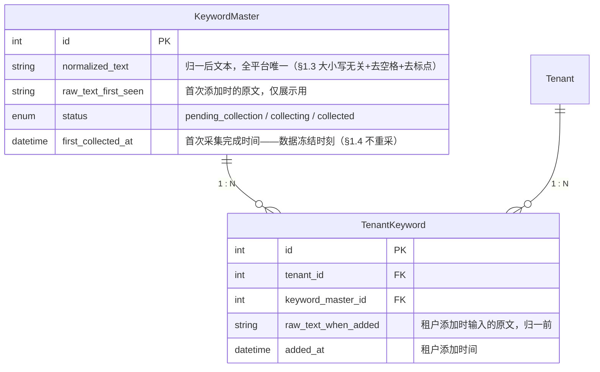
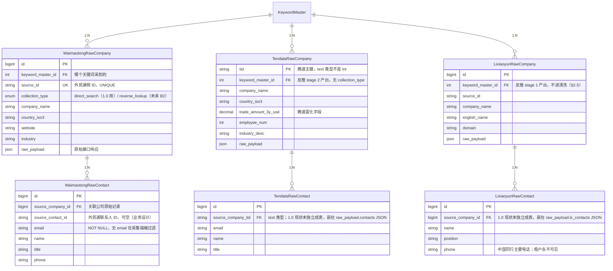
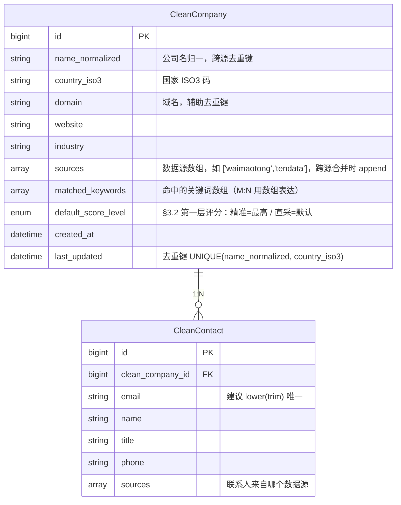
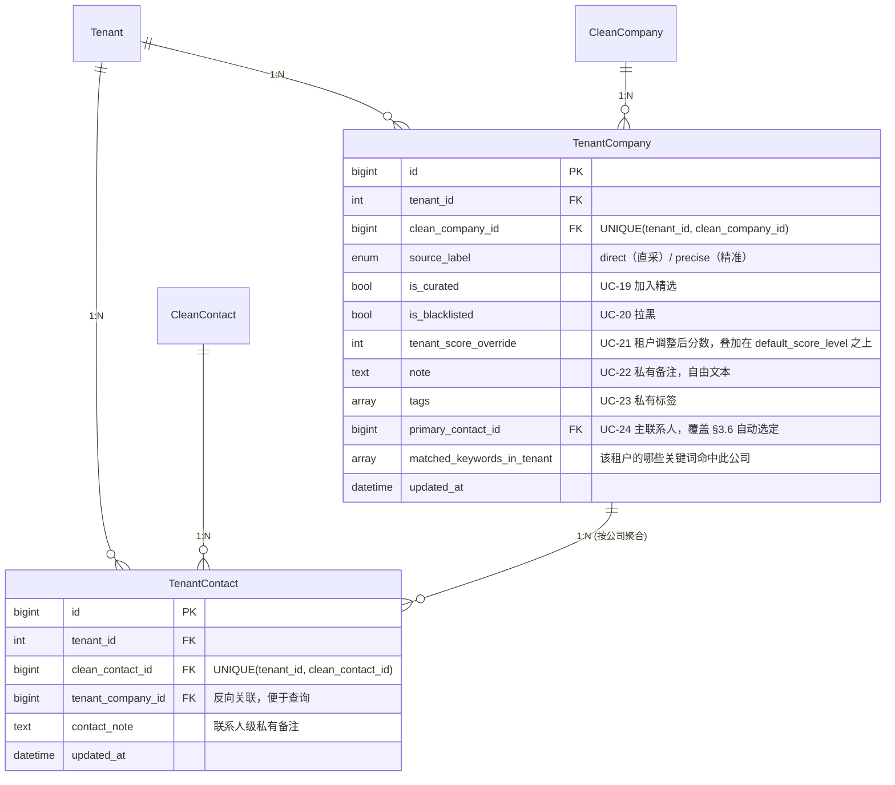
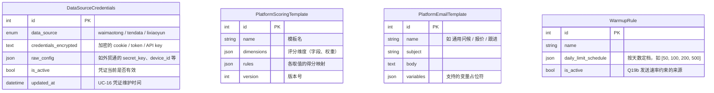
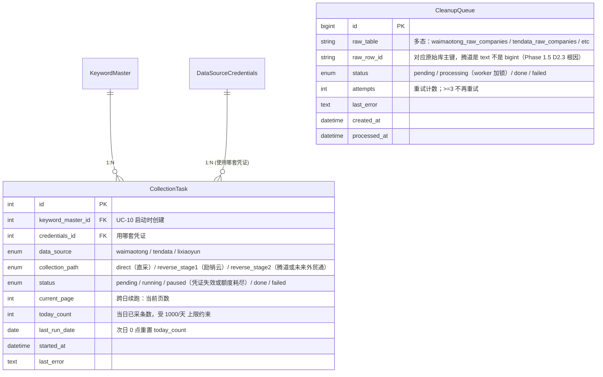
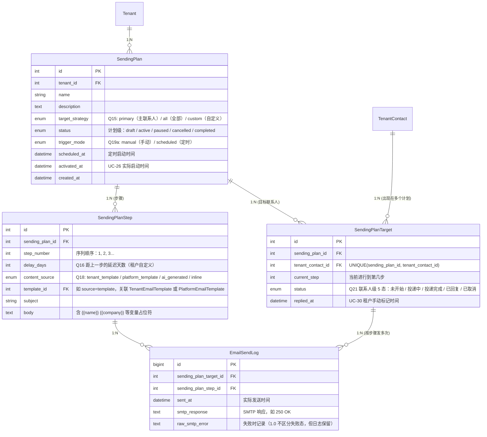
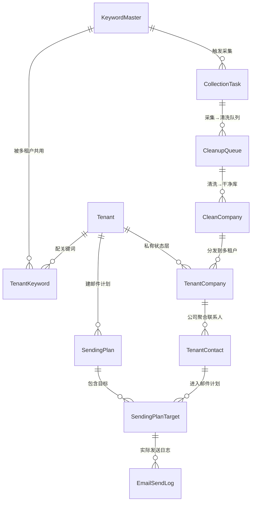

# Client Get 业务流程对齐 — 工作稿

> **本文档是与业务方对话过程中的工作沉淀**。每答完一道 Q 就追加更新。
> 对话结束后将演化为正式的 `docs/business-flow.md`（业务规则书）+ `docs/business-status-map.md`（业务现状地图）。
>
> **更新日期**：2026-05-01
> **当前进度**：业务流主线梳理（Q1-Q24）✅ + 完整用例图（UC-01 ~ UC-33）✅
> **下一步**：业务方 review 用例图 → 进入「现状对照」阶段，把代码现状一格格填进业务地图
>
> **范围说明**：本文档聚焦业务流 + 用例图。运营 SOP 细节、数据导出等不属于业务流主体，不在本文档范围。

---

## 0. 业务大方向（已对齐）

- **业务因果链**：直采 + 反推 → 清洗 → 分发 → 租户使用
- **直采与反推同等重要**——不是差异化卖点之争，两条都必须达标
- **目标客户**：海外客户（仅英文关键词、不考虑中文 / 多语言混合）

---

## 1. Day 0-1 — 租户进入与配置阶段

### 1.1 租户创建（Q1）
- 销售线下成交 → 平台运营在 admin 后台创建租户 → 给租户开账号
- **不**存在自助注册付费流程

### 1.2 AI 配置（Q2）
- OpenRouter 由**租户自行**注册并掏钱
- 配置入口**冗余 2 处**（同一份配置）：
  - admin 端租户详情页（运营帮配）
  - tenant 端管理页（租户自配）

### 1.3 关键词配置（Q3, Q5, Q7）
- **配置者**：租户自己配（隐含约束：UI 必须对传统外贸厂老板友好）
- **数量上限**：无
- **同一性判定**（当前 1.0）：大小写无关 + 去空格 + 去标点
  - `PCB-board` / `pcb board` / `PCB BOARD` 是**同**一关键词
  - `PCB` 与 `printed circuit board` 是**两**个关键词（同义不识别）
  - `PCBA` 与 `PCB` 是**两**个关键词
  - **未来**可能升级到智能同义识别（保留扩展位）
- **语言**：仅英文

### 1.4 关键词触发（Q4, Q6）
- **首次收录**（全平台从未采过的关键词）：运营在 admin **手动**点启动
- **历史已收录**：自动复用既有数据，**零触发**
- **数据时效**（已收录关键词）：全量历史 + 不再更新；数据冻结
- **重采机制**：1.0 完全不做（既不自动也不手动）

---

## 2. 采集架构（Q8）

### 2.1 启动 = 两条路径并行

```
[运营点启动一个关键词]
    │
    ├──→ 路径 A：直采
    │      外贸通 ─→ waimaotong_raw_*           (collection_type = direct_search)
    │
    └──→ 路径 B：反推
          stage 1: 励销云 ─→ lixiaoyun_raw_*    (产出中国同行清单)
          stage 2: 用 stage 1 的中国同行清单【并行】喂入：
                ├─ B1: 腾道    ─→ tendata_raw_*       (1.0 已做)
                └─ B2: 外贸通  ─→ waimaotong_raw_*    (collection_type = reverse_lookup, 1.0 不做、未来加)

          【B1 与 B2 是并行补充，不是二选一】
```

### 2.2 原始库结构与职责矩阵

原始库按【渠道 × 类型】建表，共 **6 张表**（3 个数据源 × 公司 + 联系人）：

| 数据源 | 公司表 | 联系人表 |
|---|---|---|
| 外贸通 | `waimaotong_raw_companies` | `waimaotong_raw_contacts` |
| 腾道 | `tendata_raw_companies` | `tendata_raw_contacts` |
| 励销云 | `lixiaoyun_raw_companies` | `lixiaoyun_raw_contacts` |

每张公司表的来源职责矩阵（联系人表跟随对应的公司表）：

| 公司表 | 直采 | 反推 stage 1 | 反推 stage 2 | 进干净库 |
|---|:---:|:---:|:---:|:---:|
| `waimaotong_raw_companies` | ✅ 1.0 | — | 🔜 未来 | ✅ |
| `tendata_raw_companies` | — | — | ✅ 1.0 | ✅ |
| `lixiaoyun_raw_companies` | — | ✅ 1.0 | — | ❌ |

**架构原则**：
- 原始库按【渠道 × 类型】建表 → 共 6 张实表
- 公司 ↔ 联系人 = **1 : N**
- 同一张公司表内可混合多种采集来源，用 `collection_type` 字段区分
- 1.0 schema 已预留 `direct_search` / `reverse_lookup` 两个值域；未来 B2 启用是 plug-in 而非改架构

### 2.3 清洗与干净库

- **清洗源**：外贸通原始 + 腾道原始（**励销云不进清洗**）
- **产物**：`clean_companies` + `clean_contacts`（公司 ↔ 联系人 = 1 : N）

### 2.4 数据可见性（统一规则）

| 数据层 | admin 运营 | 租户 |
|---|:---:|:---:|
| **原始库**（6 张：3 公司 + 3 联系人） | ✅ 全部可见 | ❌ 不可见 |
| **干净库**（`clean_companies` + `clean_contacts`） | ✅ 全部可见 | ✅ 命中该关键词的租户可见 |

### 2.5 业务设计：励销云数据租户永不可见

- 中国同行清单仅作反推 stage 2 的输入
- 租户业务上不需要看到中国同行
- → 这就是为什么励销云不进干净库

### 2.6 双路径命中同一公司

- **合并成一条记录**（如同一家德国公司既被外贸通直采到、又被外贸通反推到）
- collection_type 字段升级
- 1.0 用不上（B2 未启用），Phase 2 才需要落地

### 2.7 每日采集上限（关键容量约束）

**核心规则**：

| 项 | 内容 |
|---|---|
| **每日采集上限** | 1000 条 |
| **原因** | HTTP 爬取（不是开放 API），过频请求触发对方风控、可能封号 |
| **超额处理** | 跨日续跑——剩下的次日继续抓 |

**业务后果**：
- 一个关键词若有 5000 潜在客户 → 需要 **5 天**才能采完
- 多关键词 / 多租户竞争额度时需要排队调度
- 这是平台规模化的**核心容量瓶颈**

**作用粒度（Q24）**：**数据源级**——每个数据源各 1000/天 独立计数。

| 数据源 | 主消耗路径 | 容量定位 |
|---|---|---|
| **外贸通 1000/天** | 直采（路径 A） | 核心瓶颈——直采是租户主入口 |
| **腾道 1000/天** | 反推 stage 2 | 次要瓶颈——反推路径关键 |
| **励销云 1000/天** | 反推 stage 1（搜中国同行） | 实际消耗较少（中国同行数量 < 海外采购商） |

**理论日峰**：3000 条数据/天（三池独立）

**Phase 2 隐含风险**：B2 启用后，外贸通同时被「直采」+「反推 stage 2」挤占，瓶颈更紧。

**部分回答之前挂起的问题**：
- 「首采的承诺时间」 → 取决于关键词的潜在客户数量 + 1000/天 上限 + 排队顺序
- 「无上限关键词的运营压力」 → 受 1000/天 上限自然约束，不会无限堆积

---

## 3. 租户客户库视图（Q9）

### 3.1 直采 vs 精准客户的呈现

- **统一视图**：一个客户列表（对应 `/companies`），所有客户混在一起
- **标签区分来源**：每条记录上挂可见标签——"直采" / "精准"
- 租户可按标签筛选

### 3.2 评分模型：双层叠加

- **第一层（系统赋予默认等级）**
  - 反推路径产出的客户 = **默认评分等级最高**
  - 直采客户 = 默认等级（具体级别待补）
- **第二层（租户级配置规则）**
  - 评分维度 / 精选规则 / 联系人优先级 = 租户级一套规则
  - 直采和精准客户**共用同一套**租户级规则
- **隐含含义**：精准客户的差异化价值通过**两个机制**传达——标签可见 + 默认高等级

### 3.3 术语区分（已澄清）

| 术语 | 含义 | 代码入口 |
|---|---|---|
| **精准** | 反推路径产出的客户**来源标签**（业务术语） | 在 `/companies` 列表里以标签形式可见 |
| **精选** | 租户 / AI / 运营从全部客户里筛出来的子集（运营动作产物） | `/curated-customers` 独立页面 |

→ 两者不是同一回事，是**正交**的两个概念（同一客户可能同时是「精准」+「精选」，也可能只是「精准」非「精选」）

### 3.4 多租户客户分发（Q10）

**分发规则**：凡是命中关键词的租户都看到该客户。

**具体场景**：
- 王总（A，PCB 厂）+ 李总（B，PCB 厂）都配 `PCB`，张总（C，LED 显示屏）配 `LED display`
- 采到 ABC GmbH（命中 `PCB` 关键词）
- 王 + 李都看到 ABC；张看不到

**一致性保证**：
- 王总和李总看到的同一家 ABC GmbH，**基础数据完全一致**
- 唯一数据源 = `clean_companies` + `clean_contacts`
- 没有跨租户的数据差异化

**隐含含义**：
- 多租户共享同关键词时，他们实际上在**抢同一批潜在买家**——平台没有给租户做差异化
- 这进一步强化 [Phase 1.5 D1 多租户漏数据](spec-phase1.5-collection-pipeline-refactor.md) 的严重性——它直接破坏"凡命中租户都看到"这条核心规则

### 3.5 租户私有状态层（Q11）

**核心原则**：基础数据共享 + 租户操作/状态完全隔离。

```
[干净库 clean_companies + clean_contacts]      ← 平台级共享，所有命中租户共用
              ↓
[+ 租户私有状态层 (per tenant)]                 ← 完全隔离，租户间不可见
              ↓
[租户最终看到的客户库视图]
```

**完全租户私有**：王总在 ABC 上做的所有操作 / 状态，李总都看不到；李总有自己独立的一份。

**业务后果**：
- 王总精选了 ABC、发了 5 封邮件、标记"重点跟进"——李总打开 ABC 时只看到基础数据，不知道王总的动作
- 没有"市场情报冒泡"——平台不让其他租户看到任何关于"哪家公司被竞争对手追"的信号
- 合规友好：租户的客户运营行为对其他租户完全保密

**具体字段范围**（Q12）：

| # | 字段 | 含义 |
|---|---|---|
| 1 | **是否精选** | 加入 `/curated-customers` 列表 |
| 2 | **是否拉黑** | 不再考虑这家公司 |
| 3 | **租户级评分调整** | 在系统默认等级之上，租户做加减 / 覆盖 |
| 4 | **私有备注** | 自由文本 |
| 5 | **私有标签** | 租户自定义标签体系 |
| 6 | **联系人级状态** | 主联系人标记 + 联系人备注 + 邮件发送/打开/回复历史 |
| 7 | **邮件状态** | 三态：未开始 / 投递中 / 投递完成（粒度待 Q13 澄清） |

**明确不在租户私有状态层（重要 scope 决策）**：

- **「选中」**：临时 UI 交互态（用于"勾选一批客户 → 新建邮件计划"），**不持久化**为字段
- **CRM 销售漏斗**（潜在 → 接触 → 谈单 → 成交）：1.0 **不做**——产品聚焦"邮件营销进度"，不做销售管理

**邮件状态聚合规则（Q13）**：

客户库列表中的公司行"邮件状态"由联系人级状态聚合而来。三态优先级：**投递中 > 未开始 > 投递完成**

| 联系人级状态分布 | 公司行聚合 |
|---|---|
| 任一联系人在投递中 | **投递中** |
| 都不在投递中，但任一未开始 | **未开始** |
| 全部联系人都投递完成 | **投递完成** |

→ 数据存储粒度：**联系人级**；UI 展示：**聚合到公司行**

### 3.6 联系人优先级规则（Q14）

**配置入口**：[`/settings/contact-rules`](../frontend/apps/tenant/src/pages/Settings/ContactRules/index.tsx)

**配置形式**：租户配置一个**职位关键词优先级序列**

```
示例: CEO > 总经理 > 老板 > 采购经理 > 销售 > 其他
```

**作用场景**：同一套规则驱动以下 3 个场景：

| 场景 | 作用 |
|---|---|
| 联系人列表展示 | 按职位优先级**排序** |
| 主联系人自动选定 | 系统按规则自动选一个 contact 作为公司主联系人 |
| 邮件计划默认目标 | 建邮件计划时，自动选符合规则的联系人作为发送对象 |

**关键设计**：
- **不做过滤** —— generic 邮箱、无姓名联系人**仍然展示**，只是排在后面
- 配置维度仅按"职位关键词"（不区分 personal/generic 邮箱、不按字段完整度过滤）

---

## 4. Day N+1 邮件营销（邮件计划阶段）

### 4.1 邮件计划的目标人群定义（Q15）

王总从客户库勾选 N 家公司、点「新建邮件计划」时，**目标人群由租户在创建时选择策略**：

| 策略 | 目标人群 | 适用场景 |
|---|---|---|
| **主联系人** | 每家公司 1 个（按 Q14 规则自动选） | 高质量、低数量、精准营销 |
| **全部联系人** | 每家公司全部联系人 | 广撒网，提高回复率 |
| **自定义** | 租户手动逐个选 | 精细化场景，租户自己决定 |

→ UI 设计：新建邮件计划页面有"目标人群策略"选择项，三选一

### 4.2 邮件计划的结构（Q16）

邮件计划是**混合结构**——创建时租户决定要不要做序列：

| 模式 | 含义 |
|---|---|
| **单封邮件** | 一个计划只发一封邮件，发完结束 |
| **多步骤序列** | 一个计划包含 N 个步骤（如 Day 1 首发 → Day 4 跟进 → Day 8 最后催） |

**序列模式下的两个关键规则**：

- **步骤间隔**：租户自定义每一步的延迟天数（不绑死系统固定模板，适配不同行业的最佳跟进节奏）
- **中断条件**：对方回复后，停止后续邮件
- **中断粒度（Q17）**：**公司级**——一家公司有任一联系人回复，整公司的所有联系人停止后续序列
- **业务理由**：B2B 逻辑下，一家公司里任何人回复 = 公司已注意到；再发就是噪音 + 骚扰风险

### 4.3 邮件内容来源（Q18）

每一步邮件内容支持 **4 种来源任选**，1.0 全部支持：

| 来源 | 入口 | 说明 |
|---|---|---|
| **租户级模板库** | tenant 端 [`/templates`](../frontend/apps/tenant/src/pages/Templates/index.tsx) | 租户自己预先建好的模板 |
| **平台级模板库** | admin 端 `/email-templates`（租户可引用） | 运营建的通用模板（问候 / 报价 / 跟进） |
| **AI 实时生成** | 邮件计划页面内置 | 基于客户公司 + 租户产品信息 AI 现写 |
| **直接现写** | 邮件计划页面内置 | 不走模板库，直接输入 |

→ 创建邮件计划时，每一步可独立选择来源。

### 4.4 邮件计划的启动与速率（Q19）

**启动方式**：

| 模式 | 含义 |
|---|---|
| **手动启动** | 王总点"启动"按钮，立刻开始发 |
| **定时启动** | 设个时间（如明天 9 点），到时自动开始 |

→ 创建计划时租户选择触发方式（两种都支持），无需运营 / 管理员审批。

**发送速率**：受 admin 端 [`/warmup-rules`](../frontend/apps/admin/src/pages/WarmupRules/index.tsx) 配置的**邮箱预热规则**统一约束。

- 租户不能突破预热档位
- 业务理由：保护发件邮箱信誉、防止垃圾邮件标记
- 隐含设计：发送速率是平台级控制（运营定档位）、不是租户自定义

### 4.5 回复识别机制（Q20）

**1.0 简化决策：仅 UI 手动标记**

| 机制 | 1.0 状态 |
|---|---|
| **IMAP 自动检测** | ❌ 不做（推迟到后续版本） |
| **UI 手动标记** | ✅ 唯一路径——租户在客户库 / 邮件计划页面主动点"已回复" |

**业务 trade-off**：
- ✅ 节省 IMAP 工程量、节省 IMAP 凭证管理 / 域名验证 / 收信归属算法的复杂度
- ⚠️ 租户责任更重：必须主动登录、主动维护
- ⚠️ Q16「公司级中断」的实际生效依赖租户标记——**租户忘标 → 序列继续发 → 可能骚扰对方**

**租户配置门槛清单**（Day 0-1 / Day N+1 累计）：
- OpenRouter API key
- 发件邮箱 SMTP 凭证（用于发送，不需要 IMAP）
- 关键词
- 评分维度 / 联系人优先级 / 邮件模板

### 4.6 邮件状态机（Q21）

**1.0 = 5 态状态机**：

```
未开始 ─→ 投递中 ─→ 投递完成
                       │
                       ├─→ 已回复（租户手动标）
                       │
[创建后任意时点] ──────→ 已取消（租户主动停掉计划）
```

| 状态 | 触发 | 备注 |
|---|---|---|
| **未开始** | 计划已创建但未启动，或步骤未到延时点 | |
| **投递中** | 邮件正在发出（受预热档位限速） | |
| **投递完成** | 邮件已发出 SMTP 250 OK | 1.0 不区分送达 vs 退信 |
| **已回复** | 租户手动标记 | Q20 唯一路径 |
| **已取消** | 租户主动停掉邮件计划 | 计划级、联系人级粒度待定 |

**1.0 不做的状态**：
- ❌ **投递失败 / 退信**：1.0 不显式记录退信，发出后即认为"投递完成"
- ❌ **已打开未回复**：不做开信追踪、不嵌追踪像素

**Q13 聚合规则的扩展**：原三态聚合规则现在需要按 5 态重写——公司行从 5 态联系人状态如何聚合？（挂起，1.0 实施时需补一个聚合优先级表）

### 4.7 「已回复」事件的下游反应（Q22）

王总手动标"已回复"时，系统**仅做状态变化** + 触发 Q16 公司级中断：

| 系统反应 | 1.0 是否做 |
|---|---|
| 状态变化（联系人 → 已回复） | ✅ |
| Q16 公司级中断（停整公司后续邮件） | ✅ |
| 自动给联系人/公司加分 | ❌ 1.0 不做 |
| 自动加入"二次营销待跟进"列表 | ❌ 1.0 不做 |
| 通知/弹窗提醒租户 | ❌ 1.0 不做 |

**业务后果**：
- **二次营销**：租户主动重走 Q15 流程（从客户库勾选已回复客户、新建计划、配模板、启动）
- **评分调整**：租户手动改（Q12 字段 3「租户级评分调整」）
- **发现回复**：租户通过自己的邮箱看到，触发到平台标记

### 4.8 邮件计划复盘维度（Q23）

**1.0 包含的复盘维度**：

| 维度 | 含义 | 入口 |
|---|---|---|
| **计划级 KPI** | 总投递数 / 总回复数 / 回复率 / 平均回复时长 | 邮件计划详情页 |
| **步骤级对比** | 第 1 封 vs 第 2 封 vs 第 3 封的回复率（序列优化反馈） | 邮件计划详情页 |
| **跨计划趋势** | 多个历史计划的整体效果对比 | [`/email-monitor`](../frontend/apps/tenant/src/pages/EmailMonitor/index.tsx) |
| **整体 dashboard** | 累计指标综合视图 | [`/dashboard`](../frontend/apps/tenant/src/pages/Dashboard/index.tsx) |

**1.0 不做的复盘维度**（重要 scope 决策）：

- ❌ 模板级对比（不做"模板 A/B 测试"分析）
- ❌ 客户来源对比（不区分直采 vs 精准客户的 ROI）
- ❌ 联系人质量反推（不基于回复回推联系人质量分）

**产品定位捕获**：1.0 = **邮件营销执行工具**，不是**营销分析平台**。跟"不做 CRM 漏斗"一致。

---

## 5. 业务期望 vs 代码现状（差距清单）

| 项 | 业务期望 | 代码现状 | 备注 |
|---|---|---|---|
| 3 张公司原始表 | ✅ 已建 | ✅ 已建 | T-1.B migration 完成 |
| `waimaotong_raw_contacts` | ✅ 应有 | ✅ 已建 | v3 补丁今天补完 |
| `tendata_raw_contacts` | ✅ 应有 | ❌ 没建——联系人嵌在 `tendata_raw_companies.raw_payload.contacts` | [Phase 1.5 D2.10](spec-phase1.5-collection-pipeline-refactor.md) |
| `lixiaoyun_raw_contacts` | ✅ 应有 | ❌ 没建——联系人嵌在 `lixiaoyun_raw_companies.raw_payload.lx_contacts` | Phase 1.5 D2.10 |
| `clean_companies` 干净公司库 | ✅ | ✅ | T-5 已完成 |
| **`clean_contacts` 干净联系人库** | ✅ | ❌ **没建** | 业务必需，1.0 缺口；Phase 1.5 D2.10 |
| 励销云不进干净库 | ✅ | ✅ | cleanup_service 已对励销云直接标 done |

→ **隐含业务影响**：当前租户在客户库看到的"联系人"，是从 raw 层 JSON 现挖的，没有跨源去重合并。一家公司被双路命中时，联系人可能重复出现。

---

## 6. 已挂起的二阶问题（之后追，不堵主流）

- **励销云 → 反推 stage 2 的喂入机制**：中国同行清单具体怎么传给腾道 / 外贸通？是 worker 内部直接调还是写入某个中间表后被 stage 2 读取？
- **双路径合并的字段冲突处理**：合并成一条后，name / website / 字段不一致怎么取舍？（Phase 2 才决策）
- **关键词配错/改/删的可逆性**：王总配错了怎么撤回？删了已命中的客户怎么办？
- ~~**首采的承诺时间**~~ → 已回答：取决于关键词容量 / 数据源 1000 上限 / 排队顺序
- ~~**无上限关键词的运营压力**~~ → 已回答：受数据源级 1000/天 自然约束
- **多关键词竞争同一数据源时的调度策略**：FIFO 排队？并发分摊（每个关键词均匀切分 1000）？运营手动调优先级？
- **租户首采体验承诺**：一个租户一天可能 0 条数据进库（如果队列前面把 1000 吃光），怎么对租户承诺？
- **系统默认评分等级的具体级别**：反推 = "最高"，那评分体系总共几级？直采的默认等级具体是哪一级？租户级规则与系统默认等级的关系——覆盖、加减、还是仅作展示参考？
- **联系人优先级规则的边缘 case**：没邮箱的联系人是否会被邮件计划默认目标自动排除？同一职位等级多联系人怎么排序？没职位信息的怎么处理？
- **邮件序列的最大步骤数**：是否有上限？租户能否任意加步骤？
- **预热档位的具体形式**：每日 50→100→200 封？谁定义档位？所有租户共用一份预热档位还是每个租户/每个发件域名独立？
- **发件邮箱的来源**：平台代发（`@clientget.com`）/ 租户自有邮箱（`@abc.com`）/ 混合？
- **域名验证**：SPF/DKIM/DMARC 谁配置？租户自配还是平台代配？
- **排队机制**：计划 1000 封但每日预热档位 100 封，剩下 900 封怎么处理？积压队列？跨日续发？
- **手动回复标记的体验风险**：1.0 完全靠租户主动标，租户忘标 → 后续序列继续骚扰对方。是否需要"提醒未标记回复"机制？UI 上是否有"快速标记"入口？
- **「已取消」的粒度**：是计划级（取消整个邮件计划）还是联系人级（只取消某个联系人的后续）？
- **退信处理**：1.0 不显式记录退信，但 SMTP 实际退回时怎么处理？联系人是否标"无效"？是否影响评分？

---

## 8. 用例图（Use Case Specs）

> 本章节是 §1-§4 业务流的「交互视角」补充。每个 UC 包含 Actor / 前置条件 / 触发 / 主流程（含输入输出）/ 异常路径 / 后置条件。
>
> **覆盖**：33 个 UC，6 个 Actor，6 个业务阶段（销售-配置-采集-客户库-邮件营销-复盘）。索引见 §8.7。

### 8.0 Actor 清单

| Actor | 类型 | 描述 |
|---|---|---|
| **销售** | 人，外部 | 与目标客户（外贸厂老板）线下沟通成交，将名单交给运营 |
| **平台运营（admin）** | 人，内部 | 通过 admin 后台管理平台资源、执行运营动作 |
| **租户用户**（如王总） | 人，外部 | 通过 tenant 端使用平台；**租户内部不细分角色**，由 RBAC 权限控制 |
| **系统自动调度** | system | 后台 worker / 定时任务 / 触发器，自动执行清洗、分发、发送、IMAP 检测等 |
| **外部数据源**（外贸通 / 腾道 / 励销云） | system，外部 | 平台爬虫接入，受 1000/天/数据源 容量约束 |
| **邮件收件人**（如 Anna） | 人，间接 | 不登录平台；与平台的交互是「邮件被发送 → 在自己邮箱回邮 → 租户手动标记」 |

### 8.1 阶段 0：销售与租户创建

#### UC-01 销售签约

| 维度 | 内容 |
|---|---|
| **Actor** | 销售 |
| **类型** | 线下流程，不直接接触系统 |
| **前置条件** | 销售已与目标客户完成线下沟通、报价、合同协商 |
| **触发** | 客户付款 / 合同签订完成 |
| **后置条件** | 工单已提交至运营，等待 UC-02 处理 |

**主流程（Happy Path）**

| # | 操作 |
|---|---|
| 1 | 销售收齐租户基础信息（公司名 / 联系人 / 行业 / 订阅档位） |
| 2 | 销售确认客户付款到账 |
| 3 | 销售将信息整理成工单（飞书 / 邮件 / 工单系统） |
| 4 | 销售将工单提交给运营 |
| 5 | 运营接收 → 进入 UC-02 |

**输入**

| 字段 | 必填 | 说明 |
|---|:---:|---|
| 公司名称 | ✅ | |
| 主联系人姓名 + 电话 | ✅ | 如：王总 |
| 行业 / 业务定位 | ✅ | 如：PCB 制造 |
| 订阅档位 | | 平台分档计费时 |
| 合同号 / 付款凭证 | ✅ | |

**系统响应**：本 UC 不直接接触系统（纯线下交付）

**输出**

| 渠道 | 内容 |
|---|---|
| 工单 | 一份完整的"待创建租户工单"提交至运营队列 |

**异常路径**

| # | 触发 | 处理 |
|---|---|---|
| A1 | 客户付款未到账 | 销售延期提交，工单挂起 |
| A2 | 信息不齐 | 销售联系客户补齐再提交 |
| A3 | 客户中途取消 | 销售关闭工单 |
| A4 | 客户重复签约（已是平台租户） | 销售先去 admin 查询是否存在租户记录 |

---

#### UC-02 运营创建租户

| 维度 | 内容 |
|---|---|
| **Actor** | 平台运营（admin） |
| **前置条件** | 接收到 UC-01 提交的工单 |
| **触发** | 在 admin 后台点击"新建租户" |
| **后置条件** | 租户进入 `active` 状态；owner 账号可登录；工单可关闭并反馈销售；进入 UC-03 |

**主流程（Happy Path）**

| # | 操作 |
|---|---|
| 1 | 运营登录 admin 端 |
| 2 | 进入 [/admin/tenants](../frontend/apps/admin/src/pages/Tenants/index.tsx) |
| 3 | 点击"新建租户"按钮 → 弹出表单 |
| 4 | 填写租户信息（见输入） |
| 5 | 提交表单 |
| 6 | 系统校验唯一性 → 写入数据库 → 创建默认 owner 账号 |
| 7 | 系统发送邀请邮件至 owner 邮箱（含登录链接 + 临时密码） |
| 8 | UI 跳转至 `/admin/tenants/{id}` 详情页，显示"创建成功" |
| 9 | 运营反馈给销售 |

**输入**

| 字段 | 必填 | 说明 |
|---|:---:|---|
| 公司名称 | ✅ | 平台内全局唯一 |
| 主联系人姓名 | ✅ | |
| 联系人邮箱 | ✅ | owner 账号登录名 + 邀请邮件接收地址 |
| 联系电话 | | |
| 行业 / 业务定位 | | |
| 订阅档位 | | 如有 |
| 状态 | | 默认 `active` |

**系统响应**

| 类型 | 操作 |
|---|---|
| 校验 | 公司名称唯一性、邮箱格式合法、必填字段非空 |
| 写入 | `tenants` +1 行；`users` +1 行（owner 角色 + 临时密码） |
| 触发 | 发送邀请邮件至 owner 邮箱（含登录链接 + 一次性 token） |
| 记录 | 操作日志：`who created tenant X at timestamp T` |

**输出**

| 渠道 | 内容 |
|---|---|
| UI | 表单关闭，跳转至 `/admin/tenants/{id}` 详情页，显示"创建成功" |
| 数据库 | `tenants` +1 行，`users` +1 行 |
| 邮件 | owner 收到含登录链接的邀请邮件 |
| 副作用 | 租户进入"可登录"状态 |

**异常路径**

| # | 触发 | 处理 |
|---|---|---|
| A1 | 公司名称已存在 | 表单提示"已被使用，请改名"，阻塞提交 |
| A2 | 邮箱格式不合法 | 表单字段校验提示，阻塞提交 |
| A3 | 邀请邮件发送失败（SMTP 故障） | 创建仍成功，UI 显示警告"邮件未送达，请手动复制临时密码给租户" |
| A4 | 必填字段缺失 | 表单校验阻塞提交 |
| A5 | 邮箱已被另一租户占用 | 提示"邮箱已注册，请确认是否重复创建" |

---

### 8.2 阶段 1：租户配置（UC-03 ~ UC-09）

#### UC-03 租户首次登录

| 维度 | 内容 |
|---|---|
| **Actor** | 租户用户（owner） |
| **前置条件** | UC-02 已完成；owner 收到邀请邮件 |
| **触发** | owner 点击邀请邮件中的登录链接 |
| **后置条件** | owner 已设置正式密码、登录成功；进入工作台；可进入 UC-04 等配置流程 |

**主流程（Happy Path）**

| # | 操作 |
|---|---|
| 1 | owner 收到邀请邮件 |
| 2 | 点击邮件中的登录链接（含一次性 token） |
| 3 | 跳转至设置密码页面 |
| 4 | owner 输入新密码（满足强度要求） |
| 5 | 提交 → 系统验证 token 有效性 |
| 6 | 写入新密码 hash，token 失效 |
| 7 | UI 跳转至工作台 [/dashboard](../frontend/apps/tenant/src/pages/Dashboard/index.tsx) |
| 8 | 工作台展示空状态 + 配置引导 |

**输入**

| 字段 | 必填 | 说明 |
|---|:---:|---|
| 邀请 token | ✅ | URL 参数，一次性 |
| 新密码 | ✅ | 强度要求（长度、字符类型） |
| 确认密码 | ✅ | 与新密码一致 |

**系统响应**

| 类型 | 操作 |
|---|---|
| 校验 | token 有效未过期；密码强度合规；两次输入一致 |
| 写入 | `users.password_hash`；token 标记 `used` |
| 记录 | 登录日志 |

**输出**

| 渠道 | 内容 |
|---|---|
| UI | 跳转至 `/dashboard`，工作台展示空状态 + 引导 |
| 数据库 | password 写入；token 失效 |
| 副作用 | session 建立，可访问所有 tenant 端页面 |

**异常路径**

| # | 触发 | 处理 |
|---|---|---|
| A1 | token 已过期 | 提示"链接已失效，请联系运营重新发送邀请" |
| A2 | token 已使用 | 提示"已设置过密码，请直接登录" |
| A3 | 密码强度不够 | 表单提示具体不达标项 |
| A4 | 两次密码不一致 | 表单提示"两次密码不一致" |

---

#### UC-04 配置 OpenRouter API Key

| 维度 | 内容 |
|---|---|
| **Actor** | 租户用户 OR 平台运营（双入口） |
| **前置条件** | 租户已创建；OpenRouter 账号由租户在外部已注册并充值 |
| **触发** | 租户在 [/settings/ai-provider](../frontend/apps/tenant/src/pages/Settings/AIProvider/index.tsx) 或运营在 admin 端租户详情页填写 |
| **后置条件** | 租户的 AI 功能可用（邮件 AI 生成、AI 分析等都依赖此 key） |

**主流程（Happy Path） - 租户自配**

| # | 操作 |
|---|---|
| 1 | 租户在 OpenRouter 官网注册账号、绑卡充值 |
| 2 | 租户从 OpenRouter 后台复制 API key |
| 3 | 租户登录 tenant 端，进入 `/settings/ai-provider` |
| 4 | 粘贴 API key 到表单 |
| 5 | 提交保存 |
| 6 | 系统加密存储 + 调 OpenRouter `/v1/credits` 探测余额 |
| 7 | UI 显示余额 + 状态"可用" |

**主流程 - 运营帮配（替代）**

| # | 操作 |
|---|---|
| 1 | 运营从租户线下拿到 API key |
| 2 | 进入 `/admin/tenants/{id}` 详情页 → AI 配置板块 |
| 3 | 粘贴 key、提交 |
| 4 | 同上述步骤 6-7 |

**输入**

| 字段 | 必填 | 说明 |
|---|:---:|---|
| OpenRouter API Key | ✅ | `sk-or-...` 格式 |

**系统响应**

| 类型 | 操作 |
|---|---|
| 校验 | key 格式（前缀 `sk-or-`）；调 `/v1/credits` 验证有效性 |
| 写入 | 加密存储到 `tenant_ai_provider_config.openrouter_key_encrypted` |
| 触发 | 拉取余额缓存到 `balance_cached_at` |
| 记录 | 操作日志：whose key updated by whom |

**输出**

| 渠道 | 内容 |
|---|---|
| UI | "配置成功" + 余额（如 $50.32） + 状态"可用" |
| 数据库 | 加密 key + balance + balance_cached_at 写入 |
| 副作用 | 租户的 AI 功能从此可用 |

**异常路径**

| # | 触发 | 处理 |
|---|---|---|
| A1 | API key 格式不合法 | 表单提示"key 格式错误"，阻塞 |
| A2 | API key 无效（OpenRouter 拒绝） | 提示"API key 无效，请检查"，不写入 |
| A3 | OpenRouter 服务暂时不可用 | 提示"暂时无法验证，可稍后重试" + 允许保存（标记 `unverified`） |
| A4 | 余额为 0 | 保存成功，UI 警告"余额不足，请充值" |

---

#### UC-05 配置 SMTP 发件邮箱

| 维度 | 内容 |
|---|---|
| **Actor** | 租户用户 |
| **前置条件** | 租户已有可用的发件邮箱（如 `sales@abc.com`），并取得 SMTP 凭证（授权码 / 密码） |
| **触发** | 在 tenant 端 SMTP 配置页填写凭证 |
| **后置条件** | 租户可启动邮件计划；SMTP 凭证加密存储 |

**主流程（Happy Path）**

| # | 操作 |
|---|---|
| 1 | 租户从邮箱服务商拿到 SMTP 凭证（host / port / 授权码） |
| 2 | 进入 tenant 端 SMTP 配置页面 |
| 3 | 填写表单（见输入） |
| 4 | 提交保存 |
| 5 | 系统加密存储 + 测试 SMTP 连接 |
| 6 | 系统发一封测试邮件至 owner 自己的邮箱 |
| 7 | UI 显示"配置成功，已发测试邮件" |

**输入**

| 字段 | 必填 | 说明 |
|---|:---:|---|
| SMTP 服务器 (host) | ✅ | 如 `smtp.qq.com` |
| 端口 (port) | ✅ | 如 465 / 587 |
| 邮箱账号 (username) | ✅ | 完整邮箱地址 |
| 授权码 / 密码 | ✅ | 加密存储 |
| TLS / SSL | ✅ | 加密类型 |
| 发件人显示名 | | 默认用 username |

**系统响应**

| 类型 | 操作 |
|---|---|
| 校验 | host / port 格式合法；尝试 SMTP 连接（HELO + AUTH） |
| 写入 | 加密存储到 `tenant_smtp_credentials`（password 字段加密） |
| 触发 | 发测试邮件验证可达 |
| 记录 | 配置日志 |

**输出**

| 渠道 | 内容 |
|---|---|
| UI | "配置成功" + 测试邮件状态 |
| 数据库 | SMTP 凭证写入（加密） |
| 邮件 | owner 收到测试邮件 |
| 副作用 | 租户可启动邮件计划 |

**异常路径**

| # | 触发 | 处理 |
|---|---|---|
| A1 | host / port 不可达 | 提示"SMTP 服务器不可达" |
| A2 | AUTH 失败 | 提示"账号或密码不正确" |
| A3 | TLS 协商失败 | 提示"加密协商失败" |
| A4 | 测试邮件发送失败 | 凭证仍保存；UI 警告"测试邮件未送达，请稍后重试" |
| A5 | 邮箱被服务商风控 | 提示"邮箱发送被服务商限制" |

---

#### UC-06 配置关键词

| 维度 | 内容 |
|---|---|
| **Actor** | 租户用户 |
| **前置条件** | 租户已登录 |
| **触发** | 在 [/settings/keywords](../frontend/apps/tenant/src/pages/Settings/Keywords/index.tsx) 添加关键词 |
| **后置条件** | 关键词进入「待运营启动」或「已收录-自动复用」状态；进入 UC-10 / UC-11 |

**主流程（Happy Path）**

| # | 操作 |
|---|---|
| 1 | 租户进入 `/settings/keywords` |
| 2 | 点击"添加关键词"，输入文本（如 `flexible PCB for medical devices`） |
| 3 | 提交 |
| 4 | 系统按 §1.3 Q5 规则归一（大小写无关 + 去空格 + 去标点） |
| 5 | 系统判断关键词是否已被任何租户首采过 |
| 6a | **已收录** → 立刻关联租户 → 进入 UC-11（数据已就绪） |
| 6b | **未收录** → 关键词状态置「待运营启动」→ 进入 UC-10 |
| 7 | UI 关键词列表更新，新增项显示状态 |

**输入**

| 字段 | 必填 | 说明 |
|---|:---:|---|
| 关键词文本 | ✅ | 仅英文（Q5 决策）；无字符数硬上限（Q7） |

**系统响应**

| 类型 | 操作 |
|---|---|
| 校验 | 非空、纯英文 |
| 归一 | 大小写无关 + 去空格 + 去标点 |
| 查询 | 比对全局 `keywords_master`，判断是否已收录 |
| 写入 | `tenant_keywords` +1 行；如未收录则 `keywords_master` +1 行 |
| 触发 | 已收录 → 立刻 fan-out 历史客户给该租户；未收录 → 进运营队列 |
| 记录 | 配置日志 |

**输出**

| 渠道 | 内容 |
|---|---|
| UI | 关键词列表更新，状态"已就绪" 或 "待启动" |
| 数据库 | tenant_keywords / keywords_master 写入 |
| 副作用 | 已收录场景：客户库即刻增加历史数据；未收录场景：进入运营启动队列 |

**异常路径**

| # | 触发 | 处理 |
|---|---|---|
| A1 | 关键词为空 | 表单阻塞 |
| A2 | 含中文 / 非英文字符 | 提示"仅支持英文关键词"，阻塞 |
| A3 | 同租户重复添加（归一后冲突，如已加 `PCB-board`，再加 `pcb board`） | 提示"已添加" |

---

#### UC-07 配置评分维度

| 维度 | 内容 |
|---|---|
| **Actor** | 租户用户 |
| **前置条件** | 租户已登录 |
| **触发** | 在 [/settings/scoring](../frontend/apps/tenant/src/pages/Settings/Scoring/index.tsx) 配置租户级评分规则 |
| **后置条件** | 租户级评分规则生效，叠加在系统默认评分等级之上（§3.2 双层评分） |

**主流程（Happy Path）**

| # | 操作 |
|---|---|
| 1 | 租户进入 `/settings/scoring` |
| 2 | 选择基线模板（从平台级模板中选）或新建空白 |
| 3 | 配置评分维度（字段名 / 权重 / 评分规则） |
| 4 | 预览：用一批历史客户试算，看分布 |
| 5 | 提交保存 |
| 6 | 系统生效规则 + **重算**所有该租户的客户评分 |
| 7 | UI 显示"配置已生效，评分已重算" |

**输入**

| 字段 | 必填 | 说明 |
|---|:---:|---|
| 维度名 | ✅ | 如"国家"、"行业"、"规模" |
| 权重 | ✅ | 0-100 |
| 评分规则 | ✅ | 各取值的得分映射表 |

**系统响应**

| 类型 | 操作 |
|---|---|
| 校验 | 维度非空、权重总和合理、规则覆盖关键取值 |
| 写入 | `tenant_scoring_template` 新版本 |
| 触发 | 重算所有 `tenant_companies.score` |
| 记录 | 配置日志（含旧版本快照） |

**输出**

| 渠道 | 内容 |
|---|---|
| UI | 配置成功 + 客户库分数刷新 |
| 数据库 | tenant_scoring_template +1 版本；tenant_companies 评分批量更新 |
| 副作用 | 客户库列表的评分顺序可能变化 |

**异常路径**

| # | 触发 | 处理 |
|---|---|---|
| A1 | 权重总和不合规 | 表单阻塞 |
| A2 | 客户量大、重算耗时 | 后台异步重算 + UI 显示"评分正在重算，预计 N 分钟" |
| A3 | 规则有冲突 | 表单提示具体冲突位置 |

---

#### UC-08 配置联系人优先级规则

| 维度 | 内容 |
|---|---|
| **Actor** | 租户用户 |
| **前置条件** | 租户已登录 |
| **触发** | 在 [/settings/contact-rules](../frontend/apps/tenant/src/pages/Settings/ContactRules/index.tsx) 配置 |
| **后置条件** | §3.6 三个场景按规则工作：列表排序 / 自动选主联系人 / 邮件计划默认目标 |

**主流程（Happy Path）**

| # | 操作 |
|---|---|
| 1 | 租户进入 `/settings/contact-rules` |
| 2 | 配置职位关键词优先级序列（如 `CEO > 总经理 > 老板 > 采购经理 > 销售 > 其他`） |
| 3 | 提交保存 |
| 4 | 系统重排所有客户的联系人 + 重选主联系人 |
| 5 | UI 显示"配置已生效" |

**输入**

| 字段 | 必填 | 说明 |
|---|:---:|---|
| 职位关键词序列 | ✅ | 有序列表，顺序即优先级 |

**系统响应**

| 类型 | 操作 |
|---|---|
| 校验 | 至少 1 项；不允许空字符串 |
| 写入 | `tenant_contact_rules` |
| 触发 | 重排联系人；批量更新 `tenant_companies.primary_contact_id` |
| 记录 | 配置日志 |

**输出**

| 渠道 | 内容 |
|---|---|
| UI | 配置成功；客户库"主联系人"列可能变化 |
| 数据库 | tenant_contact_rules 写入；tenant_companies.primary_contact_id 批量更新 |
| 副作用 | 后续新建邮件计划"主联系人策略"会按新规则选 |

**异常路径**

| # | 触发 | 处理 |
|---|---|---|
| A1 | 序列为空 | 表单阻塞 |
| A2 | 客户量大、重算耗时 | 后台异步处理 |
| A3 | 联系人无职位字段 | 视为"其他"最低优先级（§6 挂起项） |

---

#### UC-09 邀请团队成员

| 维度 | 内容 |
|---|---|
| **Actor** | 租户用户（owner 或具备相应权限的成员） |
| **前置条件** | 租户已登录 |
| **触发** | 在 [/settings/team](../frontend/apps/tenant/src/pages/Settings/Team/index.tsx) 邀请新成员 |
| **后置条件** | 新成员收到邀请邮件 → 设置密码 → 加入租户（与 owner 共享数据） |

**主流程（Happy Path）**

| # | 操作 |
|---|---|
| 1 | owner 进入 `/settings/team` |
| 2 | 点击"邀请成员" |
| 3 | 填写邮箱 + 分配角色权限 |
| 4 | 提交 |
| 5 | 系统创建子账号 + 发送邀请邮件 |
| 6 | 新成员点击邀请链接、设密码、登录 |
| 7 | 新成员可见租户数据（按权限） |

**输入**

| 字段 | 必填 | 说明 |
|---|:---:|---|
| 新成员邮箱 | ✅ | 邀请邮件接收地址 + 登录名 |
| 角色 / 权限 | ✅ | 由租户内部权限模型定义 |
| 显示姓名 | | 可选 |

**系统响应**

| 类型 | 操作 |
|---|---|
| 校验 | 邮箱格式；同租户内未占用 |
| 写入 | `users` +1 行（同 tenant_id 关联） |
| 触发 | 发送邀请邮件 |
| 记录 | 操作日志 |

**输出**

| 渠道 | 内容 |
|---|---|
| UI | 团队列表新增项，状态"待激活" |
| 邮件 | 新成员收到邀请邮件 |
| 数据库 | users +1 行 |

**异常路径**

| # | 触发 | 处理 |
|---|---|---|
| A1 | 邮箱已被同租户占用 | 提示"已邀请，请勿重复" |
| A2 | 邮箱已被其他租户占用 | 提示"该邮箱已注册其他租户" |
| A3 | 邮件发送失败 | 状态记录；UI 提供"重发"按钮 |

### 8.3 阶段 2：采集（UC-10 ~ UC-16）

#### UC-10 运营启动首采（关键词首次采集）

| 维度 | 内容 |
|---|---|
| **Actor** | 平台运营 |
| **前置条件** | UC-06 的 6b 路径——租户配的关键词未被任何租户首采过，状态「待运营启动」 |
| **触发** | 运营在 admin 后台点击"启动"按钮 |
| **后置条件** | 双路径采集任务（直采 + 反推）入队；系统进入 UC-12 执行 |

**主流程（Happy Path）**

| # | 操作 |
|---|---|
| 1 | 运营登录 admin 端 |
| 2 | 进入 [/admin/collection/keywords](../frontend/apps/admin/src/pages/AIConfig/index.tsx) 或采集任务列表（待启动） |
| 3 | 查看待启动关键词清单 |
| 4 | 选定某关键词点"启动" |
| 5 | 系统创建 2 条采集任务记录：路径 A（直采-外贸通）+ 路径 B（反推-励销云→腾道） |
| 6 | 任务进入数据源各自的执行队列，等待 1000/天 额度 |
| 7 | UI 显示"已启动；该关键词进入采集队列" |

**输入**

| 字段 | 必填 | 说明 |
|---|:---:|---|
| 选定关键词 | ✅ | 来自待启动列表 |

**系统响应**

| 类型 | 操作 |
|---|---|
| 校验 | 关键词存在、状态确实是"待启动"、未重复启动 |
| 写入 | `collection_tasks` +2 行（路径 A + 路径 B）；`keywords_master.status = 'collecting'` |
| 触发 | 任务调度器 pickup 新任务（→ UC-12） |
| 记录 | 启动日志：who started which keyword at when |

**输出**

| 渠道 | 内容 |
|---|---|
| UI | 关键词从"待启动"列表移至"采集中"列表 |
| 数据库 | collection_tasks +2；keywords_master 状态变更 |
| 副作用 | 数据源队列长度 +1（每个数据源池子） |

**异常路径**

| # | 触发 | 处理 |
|---|---|---|
| A1 | 关键词已启动过 | 阻塞，提示"该关键词已在采集中或已完成" |
| A2 | 数据源凭证失效 | 阻塞 + 提示"凭证失效，请先维护"（→ UC-16） |
| A3 | 队列已满（容量上限） | 允许启动但排队等待，UI 提示"已排队，预计 N 天后开始" |

---

#### UC-11 已收录关键词自动复用

| 维度 | 内容 |
|---|---|
| **Actor** | 系统自动调度（在 UC-06 触发时同步执行） |
| **前置条件** | UC-06 的 6a 路径——关键词归一后已存在于 `keywords_master` |
| **触发** | 租户在 UC-06 添加关键词、归一查询命中已收录 |
| **后置条件** | 该租户的客户库立即包含该关键词的全部历史客户；体感"零等待" |

**主流程（Happy Path）**

| # | 操作 |
|---|---|
| 1 | UC-06 步骤 5 判定为"已收录" |
| 2 | 系统在同事务内创建 `tenant_keywords` 关联 |
| 3 | 查询 `clean_companies` 中标记了此关键词的全部公司 |
| 4 | 批量 UPSERT 到 `tenant_companies`（带租户 ID + 来源标签 + 默认评分等级） |
| 5 | 同步建立 `tenant_contacts` 关联（继承公司的全部联系人） |
| 6 | 写入完成 → tenant 端客户库立即可见 |

**输入**：来自 UC-06 的内部调用，无用户额外输入

**系统响应**

| 类型 | 操作 |
|---|---|
| 查询 | 关键词归一后查 `keywords_master` 命中 |
| 写入 | `tenant_keywords` +1；`tenant_companies` 批量 UPSERT；`tenant_contacts` 批量 UPSERT |
| 触发 | 评分计算（按 §3.2 双层评分模型） |
| 记录 | fan-out 日志：keyword X reused for tenant Y, N companies copied |

**输出**

| 渠道 | 内容 |
|---|---|
| UI | UC-06 完成后，租户的 `/companies` 客户库立即看到 N 家公司 |
| 数据库 | tenant_companies / tenant_contacts 大批量写入 |
| 副作用 | 评分排序生效；"精准"标签可见 |

**异常路径**

| # | 触发 | 处理 |
|---|---|---|
| A1 | fan-out 量极大（10 万 +） | 后台异步处理 + UI 显示"客户库正在装载，可能需要 N 分钟" |
| A2 | 单个 UPSERT 失败 | 重试；累计失败超阈值 → 告警 admin，租户先看到部分数据 |
| A3 | [Phase 1.5 D1 多租户漏数据 bug](spec-phase1.5-collection-pipeline-refactor.md) 触发 | **当前代码现状**：第二个租户加同一关键词时可能拿不到完整数据；业务上必须修 |

---

#### UC-12 系统执行采集任务

| 维度 | 内容 |
|---|---|
| **Actor** | 系统自动调度（采集 worker） + 外部数据源 |
| **前置条件** | UC-10 已创建采集任务；数据源凭证有效；当日 1000/天 池子未满 |
| **触发** | 任务调度器从队列 pickup |
| **后置条件** | 抓到的数据落原始库；触发 cleanup_queue 入队（→ UC-13） |

**主流程（Happy Path）— 路径 A：外贸通直采**

| # | 操作 |
|---|---|
| 1 | Worker pickup 一个直采任务 |
| 2 | 检查外贸通当日剩余额度（1000/天 - 已用） |
| 3 | 用关键词调外贸通 SEARCH → 拿到分页公司列表 |
| 4 | 对每家公司调 DETAIL → 拿到 15 字段 |
| 5 | 对每家公司调 CONTACT → 拿到联系人邮箱 |
| 6 | 写入 `waimaotong_raw_companies` + `waimaotong_raw_contacts` |
| 7 | 同事务内 INSERT `cleanup_queue`（→ UC-13 触发） |
| 8 | 累计当日已采数 +N；如未达每日 1000，继续；达上限暂停至次日 |

**主流程（Happy Path）— 路径 B：反推**

| # | 操作 |
|---|---|
| B1 | Worker pickup 反推任务（stage 1） |
| B2 | 励销云用关键词搜中国同行 → 写 `lixiaoyun_raw_companies`（最多 30 家，不进清洗） |
| B3 | 对每家中国同行触发 stage 2（B1 腾道） |
| B4 | 腾道按中国同行反推海外买家 → 写 `tendata_raw_companies` + 联系人嵌 raw_payload |
| B5 | 同事务 INSERT `cleanup_queue` |

**输入**：来自 `collection_tasks` 表的任务记录

**系统响应**

| 类型 | 操作 |
|---|---|
| 校验 | 凭证有效性、当日额度未满、数据源可达 |
| 调用 | 外部 HTTP 请求（含 cookie / token / 签名） |
| 写入 | 对应原始库（按 §2.2 6 张表路由） + cleanup_queue 入队 |
| 触发 | UC-13 清洗 worker 异步消费 |
| 记录 | 采集进度（current_page / today_count / last_run_at） |

**输出**

| 渠道 | 内容 |
|---|---|
| 数据库 | 原始库 +N 行；cleanup_queue +N 行；任务进度更新 |
| Admin UI | 采集仪表板看到进度 |
| 副作用 | 当日数据源额度消耗 |

**异常路径**

| # | 触发 | 处理 |
|---|---|---|
| A1 | 数据源 401 / 凭证失效 | 任务暂停；告警 admin；进入 UC-16 |
| A2 | 数据源 429 / 限流 | 退避重试（指数退避） |
| A3 | 数据源 5xx | 重试 N 次失败 → 任务标失败，next 日重试 |
| A4 | 当日额度耗尽 | 任务挂起，等次日 0 点重置 |
| A5 | 单条数据格式异常 | 跳过该条 + 日志，不阻塞任务 |
| A6 | 触发对方风控（IP 封禁等） | 告警 admin；任务整体停跑 |

---

#### UC-13 系统清洗去重合并

| 维度 | 内容 |
|---|---|
| **Actor** | 系统自动调度（cleanup_service worker） |
| **前置条件** | `cleanup_queue` 有 pending 项 |
| **触发** | worker 轮询（每 1-2 秒） |
| **后置条件** | 外贸通+腾道数据进 `clean_companies` / `clean_contacts`；励销云直接标 done；触发 UC-14 分发 |

**主流程（Happy Path）**

| # | 操作 |
|---|---|
| 1 | Worker `SELECT FROM cleanup_queue WHERE status='pending' FOR UPDATE SKIP LOCKED LIMIT 100` |
| 2 | 标记 status='processing' |
| 3 | 对每行判断 raw_table |
| 4a | 励销云原始库 → 直接标 done（不进 clean，§2.5 业务设计） |
| 4b | 外贸通 / 腾道原始库 → UPSERT `clean_companies`（按 name_normalized + country_iso3 去重）+ UPSERT `clean_contacts` |
| 5 | 跨数据源同公司合并：`sources` 数组追加；字段冲突按"非空优先 / 最新优先" |
| 6 | 标记 status='done' |
| 7 | 触发 UC-14 分发到所有命中租户 |

**输入**：来自 cleanup_queue 的 pending 行

**系统响应**

| 类型 | 操作 |
|---|---|
| 调度 | FOR UPDATE SKIP LOCKED 防止多 worker 重复处理 |
| 写入 | clean_companies / clean_contacts UPSERT |
| 合并 | 跨源字段融合（按 §2.6 业务规则） |
| 记录 | 处理日志 |

**输出**

| 渠道 | 内容 |
|---|---|
| 数据库 | clean_companies +/合并 N 行；clean_contacts +/合并 N 行；cleanup_queue 标 done |
| 副作用 | UC-14 触发 |

**异常路径**

| # | 触发 | 处理 |
|---|---|---|
| A1 | UPSERT 失败（如 SQL 错） | status='failed' + attempts++ + last_error 记录 |
| A2 | 双唯一索引冲突（[Phase 1.5 D4](spec-phase1.5-collection-pipeline-refactor.md)）| **当前代码现状**：会丢数据；业务必须修 |
| A3 | attempts >= 3 | 不再 reset；告警 admin |
| A4 | 长时间堆积（>10 万 pending） | 报警；运营手动扩 worker |

---

#### UC-14 系统分发到租户客户库

| 维度 | 内容 |
|---|---|
| **Actor** | 系统自动调度（接 UC-13 后台触发） |
| **前置条件** | UC-13 完成清洗，`clean_companies` 有新增/更新 |
| **触发** | UC-13 worker 处理完一条后异步调用 |
| **后置条件** | 所有命中该关键词的租户的 `tenant_companies` 中可见此公司；带"直采"或"精准"标签 + 默认评分等级 |

**主流程（Happy Path）**

| # | 操作 |
|---|---|
| 1 | 反查 `tenant_keywords` 中所有命中该关键词的租户列表 |
| 2 | 对每个租户 UPSERT `tenant_companies`（含 source_label / matched_keywords[] / 默认评分等级） |
| 3 | 同步 UPSERT `tenant_contacts` 关联 |
| 4 | 系统按 §3.2 第一层赋默认评分等级（精准 = 最高） |
| 5 | 系统按 §3.6 联系人优先级规则选定 primary_contact_id |
| 6 | 完成 → 租户客户库立即可见 |

**输入**：clean_companies 行 + 关键词关联

**系统响应**

| 类型 | 操作 |
|---|---|
| 查询 | tenant_keywords 关联 |
| 写入 | tenant_companies 批量 UPSERT；tenant_contacts 批量 UPSERT |
| 触发 | 评分计算 + primary_contact 选定 |
| 记录 | 分发日志 |

**输出**

| 渠道 | 内容 |
|---|---|
| 数据库 | tenant_companies / tenant_contacts UPSERT |
| Tenant UI | 租户客户库列表更新（实时刷新或下次访问可见） |
| 副作用 | 该客户对所有命中租户立即可见，基础数据完全一致（§3.4） |

**异常路径**

| # | 触发 | 处理 |
|---|---|---|
| A1 | 多租户关联缺口（[Phase 1.5 D1](spec-phase1.5-collection-pipeline-refactor.md)） | **代码现状缺陷**：第二个及以后的租户拿不到关联；业务必须修 |
| A2 | 租户已 archived 关键词 | 跳过该租户，不分发 |
| A3 | 同租户已存在该公司（matched_keywords 累加而非覆盖） | 直接 array_append matched_keywords |

---

#### UC-15 运营查看采集进度

| 维度 | 内容 |
|---|---|
| **Actor** | 平台运营 |
| **前置条件** | 已有进行中或已完成的采集任务 |
| **触发** | 运营进入 [/admin/collection/dashboard](../frontend/apps/admin/src/pages/IntelligenceSources/index.tsx) |
| **后置条件** | 运营可识别异常任务、决定是否人工干预 |

**主流程（Happy Path）**

| # | 操作 |
|---|---|
| 1 | 运营登录 admin 端 |
| 2 | 进入采集 dashboard |
| 3 | 查看：今日新增公司数 / 联系人数 / running 关键词数 / paused / error |
| 4 | 查看每个关键词的进度条（直采 / 反推 stage1 / stage2 三路独立显示） |
| 5 | 查看 cleanup_queue 健康指标（pending / failed / 最早 pending 时长） |
| 6 | 发现异常时点击对应任务进入详情查问题 |

**输入**：运营在 UI 上选择查看维度（按数据源 / 按关键词 / 按租户）

**系统响应**

| 类型 | 操作 |
|---|---|
| 查询 | 聚合 collection_tasks / cleanup_queue / clean_companies 多表统计 |
| 缓存 | 关键指标可缓存（如近 24h 新增公司数） |

**输出**

| 渠道 | 内容 |
|---|---|
| UI | 仪表板渲染 + 进度条 + 健康指标 + 报警标记 |

**异常路径**

| # | 触发 | 处理 |
|---|---|---|
| A1 | 数据库查询超时 | UI 显示部分数据 + "正在加载" |
| A2 | 任务大量 failed | UI 红色高亮 + 告警弹窗 |

---

#### UC-16 运营维护数据源凭证

| 维度 | 内容 |
|---|---|
| **Actor** | 平台运营 |
| **前置条件** | 数据源凭证失效（cookie 过期 / token 失效 / 风控等） |
| **触发** | UC-12 抛 `CredentialExpiredError` 告警 → 运营收到通知 |
| **后置条件** | 凭证更新后，被暂停的采集任务可以恢复 |

**主流程（Happy Path）**

| # | 操作 |
|---|---|
| 1 | 运营收到告警（UC-12 异常路径 A1 触发） |
| 2 | 进入 [/admin/data-sources/credentials](../frontend/apps/admin/src/pages/Tenants/index.tsx) |
| 3 | 找到失效的数据源（外贸通 / 腾道 / 励销云） |
| 4 | 离线方式获取新凭证（手动登录抓 cookie / 重新签发 token） |
| 5 | 在 admin 端表单粘贴新凭证 |
| 6 | 提交保存（系统加密 + 验证可用性） |
| 7 | 系统自动恢复被暂停的采集任务 |
| 8 | UI 显示"凭证已更新；任务已恢复" |

**输入**：新凭证（cookie / token / API key 等，因数据源而异）

**系统响应**

| 类型 | 操作 |
|---|---|
| 校验 | 凭证格式 + 调用一次测试请求验证可用性 |
| 写入 | 加密存储到 `data_source_credentials` |
| 触发 | 解锁该数据源所有 paused 任务，重新入队 |
| 记录 | 操作日志（who updated when） |

**输出**

| 渠道 | 内容 |
|---|---|
| UI | "凭证已更新" + 待恢复任务清单 |
| 数据库 | 凭证（加密）写入；任务状态从 paused → pending |
| 副作用 | 采集任务恢复执行 |

**异常路径**

| # | 触发 | 处理 |
|---|---|---|
| A1 | 新凭证立刻被拒（验证失败） | 阻塞保存 + 提示"凭证仍无效" |
| A2 | 凭证有效但是账号被风控 | 保存仍成功，但任务恢复后立即又触发 A6 风控（→ UC-12 异常） |
| A3 | 多个凭证管理（轮换） | 1.0 范围外（spec 已注：多账号轮换是 Phase 2） |

### 8.4 阶段 3：客户库浏览与私有状态操作（UC-17 ~ UC-24）

#### UC-17 浏览客户列表

| 维度 | 内容 |
|---|---|
| **Actor** | 租户用户 |
| **前置条件** | 租户已有客户（已收录关键词的复用 OR 首采完成的分发） |
| **触发** | 租户进入 [/companies](../frontend/apps/tenant/src/pages/Companies/index.tsx) |
| **后置条件** | 客户列表可视；可进入 UC-18 详情或直接做私有状态操作 |

**主流程（Happy Path）**

| # | 操作 |
|---|---|
| 1 | 租户进入 `/companies` |
| 2 | 系统按租户级评分排序（默认）拉取 tenant_companies + 关联的主联系人 |
| 3 | 显示列表：公司名 / 国家 / 行业 / 来源标签（直采/精准） / 评分 / 主联系人 / 邮件状态（5 态聚合） / 私有标签 / 操作按钮 |
| 4 | 支持筛选（按来源 / 标签 / 评分区间 / 邮件状态 / 国家 / 行业 / 关键词命中） |
| 5 | 支持搜索（按公司名 / 邮箱关键词） |
| 6 | 默认隐藏"已拉黑"的客户（可切换显示） |

**输入**

| 字段 | 必填 | 说明 |
|---|:---:|---|
| 筛选条件 | | 多维度组合 |
| 排序方式 | | 默认按评分降序 |
| 分页参数 | | 页码 + 每页大小 |

**系统响应**

| 类型 | 操作 |
|---|---|
| 查询 | tenant_companies JOIN clean_companies + tenant_contacts；按租户 ID 隔离 |
| 应用 | §3.5 私有状态层：拉黑过滤、评分调整叠加 |
| 应用 | §3.6 联系人优先级规则：主联系人字段 |

**输出**

| 渠道 | 内容 |
|---|---|
| UI | 列表渲染 + 总数 + 分页 + 筛选状态 |

**异常路径**

| # | 触发 | 处理 |
|---|---|---|
| A1 | 租户无客户 | UI 显示空状态 + 引导（"请先配关键词"） |
| A2 | 客户量极大（10 万+） | 分页 + 索引 + 缓存分桶查询 |
| A3 | 关键词被 archived | 该关键词下的公司仍可见（不下线已分发数据） |

---

#### UC-18 查看客户详情

| 维度 | 内容 |
|---|---|
| **Actor** | 租户用户 |
| **前置条件** | 客户存在于租户客户库 |
| **触发** | 在 UC-17 列表点击某行客户 |
| **后置条件** | 客户详情可视；可执行 UC-19~24 各类私有状态操作 |

**主流程（Happy Path）**

| # | 操作 |
|---|---|
| 1 | 租户在 `/companies` 列表点某行 |
| 2 | 跳转至 `/companies/{id}` 详情页 |
| 3 | 显示公司基础信息（公司名 / 国家 / 行业 / 网站 / 来源标签 / 命中关键词） |
| 4 | 显示评分（默认等级 + 租户调整 = 当前分） |
| 5 | 显示私有状态（精选 / 拉黑 / 备注 / 标签） |
| 6 | 显示联系人列表（按 §3.6 排序、主联系人高亮） |
| 7 | 显示邮件历史（按计划 → 步骤 → 状态聚合） |

**输入**

| 字段 | 必填 | 说明 |
|---|:---:|---|
| 客户 ID | ✅ | URL 参数 |

**系统响应**

| 类型 | 操作 |
|---|---|
| 查询 | tenant_companies + clean_companies + tenant_contacts + clean_contacts + 邮件计划历史 |
| 校验 | 客户属于该租户（多租户隔离） |

**输出**

| 渠道 | 内容 |
|---|---|
| UI | 详情页（基础信息 + 联系人 + 邮件历史 + 操作按钮） |

**异常路径**

| # | 触发 | 处理 |
|---|---|---|
| A1 | 客户不存在或不属于该租户 | 显示 404 / "无权限访问" |
| A2 | 联系人记录损坏（如 raw_payload JSON 异常） | 兜底显示"数据加载失败"，主信息仍可见 |

---

#### UC-19 标记 / 取消精选

| 维度 | 内容 |
|---|---|
| **Actor** | 租户用户 |
| **前置条件** | 客户存在于租户客户库 |
| **触发** | 列表行或详情页点"加入精选" / "移出精选" |
| **后置条件** | `tenant_companies.is_curated` 字段切换；客户出现/消失在 [/curated-customers](../frontend/apps/tenant/src/pages/CuratedCustomers/index.tsx) |

**主流程（Happy Path）**

| # | 操作 |
|---|---|
| 1 | 租户在客户列表/详情看到客户 ABC |
| 2 | 点"加入精选"按钮（图标） |
| 3 | 系统切换 `tenant_companies.is_curated = true` |
| 4 | UI 立即更新：图标变实心 + 列表"精选"标签可见 |
| 5 | 客户出现在 `/curated-customers` 页面 |
| 6 | （取消时反向操作） |

**输入**：操作（加入 / 移除） + 客户 ID

**系统响应**

| 类型 | 操作 |
|---|---|
| 校验 | 客户属于该租户；当前状态合理 |
| 写入 | `tenant_companies.is_curated` 切换 |
| 记录 | 操作日志（可选，用于审计） |

**输出**

| 渠道 | 内容 |
|---|---|
| UI | 即时反馈（icon 切换、标签出现/消失） |
| 数据库 | tenant_companies +1 字段变更 |
| 副作用 | `/curated-customers` 列表内容变化 |

**异常路径**

| # | 触发 | 处理 |
|---|---|---|
| A1 | 客户不存在 | 提示"客户不存在或已删除"，刷新列表 |
| A2 | 客户已被同状态标记（如重复"加入精选"） | 幂等：仍标记成功，UI 不变 |

---

#### UC-20 拉黑客户

| 维度 | 内容 |
|---|---|
| **Actor** | 租户用户 |
| **前置条件** | 客户存在于租户客户库 |
| **触发** | 列表行或详情页点"拉黑" |
| **后置条件** | `tenant_companies.is_blacklisted = true`；客户从默认列表隐藏；后续所有邮件计划默认不会包含此客户 |

**主流程（Happy Path）**

| # | 操作 |
|---|---|
| 1 | 租户决定不再考虑某公司 |
| 2 | 点"拉黑"按钮 |
| 3 | 弹确认对话框（"确认拉黑 ABC？拉黑后该公司从默认列表隐藏，且不会出现在新建邮件计划的目标候选中"） |
| 4 | 确认 |
| 5 | 系统写 `is_blacklisted = true` |
| 6 | UI 即时刷新：客户从列表消失 |
| 7 | 同时停止该客户的所有进行中邮件计划目标（如该客户在 P1 计划里有联系人未发完，自动取消其后续步骤） |

**输入**：客户 ID + 确认操作

**系统响应**

| 类型 | 操作 |
|---|---|
| 校验 | 客户属于该租户 |
| 写入 | `tenant_companies.is_blacklisted = true` + `blacklisted_at` 时间戳 |
| 触发 | 取消该客户在所有 active 邮件计划里的后续步骤（联系人级状态置 cancelled） |
| 记录 | 拉黑日志 |

**输出**

| 渠道 | 内容 |
|---|---|
| UI | 客户从默认列表移除；"已拉黑"列表（如有切换）可见 |
| 数据库 | tenant_companies + 邮件计划目标状态变更 |
| 副作用 | 进行中邮件计划该客户的发送被打断 |

**异常路径**

| # | 触发 | 处理 |
|---|---|---|
| A1 | 客户已在邮件计划中（已发送过邮件） | 弹窗警告"已发送 N 封邮件给该客户，是否仍拉黑？"，租户可选 yes / cancel |
| A2 | 取消邮件计划目标失败（数据库错误） | 拉黑仍成功，但 UI 警告"部分邮件计划目标可能未及时取消，请检查" |
| A3 | 拉黑后租户后悔 | 提供"取消拉黑"操作（恢复 is_blacklisted = false） |

---

#### UC-21 调整租户级评分

| 维度 | 内容 |
|---|---|
| **Actor** | 租户用户 |
| **前置条件** | 客户存在 |
| **触发** | 列表/详情点"调整评分"或编辑分数字段 |
| **后置条件** | `tenant_companies.tenant_score_override` 字段更新；客户库列表排序按新分数变化 |

**主流程（Happy Path）**

| # | 操作 |
|---|---|
| 1 | 租户认为某客户系统给的默认等级不准 |
| 2 | 点"调整评分" → 弹窗 |
| 3 | 输入新分数（或调整理由） |
| 4 | 保存 |
| 5 | 系统记录调整（保留原默认等级，加 override） |
| 6 | UI 刷新：分数列显示新值 + 标记"已调整" |

**输入**

| 字段 | 必填 | 说明 |
|---|:---:|---|
| 新分数 / 等级 | ✅ | |
| 调整理由 | | 可选，便于审计 |

**系统响应**

| 类型 | 操作 |
|---|---|
| 校验 | 分数在合法范围 |
| 写入 | `tenant_companies.tenant_score_override` + `score_adjusted_at` |
| 触发 | 客户库列表排序刷新 |
| 记录 | 评分调整日志 |

**输出**

| 渠道 | 内容 |
|---|---|
| UI | 分数列即时更新 + "已调整"小标记 |
| 数据库 | tenant_companies 字段更新 |
| 副作用 | 客户在列表中的位置变化（按分排序） |

**异常路径**

| # | 触发 | 处理 |
|---|---|---|
| A1 | 分数不在合法范围 | 表单阻塞 |
| A2 | 取消调整、回归默认 | 提供"恢复默认等级"按钮，清除 override |

---

#### UC-22 添加 / 编辑私有备注

| 维度 | 内容 |
|---|---|
| **Actor** | 租户用户 |
| **前置条件** | 客户存在 |
| **触发** | 详情页备注框输入文本 |
| **后置条件** | `tenant_companies.note` 写入；其他租户不可见（§3.5 隔离） |

**主流程（Happy Path）**

| # | 操作 |
|---|---|
| 1 | 租户在详情页找到备注区域 |
| 2 | 输入文本（如"这家询过 5 次但没下单"） |
| 3 | 失去焦点 / 点保存按钮 → 自动保存 |
| 4 | UI 显示"已保存" + 时间戳 |

**输入**

| 字段 | 必填 | 说明 |
|---|:---:|---|
| 备注文本 | | 自由文本，长度限制（如 1000 字） |

**系统响应**

| 类型 | 操作 |
|---|---|
| 校验 | 长度限制 |
| 写入 | `tenant_companies.note` + `note_updated_at` |
| 记录 | 编辑历史（可选） |

**输出**

| 渠道 | 内容 |
|---|---|
| UI | "已保存" + 时间戳 |
| 数据库 | tenant_companies.note 写入 |

**异常路径**

| # | 触发 | 处理 |
|---|---|---|
| A1 | 备注超长 | 阻塞保存 + 提示"超过 1000 字" |
| A2 | 自动保存请求失败（网络问题） | UI 显示"保存失败" + 重试按钮 |

---

#### UC-23 添加 / 移除私有标签

| 维度 | 内容 |
|---|---|
| **Actor** | 租户用户 |
| **前置条件** | 客户存在 |
| **触发** | 详情页或列表行编辑标签 |
| **后置条件** | `tenant_companies.tags[]` 写入；租户级隔离 |

**主流程（Happy Path）**

| # | 操作 |
|---|---|
| 1 | 租户在详情页或列表找到标签编辑入口 |
| 2 | 点"添加标签" → 输入标签名（已存在则下拉提示） |
| 3 | 选定 / 新建标签 → 加入客户 |
| 4 | UI 即时显示标签气泡 |
| 5 | （移除时点 X 删除） |

**输入**

| 字段 | 必填 | 说明 |
|---|:---:|---|
| 标签名 | ✅ | 字符串，长度限制（如 20 字） |

**系统响应**

| 类型 | 操作 |
|---|---|
| 校验 | 长度合规、唯一性（同客户不重复） |
| 写入 | `tenant_companies.tags` 数组追加 / 移除 |
| 维护 | 租户级标签字典 `tenant_tags`（自动新增） |

**输出**

| 渠道 | 内容 |
|---|---|
| UI | 标签气泡即时刷新 |
| 数据库 | tenant_companies.tags 更新；可能 tenant_tags 字典 +1 |

**异常路径**

| # | 触发 | 处理 |
|---|---|---|
| A1 | 标签超长 | 阻塞 |
| A2 | 同客户重复添加同标签 | 幂等，不重复 |
| A3 | 标签数过多（如 >20 个） | 软警告"建议精简" |

---

#### UC-24 设置主联系人

| 维度 | 内容 |
|---|---|
| **Actor** | 租户用户 |
| **前置条件** | 客户至少有 1 个联系人；联系人列表已按 §3.6 自动排序 |
| **触发** | 在联系人列表行点"设为主联系人" |
| **后置条件** | `tenant_companies.primary_contact_id` 覆盖系统自动选定值；后续邮件计划"主联系人"策略以此为准 |

**主流程（Happy Path）**

| # | 操作 |
|---|---|
| 1 | 租户在客户详情查看联系人列表 |
| 2 | 系统已按 §3.6 规则默认标记某联系人为"主"（如 CEO Anna） |
| 3 | 租户认为该用 Bob（采购）作为主联系人 |
| 4 | 在 Bob 这一行点"设为主联系人" |
| 5 | 系统覆盖 `tenant_companies.primary_contact_id = Bob.id` |
| 6 | UI 即时刷新：Bob 行高亮 + Anna 行降级 |

**输入**

| 字段 | 必填 | 说明 |
|---|:---:|---|
| 联系人 ID | ✅ | 必须属于该客户 |

**系统响应**

| 类型 | 操作 |
|---|---|
| 校验 | 联系人属于该客户、属于该租户可见范围 |
| 写入 | `tenant_companies.primary_contact_id` |
| 记录 | 操作日志（旧主联系人 → 新主联系人） |

**输出**

| 渠道 | 内容 |
|---|---|
| UI | 联系人列表主联系人标记切换 |
| 数据库 | tenant_companies 字段更新 |
| 副作用 | 后续 UC-25 邮件计划"主联系人"策略默认会选 Bob |

**异常路径**

| # | 触发 | 处理 |
|---|---|---|
| A1 | 选定的联系人不属于该客户 | 阻塞，提示错误 |
| A2 | 联系人无邮箱（无法作为邮件目标） | 软警告"该联系人无邮箱，邮件计划无法直接发送给它" |
| A3 | 取消手动覆盖、恢复自动选 | 提供"恢复自动选定"按钮，清除 override |

### 8.5 阶段 4：邮件计划（UC-25 ~ UC-30）

#### UC-25 新建邮件计划

| 维度 | 内容 |
|---|---|
| **Actor** | 租户用户 |
| **前置条件** | 已配置 SMTP（UC-05）；客户库有客户；OpenRouter（如用 AI 生成）已配（UC-04） |
| **触发** | 客户库勾选客户 → 点"新建邮件计划" OR 进入 [/send-plans/new](../frontend/apps/tenant/src/pages/SendPlans/New.tsx) 直接新建 |
| **后置条件** | 邮件计划进入 `draft` 状态；可启动（UC-26） |

**主流程（Happy Path）**

| # | 操作 |
|---|---|
| 1 | 租户在 `/companies` 勾选 N 家公司（临时"选中"态） |
| 2 | 点"新建邮件计划"按钮 → 跳转至 `/send-plans/new`（带勾选客户） |
| 3 | 填写计划基础信息（计划名 / 描述） |
| 4 | **选定目标人群策略**（Q15）：主联系人 / 全部联系人 / 自定义 |
| 5a | "主联系人"：系统按 §3.6 联系人优先级规则自动选每家公司的 primary_contact，在 UI 展示候选列表 |
| 5b | "全部联系人"：每家公司全部联系人加入目标列表 |
| 5c | "自定义"：租户在每家公司联系人列表里逐个勾选 |
| 6 | **配置序列结构**（Q16）：单封 OR 多步骤 |
| 7 | 单封模式：直接配置该封邮件 |
| 8 | 多步骤模式：添加 N 个步骤，每个步骤设置间隔天数（如 Day 1, Day 4, Day 8） |
| 9 | **为每一步选邮件内容来源**（Q18）：租户级模板 / 平台级模板 / AI 生成 / 现写 |
| 10 | 完成内容编辑（含变量插值如 `{{name}}` `{{company}}`） |
| 11 | **选启动方式**（Q19a）：手动启动 / 定时启动（如有定时则填日期时间） |
| 12 | 提交保存 |
| 13 | 系统创建 `sending_plans` 主记录 + `sending_plan_steps` + `sending_plan_targets` |
| 14 | UI 跳转至 `/send-plans/{id}`，状态 `draft`，等待启动 |

**输入**

| 字段 | 必填 | 说明 |
|---|:---:|---|
| 计划名 | ✅ | |
| 描述 | | |
| 目标人群策略 | ✅ | 主联系人 / 全部联系人 / 自定义 |
| 自定义目标列表 | 当策略 = 自定义时 ✅ | 联系人 ID 列表 |
| 序列结构 | ✅ | 单封 OR 多步骤 |
| 每步骤间隔（天） | 多步骤时 ✅ | 租户自定义 |
| 每步骤内容来源 | ✅ | 4 选 1 |
| 每步骤实际邮件内容（标题 + 正文） | ✅ | 含变量占位符 |
| 启动方式 | ✅ | 手动 / 定时 |
| 定时时间 | 选定时则 ✅ | datetime |

**系统响应**

| 类型 | 操作 |
|---|---|
| 校验 | 必填齐全；目标人群非空；间隔 ≥ 1 天；每个步骤都有内容；如选 AI 生成则即时调用 OpenRouter 生成草稿 |
| 写入 | `sending_plans` +1 行 + `sending_plan_steps` +N 行 + `sending_plan_targets` +M 行（联系人级） |
| 触发 | 如选 AI 生成、立即调 OpenRouter；如选定时启动、注册定时任务 |
| 记录 | 创建日志 |

**输出**

| 渠道 | 内容 |
|---|---|
| UI | 跳转至计划详情页，状态 `draft`，展示完整配置 |
| 数据库 | sending_plans / sending_plan_steps / sending_plan_targets 写入 |
| 副作用 | 进入 UC-26 启动路径 |

**异常路径**

| # | 触发 | 处理 |
|---|---|---|
| A1 | 选定的客户里有已拉黑的 | 自动剔除 + 警告"X 家拉黑客户已剔除" |
| A2 | 选 AI 生成时 OpenRouter 失败 | 提示"AI 生成失败" + 允许租户改选其他来源或现写 |
| A3 | 模板里变量缺少对应数据（如 `{{contact_name}}` 但联系人无名） | 默认空字符串或保留占位符（待业务决定） |
| A4 | 定时时间是过去的时间 | 阻塞提交 |
| A5 | SMTP 凭证已失效 | 阻塞提交 + 提示"请先重新配置 SMTP（UC-05）" |
| A6 | 目标联系人无邮箱 | 软警告 + 自动剔除 |

---

#### UC-26 启动邮件计划

| 维度 | 内容 |
|---|---|
| **Actor** | 租户用户 OR 系统自动调度（定时触发） |
| **前置条件** | UC-25 已创建计划，状态 `draft` |
| **触发** | 租户点"启动"按钮 OR 定时启动时间到达 |
| **后置条件** | 计划状态 `active`；UC-27 发送 worker 开始 pickup |

**主流程（Happy Path） - 手动启动**

| # | 操作 |
|---|---|
| 1 | 租户进入 `/send-plans/{id}` |
| 2 | 点"启动"按钮 |
| 3 | 弹确认对话框（"确认启动？计划包含 N 个目标，按预热档位限速发送"） |
| 4 | 确认 |
| 5 | 系统状态 `draft` → `active` |
| 6 | 第一步邮件按预热档位入发送队列 |

**主流程 - 定时启动**

| # | 操作 |
|---|---|
| 1 | 定时任务调度器到达预设时间 |
| 2 | 自动将状态 `draft` → `active` |
| 3 | 等同手动启动后续 |

**输入**：操作（手动启动按钮 OR 系统自动）

**系统响应**

| 类型 | 操作 |
|---|---|
| 校验 | SMTP 凭证仍有效；状态确实是 `draft`；预热档位有余量 |
| 写入 | `sending_plans.status = 'active'`、`activated_at = now()` |
| 触发 | 第一步邮件入发送队列（按目标联系人 fan-out） |
| 记录 | 启动日志 |

**输出**

| 渠道 | 内容 |
|---|---|
| UI | 状态变为 `active`，开始显示发送进度 |
| 数据库 | 状态 + 队列 +N 行 |
| 副作用 | UC-27 worker 开始执行 |

**异常路径**

| # | 触发 | 处理 |
|---|---|---|
| A1 | SMTP 失效 | 阻塞，提示"SMTP 失效，请先 UC-05 重新配置" |
| A2 | 预热档位已耗尽 | 启动成功但首批邮件挂起，等次日发 |
| A3 | 计划状态不是 `draft`（已启动 / 已取消等） | 幂等：什么也不做，UI 提示"计划已是激活状态" |
| A4 | 定时时间到达但租户已删除计划 | 调度器跳过，记录日志 |

---

#### UC-27 系统执行邮件发送

| 维度 | 内容 |
|---|---|
| **Actor** | 系统自动调度（发送 worker） + 外部 SMTP 服务 |
| **前置条件** | UC-26 计划已 active；当日预热档位有余量 |
| **触发** | 发送 worker 轮询发送队列 |
| **后置条件** | 邮件状态从 `未开始` → `投递中` → `投递完成`；记录发送日志 |

**主流程（Happy Path）**

| # | 操作 |
|---|---|
| 1 | Worker pickup 队列中下一条待发邮件 |
| 2 | 检查该租户当日预热档位余量 |
| 3 | 检查该联系人状态（如已被 UC-30 标"已回复" → 跳过） |
| 4 | 检查该公司状态（公司已拉黑 / 已被 UC-29 取消 → 跳过） |
| 5 | 联系人状态 `未开始` → `投递中` |
| 6 | 用 §4.4 的 SMTP 凭证组装邮件（替换变量、填发件人）→ 发送 |
| 7 | SMTP 返回 250 OK → 状态 `投递完成` |
| 8 | 累计当日已发送数 +1 |
| 9 | 如计划是多步骤序列：注册下一步骤的延迟任务（Day +N） |

**输入**：来自队列的待发邮件记录

**系统响应**

| 类型 | 操作 |
|---|---|
| 校验 | 联系人 / 公司状态合法；SMTP 凭证有效；预热额度未满 |
| 调用 | SMTP 服务发送邮件 |
| 写入 | `sending_plan_target_status` 状态变更（每联系人 × 步骤） |
| 累计 | 当日租户预热额度 +1 |
| 触发 | 多步骤序列时延迟注册下一步任务 |
| 记录 | 发送日志（含 SMTP 响应） |

**输出**

| 渠道 | 内容 |
|---|---|
| 数据库 | 状态变更；发送日志 +1 |
| Tenant UI | UC-28 监控页可见状态变化 |
| 副作用 | 邮件实际送达对方邮箱 |

**异常路径**

| # | 触发 | 处理 |
|---|---|---|
| A1 | SMTP 250 但实际退信（异步退信） | 1.0 不显式记录退信（业务决策），状态仍 `投递完成` |
| A2 | SMTP 5xx（永久失败） | 状态置 `投递完成`（1.0 不区分失败态），但记录 raw_smtp_error |
| A3 | SMTP 4xx（临时失败） | 重试 N 次；仍失败则同 A2 |
| A4 | 预热额度耗尽 | worker 暂停 pickup，等次日 0 点重置 |
| A5 | 该联系人已被 UC-30 标"已回复"（公司级中断） | 跳过该步骤；状态保持 |
| A6 | 计划已被 UC-29 取消 / 暂停 | 跳过 |
| A7 | SMTP 凭证失效（如密码重置） | 任务挂起；告警租户重新配置 |

---

#### UC-28 监控邮件计划状态

| 维度 | 内容 |
|---|---|
| **Actor** | 租户用户 |
| **前置条件** | 邮件计划已存在（任意状态） |
| **触发** | 进入 [/send-plans/{id}](../frontend/apps/tenant/src/pages/SendPlans/Detail.tsx) |
| **后置条件** | 租户可见进度 + 状态分布 + 步骤级 KPI |

**主流程（Happy Path）**

| # | 操作 |
|---|---|
| 1 | 租户在 `/send-plans` 列表点某计划 |
| 2 | 跳转 `/send-plans/{id}` 详情页 |
| 3 | 显示计划元信息（名称 / 状态 / 启动时间 / 目标总数） |
| 4 | 显示 5 态聚合（未开始 / 投递中 / 投递完成 / 已回复 / 已取消）的数量分布 |
| 5 | 显示步骤级 KPI（Q23）：每个步骤的发送数 / 投递完成数 / 回复率 |
| 6 | 显示目标联系人列表 + 各自当前状态（详细模式） |
| 7 | 提供操作：暂停 / 取消 / 复制此计划 |

**输入**

| 字段 | 必填 | 说明 |
|---|:---:|---|
| 计划 ID | ✅ | URL 参数 |
| 显示模式 | | 概览 / 详细模式 |

**系统响应**

| 类型 | 操作 |
|---|---|
| 查询 | sending_plans + sending_plan_steps + sending_plan_target_status 聚合 |
| 计算 | 5 态分布、步骤级回复率 |

**输出**

| 渠道 | 内容 |
|---|---|
| UI | 详情页 + 进度图 + KPI 卡片 + 目标列表 |

**异常路径**

| # | 触发 | 处理 |
|---|---|---|
| A1 | 计划不存在或不属于该租户 | 404 / 无权限 |
| A2 | 数据加载缓慢（目标数 1 万+） | 分页 + 懒加载 |

---

#### UC-29 暂停 / 取消邮件计划

| 维度 | 内容 |
|---|---|
| **Actor** | 租户用户 |
| **前置条件** | 邮件计划状态为 `active` |
| **触发** | 在 `/send-plans/{id}` 点"暂停"或"取消" |
| **后置条件** | 暂停：计划进入 `paused`，发送 worker 不再 pickup；取消：进入 `cancelled` 终态，未发邮件全部跳过 |

**主流程 - 暂停**

| # | 操作 |
|---|---|
| 1 | 租户点"暂停" |
| 2 | 弹确认 |
| 3 | 系统 `active` → `paused` |
| 4 | UC-27 发送 worker 跳过该计划 |
| 5 | UI 状态更新；提供"恢复"按钮 |

**主流程 - 取消**

| # | 操作 |
|---|---|
| 1 | 租户点"取消" |
| 2 | 弹确认（"取消后无法恢复，已发邮件不可撤回"） |
| 3 | 系统 `active`/`paused` → `cancelled` |
| 4 | 未发邮件状态批量置 `已取消` |
| 5 | UI 状态更新；不再可恢复 |

**输入**：操作类型（暂停 / 取消）+ 计划 ID

**系统响应**

| 类型 | 操作 |
|---|---|
| 校验 | 计划状态合法（暂停只能从 active；取消可从 active/paused） |
| 写入 | `sending_plans.status` 变更 + `cancelled_at` / `paused_at` |
| 触发 | 取消时：批量置目标联系人状态为 `已取消` |
| 记录 | 操作日志 |

**输出**

| 渠道 | 内容 |
|---|---|
| UI | 状态切换；按钮可见性变化 |
| 数据库 | sending_plans + sending_plan_target_status 更新 |
| 副作用 | 暂停：worker 跳过；取消：剩余邮件不再发送 |

**异常路径**

| # | 触发 | 处理 |
|---|---|---|
| A1 | 计划已 cancelled / completed | 幂等，UI 提示当前状态 |
| A2 | 部分目标已发送中（worker 已 pickup） | 已拿出去的邮件仍发完，但下一步不再触发 |
| A3 | 取消前状态已是 `paused` | 直接置 `cancelled`，正常走流程 |

---

#### UC-30 手动标"已回复"

| 维度 | 内容 |
|---|---|
| **Actor** | 租户用户 |
| **前置条件** | 邮件计划已发送过该联系人；租户在自己邮箱看到对方回复 |
| **触发** | 在客户详情 / 邮件计划详情 / 联系人列表点"已回复"按钮 |
| **后置条件** | 联系人状态置 `已回复`；触发 §4.2 公司级中断（同公司其他联系人未发邮件 → 跳过） |

**主流程（Happy Path）**

| # | 操作 |
|---|---|
| 1 | 租户在自己 SMTP 邮箱（外部）收到对方（如 Anna）回复 |
| 2 | 租户登录平台，找到 Anna 所在客户 ABC |
| 3 | 进入客户详情或邮件计划详情，找到 Anna |
| 4 | 点"已回复"按钮 |
| 5 | 系统将 Anna 的状态置 `已回复` |
| 6 | 系统触发公司级中断：把 ABC 公司其他联系人（Bob, Charlie）所有未发邮件状态置 `已取消` |
| 7 | UI 即时刷新 |

**输入**

| 字段 | 必填 | 说明 |
|---|:---:|---|
| 联系人 ID | ✅ | 哪个联系人回复了 |
| 关联邮件计划（隐式） | | 系统自动找该联系人参与的所有 active 计划 |

**系统响应**

| 类型 | 操作 |
|---|---|
| 校验 | 联系人属于该租户；该联系人确实在某 active 计划目标中 |
| 写入 | 该联系人状态 `已回复`；同公司其他联系人所有未发步骤状态 `已取消` |
| 触发 | UC-27 发送 worker 跳过相关步骤 |
| 记录 | 标记日志（who marked when） |

**输出**

| 渠道 | 内容 |
|---|---|
| UI | 客户库 / 邮件计划详情中状态即时更新 |
| 数据库 | sending_plan_target_status 批量更新 |
| 副作用 | ABC 整公司未发邮件停止发送（§4.2 业务规则生效） |

**异常路径**

| # | 触发 | 处理 |
|---|---|---|
| A1 | 联系人不在任何 active 计划中 | 状态仍标"已回复"，但无邮件需停止 |
| A2 | 租户标错（实际未回复）→ 取消标记 | 提供"取消已回复"操作；恢复联系人状态、重新启用未发邮件 |
| A3 | 同公司其他联系人已被 UC-29 取消整计划 | 重叠状态，幂等处理 |
| A4 | 标记后又收到该联系人新邮件 | 业务决策：仍维持"已回复"状态（不重置） |

### 8.6 阶段 5：复盘（UC-31 ~ UC-33）

#### UC-31 查看邮件计划复盘（计划级 + 步骤级 KPI）

| 维度 | 内容 |
|---|---|
| **Actor** | 租户用户 |
| **前置条件** | 邮件计划已发送过至少一封邮件 |
| **触发** | 进入 [/send-plans/{id}](../frontend/apps/tenant/src/pages/SendPlans/Detail.tsx) 详情页或复盘 tab |
| **后置条件** | 租户基于复盘数据决定下一步动作（继续 / 取消 / 复制此计划做新一轮） |

**主流程（Happy Path）**

| # | 操作 |
|---|---|
| 1 | 租户进入计划详情页 |
| 2 | 切换至"复盘"tab（或自动展示复盘区） |
| 3 | UI 显示**计划级 KPI**（Q23 维度 1）：总投递数 / 总回复数 / 回复率 / 平均回复时长 |
| 4 | UI 显示**步骤级对比**（Q23 维度 2）：第 1 封 vs 第 2 封 vs 第 3 封 的回复率柱状图 |
| 5 | 租户判断哪一步效果最好，决定后续优化 |
| 6 | 提供"复制此计划"按钮，可基于该计划新建一轮 |

**输入**

| 字段 | 必填 | 说明 |
|---|:---:|---|
| 计划 ID | ✅ | URL 参数 |
| 时间范围（可选） | | 默认全部 |

**系统响应**

| 类型 | 操作 |
|---|---|
| 查询 | sending_plan_target_status 聚合（总数 / 各状态分布）；按 step 分组 |
| 计算 | 回复率 = 已回复 / 投递完成；平均回复时长 = 标记时间 - 发送时间 |
| 缓存 | 已结束计划的 KPI 可缓存 |

**输出**

| 渠道 | 内容 |
|---|---|
| UI | KPI 卡片 + 步骤对比图 + 操作按钮 |

**异常路径**

| # | 触发 | 处理 |
|---|---|---|
| A1 | 还未发送任何邮件 | UI 显示"暂无数据" + 引导"等首封邮件投递后查看" |
| A2 | 大量目标（10 万+）聚合慢 | 后台异步聚合 + 加载提示 |
| A3 | 回复率为 0 | 显示 0%（不报错） |

---

#### UC-32 查看 Tenant Dashboard（综合视图）

| 维度 | 内容 |
|---|---|
| **Actor** | 租户用户 |
| **前置条件** | 租户已使用一段时间，有客户 / 邮件数据 |
| **触发** | 进入 [/dashboard](../frontend/apps/tenant/src/pages/Dashboard/index.tsx) |
| **后置条件** | 租户对自己的整体业务态势有概览 |

**主流程（Happy Path）**

| # | 操作 |
|---|---|
| 1 | 租户登录后默认进入 `/dashboard` 或主动点导航 |
| 2 | UI 顶部显示宏观指标：客户总数 / 已精选数 / 已拉黑数 / 进行中计划数 |
| 3 | 显示客户来源分布（直采 vs 精准 比例） |
| 4 | 显示邮件累计指标：累计投递数 / 累计回复数 / 整体回复率 |
| 5 | 显示 AI 余额（OpenRouter） + 当月预估消耗 |
| 6 | 显示最近活动（最新一封发出邮件 / 最新一次回复） |

**输入**：无（默认展示当前租户的全局数据）

**系统响应**

| 类型 | 操作 |
|---|---|
| 查询 | tenant_companies 聚合 + sending_plans 聚合 + AI usage 聚合 |
| 缓存 | 大部分指标可缓存 5-10 分钟 |

**输出**

| 渠道 | 内容 |
|---|---|
| UI | Dashboard 卡片 + 图表 |

**异常路径**

| # | 触发 | 处理 |
|---|---|---|
| A1 | 新租户、所有数据为 0 | 显示空状态 + 引导（"请先配关键词 → UC-06"） |
| A2 | OpenRouter 余额查询失败 | 该卡片显示"余额查询失败" + 重试按钮 |

---

#### UC-33 跨计划趋势分析

| 维度 | 内容 |
|---|---|
| **Actor** | 租户用户 |
| **前置条件** | 租户至少有 2 个邮件计划（含已结束的） |
| **触发** | 进入 [/email-monitor](../frontend/apps/tenant/src/pages/EmailMonitor/index.tsx) |
| **后置条件** | 租户能识别营销节奏的整体走向（变好 / 变差 / 持平） |

**主流程（Happy Path）**

| # | 操作 |
|---|---|
| 1 | 租户进入 `/email-monitor` |
| 2 | UI 列出所有计划（按时间倒序） |
| 3 | 每个计划一行，显示该计划的 KPI（投递数 / 回复率 / 平均回复时长） |
| 4 | 提供折线图：跨计划回复率趋势（X 轴时间 / Y 轴回复率） |
| 5 | 提供筛选（按时间范围 / 按计划状态） |
| 6 | 租户基于趋势判断营销策略走向 |

**输入**

| 字段 | 必填 | 说明 |
|---|:---:|---|
| 时间范围 | | 默认最近 90 天 |
| 计划状态筛选 | | active / completed / cancelled |

**系统响应**

| 类型 | 操作 |
|---|---|
| 查询 | 聚合 sending_plans 全集 + 各计划 KPI |
| 计算 | 时间序列回复率 + 同比 / 环比 |

**输出**

| 渠道 | 内容 |
|---|---|
| UI | 计划列表 + 趋势折线图 + 筛选器 |

**异常路径**

| # | 触发 | 处理 |
|---|---|---|
| A1 | 仅 1 个计划 | 折线图显示单点 / 提示"再做几次计划后趋势更有价值" |
| A2 | 计划数极多（100+） | 默认折叠 / 分页 |
| A3 | 跨计划数据有缺失 | 默认按"已发送过"过滤 |

---

### 8.7 用例总览索引

| Stage | UC | 用例名 | Actor |
|---|---|---|---|
| 0 | UC-01 | 销售签约 | 销售 |
| 0 | UC-02 | 运营创建租户 | 平台运营 |
| 1 | UC-03 | 租户首次登录 | 租户用户 |
| 1 | UC-04 | 配置 OpenRouter API Key | 租户 OR 运营 |
| 1 | UC-05 | 配置 SMTP 发件邮箱 | 租户用户 |
| 1 | UC-06 | 配置关键词 | 租户用户 |
| 1 | UC-07 | 配置评分维度 | 租户用户 |
| 1 | UC-08 | 配置联系人优先级规则 | 租户用户 |
| 1 | UC-09 | 邀请团队成员 | 租户用户 |
| 2 | UC-10 | 运营启动首采 | 平台运营 |
| 2 | UC-11 | 已收录关键词自动复用 | 系统调度 |
| 2 | UC-12 | 系统执行采集任务 | 系统调度 + 外部数据源 |
| 2 | UC-13 | 系统清洗去重合并 | 系统调度 |
| 2 | UC-14 | 系统分发到租户客户库 | 系统调度 |
| 2 | UC-15 | 运营查看采集进度 | 平台运营 |
| 2 | UC-16 | 运营维护数据源凭证 | 平台运营 |
| 3 | UC-17 | 浏览客户列表 | 租户用户 |
| 3 | UC-18 | 查看客户详情 | 租户用户 |
| 3 | UC-19 | 标记 / 取消精选 | 租户用户 |
| 3 | UC-20 | 拉黑客户 | 租户用户 |
| 3 | UC-21 | 调整租户级评分 | 租户用户 |
| 3 | UC-22 | 添加 / 编辑私有备注 | 租户用户 |
| 3 | UC-23 | 添加 / 移除私有标签 | 租户用户 |
| 3 | UC-24 | 设置主联系人 | 租户用户 |
| 4 | UC-25 | 新建邮件计划 | 租户用户 |
| 4 | UC-26 | 启动邮件计划 | 租户 OR 系统调度 |
| 4 | UC-27 | 系统执行邮件发送 | 系统调度 + SMTP |
| 4 | UC-28 | 监控邮件计划状态 | 租户用户 |
| 4 | UC-29 | 暂停 / 取消邮件计划 | 租户用户 |
| 4 | UC-30 | 手动标"已回复" | 租户用户 |
| 5 | UC-31 | 查看邮件计划复盘 | 租户用户 |
| 5 | UC-32 | 查看 Tenant Dashboard | 租户用户 |
| 5 | UC-33 | 跨计划趋势分析 | 租户用户 |

**总计**：33 个 UC，覆盖 6 个 Actor、6 个业务阶段。

---

---

## 9. ER 图（实体关系）

> 本章节是 §1-§4 业务流 + §8 用例图的「数据视角」补充。**业务级颗粒度**，不到物理 schema：
> - 字段只列业务关键的（不写每个字段、不写类型 INT/VARCHAR、不写索引）
> - 关系基数标注 1:1 / 1:N / M:N
> - M:N 关系优先用数组字段表达（如 `matched_keywords[]`），不显式建中间表
>
> **覆盖**：29 个实体，分 8 组。每组一个 Mermaid ER 子图 + 实体字段表格。

### 9.0 实体总览

| # | 分组 | 实体 | 主键关联 |
|---|---|---|---|
| 1-2 | **用户与组织** | Tenant / User | User N:1 Tenant |
| 3-4 | **关键词** | KeywordMaster / TenantKeyword | M:N 关联（TenantKeyword 是关联实体） |
| 5-10 | **采集原始库**（6 张） | WaimaotongRawCompany/Contact、TendataRawCompany/Contact、LixiaoyunRawCompany/Contact | 各原始库 Contact N:1 同源 Company |
| 11-12 | **清洗干净库** | CleanCompany / CleanContact | Contact N:1 Company |
| 13-14 | **租户视图层** | TenantCompany / TenantContact | TenantCompany 1:1 (Tenant + CleanCompany)；TenantContact 1:1 (Tenant + CleanContact) |
| 15-23 | **配置** | DataSourceCredentials、TenantAIProviderConfig、TenantSMTPCredentials、TenantScoringTemplate、TenantContactRules、PlatformScoringTemplate、PlatformEmailTemplate、TenantEmailTemplate、WarmupRule | 多种关系，详见各分图 |
| 24-25 | **任务与队列** | CollectionTask / CleanupQueue | CollectionTask N:1 KeywordMaster；CleanupQueue 关联 raw_table 多态 |
| 26-29 | **邮件营销** | SendingPlan / SendingPlanStep / SendingPlanTarget / EmailSendLog | Plan 1:N Step、Plan 1:N Target、SendLog 关联 Target × Step |

**核心数据流向**（数据生产链路）：

```
[采集原始库 6 张]
       ↓ 清洗去重合并
[CleanCompany + CleanContact]   ← 平台级共享
       ↓ 多租户分发
[TenantCompany + TenantContact] ← 租户私有状态叠加
       ↓ 选定目标人群
[SendingPlan + Step + Target]   ← 邮件营销
       ↓ 实际发送
[EmailSendLog]
```

---

### 9.1 用户与组织



**关系**：Tenant 1 : N User（租户内 RBAC 管理权限）

---

### 9.2 关键词



**关系**：
- KeywordMaster M : N Tenant（通过 TenantKeyword 关联实体）—— **平台级共享语义的核心**
- UC-06 添加关键词时：归一查 KeywordMaster；命中→只写 TenantKeyword（UC-11 路径）；未命中→同时写 KeywordMaster + TenantKeyword（UC-10 路径）

---

### 9.3 采集原始库（6 张表）

按 §2.2 数据架构，每个数据源各有「公司 + 联系人」两张原始表：



**业务设计**：
- 励销云只用于反推 stage 1 产出中国同行清单，**不进清洗管道**（§2.5）；中国同行租户永不可见
- 腾道 / 励销云的 RawContact 在 1.0 **未独立成表**，嵌在公司表的 `raw_payload.contacts` / `raw_payload.lx_contacts` JSON 中（[Phase 1.5 D2.10](spec-phase1.5-collection-pipeline-refactor.md)）
- 外贸通 RawContact 在 1.0 已独立成表（v3 补丁完成）
- 腾道 `tid` 是 text 类型，与 cleanup_queue.bigint 不兼容，是 [Phase 1.5 D2.3](spec-phase1.5-collection-pipeline-refactor.md) 的根因

---

### 9.4 清洗干净库



**业务设计 + 代码现状**：
- CleanCompany 是平台级共享、跨源去重合并产物
- CleanCompany M : N KeywordMaster（用 matched_keywords[] 数组表达，不建中间表）
- **CleanContact 在 1.0 未建** ❌（[Phase 1.5 D2.10](spec-phase1.5-collection-pipeline-refactor.md)）—— 当前租户看到的联系人直接从 raw 层 JSON 现挖，**没有跨源合并**——一家公司被双路命中时联系人可能重复

---

### 9.5 租户视图层（私有状态叠加）



**核心多租户语义（§3.4 + §3.5）**：
- (Tenant + CleanCompany) UNIQUE → 一对租户公司组合一条记录
- 不同租户对同一 CleanCompany 各有自己的 TenantCompany 记录
- 王总和李总看 ABC 时**基础数据完全一致**（CleanCompany 同一行）；**私有状态完全隔离**（各自的 TenantCompany 行）

**1.0 代码现状**：
- TenantContact 在 1.0 **未独立建模**（联系人级备注暂未实现）；邮件历史从 EmailSendLog 派生
- CleanCompany 1 : N TenantCompany 的多租户分发存在 [D1 多租户漏数据缺陷](spec-phase1.5-collection-pipeline-refactor.md)

---

### 9.6 配置（9 个实体，分平台级 + 租户级）

#### 9.6.1 平台级配置（运营在 admin 端管理）



#### 9.6.2 租户级配置（租户在 tenant 端管理）

```mermaid
erDiagram
    Tenant ||--|| TenantAIProviderConfig : "1:1"
    Tenant ||--|| TenantSMTPCredentials : "1:1"
    Tenant ||--|| TenantContactRules : "1:1"
    Tenant ||--o{ TenantScoringTemplate : "1:N (历史版本)"
    Tenant ||--o{ TenantEmailTemplate : "1:N"
    PlatformScoringTemplate }o--o{ TenantScoringTemplate : "可继承"
    PlatformEmailTemplate }o--o{ TenantEmailTemplate : "可引用"

    TenantAIProviderConfig {
        int tenant_id PK
        text openrouter_key_encrypted "UC-04 租户自购，加密存储"
        decimal balance_cached "缓存的余额"
        datetime balance_cached_at "余额拉取时间"
        enum status "active / unverified（验证失败但保存）/ invalid"
    }
    TenantSMTPCredentials {
        int tenant_id PK
        string host "如 smtp.qq.com"
        int port "如 465 / 587"
        string username "完整邮箱地址"
        text password_encrypted "授权码 / 密码，加密存储"
        enum tls_mode "加密类型"
        string display_name "发件人显示名"
    }
    TenantContactRules {
        int tenant_id PK
        json priority_keywords "UC-08 职位优先级序列，如 [CEO, 总经理, 老板, 采购经理, 销售, 其他]"
        datetime updated_at
    }
    TenantScoringTemplate {
        int id PK
        int tenant_id FK
        int based_on_platform_id FK "可继承自平台模板"
        json dimensions "维度 + 权重"
        json rules "评分规则"
        int version "保留历史版本，1:N"
        datetime created_at
    }
    TenantEmailTemplate {
        int id PK
        int tenant_id FK
        string name "租户私有模板库（UC-25 邮件计划可选用）"
        string subject
        text body
        json variables
    }
```



**关系**：
- 多数租户级配置是 1:1（每租户一份）；TenantScoringTemplate 保留历史版本（1:N）；TenantEmailTemplate 可有多个（1:N）
- 平台级模板与租户级模板：M:N 引用关系（租户可在自己计划里选用平台模板）

---

### 9.7 任务与队列



**关系**：
- KeywordMaster 1:N CollectionTask（每关键词在每数据源各一个任务，最多 3 个：直采 + 反推 stage1 + 反推 stage2）
- DataSourceCredentials 1:N CollectionTask（一套凭证用于多个任务）
- CleanupQueue 多态关联 6 张原始表（不是严格 FK，而是 `raw_table + raw_row_id` 软关联）

---

### 9.8 邮件营销（4 个实体）



**关系 + 业务设计**：
- Tenant 1 : N SendingPlan
- SendingPlan 1 : N SendingPlanStep / SendingPlanTarget
- TenantContact 1 : N SendingPlanTarget（一个联系人可参与多个计划，但通常只 active 一个）
- SendingPlanTarget × SendingPlanStep → N 条 EmailSendLog（每联系人 × 每步骤一条发送记录）
- **公司级中断（Q17）**：UC-30 标记某联系人"已回复"时，通过查找同 TenantCompany 下的所有 TenantContact，反向更新它们的 SendingPlanTarget.status 为"已取消"

---

### 9.9 跨组关系总览（关键 N:M 与生产链路）



**关键 N:M 关系（业务级语义）**：

| 关系 | 业务含义 | 实现 |
|---|---|---|
| Tenant M:N KeywordMaster | 多租户共享同关键词 | 通过 TenantKeyword 关联实体 |
| Tenant M:N CleanCompany | 多租户共享同公司基础数据 | 通过 TenantCompany 私有状态层 |
| KeywordMaster M:N CleanCompany | 一关键词命中多公司、一公司被多关键词命中 | CleanCompany.matched_keywords[] 数组 |
| TenantContact M:N SendingPlan | 一联系人可参与多计划、一计划包含多联系人 | 通过 SendingPlanTarget |

**生产链路（数据生命周期）**：

```
关键词配置 (TenantKeyword + KeywordMaster)
    ↓ 触发 / 复用
采集任务 (CollectionTask × 数据源 × 路径)
    ↓ 抓数据
6 张原始库 (Raw* × 6)
    ↓ 入清洗队列
CleanupQueue → 清洗 worker
    ↓ UPSERT
干净库 (CleanCompany / CleanContact)
    ↓ fan-out 到所有命中租户
租户视图层 (TenantCompany / TenantContact)
    ↓ 租户操作（精选 / 评分 / 标签 / 备注）
    ↓ 选目标 → 建邮件计划
邮件计划 (SendingPlan / Step / Target)
    ↓ worker 发送
EmailSendLog
    ↓ 租户手动标"已回复" → §4.2 公司级中断
TenantContact / TenantCompany / SendingPlanTarget 状态更新
```

---

## 10. 全文总结 & 下一步

### 10.1 文档已包含

| 章节 | 内容 | 形式 |
|---|---|---|
| §0–§4 | 业务流主线（Q1–Q24，24 题对齐成果） | 业务规则书 |
| §5 | 业务期望 vs 代码现状（差距清单） | 表格 |
| §6 | 17 个已挂起的二阶问题 | 清单 |
| **§8** | **用例图**：33 个 UC，6 个 Actor，6 阶段 | 表格驱动 |
| **§9** | **ER 图**：29 个实体，9 子节，含 Mermaid 可视化 | Mermaid + 表格 |

### 10.2 业务流闭环

```
[租户进入] → [配置 5 项] → [采集双路径 + 1000/天/数据源]
                                  ↓
                         [清洗合并 → 干净库]
                                  ↓
                  [多租户分发 → 客户库视图 + 私有状态层]
                                  ↓
                        [邮件计划 5 维度配置]
                                  ↓
              [按预热档位发送 → 5 态状态机 → 手动标回复 → 公司级中断]
                                  ↓
                            [复盘 + 二次营销]
```

### 10.3 下一步

| # | 动作 | 目标 |
|---|---|---|
| 1 | **业务方 review §8 + §9** | 重点：UC-25 / UC-12 / UC-14 / UC-30；ER §9.5 租户视图层 / §9.8 邮件营销 |
| 2 | **review 通过后进入现状对照阶段** | 基于此地图把代码状态一格格填进去 |
| 3 | **产出最终 `docs/business-status-map.md`** | 业务现状地图（动态、可对外展示） |
| 4 | **DRAFT 演化为 `docs/business-flow.md`** | 业务规则书（静态、长期沉淀） |

### 10.4 review 重点（避免下一步建在沙上）

**业务流（§1-§4）**：
- §1.3 / §1.4 关键词归一 + 触发 + 数据时效 + 不重采
- §2.1 / §2.2 / §2.4 双路径 + 6 张原始表 + 数据可见性矩阵
- §2.5 / §2.7 励销云不进清洗 + 1000/天/数据源级
- §3.2 / §3.3 / §3.4 / §3.5 双层评分 + 精准/精选术语 + 多租户一致性 + 私有状态层
- §3.6 联系人优先级（仅排序、不过滤）
- §4 邮件营销全流程

**用例图（§8）**：
- UC-25 新建邮件计划（最复杂，14 步主流程，6 异常）
- UC-12 系统执行采集（双路径 + 6 异常）
- UC-14 系统分发到租户客户库（含 D1 多租户漏数据缺陷标注）
- UC-30 手动标"已回复"（公司级中断的执行路径）

**ER 图（§9）**：
- §9.5 租户视图层：TenantCompany / TenantContact 字段是否齐？
- §9.6 配置：9 个配置实体边界是否清晰？
- §9.8 邮件营销：4 个实体的关系和 Q21 五态状态机一致吗？
- §9.9 跨组生产链路：是否有断链？

如有偏差，立刻指出。
