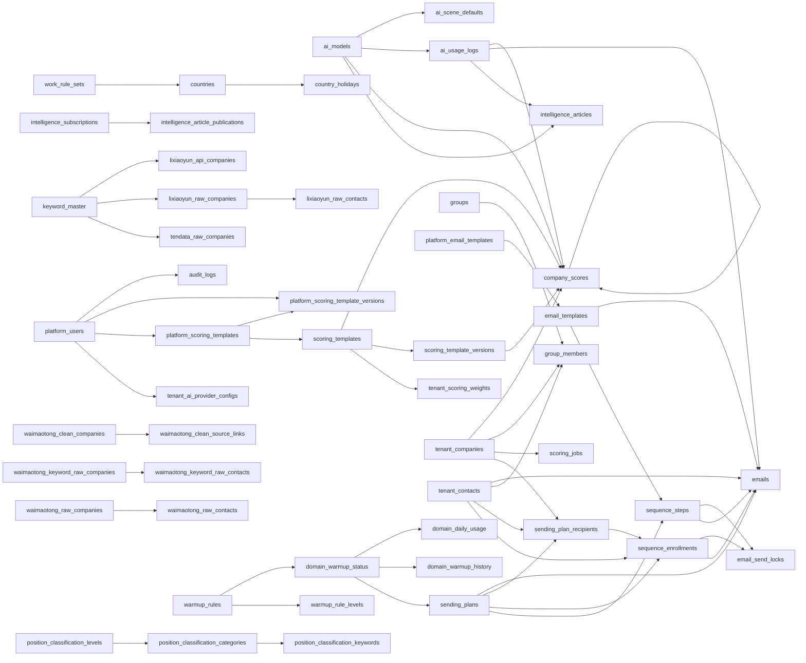

# ClientGet 生产数据库结构文档

> **来源与快照性质**：本文档由 `backend/scripts/schema_snapshot.py` 自 **生产库（Sealos PG）**（`pg_catalog` 只读查询）自动生成，生成日期 **2026-07-24**，库内 alembic 版本 **20260723_0003**。**请勿手改本文件**——结构以 `backend/03_database/schema_snapshot.json`（机器契约，diff 即带外变更探测器）为准，业务说明维护在 `schema_docs.json`，漂移注记维护在 `schema_notes.md`，改完重跑脚本渲染。
>
> **行数**为 `pg_class.reltuples` 估算值（`-1`/`0` 表示从未 ANALYZE 或确实为空），仅供判断表的活跃度。
>
> **业务说明的来源与边界**：生产库列注释覆盖率为零，「说明」列中的业务语义提炼自代码事实（services/api 层的实际读写用法、alembic 迁移注释、schema.sql 蓝图注释、DESIGN/README/docs/solutions），初版调查日期 2026-07-22。**留空 = 代码中无可靠依据**（多见于外部直写表的数据商原始字段），宁缺毋滥、不做编造；外部表（`waimaotong_*` 等）列名字面含义明确者按字面标注。若说明与代码现状冲突，以代码为准并修订 `schema_docs.json`。

**总量**：业务表 **62** 张（其中分区父表 3 张，当前共 18 个分区子表）+ 备份快照表 **0** 张 + `alembic_version`；业务视图 1 个（监控扩展视图未列出）。

## 目录

- **平台与租户治理**：[`tenants`](#tenants)、[`platform_users`](#platform_users)、[`users`](#users)、[`user_roles`](#user_roles)、[`tenant_ai_provider_configs`](#tenant_ai_provider_configs)、[`audit_logs`](#audit_logs)、[`notifications`](#notifications)
- **AI 配置与用量**：[`ai_models`](#ai_models)、[`ai_scene_defaults`](#ai_scene_defaults)、[`ai_usage_logs`](#ai_usage_logs)
- **评分体系**：[`platform_scoring_templates`](#platform_scoring_templates)、[`platform_scoring_template_versions`](#platform_scoring_template_versions)、[`scoring_templates`](#scoring_templates)、[`scoring_template_versions`](#scoring_template_versions)、[`tenant_scoring_weights`](#tenant_scoring_weights)、[`scoring_jobs`](#scoring_jobs)、[`company_scores`](#company_scores)
- **租户客户池**：[`tenant_companies`](#tenant_companies)、[`tenant_contacts`](#tenant_contacts)、[`company_blacklist`](#company_blacklist)、[`groups`](#groups)、[`group_members`](#group_members)、[`contact_rules`](#contact_rules)、[`position_classification_categories`](#position_classification_categories)、[`position_classification_levels`](#position_classification_levels)、[`position_classification_keywords`](#position_classification_keywords)
- **邮件模板**：[`platform_email_templates`](#platform_email_templates)、[`email_templates`](#email_templates)
- **序列发送链路**：[`sending_plans`](#sending_plans)、[`sequence_steps`](#sequence_steps)、[`sequence_enrollments`](#sequence_enrollments)、[`sending_plan_recipients`](#sending_plan_recipients)、[`emails`](#emails)、[`email_events`](#email_events)、[`email_send_locks`](#email_send_locks)
- **发送窗口与域名信誉**：[`countries`](#countries)、[`country_holidays`](#country_holidays)、[`work_rule_sets`](#work_rule_sets)、[`warmup_rules`](#warmup_rules)、[`warmup_rule_levels`](#warmup_rule_levels)、[`domain_warmup_status`](#domain_warmup_status)、[`domain_warmup_history`](#domain_warmup_history)、[`domain_daily_usage`](#domain_daily_usage)
- **行业情报**：[`intelligence_sources`](#intelligence_sources)、[`intelligence_articles`](#intelligence_articles)、[`intelligence_article_publications`](#intelligence_article_publications)、[`intelligence_subscriptions`](#intelligence_subscriptions)
- **外部数据管道（外部直写，schema 主权不在本仓库）**：[`waimaotong_raw_companies`](#waimaotong_raw_companies)、[`waimaotong_raw_contacts`](#waimaotong_raw_contacts)、[`waimaotong_keyword_raw_companies`](#waimaotong_keyword_raw_companies)、[`waimaotong_keyword_raw_contacts`](#waimaotong_keyword_raw_contacts)、[`waimaotong_clean_companies`](#waimaotong_clean_companies)、[`waimaotong_clean_contacts`](#waimaotong_clean_contacts)、[`waimaotong_clean_source_links`](#waimaotong_clean_source_links)、[`lixiaoyun_raw_companies`](#lixiaoyun_raw_companies)、[`lixiaoyun_raw_contacts`](#lixiaoyun_raw_contacts)、[`lixiaoyun_api_companies`](#lixiaoyun_api_companies)、[`lixiaoyun_api_clean_companies`](#lixiaoyun_api_clean_companies)、[`tendata_raw_companies`](#tendata_raw_companies)、[`tendata_raw_contacts`](#tendata_raw_contacts)、[`crawl_progress`](#crawl_progress)、[`keyword_master`](#keyword_master)
- [业务视图](#业务视图)
- [外键关系总览](#外键关系总览)
- [备份快照表](#备份快照表)
- [已知漂移与命名注记](#已知漂移与命名注记)

## 平台与租户治理

多租户 SaaS 的平台侧账号、租户开通、审计与幂等。

### tenants

平台租户主档，一行一个付费客户企业，是租户隔离（业务表 tenant_id）的根。平台管理员经 admin API 创建与管理，租户端登录、引导状态也读此表。

估算行数 4。

| 字段名 | 数据类型 | 可空 | 默认值 | 说明 |
|---|---|---|---|---|
| id | UUID | ✗ |  | **PK** |
| name | VARCHAR(100) | ✗ |  | 租户企业名称。 |
| slug | VARCHAR(50) | ✗ |  | 租户唯一短标识，租户端登录用其定位租户；缺省自动生成。 |
| industry | VARCHAR(100) | ✗ |  | 所属行业；建租户时按行业复制平台评分与邮件模板种子。 |
| contact_name | VARCHAR(100) | ✓ |  | 租户联系人姓名。 |
| contact_phone | VARCHAR(50) | ✓ |  | 租户联系人电话。 |
| contact_email | VARCHAR(255) | ✓ |  | 租户联系邮箱；建租户时写入首个管理员邮箱。 |
| status | VARCHAR(20) | ✗ | `'active'` | 租户状态；非 active 禁止租户登录，archived 不出现在列表。；取值: active, suspended, archived |
| settings | JSONB | ✗ | `'{}'` | 租户扩展配置 JSONB；当前仅建租户时写空对象，代码无读取方。 |
| needs_onboarding | BOOLEAN | ✗ | `true` | 是否需要首次引导；登录 /me 返回，完成引导接口置 false。 |
| created_at | TIMESTAMPTZ | ✗ | `now()` | 创建时间 |
| updated_at | TIMESTAMPTZ | ✗ | `now()` | 更新时间 |
| instance_id | VARCHAR | ✗ | `'default'` | 实例隔离键（平台级表按 instance 过滤） |

**唯一约束**：`instance_id, slug`

### platform_users

平台侧管理员账号，admin 后台登录主体（JWT roles=platform_admin）。由 bootstrap 脚本创建，auth 服务维护登录与锁定状态。

估算行数 2。

| 字段名 | 数据类型 | 可空 | 默认值 | 说明 |
|---|---|---|---|---|
| id | UUID | ✗ |  | **PK** |
| email | VARCHAR(255) | ✗ |  | 平台管理员登录邮箱，全局唯一，匹配时忽略大小写。 |
| password_hash | VARCHAR(255) | ✗ |  | 登录密码哈希。 |
| name | VARCHAR(100) | ✗ |  | 管理员姓名。 |
| status | VARCHAR(20) | ✗ | `'active'` | 账号状态；disabled 禁止登录。；取值: active, disabled |
| failed_login_count | INTEGER | ✗ | `0` | 连续登录失败次数，达 5 次锁定 15 分钟。 |
| locked_until | TIMESTAMPTZ | ✓ |  | 锁定截止时间，此前拒绝登录；登录成功后清空。 |
| last_login_at | TIMESTAMPTZ | ✓ |  | 最近成功登录时间。 |
| created_at | TIMESTAMPTZ | ✗ | `now()` | 创建时间 |
| updated_at | TIMESTAMPTZ | ✗ | `now()` | 更新时间 |
| instance_id | VARCHAR | ✗ | `'default'` | 实例隔离键（平台级表按 instance 过滤） |

**唯一约束**：`email`

### users

租户成员账号，租户端登录主体。建租户时创建首个管理员，之后由租户团队管理增删改；auth 服务维护登录与锁定状态。

估算行数 5。

| 字段名 | 数据类型 | 可空 | 默认值 | 说明 |
|---|---|---|---|---|
| id | UUID | ✗ |  | **PK** |
| tenant_id | UUID | ✗ |  | 租户隔离键（service 层 SQL 显式过滤，AGENTS.md §1）；FK → `tenants.id` |
| email | VARCHAR(255) | ✗ |  | 登录邮箱，租户内唯一（tenant_id+email）。 |
| password_hash | VARCHAR(255) | ✗ |  | 登录密码哈希。 |
| name | VARCHAR(100) | ✗ |  | 成员姓名。 |
| status | VARCHAR(20) | ✗ | `'active'` | 账号状态；disabled 禁止登录。；取值: active, disabled |
| must_change_pwd | BOOLEAN | ✗ | `true` | 首次登录须改密标记；修改密码成功后置 false。 |
| failed_login_count | INTEGER | ✗ | `0` | 连续登录失败次数，达 5 次锁定 15 分钟。 |
| locked_until | TIMESTAMPTZ | ✓ |  | 锁定截止时间，此前拒绝登录；登录成功后清空。 |
| last_login_at | TIMESTAMPTZ | ✓ |  | 最近成功登录时间。 |
| created_at | TIMESTAMPTZ | ✗ | `now()` | 创建时间 |
| updated_at | TIMESTAMPTZ | ✗ | `now()` | 更新时间 |
| test_email | VARCHAR(255) | ✓ |  | 个人测试收件邮箱；邮件模板「测试发送」寄往此地址。 |

**唯一约束**：`tenant_id, email`

**外键**：`tenant_id` → `tenants(id)`

### user_roles

租户用户角色关联表，一人可持多角色。团队管理写入，登录时读出并入 JWT roles 声明。

估算行数 5。

| 字段名 | 数据类型 | 可空 | 默认值 | 说明 |
|---|---|---|---|---|
| id | UUID | ✗ |  | **PK** |
| tenant_id | UUID | ✗ |  | 租户隔离键（service 层 SQL 显式过滤，AGENTS.md §1）；FK → `tenants.id` |
| user_id | UUID | ✗ |  | 关联的租户用户；删除用户时级联删除。；FK → `users.id` |
| role | user_role | ✗ |  | 角色枚举；更新角色时先删后插全量重写。 |
| created_at | TIMESTAMPTZ | ✗ | `now()` | 创建时间 |

**唯一约束**：`tenant_id, user_id, role`

**外键**：`tenant_id` → `tenants(id)`；`user_id` → `users(id)` ON DELETE CASCADE

### tenant_ai_provider_configs

每租户一行的 OpenRouter API Key 配置与余额缓存（60 秒 TTL）。租户设置页或平台管理员写入；AI 功能（邮件生成、情报摘要）调用前以 balance_status 作余额闸门。

估算行数 2。

| 字段名 | 数据类型 | 可空 | 默认值 | 说明 |
|---|---|---|---|---|
| id | UUID | ✗ |  | **PK** |
| tenant_id | UUID | ✗ |  | 租户隔离键（service 层 SQL 显式过滤，AGENTS.md §1）；FK → `tenants.id` |
| provider | VARCHAR(40) | ✗ |  | AI 供应商，当前仅 openrouter；与租户组成唯一键。 |
| api_key_encrypted | TEXT | ✗ |  | OpenRouter API Key 的 Fernet 加密密文。 |
| encryption_key_version | INTEGER | ✗ | `1` | 加密密钥版本，当前恒写 1，为密钥轮换预留。 |
| configured_by_user_id | UUID | ✓ |  | 最后配置 Key 的租户用户，与平台管理员二选一。；FK → `users.id` |
| configured_by_platform_user_id | UUID | ✓ |  | 最后配置 Key 的平台管理员。；FK → `platform_users.id` |
| last_rotated_at | TIMESTAMPTZ | ✗ | `now()` | 最近设置或更换 Key 的时间。 |
| balance_status | VARCHAR(30) | ✗ |  | 余额判定状态，AI 功能闸门：仅 available 放行。；取值: available, insufficient_balance, unknown, invalid_api_key, provider… |
| balance_source | VARCHAR(20) | ✓ |  | 余额判定口径：credits 账户余额或 key 限额接口。；取值: credits, key |
| balance_amount | NUMERIC(12,4) | ✓ |  | 剩余可用金额：credits 充值减消耗，或 key 剩余限额。 |
| balance_currency | VARCHAR(10) | ✗ | `'USD'` | 币种，固定 USD。 |
| total_credits | NUMERIC(12,4) | ✓ |  | OpenRouter 账户累计充值额（credits 口径）。 |
| total_usage | NUMERIC(12,4) | ✓ |  | OpenRouter 账户累计消耗额（credits 口径）。 |
| key_limit | NUMERIC(12,4) | ✓ |  | 当前 Key 设置的额度上限（key 口径）。 |
| key_limit_remaining | NUMERIC(12,4) | ✓ |  | 当前 Key 剩余额度；>0 判为余额可用。 |
| balance_checked_at | TIMESTAMPTZ | ✓ |  | 最近余额刷新时间；60 秒内视为新鲜，过期自动刷新。 |
| last_error_code | VARCHAR(100) | ✓ |  | 最近余额查询错误码；刷新成功后清空。 |
| last_error_message | TEXT | ✓ |  | 最近余额查询错误信息，用于前端提示。 |
| created_at | TIMESTAMPTZ | ✗ | `now()` | 创建时间 |
| updated_at | TIMESTAMPTZ | ✗ | `now()` | 更新时间 |

**唯一约束**：`tenant_id, provider`

**外键**：`configured_by_platform_user_id` → `platform_users(id)`；`configured_by_user_id` → `users(id)`；`tenant_id` → `tenants(id)` ON DELETE CASCADE

**索引**：`idx_tenant_ai_provider_configs_tenant` (tenant_id)

### audit_logs

平台与租户操作审计流水，按 created_at 月度分区（maintain_partitions.py 预建）。各服务在配置、团队、模板等变更时写入；当前无查询端点，只写不读。

**分区表** `RANGE (created_at)`，子表：`audit_logs_default`, `audit_logs_p_2026_04`, `audit_logs_p_2026_05`, `audit_logs_p_2026_06`, `audit_logs_p_2026_07`, `audit_logs_p_2026_08`；估算行数 —（分区父表见子表）。

| 字段名 | 数据类型 | 可空 | 默认值 | 说明 |
|---|---|---|---|---|
| id | UUID | ✗ |  | **PK** |
| tenant_id | UUID | ✓ |  | 租户隔离键（service 层 SQL 显式过滤，AGENTS.md §1）；FK → `tenants.id` |
| user_id | UUID | ✓ |  | 操作者（租户用户），与平台管理员至多一个有值。；FK → `users.id` |
| platform_user_id | UUID | ✓ |  | 操作者（平台管理员）。；FK → `platform_users.id` |
| action | VARCHAR(30) | ✗ |  | 操作动作字符串，如 create/update/delete/assign/remove。 |
| entity_type | VARCHAR(50) | ✗ |  | 被操作对象类型，如 tenant_user、email_template。 |
| entity_id | UUID | ✓ |  | 被操作对象 ID。 |
| old_value | JSONB | ✓ |  | 变更前对象 JSON 快照。 |
| new_value | JSONB | ✓ |  | 变更后对象 JSON 快照。 |
| ip_address | INET | ✓ |  | 请求来源 IP；当前写入路径未填充。 |
| user_agent | TEXT | ✓ |  | 请求 User-Agent；当前写入路径未填充。 |
| request_id | VARCHAR(100) | ✓ |  | 请求链路 ID；当前写入路径未填充。 |
| created_at | TIMESTAMPTZ | ✗ | `now()` | 创建时间；**PK**；分区键 |

**外键**：`platform_user_id` → `platform_users(id)`；`tenant_id` → `tenants(id)`；`user_id` → `users(id)`

### notifications

租户站内通知，一行对应一个接收用户。当前仅行业情报发布时写入；租户端通知中心按用户读取并标记已读，仪表盘统计未读数。

估算行数 0。

| 字段名 | 数据类型 | 可空 | 默认值 | 说明 |
|---|---|---|---|---|
| id | UUID | ✗ |  | **PK** |
| tenant_id | UUID | ✗ |  | 租户隔离键（service 层 SQL 显式过滤，AGENTS.md §1）；FK → `tenants.id` |
| user_id | UUID | ✗ |  | 通知接收者（租户用户），列表按用户过滤。；FK → `users.id` |
| title | VARCHAR(200) | ✗ |  | 通知标题。 |
| content | TEXT | ✗ |  | 通知正文。 |
| category | VARCHAR(30) | ✗ |  | 通知分类；当前代码仅情报发布路径写入 intelligence。；取值: scoring_complete, plan_complete, reply_received, balance_low, intel… |
| entity_type | VARCHAR(50) | ✓ |  | 关联业务对象类型，如 intelligence_article。 |
| entity_id | UUID | ✓ |  | 关联业务对象 ID，供前端跳转。 |
| is_read | BOOLEAN | ✗ | `false` | 已读标记；支持单条与一键全部已读。 |
| read_at | TIMESTAMPTZ | ✓ |  | 标记已读的时间。 |
| created_at | TIMESTAMPTZ | ✗ | `now()` | 创建时间 |

**外键**：`tenant_id` → `tenants(id)`；`user_id` → `users(id)`

**索引**：`idx_notifications_user_unread` (tenant_id, user_id, is_read, created_at DESC)

## AI 配置与用量

平台级 AI 模型注册、场景默认模型与调用计量。

### ai_models

平台级 AI 模型目录（按 instance_id 隔离）。平台管理员在 admin 配置页维护；场景默认映射与 AI 调用按此选择模型。

估算行数 9。

| 字段名 | 数据类型 | 可空 | 默认值 | 说明 |
|---|---|---|---|---|
| id | UUID | ✗ |  | **PK** |
| provider | VARCHAR(50) | ✗ | `'openrouter'` | 模型供应商，默认 openrouter；与 model_id 组成唯一键。 |
| model_id | VARCHAR(150) | ✗ |  | 供应商侧模型标识（模型代码）。 |
| display_name | VARCHAR(100) | ✗ |  | 管理端与用量展示用的模型名称。 |
| is_active | BOOLEAN | ✗ | `true` | 是否启用；场景默认仅能引用启用中的模型。 |
| config | JSONB | ✗ | `'{}'` | 模型级扩展参数 JSONB，管理端透传保存，业务代码未读具体键。 |
| created_at | TIMESTAMPTZ | ✗ | `now()` | 创建时间 |
| updated_at | TIMESTAMPTZ | ✗ | `now()` | 更新时间 |
| instance_id | VARCHAR | ✗ | `'default'` | 实例隔离键（平台级表按 instance 过滤） |

**唯一约束**：`instance_id, provider, model_id`

### ai_scene_defaults

AI 业务场景到默认模型的映射，每场景一行。平台管理员整表 PUT 维护；业务侧按场景取默认模型（要求模型启用中，否则报未配置）。

估算行数 8。

| 字段名 | 数据类型 | 可空 | 默认值 | 说明 |
|---|---|---|---|---|
| id | UUID | ✗ |  | **PK** |
| scene | VARCHAR(40) | ✗ |  | AI 业务场景名，全表唯一，每场景一条默认配置。；取值: scoring, email_generation, intelligence_summary, data_analysis |
| model_id | UUID | ✗ |  | 该场景默认使用的 ai_models.id；被引用的模型禁止删除。；FK → `ai_models.id` |
| config | JSONB | ✗ | `'{}'` | 场景级扩展参数 JSONB，透传保存。 |
| created_at | TIMESTAMPTZ | ✗ | `now()` | 创建时间 |
| updated_at | TIMESTAMPTZ | ✗ | `now()` | 更新时间 |
| instance_id | VARCHAR | ✗ | `'default'` | 实例隔离键（平台级表按 instance 过滤） |

**唯一约束**：`instance_id, scene`

**外键**：`model_id` → `ai_models(id)`

### ai_usage_logs

AI 调用用量与成本流水，先建 pending 再收尾为 completed/failed。AI 功能（邮件生成、情报摘要）经 AiUsageLogService 写入；租户端用量汇总与 30 天趋势按 completed 记录统计。

估算行数 0。

| 字段名 | 数据类型 | 可空 | 默认值 | 说明 |
|---|---|---|---|---|
| id | UUID | ✗ |  | **PK** |
| tenant_id | UUID | ✗ |  | 租户隔离键（service 层 SQL 显式过滤，AGENTS.md §1）；FK → `tenants.id` |
| user_id | UUID | ✓ |  | 触发调用的租户用户，可空。；FK → `users.id` |
| model_id | UUID | ✗ |  | 本次调用使用的 AI 模型。；FK → `ai_models.id` |
| usage_type | VARCHAR(40) | ✗ |  | 用量场景，与 ai_scene_defaults.scene 同一口径。；取值: scoring, email_generation, intelligence_summary, data_analysis |
| entity_type | VARCHAR(50) | ✓ |  | 关联业务对象类型，如 intelligence_article、email_template。 |
| entity_id | UUID | ✓ |  | 关联业务对象 ID。 |
| input_tokens | INTEGER | ✗ | `0` | 输入 token 数，完成时按供应商回传写入。 |
| output_tokens | INTEGER | ✗ | `0` | 输出 token 数，完成时按供应商回传写入。 |
| total_tokens | INTEGER | ✗ | `0` | 总 token 数；租户用量统计按完成记录求和。 |
| estimated_cost | NUMERIC(12,4) | ✓ |  | 创建 pending 记录时的预估成本。 |
| actual_cost | NUMERIC(12,4) | ✓ |  | 完成时写入的实际成本，租户成本统计口径。 |
| status | VARCHAR(20) | ✗ |  | 状态机：pending 创建 → completed/failed 收尾。；取值: pending, completed, failed |
| provider_response | JSONB | ✓ |  | 供应商返回原文/用量摘要 JSONB。 |
| idempotency_key | VARCHAR(200) | ✓ |  | 租户内幂等键（唯一），同键请求复用已有记录。 |
| provider_request_id | VARCHAR(200) | ✓ |  | 供应商侧请求 ID，用于对账与排查。 |
| latency_ms | INTEGER | ✓ |  | 调用耗时（毫秒）；当前写入路径未填充。 |
| error_code | VARCHAR(100) | ✓ |  | 失败错误码；成功完成时清空。 |
| error_message | TEXT | ✓ |  | 失败错误信息；成功完成时清空。 |
| created_at | TIMESTAMPTZ | ✗ | `now()` | 创建时间 |

**唯一约束**：`tenant_id, idempotency_key`

**外键**：`model_id` → `ai_models(id)`；`tenant_id` → `tenants(id)`；`user_id` → `users(id)`

**索引**：`idx_ai_usage_logs_tenant` (tenant_id, created_at DESC)

## 评分体系

平台评分模板 → 租户评分模板/权重 → 打分任务与结果。

### platform_scoring_templates

平台行业评分模板，每行业最多一个激活（部分唯一索引）。平台管理员维护；建租户时按行业复制为租户模板种子，更新时把维度结构同步到已实例化的租户模板并触发重评。

估算行数 3。

| 字段名 | 数据类型 | 可空 | 默认值 | 说明 |
|---|---|---|---|---|
| id | UUID | ✗ |  | **PK** |
| industry | VARCHAR(100) | ✗ |  | 适用行业；每行业最多一个激活模板，建租户按行业取用。 |
| name | VARCHAR(200) | ✗ |  | 模板名称。 |
| description | TEXT | ✓ |  | 模板说明文字。 |
| is_active | BOOLEAN | ✗ | `true` | 是否激活；激活模板才会被复制给新租户。 |
| dimensions | JSONB | ✗ |  | 维度规则 JSONB 数组：每项含 id/key、type(rule/llm)、conditions（条件+score）。 |
| grade_thresholds | JSONB | ✗ | `'{"A": 80, "B": 60, "C": 40, "D": 0, "S": 90}'` | 等级阈值 JSONB（S~D）；总分≥阈值取该等级。 |
| version | INTEGER | ✗ | `1` | 当前版本号；每次更新 +1 并写入版本快照表。 |
| created_by | UUID | ✓ |  | 创建模板的平台管理员。；FK → `platform_users.id` |
| created_at | TIMESTAMPTZ | ✗ | `now()` | 创建时间 |
| updated_at | TIMESTAMPTZ | ✗ | `now()` | 更新时间 |
| instance_id | VARCHAR | ✗ | `'default'` | 实例隔离键（平台级表按 instance 过滤） |

**外键**：`created_by` → `platform_users(id)`

**索引**：`idx_platform_scoring_templates_active` UNIQUE (instance_id, industry) WHERE is_active

### platform_scoring_template_versions

平台评分模板的版本快照，创建与每次更新各追加一行，供审计回溯。admin 版本列表接口只读。

估算行数 11。

| 字段名 | 数据类型 | 可空 | 默认值 | 说明 |
|---|---|---|---|---|
| id | UUID | ✗ |  | **PK** |
| template_id | UUID | ✗ |  | 所属平台评分模板。；FK → `platform_scoring_templates.id` |
| version | INTEGER | ✗ |  | 版本号，模板内唯一。 |
| dimensions | JSONB | ✗ |  | 该版本的维度规则快照。 |
| grade_thresholds | JSONB | ✗ |  | 该版本的等级阈值快照。 |
| changed_by | UUID | ✓ |  | 执行变更的平台管理员。；FK → `platform_users.id` |
| change_reason | TEXT | ✓ |  | 变更原因，代码写 create/update。 |
| created_at | TIMESTAMPTZ | ✗ | `now()` | 创建时间 |

**唯一约束**：`template_id, version`

**外键**：`changed_by` → `platform_users(id)`；`template_id` → `platform_scoring_templates(id)`

### scoring_templates

租户级评分模板：建租户时从平台行业模板复制（无则用内置默认），每租户仅一个激活。评分引擎按激活模板算分；租户端只能修改各条件的 score 值，平台模板更新会同步维度结构。

估算行数 4。

| 字段名 | 数据类型 | 可空 | 默认值 | 说明 |
|---|---|---|---|---|
| id | UUID | ✗ |  | **PK** |
| tenant_id | UUID | ✗ |  | 租户隔离键（service 层 SQL 显式过滤，AGENTS.md §1）；FK → `tenants.id` |
| source_platform_template_id | UUID | ✓ |  | 来源平台模板；平台模板更新时按此关联同步维度。；FK → `platform_scoring_templates.id` |
| name | VARCHAR(200) | ✗ |  | 模板名称。 |
| is_active | BOOLEAN | ✗ | `true` | 是否激活；每租户仅一个激活模板，评分引擎取激活行。 |
| dimensions | JSONB | ✗ |  | 维度规则 JSONB，结构同平台模板；租户仅可改条件 score 值。 |
| grade_thresholds | JSONB | ✗ | `'{"A": 80, "B": 60, "C": 40, "D": 0, "S": 90}'` | 等级阈值 JSONB；平台同步维度时保留租户自身阈值。 |
| version | INTEGER | ✗ | `1` | 版本号；租户修改或平台同步时 +1 并落版本快照。 |
| created_at | TIMESTAMPTZ | ✗ | `now()` | 创建时间 |
| updated_at | TIMESTAMPTZ | ✗ | `now()` | 更新时间 |
| industry | TEXT | ✗ | `'PCB'` | 行业标签（默认 PCB），供 admin 按行业分组展示。 |

**外键**：`source_platform_template_id` → `platform_scoring_templates(id)`；`tenant_id` → `tenants(id)`

**索引**：`idx_scoring_templates_active` UNIQUE (tenant_id) WHERE is_active；`idx_scoring_templates_industry` (industry)

### scoring_template_versions

租户评分模板的版本快照：建租户、租户改分值、平台同步时各追加一行。company_scores 通过 template_version_id 固定引用评分时使用的版本。

估算行数 17。

| 字段名 | 数据类型 | 可空 | 默认值 | 说明 |
|---|---|---|---|---|
| id | UUID | ✗ |  | **PK** |
| tenant_id | UUID | ✗ |  | 租户隔离键（service 层 SQL 显式过滤，AGENTS.md §1）；FK → `tenants.id` |
| template_id | UUID | ✗ |  | 所属租户评分模板。；FK → `scoring_templates.id` |
| version | INTEGER | ✗ |  | 版本号，模板内唯一；评分结果引用具体版本行。 |
| dimensions | JSONB | ✗ |  | 该版本的维度规则快照。 |
| grade_thresholds | JSONB | ✗ |  | 该版本的等级阈值快照。 |
| changed_by | UUID | ✓ |  | 触发变更的租户用户；平台同步等系统操作时为空。；FK → `users.id` |
| change_reason | TEXT | ✓ |  | 变更原因，如 tenant update、platform sync。 |
| created_at | TIMESTAMPTZ | ✗ | `now()` | 创建时间 |

**唯一约束**：`template_id, version`

**外键**：`changed_by` → `users(id)`；`template_id` → `scoring_templates(id)`；`tenant_id` → `tenants(id)`

### tenant_scoring_weights

租户对评分模板各维度的自定义权重（C6），租户端 GET/PUT 接口按 模板+维度 批量 upsert。设计意图是评分时覆盖模板默认权重，当前评分引擎尚未读取此表。

估算行数 0。

| 字段名 | 数据类型 | 可空 | 默认值 | 说明 |
|---|---|---|---|---|
| id | UUID | ✗ | `gen_random_uuid()` | **PK** |
| tenant_id | UUID | ✗ |  | 租户隔离键（service 层 SQL 显式过滤，AGENTS.md §1）；FK → `tenants.id` |
| template_id | UUID | ✗ |  | 关联的租户评分模板，级联删除。；FK → `scoring_templates.id` |
| dimension | TEXT | ✗ |  | 维度 key；租户+模板+维度组成唯一键。 |
| weight | NUMERIC(5,2) | ✗ | `1.0` | 自定义权重（≥0，默认 1.0）；设计供评分覆盖，现引擎未读取。 |
| created_at | TIMESTAMPTZ | ✗ | `now()` | 创建时间 |
| updated_at | TIMESTAMPTZ | ✗ | `now()` | 更新时间 |

**唯一约束**：`tenant_id, template_id, dimension`

**外键**：`template_id` → `scoring_templates(id)` ON DELETE CASCADE；`tenant_id` → `tenants(id)` ON DELETE CASCADE

**索引**：`idx_tenant_scoring_weights_tenant_template` (tenant_id, template_id)

### scoring_jobs

评分任务队列表（租约认领设计，含 claim 索引与活跃任务唯一约束）。当前代码无生产者与消费者——评分已改为同步执行，仅租户硬删与数据迁移的清理路径触达此表。

估算行数 0。

| 字段名 | 数据类型 | 可空 | 默认值 | 说明 |
|---|---|---|---|---|
| id | UUID | ✗ |  | **PK** |
| tenant_id | UUID | ✗ |  | 租户隔离键（service 层 SQL 显式过滤，AGENTS.md §1）；FK → `tenants.id` |
| tenant_company_id | BIGINT | ✗ |  | 待评分的租户公司；未完成状态下同公司仅一个活跃任务。；FK → `tenant_companies.id` |
| status | VARCHAR(20) | ✗ |  | 队列状态机：pending→leased→completed/failed（0004 移除 waiting_balance）。；取值: pending, leased, completed, failed |
| lease_id | UUID | ✓ |  | 本次认领的租约标识；队列设计预留，现无消费者。 |
| lease_owner | VARCHAR(100) | ✓ |  | 租约持有方（worker）标识；预留。 |
| lease_expires_at | TIMESTAMPTZ | ✓ |  | 租约到期时间，到期任务可被重新认领；预留。 |
| attempt_count | INTEGER | ✗ | `0` | 已尝试执行次数。 |
| last_error | TEXT | ✓ |  | 最近一次执行失败原因。 |
| payload | JSONB | ✗ | `'{}'` | 任务附加参数 JSONB（默认空对象）；当前无代码写入。 |
| completed_at | TIMESTAMPTZ | ✓ |  | 完成时间；为空表示仍是队列内活跃任务（唯一约束条件）。 |
| created_at | TIMESTAMPTZ | ✗ | `now()` | 创建时间 |
| updated_at | TIMESTAMPTZ | ✗ | `now()` | 更新时间 |

**外键**：`tenant_company_id` → `tenant_companies(id)` ON DELETE CASCADE；`tenant_id` → `tenants(id)`

**索引**：`idx_scoring_jobs_claim` (status, lease_expires_at, created_at)；`idx_scoring_jobs_unique_active` UNIQUE (tenant_company_id) [部分索引]

### company_scores

公司评分结果表：确定性规则引擎（非 AI）按租户激活模板+版本对公司打分并 upsert（非重试行按 公司+模板版本 唯一）。入群组、平台模板同步、lineage 补评时写入；公司列表读 grade/total_score 作为 system_grade/system_score。

估算行数 188,562。

| 字段名 | 数据类型 | 可空 | 默认值 | 说明 |
|---|---|---|---|---|
| id | UUID | ✗ |  | **PK** |
| tenant_id | UUID | ✗ |  | 租户隔离键（service 层 SQL 显式过滤，AGENTS.md §1）；FK → `tenants.id` |
| tenant_company_id | BIGINT | ✗ |  | 被评分的租户公司；非重试行与模板版本组成唯一键。；FK → `tenant_companies.id` |
| template_id | UUID | ✗ |  | 评分使用的租户评分模板。；FK → `scoring_templates.id` |
| template_version_id | UUID | ✗ |  | 评分使用的模板版本快照，锁定当时规则。；FK → `scoring_template_versions.id` |
| total_score | NUMERIC(5,2) | ✗ |  | 规则维度得分合计；列表读作 system_score。 |
| grade | CHAR(1) | ✗ |  | 按 grade_thresholds 映射的等级；列表筛选与展示用。；取值: S, A, B, C, D |
| dimension_scores | JSONB | ✗ |  | 各维度得分明细 JSONB：[{key,score,matched_condition}]，llm 维度标记 skipped。 |
| llm_pending | BOOLEAN | ✗ | `false` | LLM 评分待完成标记；预留，当前引擎不写入。 |
| llm_score | NUMERIC(5,2) | ✓ |  | LLM 维度得分；预留未使用（AI 评级现为启发式桩）。 |
| llm_reasoning | TEXT | ✓ |  | LLM 评分理由文本；预留未使用。 |
| llm_model_id | UUID | ✓ |  | LLM 评分所用模型；预留未使用。；FK → `ai_models.id` |
| llm_usage_log_id | UUID | ✓ |  | 关联的 AI 用量记录；预留未使用。；FK → `ai_usage_logs.id` |
| is_retry | BOOLEAN | ✗ | `false` | 重试评分标记；唯一约束与列表查询仅取非重试行。 |
| retry_count | INTEGER | ✗ | `0` | 重试次数；预留未使用。 |
| related_score_id | UUID | ✓ |  | 重试关联的原评分记录；预留未使用。；FK → `company_scores.id` |
| scored_at | TIMESTAMPTZ | ✗ | `now()` | 最近评分时间；重评 upsert 时刷新为 now()。 |
| created_at | TIMESTAMPTZ | ✗ | `now()` | 创建时间 |

**外键**：`llm_model_id` → `ai_models(id)`；`llm_usage_log_id` → `ai_usage_logs(id)`；`related_score_id` → `company_scores(id)`；`template_id` → `scoring_templates(id)`；`template_version_id` → `scoring_template_versions(id)`；`tenant_company_id` → `tenant_companies(id)` ON DELETE CASCADE；`tenant_id` → `tenants(id)`

**索引**：`idx_company_scores_tc_id` (tenant_company_id)；`idx_company_scores_tenant` (tenant_id, scored_at DESC)；`idx_company_scores_unique_non_retry` UNIQUE (tenant_company_id, template_version_id) WHERE (is_retry = false)

## 租户客户池

租户私有的公司/联系人数据、分组、黑名单与联系人分类规则。

### tenant_companies

租户私有客户池：把 waimaotong 清洗层公司按租户物化为池内记录，承载租户侧经营状态、数据完备度与人工修正。由 wmt_lineage_repair worker 按行业全池扇出及租户手动录入写入；客户池列表/详情、分组、发送计划读取。

估算行数 175,667。

| 字段名 | 数据类型 | 可空 | 默认值 | 说明 |
|---|---|---|---|---|
| id | BIGINT | ✗ | IDENTITY | **PK** |
| tenant_id | UUID | ✗ |  | 租户隔离键（service 层 SQL 显式过滤，AGENTS.md §1）；FK → `tenants.id` |
| clean_company_id | BIGINT | ✗ |  | 关联 waimaotong_clean_companies，租户内唯一 |
| business_status | TEXT | ✗ | `'new'` | 状态机：新建→加组→进计划→送达后触达；移出全部组回新建；取值: new, in_group, in_plan, contacted |
| data_status | TEXT | ✗ | `'ready'` | 数据完备度：就绪可入计划/缺邮箱联系人/关键字段不足三态；取值: ready, missing_contacts, insufficient_data |
| model_score | NUMERIC | ✓ |  | 预留的模型评分列，当前代码无写入路径，仅随列表/详情读出 |
| score | NUMERIC | ✓ |  | 预留的综合评分列，当前无写入；评分事实存 company_scores 表 |
| note | TEXT | ✓ |  | 租户维护的自由文本备注，编辑客户时写入 |
| tags | TEXT[] | ✓ | `'{}'` | 租户自定义标签数组（text[]，GIN 索引支持筛选） |
| created_at | TIMESTAMPTZ | ✗ | `now()` | 创建时间 |
| updated_at | TIMESTAMPTZ | ✗ | `now()` | 更新时间 |
| score_adjustment | INTEGER | ✗ | `0` | 人工分数修正，-20~+20 整数，默认 0，超范围 422 拒绝；⚠️ 带外列：生产存在但不在任何迁移（#61 ② 待补对齐迁移） |

**唯一约束**：`tenant_id, clean_company_id`

**外键**：`tenant_id` → `tenants(id)` ON DELETE CASCADE

**索引**：`idx_tenant_companies_clean_company_id` (clean_company_id)；`idx_tenant_companies_tenant_business_status` (tenant_id, business_status)；`idx_tenant_companies_tenant_data_status` (tenant_id, data_status)；`idx_tenant_companies_tenant_score` (tenant_id, score)

### tenant_contacts

租户联系人池：加组/建发送计划时按需从 waimaotong_clean_contacts 物化（ensure_contacts_from_wmt，仅取有邮箱者），记录租户侧投递状态。发送计划收件人筛选读取，邮件事件回传（退信/退订等）联动更新。

估算行数 530,449。

| 字段名 | 数据类型 | 可空 | 默认值 | 说明 |
|---|---|---|---|---|
| id | BIGINT | ✗ | IDENTITY | **PK** |
| tenant_id | UUID | ✗ |  | 租户隔离键（service 层 SQL 显式过滤，AGENTS.md §1）；FK → `tenants.id` |
| clean_contact_id | BIGINT | ✗ |  | 关联 waimaotong_clean_contacts，租户内唯一 |
| clean_company_id | BIGINT | ✗ |  | 冗余所属清洗层公司 ID，用于按公司聚合联系人 |
| contact_status | TEXT | ✗ | `'available'` | 状态机：可用→首封发出即触达；回传退信/退订/无效后被收件筛选排除 |
| is_sendable | BOOLEAN | ✗ | `true` | 可投递开关，默认 true；false 被收件人筛选排除 |
| created_at | TIMESTAMPTZ | ✗ | `now()` | 创建时间 |
| updated_at | TIMESTAMPTZ | ✗ | `now()` | 更新时间 |

**唯一约束**：`tenant_id, clean_contact_id`

**外键**：`tenant_id` → `tenants(id)` ON DELETE CASCADE

**索引**：`idx_tenant_contacts_tenant_company` (tenant_id, clean_company_id)；`idx_tenant_contacts_tenant_sendable` (tenant_id, is_sendable)；`idx_tenant_contacts_tenant_status` (tenant_id, contact_status)

### company_blacklist

租户级公司黑名单：租户在客户池拉黑公司时写入快照，发送计划筛选收件人时按公司 ID、域名、名称三种方式匹配排除，命中即标记 blacklisted。

估算行数 0。

| 字段名 | 数据类型 | 可空 | 默认值 | 说明 |
|---|---|---|---|---|
| id | UUID | ✗ |  | **PK** |
| tenant_id | UUID | ✗ |  | 租户隔离键（service 层 SQL 显式过滤，AGENTS.md §1）；FK → `tenants.id` |
| shared_company_id | UUID | ✓ |  | 被拉黑公司的清洗层 ID 快照，参与排除匹配；列名系历史遗留 |
| match_domain | VARCHAR(255) | ✓ |  | 域名匹配串，等于收件公司域名即排除；写入时取被拉黑公司的 domain |
| match_name_pattern | VARCHAR(500) | ✓ |  | 公司名匹配串，收件公司名包含该串（子串匹配）即排除 |
| reason | TEXT | ✗ |  | 拉黑原因，必填，手动操作默认 manual blacklist |
| blocked_by | UUID | ✓ |  | 执行拉黑操作的租户用户 ID；FK → `users.id` |
| created_at | TIMESTAMPTZ | ✗ | `now()` | 创建时间 |

**外键**：`blocked_by` → `users(id)`；`tenant_id` → `tenants(id)`

**索引**：`idx_company_blacklist_tenant` (tenant_id)

### groups

租户客户分组（营销名单）：发送计划 recipient_source='group' 时作为收件人来源。租户在客户池维护，加组同时把公司 business_status 置为 in_group，软删除。

估算行数 24。

| 字段名 | 数据类型 | 可空 | 默认值 | 说明 |
|---|---|---|---|---|
| id | UUID | ✗ |  | **PK** |
| tenant_id | UUID | ✗ |  | 租户隔离键（service 层 SQL 显式过滤，AGENTS.md §1）；FK → `tenants.id` |
| name | VARCHAR(200) | ✗ |  | 分组名称，租户内唯一 |
| description | TEXT | ✓ |  | 分组描述文本 |
| auto_rules | JSONB | ✓ |  | 预留的自动分组规则 JSON，当前仅透传存储，无执行引擎，成员均为手动添加 |
| member_count | INTEGER | ✗ | `0` | 冗余成员数，每次增删成员后由服务重新统计写回 |
| deleted_at | TIMESTAMPTZ | ✓ |  | 软删除时间（NULL=未删除） |
| created_at | TIMESTAMPTZ | ✗ | `now()` | 创建时间 |
| updated_at | TIMESTAMPTZ | ✗ | `now()` | 更新时间 |

**唯一约束**：`tenant_id, name`

**外键**：`tenant_id` → `tenants(id)`

### group_members

分组成员表：一行代表组内一家公司及其选定的默认收件联系人，(group_id, tenant_company_id) 唯一。加/移成员时联动公司 business_status（in_group/new）。

估算行数 18,710。

| 字段名 | 数据类型 | 可空 | 默认值 | 说明 |
|---|---|---|---|---|
| id | UUID | ✗ |  | **PK** |
| tenant_id | UUID | ✗ |  | 租户隔离键（service 层 SQL 显式过滤，AGENTS.md §1）；FK → `tenants.id` |
| group_id | UUID | ✗ |  | 所属分组 ID，分组删除时级联清理；FK → `groups.id` |
| tenant_company_id | BIGINT | ✗ |  | 组内公司（tenant_companies.id）；FK → `tenant_companies.id` |
| tenant_contact_id | BIGINT | ✓ |  | 该公司在组内选定的默认收件联系人，可空；空时回退取该公司最早建档联系人；FK → `tenant_contacts.id` |
| added_by | VARCHAR(10) | ✗ | `'manual'` | 添加方式：手动/自动规则；当前代码仅写手动；取值: manual, auto |
| created_at | TIMESTAMPTZ | ✗ | `now()` | 创建时间 |

**唯一约束**：`group_id, tenant_company_id`

**外键**：`group_id` → `groups(id)` ON DELETE CASCADE；`tenant_company_id` → `tenant_companies(id)` ON DELETE CASCADE；`tenant_contact_id` → `tenant_contacts(id)` ON DELETE SET NULL；`tenant_id` → `tenants(id)`

**索引**：`idx_group_members_group` (group_id)

### contact_rules

租户联系人挑选策略配置：租户创建时播种一条默认规则（等级优先、要求有效邮箱），设置页读取与更新。partial unique index 保证每租户仅一条激活规则；当前无发送侧代码消费该配置。

估算行数 4。

| 字段名 | 数据类型 | 可空 | 默认值 | 说明 |
|---|---|---|---|---|
| id | UUID | ✗ |  | **PK** |
| tenant_id | UUID | ✗ |  | 租户隔离键（service 层 SQL 显式过滤，AGENTS.md §1）；FK → `tenants.id` |
| name | VARCHAR(200) | ✗ |  | 规则名称，默认「默认联系人规则」 |
| is_active | BOOLEAN | ✗ | `true` | 是否激活；每租户仅允许一条激活规则（partial unique index） |
| rules | JSONB | ✗ |  | 规则 JSON：等级优先序、要求有效邮箱、默认挑选策略三键 |
| version | INTEGER | ✗ | `1` | 规则版本号，每次更新自动 +1 |
| created_at | TIMESTAMPTZ | ✗ | `now()` | 创建时间 |
| updated_at | TIMESTAMPTZ | ✗ | `now()` | 更新时间 |

**外键**：`tenant_id` → `tenants(id)`

**索引**：`idx_contact_rules_active` UNIQUE (tenant_id) WHERE is_active

### position_classification_categories

职位类别表（平台全局，无租户隔离）：从属于职位等级，如 executive/purchasing，是匹配关键词的分组单元；admin 维护等级树时读写（迁移 0029）。

估算行数 2。

| 字段名 | 数据类型 | 可空 | 默认值 | 说明 |
|---|---|---|---|---|
| id | UUID | ✗ | `gen_random_uuid()` | **PK** |
| level_id | UUID | ✗ |  | 所属职位等级 ID，等级删除时级联删除类别；FK → `position_classification_levels.id` |
| name | TEXT | ✗ |  | 类别代号，如 executive/purchasing/invalid |
| display_name | TEXT | ✗ |  | 类别显示名，如「高管/决策层」「采购/贸易层」 |
| sort_order | INTEGER | ✗ | `0` | 类别匹配优先级，分类视图按其降序取首个命中类别 |
| created_at | TIMESTAMPTZ | ✗ | `now()` | 创建时间 |
| updated_at | TIMESTAMPTZ | ✗ | `now()` | 更新时间 |

**外键**：`level_id` → `position_classification_levels(id)` ON DELETE CASCADE

**索引**：`idx_pos_cat_level` (level_id)

### position_classification_levels

职位等级表（平台全局）：联系人职位分类体系顶层，种子为 A 决策层/B 采购层/X 不投递；admin 维护，分类视图与发送计划收件人筛选读取（迁移 0029）。

估算行数 3。

| 字段名 | 数据类型 | 可空 | 默认值 | 说明 |
|---|---|---|---|---|
| id | UUID | ✗ | `gen_random_uuid()` | **PK** |
| name | TEXT | ✗ |  | 等级代号，如 A/B/X |
| display_name | TEXT | ✗ |  | 等级显示名，如「A级（决策层）」 |
| sort_order | INTEGER | ✗ | `0` | 排序权重，值大优先；分类取最高命中，收件去重优先高等级 |
| is_sendable | BOOLEAN | ✗ | `true` | 该等级职位是否允许投递；false（如 X 级）联系人被发送计划整体排除 |
| created_at | TIMESTAMPTZ | ✗ | `now()` | 创建时间 |
| updated_at | TIMESTAMPTZ | ✗ | `now()` | 更新时间 |

### position_classification_keywords

职位匹配关键词表（平台全局）：对联系人 position 字符串做小写子串（LIKE）匹配，命中即把联系人归入所属类别与等级；admin 维护，v_tenant_contact_classified 视图实时使用。

估算行数 16。

| 字段名 | 数据类型 | 可空 | 默认值 | 说明 |
|---|---|---|---|---|
| id | UUID | ✗ | `gen_random_uuid()` | **PK** |
| category_id | UUID | ✗ |  | 所属职位类别 ID，与关键词联合唯一，类别删除级联；FK → `position_classification_categories.id` |
| keyword | TEXT | ✗ |  | 匹配关键词（如 ceo、采购），与职位字符串小写子串匹配 |
| created_at | TIMESTAMPTZ | ✗ | `now()` | 创建时间 |

**唯一约束**：`category_id, keyword`

**外键**：`category_id` → `position_classification_categories(id)` ON DELETE CASCADE

**索引**：`idx_pos_kw_cat` (category_id)

## 邮件模板

平台行业模板与租户模板。

### platform_email_templates

平台级邮件模板库，按行业组织：platform admin 在管理端维护（按 instance_id 隔离）；租户创建时按其行业批量复制为租户模板，租户也可浏览同行业上架模板并单个复制。

估算行数 5。

| 字段名 | 数据类型 | 可空 | 默认值 | 说明 |
|---|---|---|---|---|
| id | UUID | ✗ |  | **PK** |
| industry | VARCHAR(100) | ✗ |  | 模板所属行业（如 PCB），仅对同行业租户可见可复制 |
| name | VARCHAR(200) | ✗ |  | 模板名称 |
| description | TEXT | ✓ |  | 模板用途描述，供租户挑选时参考 |
| category | VARCHAR(50) | ✗ |  | 模板分类标签，admin 创建默认 default |
| subject | TEXT | ✗ |  | 邮件主题模板，支持 {{变量}} 占位符，入库前清洗 |
| body_html | TEXT | ✗ |  | HTML 正文模板，入库前经 sanitize_html 清洗 |
| body_text | TEXT | ✓ |  | 纯文本正文，缺失时可由 HTML 提取回填 |
| variables | JSONB | ✗ | `'[]'` | 可用变量名 JSON 字符串数组，如 company_name |
| is_active | BOOLEAN | ✗ | `true` | 是否上架；false 后租户列表不可见、不可复制 |
| created_at | TIMESTAMPTZ | ✗ | `now()` | 创建时间 |
| updated_at | TIMESTAMPTZ | ✗ | `now()` | 更新时间 |
| instance_id | VARCHAR | ✗ | `'default'` | 实例隔离键（平台级表按 instance 过滤） |

**索引**：`idx_platform_email_templates_industry` (industry, category) WHERE is_active

### email_templates

租户自有邮件模板：序列步骤（sequence_steps.template_id）发信时渲染其主题与正文，{{变量}} 替换后经清洗发出。来源为手写、AI 生成或平台模板复制；软删除（deleted_at）。

估算行数 45。

| 字段名 | 数据类型 | 可空 | 默认值 | 说明 |
|---|---|---|---|---|
| id | UUID | ✗ |  | **PK** |
| tenant_id | UUID | ✗ |  | 租户隔离键（service 层 SQL 显式过滤，AGENTS.md §1）；FK → `tenants.id` |
| source_type | VARCHAR(20) | ✗ | `'custom'` | 模板来源：custom 自建 / platform_copy 复制自平台模板；取值: custom, platform_copy |
| platform_template_id | UUID | ✓ |  | 复制来源的平台模板 ID；同租户同平台模板的未删副本唯一（0052 索引）；FK → `platform_email_templates.id` |
| name | VARCHAR(200) | ✗ |  | 模板名称，克隆时自动加「副本」后缀 |
| category | VARCHAR(50) | ✗ |  | 模板分类标签，创建默认 cold_outreach |
| subject | TEXT | ✗ |  | 邮件主题模板，发送时替换 {{company_name}} 等占位符 |
| body_html | TEXT | ✗ |  | HTML 正文模板，发送/测试邮件时渲染变量并再次清洗 |
| body_text | TEXT | ✓ |  | 纯文本正文模板，缺失时可由 body_html 提取回填 |
| variables | JSONB | ✗ | `'[]'` | 可用变量名 JSON 数组；发送注入公司名/联系人名/发件人名 |
| is_ai_generated | BOOLEAN | ✗ | `false` | 是否由 AI 生成，生成走 email_generation 场景并记用量计费 |
| ai_prompt | TEXT | ✓ |  | AI 生成模板时的用户提示词，随模板留档 |
| deleted_at | TIMESTAMPTZ | ✓ |  | 软删除时间（NULL=未删除） |
| created_at | TIMESTAMPTZ | ✗ | `now()` | 创建时间 |
| updated_at | TIMESTAMPTZ | ✗ | `now()` | 更新时间 |

**外键**：`platform_template_id` → `platform_email_templates(id)`；`tenant_id` → `tenants(id)`

**索引**：`ix_email_templates_tenant_platform_active` UNIQUE (tenant_id, platform_template_id) [部分索引]

## 序列发送链路

发送计划 → 序列步骤 → 收件人报名 → 单封邮件 → 投递事件回传。核心可靠性域。

### sending_plans

租户序列邮件发送计划主档：定义收件人圈选、发送策略、发件域名与发件身份，并汇总发送进度。租户 API 创建维护，发送 worker 读取 running 计划按域领取发送。

估算行数 37。

| 字段名 | 数据类型 | 可空 | 默认值 | 说明 |
|---|---|---|---|---|
| id | UUID | ✗ |  | **PK** |
| tenant_id | UUID | ✗ |  | 租户隔离键（service 层 SQL 显式过滤，AGENTS.md §1）；FK → `tenants.id` |
| created_by | UUID | ✗ |  | 创建计划的租户用户 ID（FK users）；FK → `users.id` |
| name | VARCHAR(200) | ✗ |  | 计划名称，列表页按名称关键词搜索 |
| description | TEXT | ✓ |  | 计划描述，可空 |
| status | VARCHAR(20) | ✗ | `'draft'` | 状态机 draft→scheduled→running↔paused→completed/cancelled；仅 running 被 worker 领取，报名全部终态后自动 completed；取值: draft, scheduled, running, paused, completed, cancelled |
| recipient_source | VARCHAR(20) | ✗ |  | 收件人圈选方式：group 分组 / manual 手选 / filter 条件筛选，决定 recipient_config 结构；取值: group, manual, filter |
| recipient_config | JSONB | ✗ |  | 圈选参数 JSONB：group 存 group_id，manual 存 tenant_contact_ids/tenant_company_ids，filter 存 business_status/country |
| send_strategy | JSONB | ✗ | `'{"interval_seconds": [3, 3]}'` | 发送策略 JSONB：interval_seconds=[min,max] 同域两封间随机间隔秒数；默认 [3,3]（0708 起，曾 [30,120]→[1,1]） |
| sender_name | VARCHAR(200) | ✓ |  | 发件人显示名，兼作 {{sender_name}} 模板变量 |
| sender_email | VARCHAR(255) | ✓ |  | 发件地址，来自租户自己的暖域名邮箱（config.py 注：全局无兜底发件地址） |
| domain_id | UUID | ✓ |  | 绑定发信域名 FK（domain_warmup_status）；启动须 verified，worker 按域调度与限额；FK → `domain_warmup_status.id` |
| total_recipients | INTEGER | ✗ | `0` | 已锁定收件人总数，锁定/追加时重算 |
| sent_count | INTEGER | ✗ | `0` | 计划累计成功发出邮件数，每封接单 +1 |
| scheduled_at | TIMESTAMPTZ | ✓ |  | 定时启动时间，兼作首步 next_step_due_at |
| started_at | TIMESTAMPTZ | ✓ |  | 首次启动时间（COALESCE 保留首值） |
| completed_at | TIMESTAMPTZ | ✓ |  | 完成或取消时间 |
| deleted_at | TIMESTAMPTZ | ✓ |  | 软删除时间（NULL=未删除） |
| created_at | TIMESTAMPTZ | ✗ | `now()` | 创建时间 |
| updated_at | TIMESTAMPTZ | ✗ | `now()` | 更新时间 |

**外键**：`created_by` → `users(id)`；`domain_id` → `domain_warmup_status(id)`；`tenant_id` → `tenants(id)`

**索引**：`idx_sending_plans_tenant_status` (tenant_id, status)

### sequence_steps

发送计划的序列步骤配置：第几步用哪个模板、延迟几天、按上一步反馈的触发条件。租户 API 维护，worker 按 enrollment.current_step 关联读取。

估算行数 33。

| 字段名 | 数据类型 | 可空 | 默认值 | 说明 |
|---|---|---|---|---|
| id | UUID | ✗ |  | **PK** |
| tenant_id | UUID | ✗ |  | 租户隔离键（service 层 SQL 显式过滤，AGENTS.md §1）；FK → `tenants.id` |
| plan_id | UUID | ✗ |  | 所属发送计划，随计划级联删除；FK → `sending_plans.id` |
| step_number | INTEGER | ✗ |  | 步骤序号（1-10），计划内唯一且从 1 连续；第一步必须 always 且 delay 0 |
| template_id | UUID | ✗ |  | 本步使用的邮件模板 FK；FK → `email_templates.id` |
| delay_days | INTEGER | ✗ | `0` | 距上一步发出的间隔天数；上一步发成功后 next_step_due_at=now+此值 |
| condition_type | VARCHAR(20) | ✗ | `'no_reply'` | 本步触发条件，发送前按上一步邮件最新状态判定，不满足则本轮跳过不发；取值: always, no_reply, no_open, opened, clicked |
| use_ai_personalization | BOOLEAN | ✗ | `false` | 是否 AI 个性化改写本步邮件；当前发送链路未消费该配置 |
| ai_instructions | TEXT | ✓ |  | AI 个性化指令文本；当前发送链路未消费 |
| created_at | TIMESTAMPTZ | ✗ | `now()` | 创建时间 |
| updated_at | TIMESTAMPTZ | ✗ | `now()` | 更新时间 |

**唯一约束**：`plan_id, step_number`

**外键**：`plan_id` → `sending_plans(id)` ON DELETE CASCADE；`template_id` → `email_templates(id)`；`tenant_id` → `tenants(id)`

### sequence_enrollments

联系人在某计划中的序列推进状态机（进行到第几步、下次何时发）。计划启动/追加时创建，worker 领取推进，webhook 回复/退信/退订时终止；(plan_id,tenant_contact_id) 唯一。

估算行数 210,960。

| 字段名 | 数据类型 | 可空 | 默认值 | 说明 |
|---|---|---|---|---|
| id | UUID | ✗ |  | **PK** |
| tenant_id | UUID | ✗ |  | 租户隔离键（service 层 SQL 显式过滤，AGENTS.md §1）；FK → `tenants.id` |
| plan_id | UUID | ✗ |  | 所属发送计划；FK → `sending_plans.id` |
| plan_recipient_id | UUID | ✗ |  | 对应的锁定收件人记录 FK；FK → `sending_plan_recipients.id` |
| tenant_contact_id | BIGINT | ✗ |  | 收件联系人；与 plan_id 联合唯一防重复报名；FK → `tenant_contacts.id` |
| current_step | INTEGER | ✗ | `1` | 当前待发送步骤号，发成功后推进到下一步 |
| status | VARCHAR(20) | ✗ | `'active'` | 状态机：active 待发；发完转 completed，回传回复/退信/退订即终止，暂停 paused，重试耗尽或永久错误转 failed；取值: active, completed, replied, bounced, unsubscribed, paused, cancelle… |
| enrolled_at | TIMESTAMPTZ | ✗ | `now()` | 报名入列时间 |
| last_step_sent_at | TIMESTAMPTZ | ✓ |  | 最近一步成功发出时间 |
| next_step_due_at | TIMESTAMPTZ | ✓ |  | 下一步到期时间（UTC）；时区跳过/配额推迟/重试时后移，终态置 NULL |
| completed_at | TIMESTAMPTZ | ✓ |  | 序列终止时间（完成/回复/退信/退订/取消） |
| created_at | TIMESTAMPTZ | ✗ | `now()` | 创建时间 |
| updated_at | TIMESTAMPTZ | ✗ | `now()` | 更新时间 |
| last_skip_reason | TEXT | ✓ |  | 最近一次时区窗口跳过原因（当地非工作时间/非工作日/假日） |
| last_skip_at | TIMESTAMPTZ | ✓ |  | 最近一次时区窗口跳过时间 |
| send_attempt_count | INTEGER | ✗ | `0` | 当前步骤临时失败重试计数（0530 新增）；15m/1h/4h 三次上限，超限转 failed，发成功清零 |

**唯一约束**：`plan_id, tenant_contact_id`

**外键**：`plan_id` → `sending_plans(id)`；`plan_recipient_id` → `sending_plan_recipients(id)`；`tenant_contact_id` → `tenant_contacts(id)` ON DELETE CASCADE；`tenant_id` → `tenants(id)`

**索引**：`idx_sequence_enrollments_due` (status, next_step_due_at) WHERE ((status)::text = 'active'::text)

### sending_plan_recipients

计划锁定的收件人白名单快照（公司+联系人），报名与发送以此为准；锁定与启动后追加时写入，(plan_id,tenant_contact_id) 唯一。

估算行数 245,100。

| 字段名 | 数据类型 | 可空 | 默认值 | 说明 |
|---|---|---|---|---|
| id | UUID | ✗ |  | **PK** |
| tenant_id | UUID | ✗ |  | 租户隔离键（service 层 SQL 显式过滤，AGENTS.md §1）；FK → `tenants.id` |
| plan_id | UUID | ✗ |  | 所属计划，级联删除；FK → `sending_plans.id` |
| tenant_company_id | BIGINT | ✗ |  | 收件人所属租户公司 FK；FK → `tenant_companies.id` |
| tenant_contact_id | BIGINT | ✗ |  | 锁定的收件联系人，计划内唯一；FK → `tenant_contacts.id` |
| source_type | VARCHAR(20) | ✗ |  | 该收件人的圈选来源快照（group/manual/filter）；取值: group, manual, filter |
| source_ref | UUID | ✓ |  | 来源引用 ID：group 来源存 group_id，manual/filter 为 NULL |
| locked_at | TIMESTAMPTZ | ✗ | `now()` | 锁定入册时间 |
| appended_after_start | BOOLEAN | ✗ | `false` | 是否计划启动后追加（追加接口写 true，初始锁定 false） |
| excluded_at | TIMESTAMPTZ | ✓ |  | 排除时间；启动时按 IS NULL 过滤可发名单，当前无写入路径恒 NULL |
| excluded_reason | VARCHAR(100) | ✓ |  | 排除原因；当前无写入路径，预览候选的排除原因仅内存计算不落库 |
| created_at | TIMESTAMPTZ | ✗ | `now()` | 创建时间 |

**唯一约束**：`plan_id, tenant_contact_id`

**外键**：`plan_id` → `sending_plans(id)` ON DELETE CASCADE；`tenant_company_id` → `tenant_companies(id)` ON DELETE CASCADE；`tenant_contact_id` → `tenant_contacts(id)` ON DELETE CASCADE；`tenant_id` → `tenants(id)`

**索引**：`idx_sending_plan_recipients_plan` (plan_id)

### emails

每次实际发送的邮件实体：渲染消毒后的内容快照+投递全程状态；按 created_at 月度分区，复合主键 (id,created_at)。worker 领取时创建并发送，webhook 与对账 worker 回写状态，配额推迟时整行删除待重建。

**分区表** `RANGE (created_at)`，子表：`emails_default`, `emails_p_2026_04`, `emails_p_2026_05`, `emails_p_2026_06`, `emails_p_2026_07`, `emails_p_2026_08`；估算行数 —（分区父表见子表）。

| 字段名 | 数据类型 | 可空 | 默认值 | 说明 |
|---|---|---|---|---|
| id | UUID | ✗ |  | **PK** |
| tenant_id | UUID | ✗ |  | 租户隔离键（service 层 SQL 显式过滤，AGENTS.md §1）；FK → `tenants.id` |
| plan_id | UUID | ✓ |  | 所属发送计划；FK → `sending_plans.id` |
| step_id | UUID | ✓ |  | 对应序列步骤 FK；FK → `sequence_steps.id` |
| step_number | INTEGER | ✓ |  | 步骤号快照，供分步统计 |
| template_id | UUID | ✓ |  | 生成本邮件的模板 FK；FK → `email_templates.id` |
| enrollment_id | UUID | ✓ |  | 所属序列报名，状态联动的关联键；FK → `sequence_enrollments.id` |
| tenant_contact_id | BIGINT | ✗ |  | 收件联系人 FK；FK → `tenant_contacts.id` |
| from_email | VARCHAR(255) | ✗ |  | 发件地址，取计划 sender_email |
| from_name | VARCHAR(200) | ✓ |  | 发件人显示名，取计划 sender_name |
| to_email | VARCHAR(255) | ✗ |  | 收件邮箱（来自清洗联系人表） |
| to_name | VARCHAR(200) | ✓ |  | 收件人姓名 |
| subject | TEXT | ✗ |  | 渲染变量并消毒后的主题快照 |
| body_html | TEXT | ✗ |  | 渲染变量并消毒后的 HTML 正文快照 |
| body_text | TEXT | ✓ |  | 纯文本正文；为空时从 HTML 提取兜底 |
| reply_message_id | VARCHAR(200) | ✓ |  | 回信在 EngageLab 侧的邮件 id（route 事件回传） |
| reply_from_email | VARCHAR(255) | ✓ |  | 回信发件人地址（route 事件回传） |
| reply_subject | TEXT | ✓ |  | 回信主题（route 事件回传） |
| reply_body_text | TEXT | ✓ |  | 回信正文文本（route 事件回传） |
| reply_received_at | TIMESTAMPTZ | ✓ |  | 收到回信时间（route 事件时间） |
| status | VARCHAR(20) | ✗ | `'pending'` | 投递状态机：queued 建行待发→sent 接单→delivered 及打开/点击/回复推进；退信/投诉/退订为负反馈，发送失败为 failed；默认值 pending 代码未使用；取值: pending, queued, sent, delivered, opened, clicked, replied, bounced… |
| is_ai_personalized | BOOLEAN | ✗ | `false` | 是否 AI 个性化内容；当前发送链路未写入，恒默认 false |
| ai_usage_log_id | UUID | ✓ |  | 关联 AI 用量日志 FK；当前发送链路未写入；FK → `ai_usage_logs.id` |
| engagelab_message_id | VARCHAR(100) | ✓ |  | EngageLab 返回的 email_id；webhook 与对账以此反查回写 |
| scheduled_at | TIMESTAMPTZ | ✓ |  | 预定发送时间；全库无代码消费（配额事故复盘明确） |
| sent_at | TIMESTAMPTZ | ✓ |  | 服务商接单时间；统计实发口径用 sent_at IS NOT NULL |
| delivered_at | TIMESTAMPTZ | ✓ |  | 投递成功时间（webhook/对账回写） |
| opened_at | TIMESTAMPTZ | ✓ |  | 最近一次打开时间（webhook 回写） |
| clicked_at | TIMESTAMPTZ | ✓ |  | 点击时间（webhook 回写） |
| replied_at | TIMESTAMPTZ | ✓ |  | 回复时间（webhook 回写） |
| bounced_at | TIMESTAMPTZ | ✓ |  | 退信时间（webhook/对账回写） |
| created_at | TIMESTAMPTZ | ✗ | `now()` | 创建时间；**PK**；分区键 |
| first_opened_at | TIMESTAMPTZ | ✓ |  | 首次打开时间，COALESCE 只写一次，独立打开数口径（D-041） |
| open_count | INTEGER | ✗ | `0` | 累计打开次数，每次 opened 事件 +1（D-041） |
| soft_bounce | BOOLEAN | ✗ | `false` | 软退信标记（soft_bounce 事件或对账 status=5） |
| invalid_email | BOOLEAN | ✗ | `false` | 无效邮箱硬退信标记（invalid_email 事件或对账 status=4） |
| report_spam | BOOLEAN | ✗ | `false` | 被举报垃圾邮件标记（report_spam 事件） |
| unsubscribed | BOOLEAN | ✗ | `false` | 退订标记（unsubscribe 事件），独立于 status 供聚合统计 |

**外键**：`ai_usage_log_id` → `ai_usage_logs(id)`；`enrollment_id` → `sequence_enrollments(id)`；`plan_id` → `sending_plans(id)`；`step_id` → `sequence_steps(id)`；`template_id` → `email_templates(id)`；`tenant_contact_id` → `tenant_contacts(id)` ON DELETE CASCADE；`tenant_id` → `tenants(id)`

**索引**：`idx_emails_delivery_flags` (tenant_id, soft_bounce, report_spam, unsubscribed) WHERE (soft_bounce OR report_spam OR unsubscribed)；`idx_emails_engagelab` (engagelab_message_id) WHERE (engagelab_message_id IS NOT NULL)；`idx_emails_enrollment` (enrollment_id) WHERE (enrollment_id IS NOT NULL)；`idx_emails_open_tracking` (tenant_id, first_opened_at) WHERE (first_opened_at IS NOT NULL)；`idx_emails_tenant_created` (tenant_id, created_at DESC, id DESC)

### email_events

EngageLab webhook 回传的投递事件流水：原始 payload 存档并幂等去重，是 emails 状态回写的依据；webhook 端点验签后写入。

估算行数 354,700。

| 字段名 | 数据类型 | 可空 | 默认值 | 说明 |
|---|---|---|---|---|
| id | UUID | ✗ |  | **PK** |
| tenant_id | UUID | ✗ |  | 租户隔离键（service 层 SQL 显式过滤，AGENTS.md §1）；FK → `tenants.id` |
| email_id | UUID | ✗ |  | 关联邮件 id（emails 复合主键前半，分区表无真 FK） |
| email_created_at | TIMESTAMPTZ | ✗ |  | 关联邮件 created_at，配合 email_id 定位分区行 |
| event_type | VARCHAR(20) | ✗ |  | 归一化后的事件类型；target 事件不入库；取值: sent, delivered, opened, clicked, replied, bounced, complained, uns… |
| metadata | JSONB | ✗ | `'{}'` | EngageLab webhook 原始 payload 整包 JSONB |
| source | VARCHAR(20) | ✗ | `'engagelab'` | 事件来源渠道；当前恒写 engagelab（system 预留未用）；取值: engagelab, system |
| provider_event_id | TEXT | ✓ |  | 幂等键：EngageLab 无事件 id，用 message_id+原始事件+itime 拼接；与 source 联合唯一去重，0002 放宽为 text |
| occurred_at | TIMESTAMPTZ | ✗ | `now()` | 事件发生时间（itime 毫秒时间戳解析） |
| created_at | TIMESTAMPTZ | ✗ | `now()` | 创建时间 |

**外键**：`tenant_id` → `tenants(id)`

**索引**：`idx_email_events_email` (email_id, email_created_at)；`idx_email_events_provider_unique` UNIQUE (source, provider_event_id) WHERE (provider_event_id IS NOT NULL)；`idx_email_events_tenant_type` (tenant_id, event_type, occurred_at DESC)

### email_send_locks

(enrollment,step) 粒度的发送幂等锁，保证同一序列步骤至多成功发送一次——「不重复发送」的落库机制；worker 领取时抢锁并按结果流转，locked 超 30 分钟按僵尸锁回收。

估算行数 184,215。

| 字段名 | 数据类型 | 可空 | 默认值 | 说明 |
|---|---|---|---|---|
| id | UUID | ✗ |  | **PK** |
| tenant_id | UUID | ✗ |  | 租户隔离键（service 层 SQL 显式过滤，AGENTS.md §1）；FK → `tenants.id` |
| enrollment_id | UUID | ✗ |  | 报名 FK，幂等键前半；FK → `sequence_enrollments.id` |
| step_id | UUID | ✗ |  | 步骤 FK；(enrollment_id,step_id) 唯一构成幂等键；FK → `sequence_steps.id` |
| status | VARCHAR(20) | ✗ | `'locked'` | 锁状态：locked 抢占中、sent 永久占位防重发、failed/released 允许 ON CONFLICT 重抢；取值: locked, sent, failed, released |
| locked_by | VARCHAR(100) | ✓ |  | 抢锁 worker 实例标识（默认 sending-service） |
| locked_at | TIMESTAMPTZ | ✗ | `now()` | 抢锁时间；locked 超 30 分钟判僵尸回收 |
| released_at | TIMESTAMPTZ | ✓ |  | 锁释放/终结时间 |
| email_id | UUID | ✓ |  | 本次锁定创建的邮件行 id；配额推迟删邮件时清空 |
| email_created_at | TIMESTAMPTZ | ✓ |  | 邮件行 created_at，配合 email_id 定位分区行 |

**唯一约束**：`enrollment_id, step_id`

**外键**：`enrollment_id` → `sequence_enrollments(id)`；`step_id` → `sequence_steps(id)`；`tenant_id` → `tenants(id)`

## 发送窗口与域名信誉

收件人时区/工作日窗口与发信域名预热配额。

### countries

国家基础表（ISO3 主键）：收件人国家到 IANA 时区与工作时间规则集的映射，发送窗口计算的数据源；迁移种子初始化，admin 维护。

估算行数 250。

| 字段名 | 数据类型 | 可空 | 默认值 | 说明 |
|---|---|---|---|---|
| iso3 | CHAR(3) | ✗ |  | ISO 3166-1 alpha-3 国家码主键（大写三字母）；**PK** |
| name_zh | TEXT | ✗ |  | 国家中文名 |
| name_en | TEXT | ✗ |  | 国家英文名 |
| timezone | TEXT | ✗ |  | IANA 时区名，发送窗口按此换算收件人当地时间 |
| rule_set_id | UUID | ✓ |  | 工作时间规则集 FK；NULL 时兜底用默认规则集；FK → `work_rule_sets.id` |
| created_at | TIMESTAMPTZ | ✗ | `now()` | 创建时间 |
| updated_at | TIMESTAMPTZ | ✗ | `now()` | 更新时间 |

**外键**：`rule_set_id` → `work_rule_sets(id)` ON DELETE SET NULL

**索引**：`idx_countries_rule_set` (rule_set_id)

### country_holidays

国家假日表：发送窗口计算时跳过收件人当地假日并顺延到下个可发时点；迁移种子 2026 年数据加 admin 手工维护，(国家,日期) 唯一。

估算行数 3,488。

| 字段名 | 数据类型 | 可空 | 默认值 | 说明 |
|---|---|---|---|---|
| id | UUID | ✗ | `gen_random_uuid()` | **PK** |
| country_iso3 | CHAR(3) | ✗ |  | 国家码 FK，随国家级联删除；FK → `countries.iso3` |
| date | DATE | ✗ |  | 假日日期（当地日历日） |
| name | TEXT | ✓ |  | 假日名称（种子已译中文） |
| source | VARCHAR(20) | ✗ | `'manual'` | 数据来源：seed 迁移种子 / manual 手工录入 |
| created_at | TIMESTAMPTZ | ✗ | `now()` | 创建时间 |

**唯一约束**：`country_iso3, date`

**外键**：`country_iso3` → `countries(iso3)` ON DELETE CASCADE

**索引**：`idx_country_holidays_country_date` (country_iso3, date)

### work_rule_sets

工作时间规则集：定义可发送的星期与当地时段，国家经 rule_set_id 引用；admin 维护，worker 领取邮件时据此判定收件人当地是否可发。

估算行数 1。

| 字段名 | 数据类型 | 可空 | 默认值 | 说明 |
|---|---|---|---|---|
| id | UUID | ✗ | `gen_random_uuid()` | **PK** |
| name | TEXT | ✗ |  | 规则集名称 |
| work_days | INTEGER[] | ✗ |  | 可发送星期数组，0=周一…6=周日；种子默认周一至周五 |
| time_segments | JSONB | ✗ |  | 当地可发送时段 JSONB [{start,end}]，HH:MM 格式，支持跨零点段，段间不得重叠 |
| is_default | BOOLEAN | ✗ | `false` | 是否默认规则集；部分唯一索引保证仅一条，国家未配置时兜底 |
| created_at | TIMESTAMPTZ | ✗ | `now()` | 创建时间 |
| updated_at | TIMESTAMPTZ | ✗ | `now()` | 更新时间 |

**索引**：`idx_work_rule_sets_one_default` UNIQUE (is_default) WHERE is_default

### warmup_rules

发信域名预热规则（平台级，按实例隔离）：定义观察样本与告警阈值，档位明细在 warmup_rule_levels；admin 配置，新建域名/租户时取激活规则定档。

估算行数 2。

| 字段名 | 数据类型 | 可空 | 默认值 | 说明 |
|---|---|---|---|---|
| id | UUID | ✗ |  | **PK** |
| name | VARCHAR(100) | ✗ |  | 规则名称 |
| is_active | BOOLEAN | ✗ | `true` | 是否当前激活规则；新建域名按激活规则选档 |
| min_observation_emails | INTEGER | ✗ | `20` | 升档观察所需最小发送样本数（默认 20）；当前无自动升降档消费 |
| bounce_alert_rate | NUMERIC(5,4) | ✗ | `0.05` | 退信率告警阈值（默认 0.05）；当前仅存储无业务消费 |
| config | JSONB | ✗ | `'{}'` | 规则扩展配置 JSONB；种子与现状均为空对象，无业务消费 |
| created_at | TIMESTAMPTZ | ✗ | `now()` | 创建时间 |
| updated_at | TIMESTAMPTZ | ✗ | `now()` | 更新时间 |
| instance_id | VARCHAR | ✗ | `'default'` | 实例隔离键（平台级表按 instance 过滤） |

**索引**：`idx_warmup_rules_active` UNIQUE (instance_id) WHERE is_active

### warmup_rule_levels

预热规则档位明细：每档的日发送上限与升档健康指标门槛；保存规则时整组重建，选档时把 daily_limit 复制进域名记录。

估算行数 38。

| 字段名 | 数据类型 | 可空 | 默认值 | 说明 |
|---|---|---|---|---|
| id | UUID | ✗ |  | **PK** |
| rule_id | UUID | ✗ |  | 所属预热规则，级联删除；FK → `warmup_rules.id` |
| level | INTEGER | ✗ |  | 档位序号（≥1，种子 1-6），(rule_id,level) 唯一 |
| daily_limit | INTEGER | ✗ |  | 该档日发送上限（封/日，种子 50-4000），选档时复制到域名 |
| min_stay_days | INTEGER | ✗ | `1` | 升下一档前最少停留天数（默认 1）；当前无自动升档消费 |
| min_delivery_rate | NUMERIC(5,4) | ✗ | `0.95` | 升档要求最低送达率（默认 0.95）；当前无自动消费 |
| max_bounce_rate | NUMERIC(5,4) | ✗ | `0.02` | 允许最高退信率（默认 0.02）；当前无自动消费 |
| max_complaint_rate | NUMERIC(5,4) | ✗ | `0.001` | 允许最高投诉率（默认 0.001）；当前无自动消费 |
| created_at | TIMESTAMPTZ | ✗ | `now()` | 创建时间 |

**唯一约束**：`rule_id, level`

**外键**：`rule_id` → `warmup_rules(id)` ON DELETE CASCADE

### domain_warmup_status

租户发信域名档案：DNS 验证状态+预热档位与日配额，(tenant_id,domain) 唯一；admin 后台维护，发送链路读它校验域名可用、取发件地址、生成当日配额行。

估算行数 3。

| 字段名 | 数据类型 | 可空 | 默认值 | 说明 |
|---|---|---|---|---|
| id | UUID | ✗ |  | **PK** |
| tenant_id | UUID | ✗ |  | 租户隔离键（service 层 SQL 显式过滤，AGENTS.md §1）；FK → `tenants.id` |
| domain | VARCHAR(255) | ✗ |  | 发信域名（存小写） |
| spf_record | TEXT | ✓ |  | SPF DNS 记录文本（admin 录入） |
| dkim_record | TEXT | ✓ |  | DKIM DNS 记录文本（admin 录入） |
| dmarc_record | TEXT | ✓ |  | DMARC DNS 记录文本（admin 录入） |
| verification_status | VARCHAR(20) | ✗ | `'pending'` | DNS 验证状态；verified 才能锁收件人、启动计划、发测试邮件；取值: pending, verifying, verified, failed |
| dns_verified_at | TIMESTAMPTZ | ✓ |  | DNS 验证通过时间 |
| dns_last_checked_at | TIMESTAMPTZ | ✓ |  | 最近一次 DNS 检查时间；当前仅人工验证动作写入 |
| warmup_rule_id | UUID | ✓ |  | 采用的预热规则 FK；FK → `warmup_rules.id` |
| warmup_level | INTEGER | ✗ | `1` | 当前预热档位（≥1；0037 放开上限跟随规则档位） |
| daily_limit | INTEGER | ✗ | `50` | 当日发送上限；选档时从档位表复制，建当日配额行时再快照 |
| total_sent | INTEGER | ✗ | `0` | 累计发送数；当前无自动回写链路，仅展示与历史快照复制 |
| bounce_rate | NUMERIC(5,4) | ✓ | `0` | 域名退信率；当前无自动回写链路，仅展示 |
| complaint_rate | NUMERIC(5,4) | ✓ | `0` | 域名投诉率；当前无自动回写链路，仅展示 |
| open_rate | NUMERIC(5,4) | ✓ | `0` | 域名打开率；当前无自动回写链路，仅展示 |
| level_changed_at | TIMESTAMPTZ | ✓ |  | 档位最近调整时间（创建/手动调档时写 now） |
| created_at | TIMESTAMPTZ | ✗ | `now()` | 创建时间 |
| updated_at | TIMESTAMPTZ | ✗ | `now()` | 更新时间 |
| sender_email | VARCHAR(255) | ✓ |  | 一域一箱的发件邮箱（完整邮箱格式，0100 新增）；测试邮件取首个 verified 域名的此值 |

**唯一约束**：`tenant_id, domain`

**外键**：`tenant_id` → `tenants(id)`；`warmup_rule_id` → `warmup_rules(id)`

### domain_warmup_history

域名预热变更与快照流水：记录建域、验证通过、调档等时点的档位与指标快照；admin 动作写入，租户端只读历史列表。

估算行数 15。

| 字段名 | 数据类型 | 可空 | 默认值 | 说明 |
|---|---|---|---|---|
| id | UUID | ✗ |  | **PK** |
| tenant_id | UUID | ✗ |  | 租户隔离键（service 层 SQL 显式过滤，AGENTS.md §1）；FK → `tenants.id` |
| warmup_status_id | UUID | ✗ |  | 关联的域名预热记录 FK，级联删除；FK → `domain_warmup_status.id` |
| domain | VARCHAR(255) | ✗ |  | 域名冗余快照 |
| warmup_level | INTEGER | ✗ |  | 变更时点的预热档位 |
| daily_limit | INTEGER | ✗ |  | 变更时点的日发送上限 |
| total_sent | INTEGER | ✗ |  | 变更时点的累计发送数 |
| bounce_rate | NUMERIC(5,4) | ✓ |  | 变更时点的退信率 |
| complaint_rate | NUMERIC(5,4) | ✓ |  | 变更时点的投诉率 |
| open_rate | NUMERIC(5,4) | ✓ |  | 变更时点的打开率 |
| change_type | VARCHAR(20) | ✗ |  | 变更类型；代码当前仅写 manual_adjust，升降档/日快照为预留取值；取值: level_up, level_down, daily_snapshot, manual_adjust |
| change_reason | TEXT | ✓ |  | 变更原因文本（domain created / domain verified / warmup config updated 等） |
| changed_by | UUID | ✓ |  | 操作人用户 FK；当前写入路径均未记录，恒 NULL；FK → `users.id` |
| snapshot_at | TIMESTAMPTZ | ✗ | `now()` | 快照时间，历史列表按其倒序 |
| created_at | TIMESTAMPTZ | ✗ | `now()` | 创建时间 |

**外键**：`changed_by` → `users(id)`；`tenant_id` → `tenants(id)`；`warmup_status_id` → `domain_warmup_status(id)` ON DELETE CASCADE

### domain_daily_usage

域名 × 北京日历日的发送配额账本：worker 领取邮件前原子占位（不超 daily_limit），失败/推迟/僵尸回收时回退；(domain_id,usage_date) 唯一，占满即当日停领。

估算行数 46。

| 字段名 | 数据类型 | 可空 | 默认值 | 说明 |
|---|---|---|---|---|
| id | UUID | ✗ |  | **PK** |
| tenant_id | UUID | ✗ |  | 租户隔离键（service 层 SQL 显式过滤，AGENTS.md §1）；FK → `tenants.id` |
| domain_id | UUID | ✗ |  | 发信域名 FK（domain_warmup_status）；FK → `domain_warmup_status.id` |
| usage_date | DATE | ✗ |  | 配额日（北京时区日历日） |
| daily_limit | INTEGER | ✗ |  | 当日上限快照；当日首次占位时从域名记录复制 |
| reserved_count | INTEGER | ✗ | `0` | 已占用配额数；领取 +1 且不得超上限，失败/配额推迟/僵尸回收 -1，发送成功不回退 |
| sent_count | INTEGER | ✗ | `0` | 当日成功发送数统计位；当前代码未回写，恒 0 |
| failed_count | INTEGER | ✗ | `0` | 当日失败数统计位；当前代码未回写，恒 0 |
| created_at | TIMESTAMPTZ | ✗ | `now()` | 创建时间 |
| updated_at | TIMESTAMPTZ | ✗ | `now()` | 更新时间 |

**唯一约束**：`domain_id, usage_date`

**外键**：`domain_id` → `domain_warmup_status(id)`；`tenant_id` → `tenants(id)`

## 行业情报

情报源、文章（分区表）、发布与订阅。

### intelligence_sources

行业情报源配置表（RSS/网站/手工三类），平台 Admin 维护与启停，tenant_id 为空即平台级源；本仓库读写，但定时自动抓取尚未实现（#49），文章目前靠人工经 internal 接口发布。

估算行数 2。

| 字段名 | 数据类型 | 可空 | 默认值 | 说明 |
|---|---|---|---|---|
| id | UUID | ✗ |  | **PK** |
| tenant_id | UUID | ✓ |  | 租户隔离键（service 层 SQL 显式过滤，AGENTS.md §1）；FK → `tenants.id` |
| name | VARCHAR(200) | ✗ |  | 情报源名称 |
| source_type | VARCHAR(20) | ✗ |  | 来源类型：rss/website/manual；取值: rss, website, manual |
| url | TEXT | ✓ |  | 来源抓取地址（RSS/网站 URL） |
| fetch_config | JSONB | ✗ | `'{"frequency_hours": 24}'` | 抓取配置 JSON，默认 {"frequency_hours":24} |
| industry_tags | JSONB | ✗ | `'[]'` | 该源覆盖的行业标签数组（JSON） |
| is_active | BOOLEAN | ✗ | `true` | 是否启用，Admin 列表可直接启停 |
| last_fetched_at | TIMESTAMPTZ | ✓ |  | 最近抓取时间；采集器未实现，当前无写入方 |
| error_count | INTEGER | ✗ | `0` | 抓取失败计数；采集器未实现，当前无写入方 |
| deleted_at | TIMESTAMPTZ | ✓ |  | 软删除时间（NULL=未删除） |
| created_at | TIMESTAMPTZ | ✗ | `now()` | 创建时间 |
| updated_at | TIMESTAMPTZ | ✗ | `now()` | 更新时间 |

**外键**：`tenant_id` → `tenants(id)`

### intelligence_articles

行业情报文章表，按 created_at 月度 RANGE 分区；由 internal 端点 /intelligence/articles/publish（scope intelligence:publish）upsert 写入，随后按租户订阅匹配发布，本仓库读写。

**分区表** `RANGE (created_at)`，子表：`articles_p_2026_04`, `articles_p_2026_05`, `articles_p_2026_06`, `articles_p_2026_07`, `articles_p_2026_08`, `intelligence_articles_default`；估算行数 —（分区父表见子表）。

| 字段名 | 数据类型 | 可空 | 默认值 | 说明 |
|---|---|---|---|---|
| id | UUID | ✗ |  | **PK** |
| source_id | UUID | ✓ |  | 所属情报源 intelligence_sources.id（无外键约束） |
| title | VARCHAR(500) | ✗ |  | 文章标题 |
| url | TEXT | ✓ |  | 原文链接 |
| author | VARCHAR(200) | ✓ |  | 作者 |
| published_at | TIMESTAMPTZ | ✓ |  | 原文发布时间，缺省取入库时间 |
| content_raw | TEXT | ✓ |  | 原文全文 |
| content_summary | TEXT | ✓ |  | 摘要；当前实现为原文归一化后截取前 240 字符 |
| ai_category | VARCHAR(100) | ✓ |  | AI 分类（发布方提供） |
| ai_tags | JSONB | ✗ | `'[]'` | AI 标签数组，与订阅 industry_tags 求交集做推送匹配 |
| ai_relevance_score | NUMERIC(3,2) | ✓ |  | AI 相关度评分（0-1），低于订阅 min_relevance 不推送 |
| ai_model_id | UUID | ✓ |  | 生成摘要所用 AI 模型，发布成功后回填；FK → `ai_models.id` |
| ai_usage_log_id | UUID | ✓ |  | 摘要计费对应的 AI 用量日志 ID；FK → `ai_usage_logs.id` |
| status | VARCHAR(20) | ✗ | `'pending'` | pending/processed/published/archived；发布到租户后置 published；取值: pending, processed, published, archived |
| created_at | TIMESTAMPTZ | ✗ | `now()` | 创建时间；**PK**；分区键 |

**外键**：`ai_model_id` → `ai_models(id)`；`ai_usage_log_id` → `ai_usage_logs(id)`

### intelligence_article_publications

文章向租户的发布与阅读状态表（tenant_id+article_id 唯一）；发布流程按订阅匹配写入，租户情报中心读取并更新已读/收藏/归档状态，本仓库读写。

估算行数 0。

| 字段名 | 数据类型 | 可空 | 默认值 | 说明 |
|---|---|---|---|---|
| id | UUID | ✗ |  | **PK** |
| tenant_id | UUID | ✗ |  | 租户隔离键（service 层 SQL 显式过滤，AGENTS.md §1）；FK → `tenants.id` |
| article_id | UUID | ✗ |  | 文章 ID，与 article_created_at 联合定位分区表记录 |
| article_created_at | TIMESTAMPTZ | ✗ |  | 文章 created_at 冗余副本，用于 JOIN 分区表 |
| status | VARCHAR(20) | ✗ | `'unread'` | 阅读状态：unread/read/starred/archived；取值: unread, read, starred, archived |
| has_summary | BOOLEAN | ✗ | `true` | 是否含 AI 摘要（租户 AI 配置可用且计费成功为 true）；false 时不返回摘要正文 |
| read_at | TIMESTAMPTZ | ✓ |  | 标记已读的时间 |
| matched_by | VARCHAR(30) | ✓ |  | 匹配方式 subscription/manual/system；当前发布流程写 subscription；取值: subscription, manual, system |
| subscription_id | UUID | ✓ |  | 命中的订阅记录 ID（多条命中时取首条）；FK → `intelligence_subscriptions.id` |
| created_at | TIMESTAMPTZ | ✗ | `now()` | 创建时间 |
| updated_at | TIMESTAMPTZ | ✗ | `now()` | 更新时间 |

**唯一约束**：`tenant_id, article_id`

**外键**：`subscription_id` → `intelligence_subscriptions(id)`；`tenant_id` → `tenants(id)`

**索引**：`idx_article_publications_tenant` (tenant_id, status)

### intelligence_subscriptions

租户用户的情报订阅偏好表（每用户一条，PUT 全量覆盖）；发布文章时据此做行业标签交集与相关度阈值匹配，决定是否推送给该租户。本仓库读写。

估算行数 0。

| 字段名 | 数据类型 | 可空 | 默认值 | 说明 |
|---|---|---|---|---|
| id | UUID | ✗ |  | **PK** |
| tenant_id | UUID | ✗ |  | 租户隔离键（service 层 SQL 显式过滤，AGENTS.md §1）；FK → `tenants.id` |
| user_id | UUID | ✗ |  | 订阅所属用户；FK → `users.id` |
| industry_tags | JSONB | ✗ | `'[]'` | 关注行业标签数组；为空则不按标签过滤 |
| min_relevance | NUMERIC(3,2) | ✗ | `0.5` | 推送要求的最低 AI 相关度阈值，默认 0.5 |
| notify_enabled | BOOLEAN | ✗ | `true` | 是否同时写站内通知（notifications） |
| created_at | TIMESTAMPTZ | ✗ | `now()` | 创建时间 |
| updated_at | TIMESTAMPTZ | ✗ | `now()` | 更新时间 |

**外键**：`tenant_id` → `tenants(id)`；`user_id` → `users(id)`

## 外部数据管道（外部直写，schema 主权不在本仓库）

waimaotong/lixiaoyun/tendata 三路外部采购商数据入池与清洗中间态。按 AGENTS.md §2：对这些表结构的任何变更须先与用户确认。

### waimaotong_raw_companies

外贸通采集程序直写的原始公司表（数据链路 raw 层第一站），经外部清洗进入 waimaotong_clean_companies；本仓库只读：Admin 外贸通页浏览，以及用 source_competitor 判定「精准反推」采集类型。

估算行数 7,429。

| 字段名 | 数据类型 | 可空 | 默认值 | 说明 |
|---|---|---|---|---|
| id | BIGINT | ✗ | IDENTITY | **PK** |
| real_id | TEXT | ✓ |  |  |
| name | TEXT | ✓ |  | 公司名（旧列，展示时与 company_name 取 COALESCE） |
| domain | TEXT | ✓ |  | 公司域名 |
| industry | TEXT | ✓ |  | 行业 |
| phone | TEXT | ✓ |  | 电话 |
| employee_size | TEXT | ✓ |  | 员工规模文本（筛选时解析其中数字） |
| founded_year | INTEGER | ✓ |  | 成立年份 |
| description | TEXT | ✓ |  | 公司描述 |
| products | TEXT[] | ✓ |  | 产品列表；已知混有 Python repr 脏数据，代码不查询不渲染 |
| source_tags | TEXT[] | ✓ |  | 来源标签数组（外部写入） |
| contacts_count | INTEGER | ✓ |  | 联系人数 |
| detail_status | TEXT | ✗ | `'pending'` | 详情抓取状态：pending/fetched/failed/skipped；取值: pending, fetched, failed, skipped |
| created_at | TIMESTAMPTZ | ✓ | `now()` | 创建时间 |
| updated_at | TIMESTAMPTZ | ✓ | `now()` | 更新时间 |
| company_id | TEXT | ✓ |  | 外贸通侧公司 ID（文本，外部写入） |
| sys_company_id | UUID | ✓ | `gen_random_uuid()` | 系统统一公司 UUID，与 clean 层公司/联系人表的关联键 |
| api_company_id | TEXT | ✓ |  | 外贸通 API 返回的公司 ID（Admin 详情「API ID」） |
| company_name | TEXT | ✓ |  | 公司名（线上主用列，优先于 name 使用） |
| country | TEXT | ✓ |  | 国家（Admin 按此筛选） |
| source_type | TEXT | ✓ |  | 采集来源类型（外部程序口径，Admin 详情「来源类型」） |
| source_keyword | TEXT | ✓ |  | 采集关键词（PCB 场景如「电路」「线路」） |
| source_competitor | TEXT | ✓ |  | 来源同行：反推采集的同行公司名，存在即判定 reverse 采集类型 |
| id_verified | BOOLEAN | ✓ | `false` | 公司 ID 是否已验证（Admin 详情「已验证」） |
| plan_id | INTEGER | ✓ |  |  |
| full_address | TEXT | ✓ |  | 注册地址 |
| website | TEXT | ✓ |  | 官网 URL |
| has_detail | BOOLEAN | ✓ | `false` | 是否已抓到详情 |
| has_contacts | BOOLEAN | ✓ | `false` | 是否已抓到联系人（Admin「有联系人」筛选） |
| email_count | INTEGER | ✓ |  | 抓到的邮箱数量 |
| detail_raw_data | TEXT | ✓ |  | 详情接口原始返回（文本） |
| raw_data | TEXT | ✓ |  | 采集原始返回（文本） |
| error_msg | TEXT | ✓ |  | 采集/富化失败的错误信息 |
| revenue | TEXT | ✓ |  | 营收（文本） |
| sic | TEXT | ✓ |  | SIC 行业分类码 |
| naics | TEXT | ✓ |  | NAICS 行业分类码 |
| linkedin | TEXT | ✓ |  | LinkedIn 主页链接 |
| facebook | TEXT | ✓ |  | Facebook 主页链接 |
| twitter | TEXT | ✓ |  | Twitter/X 主页链接 |
| youtube | TEXT | ✓ |  | YouTube 主页链接 |
| instagram | TEXT | ✓ |  | Instagram 主页链接 |
| logo | TEXT | ✓ |  | 公司 LOGO 图片 URL |
| target_market | TEXT | ✓ |  | 目标市场 |
| partners | TEXT | ✓ |  | 合作伙伴 |
| brand_name | TEXT | ✓ |  | 品牌名 |

**索引**：`idx_wmt_raw_source_competitor_lower` (lower(TRIM(BOTH FROM source_competitor))) [部分索引]；`idx_wmt_raw_sys_company_id` (sys_company_id)

### waimaotong_raw_contacts

外贸通原始联系人表（raw 层），按 raw_company_id 挂在原始公司下，外部程序直写；本仓库只读展示于 Admin 详情，0050 迁移曾据此物化 waimaotong_clean_contacts。

估算行数 242,544。

| 字段名 | 数据类型 | 可空 | 默认值 | 说明 |
|---|---|---|---|---|
| id | BIGINT | ✗ | IDENTITY | **PK** |
| raw_company_id | BIGINT | ✗ |  | 所属原始公司 FK（级联删除）；FK → `waimaotong_raw_companies.id` |
| source_contact_id | TEXT | ✓ |  | 源系统联系人 ID，公司内去重键 |
| name | TEXT | ✓ |  | 姓名 |
| position | TEXT | ✓ |  | 职位 |
| department | TEXT | ✓ |  | 部门 |
| email | CITEXT | ✓ |  | 邮箱（citext；无 source_contact_id 时作公司内去重键） |
| email_status | TEXT | ✓ |  | 邮箱验证状态（外部提供） |
| phone | TEXT | ✓ |  | 电话 |
| mobile | TEXT | ✓ |  | 手机 |
| linkedin | TEXT | ✓ |  | LinkedIn 链接 |
| whatsapp | TEXT | ✓ |  | WhatsApp 联系方式 |
| source | TEXT | ✓ |  | 联系人数据来源渠道 |
| confidence | NUMERIC | ✓ |  | 联系人信息置信度（数值） |
| raw_payload | JSONB | ✓ |  | 原始 JSON 负载 |
| created_at | TIMESTAMPTZ | ✓ | `now()` | 创建时间 |
| sys_contact_id | UUID | ✓ |  | 系统统一联系人 UUID（0044 补齐的线上列） |
| contact_id | TEXT | ✓ |  | 外贸通侧联系人 ID |
| sys_company_id | UUID | ✓ |  | 所属公司统一 UUID（冗余） |
| api_company_id | TEXT | ✓ |  | 外贸通 API 公司 ID（冗余） |
| company_id | TEXT | ✓ |  | 外贸通侧公司 ID（冗余） |

**外键**：`raw_company_id` → `waimaotong_raw_companies(id)` ON DELETE CASCADE

**索引**：`idx_wmt_raw_contacts_company` (raw_company_id)；`idx_wmt_raw_contacts_email` (email) WHERE (email IS NOT NULL)；`uq_wmt_raw_contacts_email_fallback` UNIQUE (raw_company_id, email) WHERE ((source_contact_id IS NULL) AND (email IS NOT NULL))；`uq_wmt_raw_contacts_source_contact` UNIQUE (raw_company_id, source_contact_id) WHERE (source_contact_id IS NOT NULL)

### waimaotong_keyword_raw_companies

外贸通「关键词采集」线的原始公司表（含旧版系统 legacy_* 迁移对照列），外部程序直写，本仓库代码零引用；经外部清洗合入 clean 层时 data_source_tags 标记「外贸通关键词采集」。

估算行数 193,825；外贸通关键词采集原始公司表；后续进入 clean 层时 data_source_tags 标记为 外贸通关键词采集。

| 字段名 | 数据类型 | 可空 | 默认值 | 说明 |
|---|---|---|---|---|
| id | BIGINT | ✗ | `nextval(waimaotong_keyword_raw_companies_id_seq)` | **PK** |
| sys_company_id | UUID | ✗ | `gen_random_uuid()` | 系统统一公司 UUID |
| legacy_company_data_id | INTEGER | ✓ |  | 旧版程序 company_data 表记录 ID（唯一，迁移对照） |
| legacy_sys_company_id | UUID | ✓ |  | 旧版体系的公司 UUID |
| legacy_company_analysis_id | INTEGER | ✓ |  | 旧版 company_analysis 表记录 ID（迁移对照） |
| source_type | TEXT | ✗ | `'keyword_search'` | 采集来源类型，默认 keyword_search |
| legacy_source_type | TEXT | ✓ |  | 旧版体系的来源类型 |
| source_keyword | TEXT | ✓ |  | 采集关键词（有索引） |
| source_country | TEXT | ✓ |  | 采集时指定的国家 |
| api_company_id | TEXT | ✓ |  | 外贸通 API 公司 ID；与关键词+国家构成唯一约束 |
| real_id | TEXT | ✓ |  |  |
| id_verified | BOOLEAN | ✓ | `false` | 公司 ID 是否已验证 |
| company_name | TEXT | ✓ |  | 公司名（主用列） |
| name | TEXT | ✓ |  | 公司名（旧列） |
| country | TEXT | ✓ |  | 国家 |
| domain | TEXT | ✓ |  | 公司域名 |
| industry | TEXT | ✓ |  | 行业 |
| phone | TEXT | ✓ |  | 电话 |
| employee_size | TEXT | ✓ |  | 员工规模文本 |
| founded_year | INTEGER | ✓ |  | 成立年份 |
| description | TEXT | ✓ |  | 公司描述 |
| products | TEXT[] | ✓ |  | 产品列表 |
| source_tags | TEXT[] | ✓ |  | 来源标签数组 |
| contacts_count | INTEGER | ✓ | `0` | 联系人数，默认 0 |
| email_count | INTEGER | ✓ | `0` | 邮箱数量，默认 0 |
| detail_status | TEXT | ✓ | `'pending'` | 详情抓取状态，默认 pending |
| has_detail | BOOLEAN | ✓ | `false` | 是否已抓到详情 |
| has_contacts | BOOLEAN | ✓ | `false` | 是否已抓到联系人 |
| raw_data | JSONB | ✓ |  | 采集原始返回（JSON） |
| detail_raw_data | JSONB | ✓ |  | 详情接口原始返回（JSON） |
| legacy_analysis_raw | JSONB | ✓ |  | 旧版 AI 分析原始结果（JSON，迁移遗留） |
| plan_id | INTEGER | ✓ |  |  |
| created_at | TIMESTAMPTZ | ✓ | `now()` | 创建时间 |
| updated_at | TIMESTAMPTZ | ✓ | `now()` | 更新时间 |
| full_address | TEXT | ✓ |  | 详细地址 |
| website | TEXT | ✓ |  | 官网 URL |
| revenue | TEXT | ✓ |  | 营收（文本） |
| sic | TEXT | ✓ |  | SIC 行业分类码 |
| naics | TEXT | ✓ |  | NAICS 行业分类码 |
| linkedin | TEXT | ✓ |  | LinkedIn 主页链接 |
| facebook | TEXT | ✓ |  | Facebook 主页链接 |
| twitter | TEXT | ✓ |  | Twitter/X 主页链接 |
| youtube | TEXT | ✓ |  | YouTube 主页链接 |
| instagram | TEXT | ✓ |  | Instagram 主页链接 |
| logo | TEXT | ✓ |  | 公司 LOGO 图片 URL |
| target_market | TEXT | ✓ |  | 目标市场 |
| partners | TEXT | ✓ |  | 合作伙伴 |
| brand_name | TEXT | ✓ |  | 品牌名 |

**唯一约束**：`legacy_company_data_id`

**索引**：`idx_wmt_keyword_raw_companies_keyword` (source_keyword)；`idx_wmt_keyword_raw_companies_source_type` (source_type)；`idx_wmt_keyword_raw_companies_sys_company` (sys_company_id)；`uq_wmt_keyword_raw_company_api_keyword_country` UNIQUE (api_company_id, COALESCE(source_keyword, ''::text), COALESCE(country, ''::text)) [部分索引]

### waimaotong_keyword_raw_contacts

外贸通关键词采集线的原始联系人表（估算约 739 万行），按 keyword_raw_company_id 挂在关键词原始公司下；外部程序直写，本仓库代码零引用。

估算行数 8,725,007；外贸通关键词采集原始联系人表，关联 waimaotong_keyword_raw_companies。

| 字段名 | 数据类型 | 可空 | 默认值 | 说明 |
|---|---|---|---|---|
| id | BIGINT | ✗ | `nextval(waimaotong_keyword_raw_contacts_id_seq)` | **PK** |
| keyword_raw_company_id | BIGINT | ✗ |  | 所属关键词原始公司 FK（级联删除）；FK → `waimaotong_keyword_raw_companies.id` |
| legacy_contact_data_id | INTEGER | ✓ |  | 旧版程序 contact_data 表记录 ID（唯一，迁移对照） |
| source_contact_id | TEXT | ✓ |  | 源系统联系人 ID，公司内去重键 |
| sys_contact_id | UUID | ✗ | `gen_random_uuid()` | 系统统一联系人 UUID |
| sys_company_id | UUID | ✓ |  | 所属公司统一 UUID |
| api_company_id | TEXT | ✓ |  | 外贸通 API 公司 ID（冗余） |
| company_id | TEXT | ✓ |  | 外贸通侧公司 ID（冗余） |
| name | TEXT | ✓ |  | 姓名 |
| position | TEXT | ✓ |  | 职位 |
| department | TEXT | ✓ |  | 部门 |
| email | TEXT | ✓ |  | 邮箱（公司内按小写去重索引） |
| email_status | TEXT | ✓ |  | 邮箱验证状态（外部提供） |
| phone | TEXT | ✓ |  | 电话 |
| mobile | TEXT | ✓ |  | 手机 |
| linkedin | TEXT | ✓ |  | LinkedIn 链接 |
| whatsapp | TEXT | ✓ |  | WhatsApp 联系方式 |
| source | TEXT | ✓ |  | 联系人数据来源渠道 |
| confidence | NUMERIC | ✓ |  | 联系人信息置信度（数值） |
| raw_payload | JSONB | ✓ |  | 原始 JSON 负载 |
| created_at | TIMESTAMPTZ | ✓ | `now()` | 创建时间 |
| updated_at | TIMESTAMPTZ | ✓ | `now()` | 更新时间 |

**唯一约束**：`legacy_contact_data_id`

**外键**：`keyword_raw_company_id` → `waimaotong_keyword_raw_companies(id)` ON DELETE CASCADE

**索引**：`idx_wmt_keyword_raw_contact_company_email` (keyword_raw_company_id, lower(email)) WHERE ((email IS NOT NULL) AND (btrim(email) <> ''::text))；`idx_wmt_keyword_raw_contacts_company` (keyword_raw_company_id)；`idx_wmt_keyword_raw_contacts_sys_company` (sys_company_id)；`uq_wmt_keyword_raw_contact_company_source_id` UNIQUE (keyword_raw_company_id, source_contact_id) WHERE (source_contact_id IS NOT NULL)

### waimaotong_clean_companies

外贸通清洗+AI 分析后的公司主表（clean 层公池，跨实例共享），tenant_companies.clean_company_id 逻辑指向本表（无 FK）；外部清洗程序为主写方，本仓库仅写手工录入行（source_id 前缀 manual-），wmt_lineage_repair 每约 300 秒把公池分发给活跃 PCB 租户（排除手工行）。

估算行数 46,960。

| 字段名 | 数据类型 | 可空 | 默认值 | 说明 |
|---|---|---|---|---|
| id | BIGINT | ✗ | `nextval(waimaotong_clean_companies_id_seq)` | **PK** |
| source_id | TEXT | ✗ |  | 唯一来源标识；manual- 前缀为手工录入行，不参与公池分发并判定为 manual 采集 |
| name | TEXT | ✓ |  | 公司名（旧列） |
| country_iso3 | CHAR(3) | ✓ |  | 国家 ISO3 码；发送链路据此关联 countries 表取收件人时区 |
| domain | TEXT | ✓ |  | 公司域名；手工建司去重键之一，为空时展示回退 website |
| industry | TEXT | ✓ |  | 行业（租户列表筛选、公池 data_status 判定输入之一） |
| address | TEXT | ✓ |  | 地址（旧列，代码读 full_address） |
| phone | TEXT | ✓ |  | 电话 |
| employee_size | TEXT | ✓ |  | 员工规模文本；评分 employee_num_range 维度解析此列 |
| founded_year | INTEGER | ✓ |  | 成立年份（整数） |
| description | TEXT | ✓ |  | 公司描述 |
| products | TEXT[] | ✓ |  | 产品列表（旧 text[] 列，代码不读） |
| emails | TEXT[] | ✓ |  | 公司邮箱列表（text[]） |
| trade_amount_3y_usd | NUMERIC | ✓ |  | 近 3 年贸易额（美元）；评分 trade_amount_3y_usd_range 维度与筛选用 |
| trade_count | INTEGER | ✓ |  | 贸易次数；评分 trade_count_range 维度用 |
| has_trade_data | BOOLEAN | ✓ |  | 是否有海关贸易数据 |
| contacts_count | INTEGER | ✓ |  | 有邮箱联系人数；公池分发 data_status 判定与评分 has_contact 依据 |
| keyword_master_ids | UUID[] | ✗ | `'{}'` | 物化血缘：关联的 keyword_master 关键词 ID 数组（0047 增设，GIN 索引） |
| source_tags | TEXT[] | ✓ |  | 来源标签（text[] 旧列）；评分 source_table_contains 条件兼容读取 |
| customs_data | JSONB | ✓ |  | 海关数据 JSON（旧列，0035 起语义由 trade_payload 承接） |
| search_payload | JSONB | ✓ |  | 搜索接口原始返回（JSON） |
| detail_payload | JSONB | ✓ |  | 详情接口原始返回（JSON） |
| trade_payload | JSONB | ✓ |  | 贸易/海关接口原始返回（JSON） |
| raw_payload | JSONB | ✓ |  | 原始数据负载（JSON） |
| detail_status | TEXT | ✓ |  | 详情富化状态（pending/fetched/failed/skipped 口径） |
| detail_fetched_at | TIMESTAMPTZ | ✓ |  | 详情抓取完成时间 |
| trade_status | TEXT | ✓ |  | 贸易数据富化状态 |
| trade_fetched_at | TIMESTAMPTZ | ✓ |  | 贸易数据抓取完成时间 |
| contacts_status | TEXT | ✓ |  | 联系人富化状态 |
| contacts_fetched_at | TIMESTAMPTZ | ✓ |  | 联系人抓取完成时间 |
| enrichment_error | JSONB | ✓ |  | 富化失败错误详情（JSON） |
| created_at | TIMESTAMPTZ | ✗ | `now()` | 创建时间 |
| updated_at | TIMESTAMPTZ | ✗ | `now()` | 更新时间 |
| sys_company_id | UUID | ✓ |  | 系统统一公司 UUID：与 clean_contacts、raw 表关联的核心键 |
| company_id | TEXT | ✓ |  | 外贸通侧公司 ID（文本） |
| company_name | TEXT | ✓ |  | 公司名主用列；租户端展示、name+country 匹配、手工建司去重均用它 |
| english_name | TEXT | ✓ |  | 英文公司名 |
| country | TEXT | ✓ |  | 国家文本；country_iso3 为空时的展示回退 |
| full_address | TEXT | ✓ |  | 详细地址 |
| website | TEXT | ✓ |  | 官网 URL；domain 为空时的展示回退 |
| founded_year_text | TEXT | ✓ |  | 成立年份原始文本值 |
| grade | TEXT | ✓ |  | 外贸通 AI 评级等级（租户端「AI 评级」，Admin 列表可筛选） |
| score | INTEGER | ✓ |  | 外贸通 AI 评分总分（租户端读作 wmt_score/总分） |
| sub_industry | TEXT | ✓ |  | AI 细分行业（租户端 industry_tags 来源） |
| match_reasons | JSONB | ✓ |  | AI 分析：匹配原因列表（JSON） |
| potential_needs | JSONB | ✓ |  | AI 分析：潜在需求列表（JSON） |
| recommended_products | JSONB | ✓ |  | AI 分析：推荐产品列表（JSON） |
| sales_approach | TEXT | ✓ |  | AI 分析：销售策略建议 |
| risk_factors | JSONB | ✓ |  | AI 分析：风险因素列表（JSON） |
| company_type_analysis | TEXT | ✓ |  | AI 分析：公司类型；评分 factory_type_in 条件读取 |
| main_business | JSONB | ✓ |  | AI 分析：主营业务列表（JSON） |
| product_tags | JSONB | ✓ |  | AI 产品标签（jsonb 数组）；租户筛选与公池 data_status 判定用 |
| tag_confidence | JSONB | ✓ |  | 产品标签置信度信息（JSON） |
| score_details | JSONB | ✓ |  | AI 评分明细：各维度得分 JSON（Admin/租户详情展示） |
| trade_summary | JSONB | ✓ |  | 贸易数据摘要（JSON） |
| email_priority | TEXT | ✓ |  | 恒空列：无写入方；代码已停止读取（2026-07-23，#61 ⑥），列本身是否删除待外部管道方定夺 |
| plan_id | INTEGER | ✓ |  |  |
| search_raw | TEXT | ✓ |  | 搜索原始返回文本 |
| ai_raw | TEXT | ✓ |  | AI 分析原始返回文本 |
| data_sources | JSONB | ✓ |  | 数据来源明细（JSON） |
| region | TEXT | ✓ |  | 地区 |
| company_size | TEXT | ✓ |  | 公司规模描述（租户列表透出） |
| revenue_estimate | TEXT | ✓ |  | 营收估算 |
| products_services | JSONB | ✓ | `'[]'` | 产品与服务列表（JSON） |
| target_customers | TEXT | ✓ |  | 目标客户 |
| market_coverage | TEXT | ✓ |  | 市场覆盖范围 |
| linkedin | TEXT | ✓ |  | LinkedIn 主页链接 |
| youtube | TEXT | ✓ |  | YouTube 主页链接 |
| other_social | TEXT | ✓ |  | 其他社交媒体链接 |
| recent_activities | JSONB | ✓ | `'[]'` | 近期动态（JSON 数组） |
| key_contacts | JSONB | ✓ | `'[]'` | 关键联系人（JSON 数组） |
| data_source_tags | JSONB | ✓ | `'[]'` | 采集来源标签（jsonb，GIN 索引）；含「外贸通关键词采集」「腾道」，判定采集类型并供评分 |
| is_new_collection | BOOLEAN | ✓ | `true` | 是否新采集数据，默认 true |
| revenue | TEXT | ✓ |  | 营收（文本） |
| sic | TEXT | ✓ |  | SIC 行业分类码 |
| naics | TEXT | ✓ |  | NAICS 行业分类码 |
| facebook | TEXT | ✓ |  | Facebook 主页链接 |
| twitter | TEXT | ✓ |  | Twitter/X 主页链接 |
| instagram | TEXT | ✓ |  | Instagram 主页链接 |
| logo | TEXT | ✓ |  | 公司 LOGO 图片 URL |
| target_market | TEXT | ✓ |  | 目标市场 |
| partners | TEXT | ✓ |  | 合作伙伴 |
| brand_name | TEXT | ✓ |  | 品牌名 |
| ai_analyzed_at | TIMESTAMPTZ | ✓ |  | AI 分析完成时间 |
| system_grade | CHAR(1) | ✓ |  | 平台模板算出的系统评级（0614 回填）；租户端系统评级实际读 company_scores |
| system_score | INTEGER | ✓ |  | 平台模板系统评分总分（0614 回填），当前无应用代码读取 |

**唯一约束**：`source_id`

**索引**：`idx_wmt_clean_companies_domain` (domain) WHERE ((domain IS NOT NULL) AND (domain <> ''::text))；`idx_wmt_clean_companies_name_country` (company_name, country_iso3)；`idx_wmt_clean_country` (country_iso3)；`idx_wmt_clean_data_source_tags_gin` (data_source_tags jsonb_path_ops) [gin]；`idx_wmt_clean_domain` (domain)；`idx_wmt_clean_keyword_master_ids` (keyword_master_ids) [gin]；`idx_wmt_clean_name` (name)；`idx_wmt_clean_source_id` (source_id)

### waimaotong_clean_contacts

外贸通清洗后的联系人公池（约 191 万行），以 sys_company_id 挂到 clean 公司；外部清洗程序为主写方，本仓库写手工联系人并按需物化 tenant_contacts，发送链路从此表取收件人邮箱与姓名。

估算行数 2,036,039。

| 字段名 | 数据类型 | 可空 | 默认值 | 说明 |
|---|---|---|---|---|
| id | BIGINT | ✗ | `nextval(waimaotong_clean_contacts_id_seq)` | **PK** |
| sys_contact_id | UUID | ✓ | `gen_random_uuid()` | 系统统一联系人 UUID |
| contact_id | TEXT | ✓ |  | 外贸通侧联系人 ID；与 sys_company_id 构成唯一约束之一 |
| sys_company_id | UUID | ✓ |  | 所属公司统一 UUID，与 clean_companies 关联的主路径 |
| api_company_id | TEXT | ✓ |  | 外贸通 API 公司 ID（冗余） |
| company_id | TEXT | ✓ |  | 外贸通侧公司 ID（冗余） |
| company_name | TEXT | ✓ |  | 公司名快照（冗余） |
| name | TEXT | ✓ |  | 姓名（邮件个性化变量 contact_name 来源） |
| position | TEXT | ✓ |  | 职位；物化 tenant_contacts 时有职位者排前 |
| department | TEXT | ✓ |  | 部门 |
| email | TEXT | ✓ |  | 邮箱：发送链路收件地址；无邮箱的联系人不物化到租户 |
| email_status | TEXT | ✓ |  | 邮箱验证状态（外部提供，租户联系人页透出） |
| phone | TEXT | ✓ |  | 电话 |
| mobile | TEXT | ✓ |  | 手机 |
| linkedin | TEXT | ✓ |  | LinkedIn 链接 |
| whatsapp | TEXT | ✓ |  | WhatsApp 联系方式 |
| source | TEXT | ✓ |  | 联系人数据来源渠道 |
| confidence | TEXT | ✓ |  | 联系人信息置信度（本表为文本类型） |
| raw_data | TEXT | ✓ |  | 原始数据文本 |
| created_at | TIMESTAMPTZ | ✓ | `now()` | 创建时间 |

**唯一约束**：`sys_company_id, contact_id`；`sys_company_id, email`；`sys_company_id, name, "position"`

**索引**：`idx_wmt_clean_contacts_company` (sys_company_id)；`idx_wmt_clean_contacts_email` (email)；`idx_wmt_clean_contacts_sys_company_id` (sys_company_id)

### waimaotong_clean_source_links

raw→clean 血缘映射表：记录每家 clean 公司由哪些 raw 行合并而来（source_table+source_raw_id 联合唯一），并快照来源关键词/同行等采集上下文；外部清洗程序维护，本仓库代码零引用。

估算行数 90,644。

| 字段名 | 数据类型 | 可空 | 默认值 | 说明 |
|---|---|---|---|---|
| id | BIGINT | ✗ | `nextval(waimaotong_clean_source_links_id_seq)` | **PK** |
| clean_company_id | BIGINT | ✗ |  | 指向 waimaotong_clean_companies 的 FK（级联删除）；FK → `waimaotong_clean_companies.id` |
| clean_sys_company_id | UUID | ✓ |  | clean 公司统一 UUID（冗余） |
| source_table | TEXT | ✗ |  | 来源 raw 表名 |
| source_raw_id | BIGINT | ✗ |  | 来源 raw 表中的行 ID，与 source_table 联合唯一 |
| source_type | TEXT | ✓ |  | 来源行的采集类型快照 |
| source_keyword | TEXT | ✓ |  | 来源行的采集关键词快照（有索引） |
| source_competitor | TEXT | ✓ |  | 来源行的来源同行快照 |
| api_company_id | TEXT | ✓ |  | 来源行的外贸通 API 公司 ID |
| source_company_name | TEXT | ✓ |  | 来源行的公司名快照 |
| source_country | TEXT | ✓ |  | 来源行的国家快照 |
| created_at | TIMESTAMPTZ | ✓ | `now()` | 创建时间 |
| updated_at | TIMESTAMPTZ | ✓ | `now()` | 更新时间 |

**唯一约束**：`source_table, source_raw_id`

**外键**：`clean_company_id` → `waimaotong_clean_companies(id)` ON DELETE CASCADE

**索引**：`idx_wmt_clean_source_links_clean_company` (clean_company_id)；`idx_wmt_clean_source_links_keyword` (source_keyword)

### lixiaoyun_raw_companies

励销云（理小云）中国同行公司搜索原始层，外部采集程序按关键词直写（keyword_master_id+source_id 联合唯一）；曾供已退役的 peer_companies 清洗管道消费，现仓库内无活跃读者（旧列表服务为未挂路由的遗留代码）。

估算行数 97,752。

| 字段名 | 数据类型 | 可空 | 默认值 | 说明 |
|---|---|---|---|---|
| id | BIGINT | ✗ | `nextval(lixiaoyun_raw_companies_id_seq)` | **PK** |
| source_id | TEXT | ✓ |  | 励销云公司源 ID，与关键词联合唯一（可空） |
| name | TEXT | ✓ |  | 公司中文名称 |
| english_name | TEXT | ✓ |  | 公司英文名 |
| domain | TEXT | ✓ |  | 公司网站域名 |
| esdate | DATE | ✓ |  | 成立日期 |
| legalperson | TEXT | ✓ |  | 法定代表人 |
| uncid | TEXT | ✓ |  | 统一社会信用代码 |
| reg_capital | TEXT | ✓ |  | 注册资本（文本，含万/亿单位） |
| employee_scale | TEXT | ✓ |  | 人员规模（文本区间，如 50-99 人） |
| reg_address | TEXT | ✓ |  | 注册地址 |
| raw_payload | JSONB | ✓ |  | 搜索结果原始 JSON（含关键词、联系人数） |
| created_at | TIMESTAMPTZ | ✓ | `now()` | 创建时间 |
| keyword_master_id | UUID | ✓ |  | 采集关键词 FK→keyword_master，删词置空；FK → `keyword_master.id` |
| contact_address | TEXT | ✓ |  | 联系地址（数据商原始字段） |
| paid_capital | TEXT | ✓ |  | 实缴资本（数据商原始字段） |
| business_scope | TEXT | ✓ |  | 经营范围（数据商原始字段） |
| industry | TEXT | ✓ |  | 所属行业（数据商原始字段） |
| detail_payload | JSONB | ✓ |  | 详情接口原始返回 JSON（外部程序写入） |
| contacts_payload | JSONB | ✓ |  | 联系人接口原始返回 JSON（外部程序写入） |

**外键**：`keyword_master_id` → `keyword_master(id)` ON DELETE SET NULL

**索引**：`idx_lxy_raw_companies_keyword` (keyword_master_id)；`idx_lxy_raw_companies_source` (source_id)；`uq_lxy_raw_companies_keyword_source` UNIQUE (keyword_master_id, source_id)

### lixiaoyun_raw_contacts

励销云同行公司联系人原始层，外部采集程序随公司行直写、级联挂在 lixiaoyun_raw_companies 下；当前仓库内无读取方。

估算行数 167,612。

| 字段名 | 数据类型 | 可空 | 默认值 | 说明 |
|---|---|---|---|---|
| id | BIGINT | ✗ | IDENTITY | **PK** |
| raw_company_id | BIGINT | ✗ |  | 所属公司行 FK→lixiaoyun_raw_companies，级联删除；FK → `lixiaoyun_raw_companies.id` |
| source_contact_id | TEXT | ✓ |  | 数据商联系人 ID，同公司内唯一（可空） |
| name | TEXT | ✓ |  | 联系人姓名 |
| position | TEXT | ✓ |  | 职位 |
| email | CITEXT | ✓ |  | 邮箱（citext；无源联系人 ID 时按邮箱去重） |
| phone | TEXT | ✓ |  | 电话 |
| raw_payload | JSONB | ✓ |  | 联系人原始 JSON |
| created_at | TIMESTAMPTZ | ✓ | `now()` | 创建时间 |

**外键**：`raw_company_id` → `lixiaoyun_raw_companies(id)` ON DELETE CASCADE

**索引**：`idx_lxy_raw_contacts_company` (raw_company_id)；`idx_lxy_raw_contacts_email` (email) WHERE (email IS NOT NULL)；`uq_lxy_raw_contacts_email_fallback` UNIQUE (raw_company_id, email) WHERE ((source_contact_id IS NULL) AND (email IS NOT NULL))；`uq_lxy_raw_contacts_source_contact` UNIQUE (raw_company_id, source_contact_id) WHERE (source_contact_id IS NOT NULL)

### lixiaoyun_api_companies

外部采集程序经励销云开放 API 按关键词写入的同行公司工商数据原始记录表（一司可多条，每条挂一个关键词）；admin「同行原始数据」页只读浏览，外部清洗按 pid 去重聚合到 lixiaoyun_api_clean_companies。

估算行数 78,269。

| 字段名 | 数据类型 | 可空 | 默认值 | 说明 |
|---|---|---|---|---|
| id | BIGINT | ✗ | `nextval(lixiaoyun_api_companies_id_seq)` | **PK** |
| location_code | TEXT | ✗ | `''` | 地区代码（数据商原始字段，建有索引） |
| collected_at | TIMESTAMPTZ | ✗ | `now()` | 采集入库时间，列表默认倒序排序键 |
| pid | TEXT | ✗ |  | 励销云公司 PID（数据商唯一标识） |
| entname | TEXT | ✓ |  | 企业中文名称 |
| entname_eng | TEXT | ✓ |  | 企业英文名 |
| legalperson | TEXT | ✓ |  | 法定代表人 |
| uncid | TEXT | ✓ |  | 统一社会信用代码 |
| esdate | BIGINT | ✓ |  | 成立日期（epoch 毫秒） |
| reg_cap | TEXT | ✓ |  | 注册资本（文本，服务端解析万/亿区间筛选） |
| geo_address | TEXT | ✓ |  | 通讯地址 |
| dom | TEXT | ✓ |  | 注册地址（住所） |
| entstatus | TEXT | ✓ |  | 经营状态 |
| official_website | TEXT | ✓ |  | 官网 |
| ent_introduction | TEXT | ✓ |  | 企业简介 |
| search_payload | JSONB | ✓ |  | 搜索接口原始返回 JSON |
| regccap | TEXT | ✓ |  | 实缴资本（文本） |
| enttype | TEXT | ✓ |  | 企业类型 |
| enttype_code | TEXT | ✓ |  | 企业类型代码 |
| regno | TEXT | ✓ |  | 注册号 |
| organizational_code | TEXT | ✓ |  | 组织机构代码 |
| opfrom | BIGINT | ✓ |  | 经营期限起（epoch 毫秒） |
| opto | BIGINT | ✓ |  | 经营期限止（epoch 毫秒） |
| regorg | TEXT | ✓ |  | 登记机关 |
| apprdate | BIGINT | ✓ |  | 核准日期（epoch 毫秒） |
| revokedate | BIGINT | ✓ |  | 吊销日期（epoch 毫秒，数据商原始字段） |
| province | INTEGER | ✓ |  | 所在省区划代码 |
| city | INTEGER | ✓ |  | 所在市区划代码 |
| district | INTEGER | ✓ |  | 所在区县区划代码 |
| reg_province | INTEGER | ✓ |  | 注册地省区划代码 |
| reg_city | INTEGER | ✓ |  | 注册地市区划代码 |
| reg_district | INTEGER | ✓ |  | 注册地区县区划代码 |
| oploc | TEXT | ✓ |  | 经营场所 |
| entstatus_code | INTEGER | ✓ |  | 经营状态代码 |
| industryphy | TEXT | ✓ |  | 行业门类代码（一级行业） |
| industryphy_desc | TEXT | ✓ |  | 行业门类描述（一级行业） |
| secindustry | JSONB | ✓ |  | 二级行业代码（JSONB 数组） |
| secindustry_desc | JSONB | ✓ |  | 二级行业描述（JSONB 数组） |
| industry_l3 | TEXT | ✓ |  | 三级行业代码 |
| industry_l3_desc | TEXT | ✓ |  | 三级行业描述 |
| industry_l4 | TEXT | ✓ |  | 四级行业代码 |
| industry_l4_desc | TEXT | ✓ |  | 四级行业描述 |
| opscope | TEXT | ✓ |  | 经营范围 |
| scale | TEXT | ✓ |  | 员工规模（文本，服务端解析区间筛选） |
| annual_turnover | TEXT | ✓ |  | 年营业额（文本） |
| historyname_list | JSONB | ✓ |  | 企业历史名称列表（JSONB） |
| legalperson_desc | TEXT | ✓ |  | 法定代表人描述（数据商原始字段） |
| baseinfo_payload | JSONB | ✓ |  | 工商基本信息接口原始返回 JSON |
| keyword_master_id | UUID | ✓ |  | 采集关键词 FK（0041 起替代原 keyword 文本列）；FK → `keyword_master.id` |

**外键**：`keyword_master_id` → `keyword_master(id)`

**索引**：`idx_lixiaoyun_api_companies_collected_at` (collected_at DESC)；`idx_lixiaoyun_api_companies_keyword_master_id` (keyword_master_id)；`idx_lxy_api_entname` (entname)；`idx_lxy_api_location` (location_code)；`idx_lxy_api_pid` (pid)；`idx_lxy_api_uncid` (uncid)

### lixiaoyun_api_clean_companies

同行公司清洗层：外部程序将 lixiaoyun_api_companies 按 pid 去重聚合为一司一行（keyword_master_ids/source_record_ids 记血缘）；admin「同行清洗数据」页读取，tenant 公司列表以 entname_eng 匹配外贸通 source_competitor 补充来源竞品中文名。

估算行数 28,324。

| 字段名 | 数据类型 | 可空 | 默认值 | 说明 |
|---|---|---|---|---|
| id | BIGINT | ✗ | `nextval(lixiaoyun_api_clean_companies_id_seq)` | **PK** |
| pid | TEXT | ✗ |  | 励销云公司 PID，唯一（去重聚合键） |
| entname | TEXT | ✓ |  | 企业中文名；租户侧用作「来源竞品中文名」 |
| entname_eng | TEXT | ✓ |  | 企业英文名；规范化匹配外贸通 source_competitor |
| legalperson | TEXT | ✓ |  | 法定代表人 |
| uncid | TEXT | ✓ |  | 统一社会信用代码 |
| esdate | BIGINT | ✓ |  | 成立日期（epoch 毫秒） |
| reg_cap | TEXT | ✓ |  | 注册资本（文本，服务端解析万/亿区间筛选） |
| regccap | TEXT | ✓ |  | 实缴资本（文本） |
| enttype | TEXT | ✓ |  | 企业类型 |
| entstatus | TEXT | ✓ |  | 经营状态 |
| geo_address | TEXT | ✓ |  | 通讯地址 |
| dom | TEXT | ✓ |  | 注册地址（住所） |
| province | INTEGER | ✓ |  | 所在省区划代码 |
| city | INTEGER | ✓ |  | 所在市区划代码 |
| district | INTEGER | ✓ |  | 所在区县区划代码 |
| industryphy_desc | TEXT | ✓ |  | 行业门类描述（一级行业） |
| opscope | TEXT | ✓ |  | 经营范围 |
| scale | TEXT | ✓ |  | 员工规模（文本，服务端解析区间筛选） |
| annual_turnover | TEXT | ✓ |  | 年营业额（文本） |
| official_website | TEXT | ✓ |  | 官网 |
| ent_introduction | TEXT | ✓ |  | 企业简介 |
| keyword_master_ids | UUID[] | ✓ |  | 关联关键词主表 ID 数组（聚合多来源，GIN 索引） |
| source_record_ids | BIGINT[] | ✓ |  | 聚合来源的 lixiaoyun_api_companies 行 ID 数组 |
| created_at | TIMESTAMPTZ | ✗ | `now()` | 创建时间 |
| updated_at | TIMESTAMPTZ | ✗ | `now()` | 更新时间 |
| location_code | TEXT | ✓ |  | 地区代码（承自原始记录） |
| collected_at | TIMESTAMPTZ | ✓ |  | 采集时间（承自原始记录，可空） |
| enttype_code | TEXT | ✓ |  | 企业类型代码 |
| regno | TEXT | ✓ |  | 注册号 |
| organizational_code | TEXT | ✓ |  | 组织机构代码 |
| opfrom | BIGINT | ✓ |  | 经营期限起（epoch 毫秒） |
| opto | BIGINT | ✓ |  | 经营期限止（epoch 毫秒） |
| regorg | TEXT | ✓ |  | 登记机关 |
| apprdate | BIGINT | ✓ |  | 核准日期（epoch 毫秒） |
| revokedate | BIGINT | ✓ |  | 吊销日期（epoch 毫秒，数据商原始字段） |
| reg_province | INTEGER | ✓ |  | 注册地省区划代码 |
| reg_city | INTEGER | ✓ |  | 注册地市区划代码 |
| reg_district | INTEGER | ✓ |  | 注册地区县区划代码 |
| oploc | TEXT | ✓ |  | 经营场所 |
| entstatus_code | INTEGER | ✓ |  | 经营状态代码 |
| industryphy | TEXT | ✓ |  | 行业门类代码（一级行业） |
| secindustry | JSONB | ✓ |  | 二级行业代码（JSONB 数组） |
| secindustry_desc | JSONB | ✓ |  | 二级行业描述（JSONB 数组） |
| industry_l3 | TEXT | ✓ |  | 三级行业代码 |
| industry_l3_desc | TEXT | ✓ |  | 三级行业描述 |
| industry_l4 | TEXT | ✓ |  | 四级行业代码 |
| industry_l4_desc | TEXT | ✓ |  | 四级行业描述 |
| historyname_list | JSONB | ✓ |  | 企业历史名称列表（JSONB） |
| legalperson_desc | TEXT | ✓ |  | 法定代表人描述（数据商原始字段） |
| search_payload | JSONB | ✓ |  | 搜索接口原始返回 JSON（承自原始记录） |
| baseinfo_payload | JSONB | ✓ |  | 工商基本信息接口原始返回 JSON（承自原始记录） |
| industry_tags | TEXT | ✓ |  | 行业标签（单值文本，UI「标签」精确匹配筛选） |

**唯一约束**：`pid`

**索引**：`idx_lac_clean_entname` (entname)；`idx_lac_clean_keyword_ids` (keyword_master_ids) [gin]；`idx_lac_clean_pid` (pid)；`idx_lac_clean_uncid` (uncid)；`idx_lxc_entname_eng_lower_full` (lower(TRIM(BOTH FROM entname_eng)))

### tendata_raw_companies

腾道（Tendata）海外采购商原始层：外部采集程序按关键词直搜（direct_search）或经中国 PCB 供应商精准反推（reverse_lookup）写入，详情/贸易/联系人三路补全状态内嵌；admin /raw/tendata API 只读可查（对应前端页已移除），原仓库内清洗管道（cleanup_queue→clean_companies）已随 T-21 退役。

估算行数 15,120。

| 字段名 | 数据类型 | 可空 | 默认值 | 说明 |
|---|---|---|---|---|
| id | BIGINT | ✗ | IDENTITY | **PK** |
| keyword_master_id | UUID | ✓ |  | 采集关键词 FK→keyword_master，删词置空；FK → `keyword_master.id` |
| source_id | TEXT | ✗ |  | 腾道公司 ID（tid），与关键词+采集类型联合唯一 |
| collection_type | TEXT | ✗ | `'reverse_lookup'` | 采集方式：direct_search 直搜/reverse_lookup 反推；取值: direct_search, reverse_lookup |
| globiz_id | TEXT | ✓ |  | 腾道 globiz 全球企业 ID |
| name | TEXT | ✓ |  | 公司名称（标准化英文名） |
| name_local | TEXT | ✓ |  | 公司本地语言名称 |
| country_iso3 | CHAR(3) | ✓ |  | 国家三位 ISO 代码 |
| website | TEXT | ✓ |  | 官网 |
| tax_no | TEXT | ✓ |  | 税号 |
| incorporation_date | DATE | ✓ |  | 成立日期（依赖工商注册数据，覆盖率低） |
| employee_num | TEXT | ✓ |  | 员工人数（文本，服务端取数字筛选） |
| industry_desc | TEXT | ✓ |  | 细分行业描述（多数为空） |
| product_tags | TEXT[] | ✓ |  | 产品标签数组（贸易记录 productTag 聚合去重） |
| pcb_suppliers | TEXT[] | ✓ |  | 采购商对应的中国 PCB 供应商名单（贸易出口商聚合去重） |
| trade_amount_3y_usd | NUMERIC | ✓ |  | 近 3 年进出口总额（美元） |
| trade_count | INTEGER | ✓ |  | 进出口次数（贸易统计） |
| contacts_count | INTEGER | ✓ |  | 联系人数 |
| has_trade_data | BOOLEAN | ✓ |  | 是否有进出口贸易数据 |
| aliases | TEXT[] | ✓ |  | 公司别名数组 |
| raw_payload | JSONB | ✓ |  | 采集原始 JSON（含 keyword、collection_method） |
| detail_status | TEXT | ✗ | `'pending'` | 详情补全状态 pending/fetched/failed/skipped；取值: pending, fetched, failed, skipped |
| detail_fetched_at | TIMESTAMPTZ | ✓ |  | 详情拉取完成时间 |
| trade_status | TEXT | ✗ | `'pending'` | 贸易数据补全状态（枚举同 detail_status）；取值: pending, fetched, failed, skipped |
| trade_fetched_at | TIMESTAMPTZ | ✓ |  | 贸易数据拉取完成时间 |
| contacts_status | TEXT | ✗ | `'pending'` | 联系人补全状态（枚举同 detail_status）；取值: pending, fetched, failed, skipped |
| contacts_fetched_at | TIMESTAMPTZ | ✓ |  | 联系人拉取完成时间 |
| enrichment_error | JSONB | ✓ |  | 补全失败错误详情 JSON |
| created_at | TIMESTAMPTZ | ✓ | `now()` | 创建时间 |
| exporter_name | TEXT | ✓ |  | 出口商名称（数据商字段，代码未引用） |

**唯一约束**：`keyword_master_id, source_id, collection_type`

**外键**：`keyword_master_id` → `keyword_master(id)` ON DELETE SET NULL

**索引**：`idx_tendata_raw_companies_country` (country_iso3)；`idx_tendata_raw_companies_globiz` (globiz_id) WHERE (globiz_id IS NOT NULL)；`idx_tendata_raw_companies_keyword` (keyword_master_id)；`idx_tendata_raw_companies_source` (source_id)

### tendata_raw_contacts

腾道采购商联系人原始层（多子端点采集后统一格式），外部程序写入；admin /raw/tendata/{id}/contacts 接口只读展示；raw_company_id 指向 tendata_raw_companies（现无 FK 约束）。

估算行数 696,960。

| 字段名 | 数据类型 | 可空 | 默认值 | 说明 |
|---|---|---|---|---|
| id | BIGINT | ✗ | IDENTITY | **PK** |
| raw_company_id | BIGINT | ✗ |  | 所属公司行 ID→tendata_raw_companies（无 FK） |
| source_contact_id | TEXT | ✓ |  | 数据商联系人 ID，同公司内唯一（可空） |
| name | TEXT | ✓ |  | 联系人姓名 |
| position | TEXT | ✓ |  | 职位 |
| email | CITEXT | ✓ |  | 邮箱（citext；无源联系人 ID 时按邮箱去重） |
| phone | TEXT | ✓ |  | 电话 |
| raw_payload | JSONB | ✓ |  | 联系人原始 JSON（admin 详情从中取 mobile） |
| created_at | TIMESTAMPTZ | ✓ | `now()` | 创建时间 |

**索引**：`idx_tendata_raw_contacts_company` (raw_company_id)；`idx_tendata_raw_contacts_email` (email) WHERE (email IS NOT NULL)；`uq_tendata_raw_contacts_email_fallback` UNIQUE (raw_company_id, email) WHERE ((source_contact_id IS NULL) AND (email IS NOT NULL))；`uq_tendata_raw_contacts_source_contact` UNIQUE (raw_company_id, source_contact_id) WHERE (source_contact_id IS NOT NULL)

### crawl_progress

外部采集程序的关键词分页进度断点表，(source, keyword_master_id, task_key) 唯一；迁移 0054 曾以「未使用」删除，后由外部程序重建（生产约 2.3 万行），仓库代码不读写。

估算行数 22,674。

| 字段名 | 数据类型 | 可空 | 默认值 | 说明 |
|---|---|---|---|---|
| id | INTEGER | ✗ | `nextval(crawl_progress_id_seq)` | **PK** |
| source | TEXT | ✗ |  | 数据源标识（唯一键组成之一） |
| keyword_master_id | UUID | ✗ |  | 采集关键词 ID（对应 keyword_master，无 FK） |
| task_key | TEXT | ✗ |  | 任务键，区分同源同关键词下的不同采集任务 |
| status | TEXT | ✓ |  | 采集任务状态（外部程序维护） |
| current_page | INTEGER | ✓ |  | 当前已采集页码 |
| total_pages | INTEGER | ✓ |  | 总页数 |
| total_records | INTEGER | ✓ |  | 总记录数 |
| extra | JSONB | ✓ |  | 扩展信息 JSON |
| created_at | TIMESTAMP | ✓ | `now()` | 创建时间 |
| updated_at | TIMESTAMP | ✓ | `now()` | 更新时间 |

**唯一约束**：`source, keyword_master_id, task_key`

### keyword_master

全平台去重的采集关键词主库，是外部采集与数据血缘的主控实体：lixiaoyun/tendata 原始表及 crawl_progress 以 keyword_master_id 单值挂靠，wmt/lixiaoyun 清洗层以 keyword_master_ids 数组物化血缘；现由外部采集侧写入（租户订阅表 tenant_keyword 已退役），admin 数据浏览页 JOIN 显示「搜索词」。

估算行数 175。

| 字段名 | 数据类型 | 可空 | 默认值 | 说明 |
|---|---|---|---|---|
| id | UUID | ✗ | `gen_random_uuid()` | **PK** |
| keyword | TEXT | ✗ |  | 关键词原文（展示用） |
| keyword_normalized | TEXT | ✗ |  | 规范化关键词，全局唯一（去重口径） |
| created_at | TIMESTAMPTZ | ✗ | `now()` | 创建时间 |

**唯一约束**：`keyword_normalized`

**索引**：`uq_keyword_master_normalized` UNIQUE (keyword_normalized)

## 业务视图

### v_tenant_contact_classified

```sql
 SELECT tc.id AS contact_id,
    cl.id AS level_id,
    ca.id AS category_id,
    cl.is_sendable
   FROM waimaotong_clean_contacts tc
     JOIN LATERAL ( SELECT pck.category_id,
            pcc.level_id
           FROM position_classification_keywords pck
             JOIN position_classification_categories pcc ON pcc.id = pck.category_id
          WHERE lower(tc."position") ~~ (('%'::text || pck.keyword) || '%'::text)
          ORDER BY pcc.sort_order DESC
         LIMIT 1) matched ON true
     JOIN position_classification_categories ca ON ca.id = matched.category_id
     JOIN position_classification_levels cl ON cl.id = matched.level_id;
```

## 外键关系总览

方向约定：`被引用表.列 → 引用表.外键列`（即「一 → 多」）。

- `ai_models.id` → `ai_scene_defaults.model_id`
- `ai_models.id` → `ai_usage_logs.model_id`
- `ai_models.id` → `company_scores.llm_model_id`
- `ai_models.id` → `intelligence_articles.ai_model_id`
- `ai_usage_logs.id` → `company_scores.llm_usage_log_id`
- `ai_usage_logs.id` → `emails.ai_usage_log_id`
- `ai_usage_logs.id` → `intelligence_articles.ai_usage_log_id`
- `company_scores.id` → `company_scores.related_score_id`
- `countries.iso3` → `country_holidays.country_iso3`（ON DELETE CASCADE）
- `domain_warmup_status.id` → `domain_daily_usage.domain_id`
- `domain_warmup_status.id` → `domain_warmup_history.warmup_status_id`（ON DELETE CASCADE）
- `domain_warmup_status.id` → `sending_plans.domain_id`
- `email_templates.id` → `emails.template_id`
- `email_templates.id` → `sequence_steps.template_id`
- `groups.id` → `group_members.group_id`（ON DELETE CASCADE）
- `intelligence_subscriptions.id` → `intelligence_article_publications.subscription_id`
- `keyword_master.id` → `lixiaoyun_api_companies.keyword_master_id`
- `keyword_master.id` → `lixiaoyun_raw_companies.keyword_master_id`（ON DELETE SET NULL）
- `keyword_master.id` → `tendata_raw_companies.keyword_master_id`（ON DELETE SET NULL）
- `lixiaoyun_raw_companies.id` → `lixiaoyun_raw_contacts.raw_company_id`（ON DELETE CASCADE）
- `platform_email_templates.id` → `email_templates.platform_template_id`
- `platform_scoring_templates.id` → `platform_scoring_template_versions.template_id`
- `platform_scoring_templates.id` → `scoring_templates.source_platform_template_id`
- `platform_users.id` → `audit_logs.platform_user_id`
- `platform_users.id` → `platform_scoring_template_versions.changed_by`
- `platform_users.id` → `platform_scoring_templates.created_by`
- `platform_users.id` → `tenant_ai_provider_configs.configured_by_platform_user_id`
- `position_classification_categories.id` → `position_classification_keywords.category_id`（ON DELETE CASCADE）
- `position_classification_levels.id` → `position_classification_categories.level_id`（ON DELETE CASCADE）
- `scoring_template_versions.id` → `company_scores.template_version_id`
- `scoring_templates.id` → `company_scores.template_id`
- `scoring_templates.id` → `scoring_template_versions.template_id`
- `scoring_templates.id` → `tenant_scoring_weights.template_id`（ON DELETE CASCADE）
- `sending_plan_recipients.id` → `sequence_enrollments.plan_recipient_id`
- `sending_plans.id` → `emails.plan_id`
- `sending_plans.id` → `sending_plan_recipients.plan_id`（ON DELETE CASCADE）
- `sending_plans.id` → `sequence_enrollments.plan_id`
- `sending_plans.id` → `sequence_steps.plan_id`（ON DELETE CASCADE）
- `sequence_enrollments.id` → `email_send_locks.enrollment_id`
- `sequence_enrollments.id` → `emails.enrollment_id`
- `sequence_steps.id` → `email_send_locks.step_id`
- `sequence_steps.id` → `emails.step_id`
- `tenant_companies.id` → `company_scores.tenant_company_id`（ON DELETE CASCADE）
- `tenant_companies.id` → `group_members.tenant_company_id`（ON DELETE CASCADE）
- `tenant_companies.id` → `scoring_jobs.tenant_company_id`（ON DELETE CASCADE）
- `tenant_companies.id` → `sending_plan_recipients.tenant_company_id`（ON DELETE CASCADE）
- `tenant_contacts.id` → `emails.tenant_contact_id`（ON DELETE CASCADE）
- `tenant_contacts.id` → `group_members.tenant_contact_id`（ON DELETE SET NULL）
- `tenant_contacts.id` → `sending_plan_recipients.tenant_contact_id`（ON DELETE CASCADE）
- `tenant_contacts.id` → `sequence_enrollments.tenant_contact_id`（ON DELETE CASCADE）
- `tenants.id` → `ai_usage_logs.tenant_id`
- `tenants.id` → `audit_logs.tenant_id`
- `tenants.id` → `company_blacklist.tenant_id`
- `tenants.id` → `company_scores.tenant_id`
- `tenants.id` → `contact_rules.tenant_id`
- `tenants.id` → `domain_daily_usage.tenant_id`
- `tenants.id` → `domain_warmup_history.tenant_id`
- `tenants.id` → `domain_warmup_status.tenant_id`
- `tenants.id` → `email_events.tenant_id`
- `tenants.id` → `email_send_locks.tenant_id`
- `tenants.id` → `email_templates.tenant_id`
- `tenants.id` → `emails.tenant_id`
- `tenants.id` → `group_members.tenant_id`
- `tenants.id` → `groups.tenant_id`
- `tenants.id` → `intelligence_article_publications.tenant_id`
- `tenants.id` → `intelligence_sources.tenant_id`
- `tenants.id` → `intelligence_subscriptions.tenant_id`
- `tenants.id` → `notifications.tenant_id`
- `tenants.id` → `scoring_jobs.tenant_id`
- `tenants.id` → `scoring_template_versions.tenant_id`
- `tenants.id` → `scoring_templates.tenant_id`
- `tenants.id` → `sending_plan_recipients.tenant_id`
- `tenants.id` → `sending_plans.tenant_id`
- `tenants.id` → `sequence_enrollments.tenant_id`
- `tenants.id` → `sequence_steps.tenant_id`
- `tenants.id` → `tenant_ai_provider_configs.tenant_id`（ON DELETE CASCADE）
- `tenants.id` → `tenant_companies.tenant_id`（ON DELETE CASCADE）
- `tenants.id` → `tenant_contacts.tenant_id`（ON DELETE CASCADE）
- `tenants.id` → `tenant_scoring_weights.tenant_id`（ON DELETE CASCADE）
- `tenants.id` → `user_roles.tenant_id`
- `tenants.id` → `users.tenant_id`
- `users.id` → `ai_usage_logs.user_id`
- `users.id` → `audit_logs.user_id`
- `users.id` → `company_blacklist.blocked_by`
- `users.id` → `domain_warmup_history.changed_by`
- `users.id` → `intelligence_subscriptions.user_id`
- `users.id` → `notifications.user_id`
- `users.id` → `scoring_template_versions.changed_by`
- `users.id` → `sending_plans.created_by`
- `users.id` → `tenant_ai_provider_configs.configured_by_user_id`
- `users.id` → `user_roles.user_id`（ON DELETE CASCADE）
- `waimaotong_clean_companies.id` → `waimaotong_clean_source_links.clean_company_id`（ON DELETE CASCADE）
- `waimaotong_keyword_raw_companies.id` → `waimaotong_keyword_raw_contacts.keyword_raw_company_id`（ON DELETE CASCADE）
- `waimaotong_raw_companies.id` → `waimaotong_raw_contacts.raw_company_id`（ON DELETE CASCADE）
- `warmup_rules.id` → `domain_warmup_status.warmup_rule_id`
- `warmup_rules.id` → `warmup_rule_levels.rule_id`（ON DELETE CASCADE）
- `work_rule_sets.id` → `countries.rule_set_id`（ON DELETE SET NULL）

下图为除高扇出「枢纽表」外的外键拓扑（`A --> B` 表示 B 持有指向 A 的外键）。以下枢纽表被过多表引用，为保持图形可读未画入：

- **`tenants`** ← 被 31 张表引用：`ai_usage_logs`、`audit_logs`、`company_blacklist`、`company_scores`、`contact_rules`、`domain_daily_usage`、`domain_warmup_history`、`domain_warmup_status`、`email_events`、`email_send_locks`、`email_templates`、`emails`、`group_members`、`groups`、`intelligence_article_publications`、`intelligence_sources`、`intelligence_subscriptions`、`notifications`、`scoring_jobs`、`scoring_template_versions`、`scoring_templates`、`sending_plan_recipients`、`sending_plans`、`sequence_enrollments`、`sequence_steps`、`tenant_ai_provider_configs`、`tenant_companies`、`tenant_contacts`、`tenant_scoring_weights`、`user_roles`、`users`
- **`users`** ← 被 10 张表引用：`ai_usage_logs`、`audit_logs`、`company_blacklist`、`domain_warmup_history`、`intelligence_subscriptions`、`notifications`、`scoring_template_versions`、`sending_plans`、`tenant_ai_provider_configs`、`user_roles`



## 备份快照表

当前库现存 **0** 张备份快照表（一次性运维操作留档，清理计划见 issue #61）：

| 表名 | 估算行数 |
|---|---|

## 已知漂移与命名注记

> 本节结论来自 2026-07-22 的生产库实查与全量代码扫描（backend/app、scripts、schema.sql），并与 issue #61/#64 交叉核对。后续注记按同样标准增量维护：只记录有证据的事实，附出处。

### A. 事实源状态

- **迁移链与生产一致**（2026-07-22 核对）：生产 `alembic_version = 20260714_0001` == 仓库迁移链 head（`20260714_0001_drop_retired_collection_tables`）。
- **但空库重放迁移链会失败**（#64）：首个迁移建 `company_scores.tenant_company_id uuid`，与 `tenant_companies.id bigint` 类型冲突。迁移链只能演进存量库，不能作为从零建库的事实源。
- **`schema.sql` 蓝图漂移（不得作为实施依据，AGENTS.md §2）**：
  - 图有实无 15 张（蓝图声明、生产已不存在）：`clean_companies`、`clean_company_keywords`、`clean_company_sources`、`clean_contacts`、`cleanup_queue`、`collection_keywords`、`collection_runs`、`collection_task_keywords`、`collection_tasks`、`competitor_companies`、`competitor_contacts`、`data_source_credentials`、`data_sources`、`shared_contacts`、`tenant_keyword`；
  - 实有图无 8 张（生产存在、蓝图缺失，全部为外部管道表）：`crawl_progress`、`lixiaoyun_api_clean_companies`、`lixiaoyun_api_companies`、`waimaotong_clean_companies`、`waimaotong_clean_contacts`、`waimaotong_clean_source_links`、`waimaotong_keyword_raw_companies`、`waimaotong_keyword_raw_contacts`。
- **带外列**：`tenant_companies.score_adjustment` 生产存在、代码在用、不在任何迁移（#61 ②）。2026-07-22 核实：#61 提到需排查的 `score_adjusted_at/by/reason` 三列**既不在生产也无任何代码引用**，无报错风险。
- **带外表**：`crawl_progress` 曾被迁移 0054 以「未使用」删除，现存表为外部采集程序**带外重建**（生产约 2.3 万行），仓库代码零读写。
- **带外删除**：`cleanup_queue` 不在生产但仍存在于跑到同版本 head 的开发库（2026-07-22 双库快照对比证实）——它是被生产侧**带外删除**的，迁移链（含 0714）从未删它。
- **备份表清理（2026-07-23，#61 ①）**：原 23 张备份快照表已全部 dump 留档后 DROP（外部书面确认 + 三方依赖核查为零；留档 `~/ClientGet-db-archive/backup-tables-20260723/`，23 个 .sql.gz 逐张行数核验通过，合计 340,596 行）。来源考证（外部确认）：6-02 三批 20 张为外贸通仓库 `repair_clean_company_identity.py` 身份合并保护备份；7-03 两张为本仓库配额事故恢复脚本产物；7-09 一张为外部 AI 标签调整前快照。
- **迁移链编号倒挂**：`20260625_0100_add_instance_id` 的 `down_revision` 指向 `20260701_0002`，实际拓扑为 `…0614_0002 → 0701_0001 → 0701_0002 → 0625_0100 → 0708_0001…`。按文件名排序读迁移史会得出错误顺序，考古时以 `down_revision` 链为准。
- **恒空列**：`waimaotong_clean_companies.email_priority`——2026-07-23 起代码已停止读取（#61 ⑥，后端 4 处+前端 4 处清理），列本身是否删除待外部管道方定夺（对账时已知会）。
- **本文档的视图定义取自生产**（`pg_get_viewdef`），不受 schema.sql 中过时视图定义影响。

### B. DDL 出处全集（建表语句在哪里）

本仓库无 ORM 实体层，schema 定义分布在：

| 位置 | 性质 |
|---|---|
| `backend/alembic/versions/`（70 个迁移） | 唯一正式 schema 演进渠道；镜像启动自动 `upgrade head` |
| `backend/app/db/partitions.py:46-67` | **运行时 DDL**：启动时为 `audit_logs`/`emails`/`intelligence_articles` 自动创建当月+次月分区 |
| `backend/scripts/maintain_partitions.py` | 分区维护脚本（仅覆盖 `emails`/`audit_logs`，与上者逻辑重叠） |
| `backend/scripts/restore_quota_incident_enrollments.py:131,142` | 一次性事故恢复脚本，产出过 `backup_quota_incident_*` 备份表 |
| `backend/03_database/schema.sql` | 手工蓝图，已知漂移（见上），运行时不执行 |

另：`waimaotong_*`、`lixiaoyun_*`、`tendata_*` 等外部直写表的 schema 主权不在本仓库（AGENTS.md §2），生产中它们的结构变更可能完全不经过本仓库。

**与外部管道方的数据契约约定（2026-07-23 备份表对账时外部书面确认）**：
- `waimaotong_clean_companies` **禁止清空重建**——外部采集口径为增量 upsert/update（其 `clean_waimaotong.py` 有明文），以保护 `tenant_companies.clean_company_id` 等历史关联；
- `waimaotong_keyword_raw_companies`/`waimaotong_keyword_raw_contacts`/`crawl_progress` 为外部在用生产表；双方约定：**任一方新建/重建采集相关表须纳入数据契约并提前知会**（我方侧的探测手段即本快照的 git diff）。

### C. 字段命名与业务含义不一致（DB 列名 ≠ 代码/API 字段名）

**1) SQL `AS` / Python 层显式改名**（DB 列 → 对外字段）：

| 所在表 | DB 列名 | 代码/API 字段名 | 证据 |
|---|---|---|---|
| waimaotong_clean_companies | `product_tags` | `product_keywords` | `tenant_ops_service.py:299` |
| waimaotong_clean_companies | `website` | `company_domain` | `tenant_messaging_service.py:2782,2844,2869,2915` |
| waimaotong_clean_companies | `score` | `wmt_score` | `tenant_query_service.py:388,506` |
| waimaotong_clean_companies | `company_name` / `english_name` | `name` / `name_en` | `tenant_query_service.py:438-439,572-573` |
| waimaotong_clean_companies | `industry` / `employee_size` | `industry_desc` / `employee_num` | `tenant_query_service.py:443,446,578-579` |
| company_scores | `grade` / `total_score` | `system_grade` / `system_score` | `tenant_query_service.py:404-405,544-545` |
| lixiaoyun_api_clean_companies | `entname` | `source_competitor_cn` | `tenant_query_service.py:415,547` |
| tenant_contacts | `contact_status` | `status` | `tenant_ops_service.py:405` |
| sending_plans | `sender_email` / `sender_name` | `from_email` / `from_name` | `tenant_messaging_service.py:1825-1826,1859-1860` |
| sequence_steps | `step_number` | `previous_step` | `tenant_messaging_service.py:2973` |
| intelligence_article_publications | `status` / `created_at` | `publication_status`→`status`、`published_at`→`published_to_tenant_at` | `intelligence_service.py:375,382` |
| ai_models | `display_name` / `is_active` | `model_display_name` / `model_is_active` | `admin_config_service.py:872-873` |

（Pydantic `alias=` 全部用于环境变量/Header/Query 绑定，未发现 DB 列映射。）

**2) 同一业务概念多名并存**：

- 「公司网站/域名」三个名字：`waimaotong_clean_companies.website` 与 `.domain` 双列并存互为兜底（`COALESCE(NULLIF(wc.domain,''), wc.website)`，`tenant_query_service.py:381`），messaging 层再改名 `company_domain`；
- 「国家」双列：`country_iso3` 与 `country` 并存兜底（`tenant_query_service.py:379`），`tenant_ops_service.py:295` 又把 `country_iso3 AS country`；
- raw 层列名（`industry_desc`/`employee_num`）→ clean 层改名（`industry`/`employee_size`）→ API 输出**又改回** raw 层风格，同一字段跨层两套名字。

**3) 误导性命名**：

- `tenant_messaging_service.py` 全篇用别名 `shc` 指代 `waimaotong_clean_contacts`（如 :989,1677,2794），`shc` 实为已退役表 `shared_contacts` 的缩写残留；
- `company_blacklist.shared_company_id` 列名指向已删除的 `shared_companies` 表，实际写入的是清洗层公司 ID 快照（历史遗留命名）；
- `config.py:93` 注释中的 `send_plans.sender_email` 为笔误，实际表名 **`sending_plans`**（全仓库唯一一处误写）；
- 环境变量 `DATA_SOURCE_ENCRYPTION_KEY` 为历史名，现加密的是 `tenant_ai_provider_configs.api_key_encrypted`（OpenRouter Key 等），README §7 已注明不得删除轮换（DB 列名本身无错位）。

### D. 空表（估算行数为 0，可能是未启用/待接线功能）

`ai_usage_logs`、`company_blacklist`、`intelligence_article_publications`、`intelligence_subscriptions`、`notifications`、`scoring_jobs`、`tenant_scoring_weights`（以及备份表中 4 张 scoring 相关快照）。判断是否废弃需结合代码引用频次（见仓库调查记录）。

### E. 设计存在但运行链路未接线的设施（2026-07-22 代码扫描证实的负向事实）

下列结构在 schema 中完整存在，但对应的运行链路**当前不存在**——列说明中已逐一标注，集中列在这里供清理/接线决策参考：

| 设施 | 缺的链路 | 证据要点 |
|---|---|---|
| `scoring_jobs` 队列表（含租约列） | 全库无生产者与消费者，评分已改为同步执行 | 仅租户硬删/迁移清理触达 |
| `service_idempotency_keys` | `InternalIdempotencyService` 已实现 load/save 但无任何调用方 | `request_hash` 无写入路径 |
| `tenant_scoring_weights.weight` | 服务 docstring 声称评分 worker 读取覆盖默认权重，**实际评分引擎未读此表** | 文档与事实不符点 |
| 域名预热自动升降档 | `warmup_rules`/`warmup_rule_levels` 的健康指标列（`min_stay_days`、`min_delivery_rate`、`max_bounce_rate` 等）只有 CRUD，无自动升降档判定；`domain_warmup_status.total_sent`/`bounce_rate` 无回写 | 升降档需人工操作 |
| `domain_daily_usage.sent_count`/`failed_count` | 恒 0，发送侧未回写 | 配额消耗另有口径 |
| `domain_warmup_history.changed_by` | 代码所有 INSERT 均不写，恒 NULL | |
| `emails.scheduled_at` | 全库无代码消费 | 配额事故复盘文档明确；实发口径是 `sent_at IS NOT NULL` |
| `tenant_companies.model_score`/`score` | 只有 SELECT 无写入，评分事实存 `company_scores`；前端「大模型评分」实际绑定 `wmt_score` | 预留列 |
| `groups.auto_rules` | 仅透传存储，无自动分组引擎（`group_members.added_by` 恒写 'manual'） | |
| `contact_rules.rules` | 租户初始化写入默认值，发送侧无任何消费方 | |
| `intelligence_sources.last_fetched_at`/`error_count` | 情报定时采集未实现（#49），无写入方 | |
| `audit_logs.ip_address`/`user_agent`/`request_id`、`ai_usage_logs.latency_ms` | 无填充路径 | 预留 |

**2026-07-23 逐项拍板结果**：
- **接线（已立 issue）**：`tenant_companies.score` 断供（筛选失效 bug）→ #81（P1，回写方案）；域名预热自动升降档三件套 → #82（P2）；审计字段填充 → #83（P3）；
- **拆除**：`service_idempotency_keys` 表 + `InternalIdempotencyService`（零调用方，幂等由 `email_send_locks` 承担；305 行已 dump 留档，迁移 20260723_0003）；
- **保留（预留待接线）**：`scoring_jobs` 队列、`emails.scheduled_at`、`groups.auto_rules`、`contact_rules.rules`（核实修正：发送侧**在用**平台级职位过滤 `v_tenant_contact_classified`，未接线的仅租户自定义规则层）；
- **文档修正**：`tenant_scoring_weights_service.py` docstring 已改正（原声称评分 worker 读取权重，实际未接线）；
- intelligence 定时采集继续由 #49 追踪。
