**找线路板公司（50000+）**

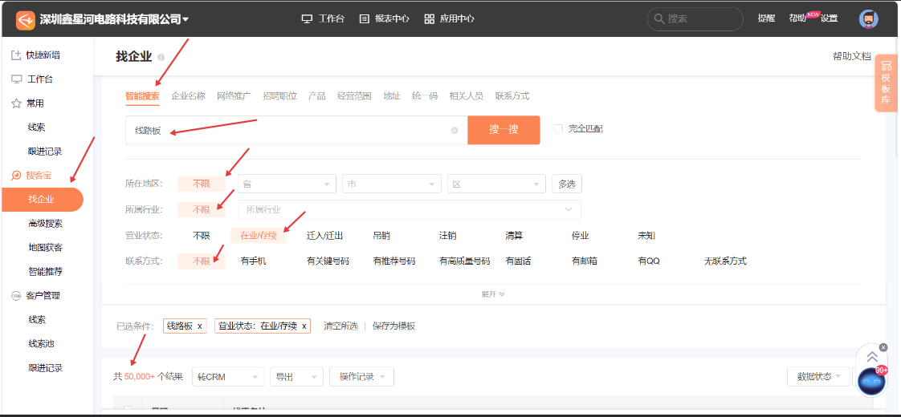

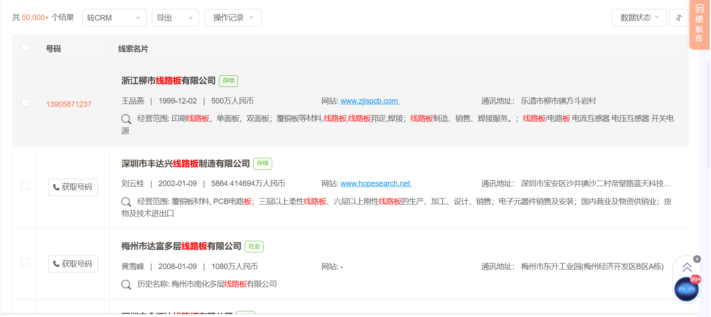

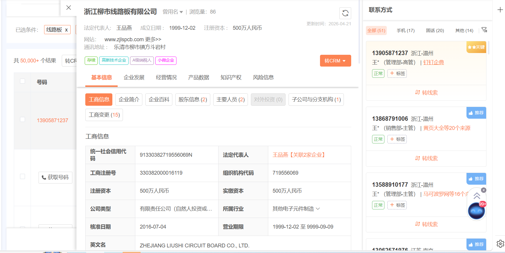

提取线路板公司基础信息（单独存档）

公司中文名称

公司英文名称

公司成立时间

公司网址

公司通讯地址

公司注册地址

公司联系人（联系人数据都提取）（职位/名称/电话/邮箱）

公司注册资金/实缴资金

公司人员（规模）

公司法人

**找电路板公司（60000+）**

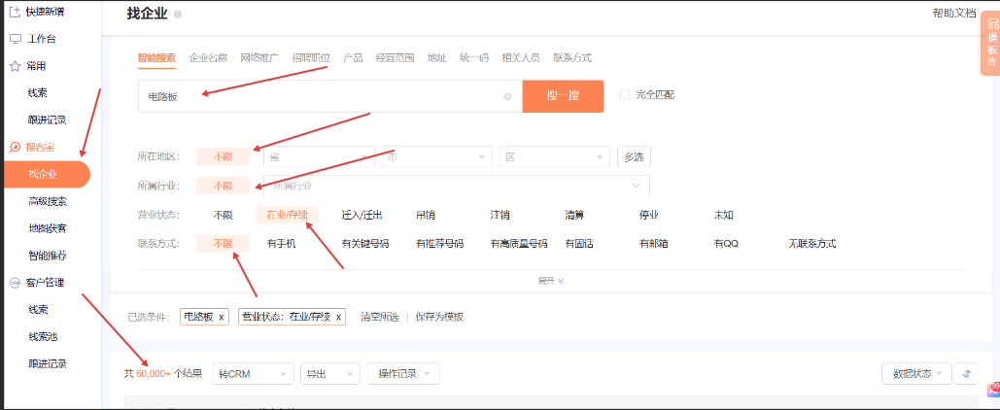

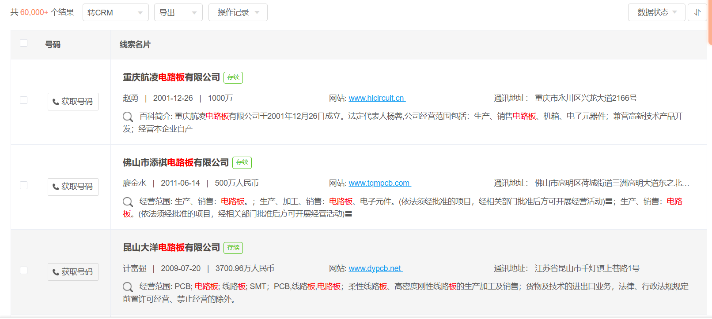

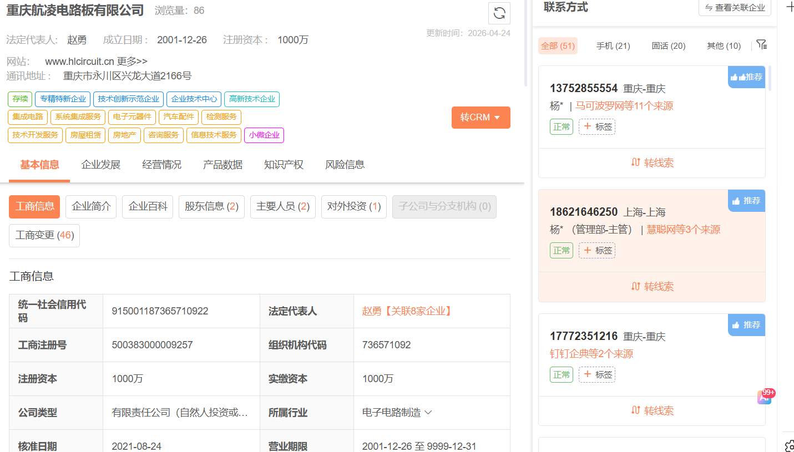

四．提取**电路板**公司基础信息（单独存档）

公司中文名称

公司英文名称

公司成立时间

公司网址

公司通讯地址

公司注册地址

公司联系人（联系人数据都提取）（职位/名称/电话/邮箱）

公司注册资金/实缴资金

公司人员（规模）

公司法人

**合并以上（电路板+线路板）两组数据单独存档。**

**提供以上公司英文名称到腾道数据中搜索他们的"进口商名称(标准)"既是我们要找的客户。（方法如下）**

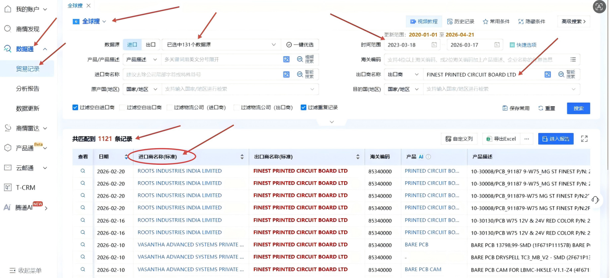

点击客户名称进入客户内容提取我们要的数据。

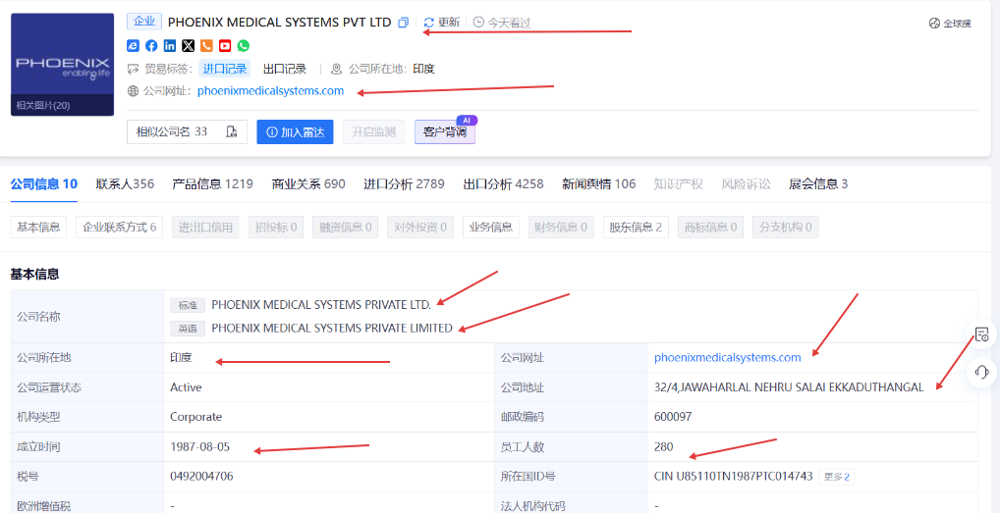

（客户数据内容）

公司名称/**公司LOGO（增加）**/英文名称/国家/细分行业/产品标签/工厂性质/公司规模/官网/数据来源/有没有进出口数据/进出口总额度（3年）/进出口次数/联系人数/公司成立时间/PCB供应商/增加新客户可以手动录入栏/更新时间-（另外公司画像内容）

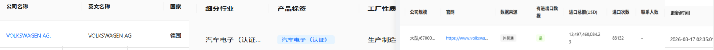

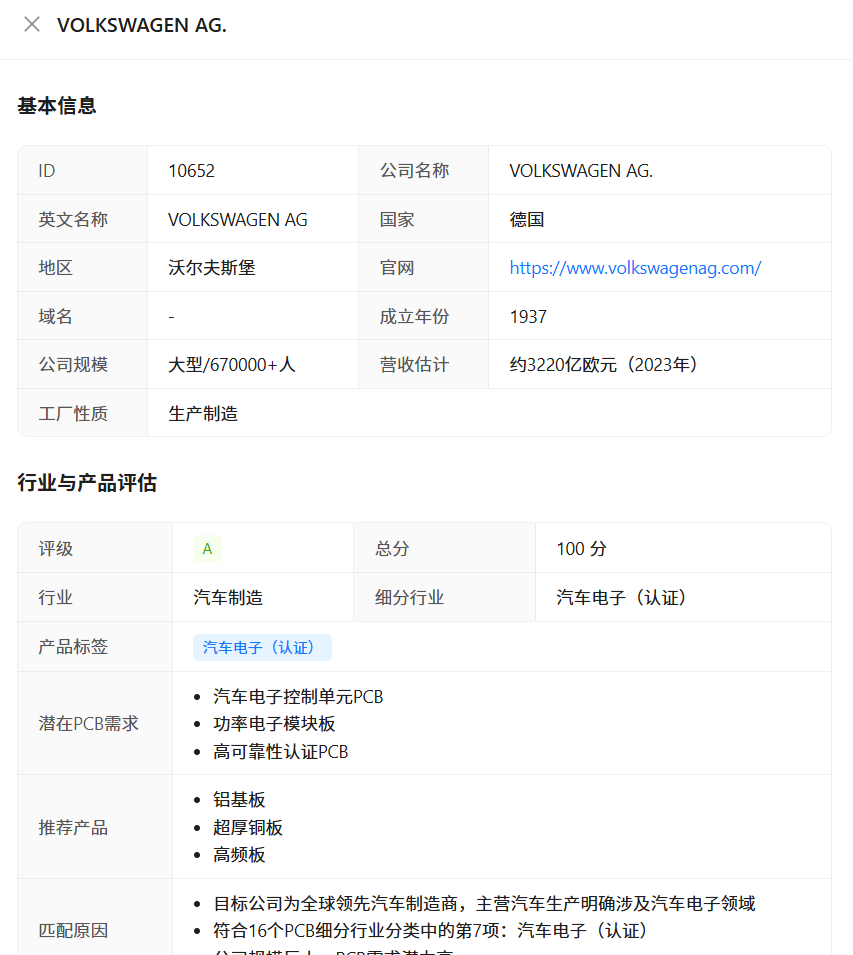

**提供以上公司英文名称到网易外贸通数据中找到该公司。（方法如下）**

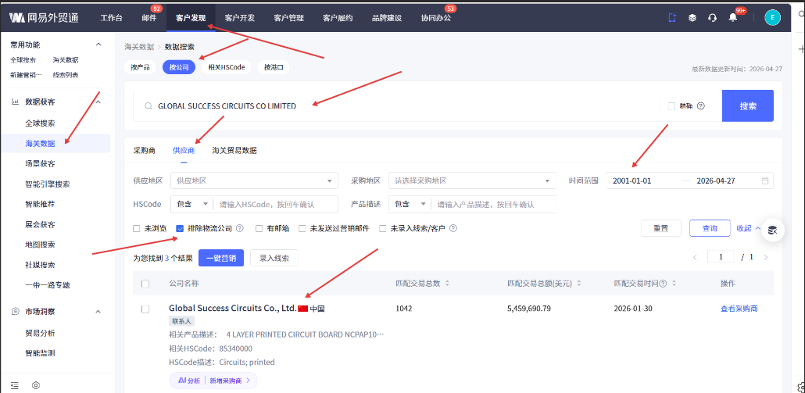

**九.点击进去找到它的"采购商"既是我们的客户**

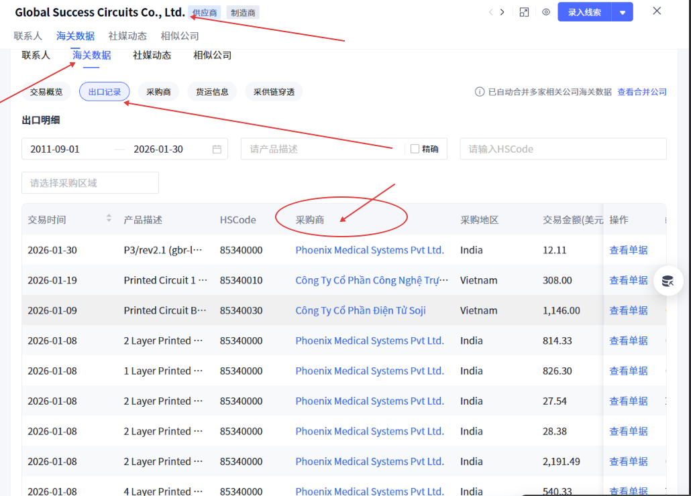

收集我们的客户信息。

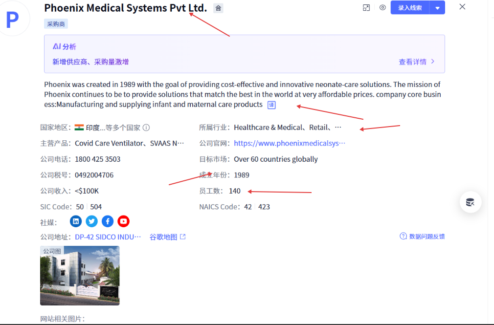

同一家（线+电路板英文）公司腾道和网易外贸通都需要搜索但数据**分开存档。**

**存档内容如下：**

（客户数据内容同上）
