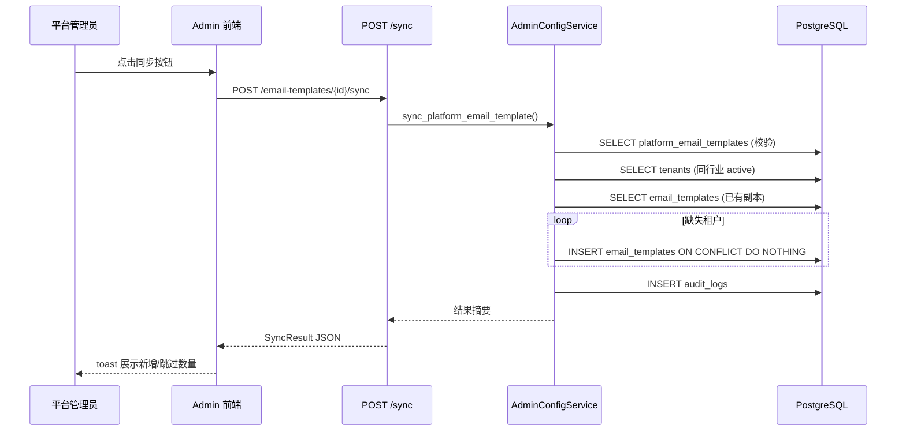

# feat: 平台邮件模板同步到同行业租户

## Summary

为 Admin 端新增手动同步能力：平台管理员可将某个启用的平台邮件模板同步给所有同行业 active 租户。后端实现批量查询 + 循环 INSERT ON CONFLICT DO NOTHING 的幂等同步逻辑，前端在模板列表增加同步按钮并以 toast 展示结果摘要。新增一个 Alembic partial unique index 迁移保障并发安全。

---

## Problem Frame

平台邮件模板只在创建租户时按行业复制一次。平台后续新增的模板无法自动补发给已有同行业租户，导致运营需手动补写线上数据，既低效又容易遗漏。

---

## Requirements

- R1. 平台管理员可对单个启用的平台邮件模板触发同步，将其补齐到所有同行业 active 租户
- R2. 同步幂等：已有非软删除副本的租户跳过，不覆盖租户已编辑内容
- R3. 未启用或不存在的平台模板拒绝同步，返回明确错误
- R4. 同步接口返回完整结果摘要（模板信息、目标租户数、新增数、跳过数、明细）
- R5. 同步动作写入审计记录
- R6. Admin 前端提供同步按钮，成功后展示摘要 toast，失败后展示错误提示
- R7. 并发同步不创建重复副本（数据库层 partial unique index 保障）

---

## Scope Boundaries

- 不做租户端平台模板导入入口
- 不做跨行业同步、租户多选或全量广播
- 不做自动后台同步、定时任务或平台模板更新下发
- 不修改现有邮件发送链路和发送计划逻辑
- 不复制 `body_design` 字段（租户模板表无此列，与创建租户行为一致）
- 不覆盖、更新或回滚租户已有模板副本
- 同步按钮无确认弹窗（依赖幂等性保障安全）
- 响应数组不截断不分页（当前 B2B 场景单行业租户数有限）

---

## Context & Research

### Relevant Code and Patterns

- **Admin 路由模式**：`backend/app/api/admin/config.py` — 所有端点使用 `PlatformAuthContext = Depends(get_current_platform_user)`，返回 `success_response(data)`。服务实例 `service = AdminConfigService()` 在模块级创建。URL 前缀 `/admin/api/v1/`
- **Admin 服务模式**：`backend/app/services/admin_config_service.py` — 方法签名 `async def method(self, conn, *, param=...)` ，使用 `sqlalchemy.text()` 原始 SQL，UUID 用 `new_uuid()`，审计用 `self.audit.write()`
- **租户模板复制逻辑**：`backend/app/services/tenant_service.py:349-387` — `_copy_platform_email_templates()` 方法，复制字段为 `id, name, category, subject, body_html, body_text, variables`
- **前端 API 封装**：`frontend/packages/shared-api/src/admin/email-templates.ts` — `emailTemplatesApi(client)` 返回对象字面量，各方法用 `client.get/post/put/delete`
- **Admin 列表页操作**：`frontend/apps/admin/src/app/(dashboard)/email-templates/client-page.tsx` — 行内 `Button variant="ghost" size="icon"`，toast 用 `sonner` 的 `toast.success/error`，刷新用 `query.refetch()` 或 `await load()`
- **Alembic 迁移模式**：`backend/alembic/versions/` — 命名 `YYYYMMDD_NNNN_desc.py`，使用 `conn.exec_driver_sql()`

### Institutional Learnings

- **asyncpg 参数类型安全**（`docs/solutions/runtime-errors/asyncpg-named-param-cast-syntax-error-20260507.md`）：绝不在 `sqlalchemy.text()` 中使用 `::type` 语法，必须用 `CAST(:param AS type)` 或传 Python 原生类型对象
- **ON CONFLICT 幂等模式**（`docs/solutions/best-practices/fk-column-migration-null-old-values-before-constraint-2026-05-07.md`）：以 `(tenant_id, platform_template_id)` 为去重键的 partial unique index 模式已有实践
- **幂等迁移**（`docs/solutions/best-practices/admin-waimaotong-fullstack-display-rewrite-2026-05-19.md`）：创建索引使用 `IF NOT EXISTS`，`exec_driver_sql()` 写原生 SQL
- **FK 依赖图查验**（`docs/solutions/database-issues/alembic-non-cascade-fk-chain-blocks-tenant-delete-2026-05-19.md`）：迁移前查 `pg_constraint` 确认不影响现有 FK 链路

---

## Key Technical Decisions

- **只同步到 active 租户**：`tenants.status = 'active'`，suspended/archived 租户不参与同步（Design Decision 5）
- **批量查询 + 循环 INSERT**：先一次 SELECT 查出已有副本的 tenant_id 集合，再循环 INSERT 缺失副本。INSERT 使用 `ON CONFLICT DO NOTHING`（Design Decision 7）
- **Partial unique index**：`(tenant_id, platform_template_id) WHERE deleted_at IS NULL`，数据库层保障并发安全（Design Decision 4）
- **软删除副本不阻止新同步**：查询已有副本时 `WHERE deleted_at IS NULL`，软删除的副本视为不存在
- **审计 action 为 `sync`**：entity_type 为 `platform_email_template`，new_value 记录同步摘要

---

## Open Questions

### Resolved During Planning

- **CONCURRENTLY 索引创建事务问题**：`CREATE INDEX CONCURRENTLY` 不能在事务内执行，Alembic 迁移需先 `COMMIT` 结束自动事务。但考虑到 `email_templates` 表数据量不大，可使用普通 `CREATE UNIQUE INDEX IF NOT EXISTS`（非 CONCURRENTLY），避免事务管理复杂性
- **前端 API 路径**：前端 admin client 的 baseURL 已包含 admin API 地址，调用时路径为 `/api/v1/email-templates/{id}/sync`（不含 `/admin` 前缀）

### Deferred to Implementation

- **审计记录的 new_value 具体 JSON 结构**：实现时根据同步结果确定，包含 created_count、skipped_count 等摘要信息

---

## High-Level Technical Design

> *以下为方向性设计指引，非实施规范。实施时应根据实际代码调整。*

```
同步流程：

1. 查平台模板 → 校验存在 + is_active = true
2. 查同行业 active 租户列表
3. 批量查已有非软删除副本 tenant_id 集合
4. 循环 INSERT 缺失副本 (ON CONFLICT DO NOTHING)
5. 收集 created / skipped 明细
6. 写审计记录
7. 返回完整结果摘要
```



---

## Implementation Units

### U1. Alembic 迁移：partial unique index

**Goal:** 创建 `ix_email_templates_tenant_platform_active` 索引，为并发同步提供数据库层幂等保障。

**Requirements:** R7

**Dependencies:** 无

**Files:**
- Create: `backend/alembic/versions/20260522_0052_email_template_sync_unique_index.py`

**Approach:**
- 先去重：删除 `(tenant_id, platform_template_id) WHERE deleted_at IS NULL` 重复行，保留每组最早创建的行（防止线上数据有重复导致建索引失败）
- 再建索引：`exec_driver_sql()` 执行 `CREATE UNIQUE INDEX IF NOT EXISTS ix_email_templates_tenant_platform_active ON email_templates (tenant_id, platform_template_id) WHERE deleted_at IS NULL`
- downgrade 执行 `DROP INDEX IF EXISTS ix_email_templates_tenant_platform_active`（不恢复已删除的重复行）
- 不使用 `CONCURRENTLY`（表数据量可控），避免事务管理复杂性
- `down_revision` 链接到当前最新迁移

**Patterns to follow:**
- `backend/alembic/versions/20260521_0051_wmt_keyword_master_ids_not_null.py` — 命名规范和 `exec_driver_sql()` 模式

**Test scenarios:**
- Happy path: 迁移 upgrade 成功，索引在 `pg_indexes` 中可见
- Happy path: 迁移 downgrade 成功，索引被移除
- Edge case: 重复执行 upgrade 不报错（`IF NOT EXISTS`）

**Verification:**
- `alembic upgrade head` 执行无报错
- `SELECT indexname FROM pg_indexes WHERE tablename = 'email_templates' AND indexname = 'ix_email_templates_tenant_platform_active'` 返回 1 行

---

### U2. 后端同步接口与服务逻辑

**Goal:** 实现 `POST /email-templates/{template_id}/sync` 路由和 `AdminConfigService.sync_platform_email_template()` 同步方法，包含审计记录。

**Requirements:** R1, R2, R3, R4, R5

**Dependencies:** U1

**Files:**
- Modify: `backend/app/api/admin/config.py`
- Modify: `backend/app/services/admin_config_service.py`

**Approach:**

路由层（`config.py`）：
- 新增 `@router.post("/email-templates/{template_id}/sync")`
- 依赖 `PlatformAuthContext`，调用 `service.sync_platform_email_template(context.connection, template_id=template_id, platform_user_id=context.platform_user_id)`
- 返回 `success_response(result)`

服务层（`admin_config_service.py`）新增 `sync_platform_email_template(self, conn, *, template_id, platform_user_id)` 方法：
- 调用已有 `get_platform_email_template()` 获取模板详情，校验存在性
- 校验 `is_active = true`，否则 `raise AppError(code="INVALID_OPERATION", message="未启用的模板不可同步", status_code=400)`
- 查同行业 active 租户：`SELECT id, name FROM tenants WHERE industry = :industry AND status = 'active'`
- 批量查已有副本：`SELECT tenant_id FROM email_templates WHERE platform_template_id = :template_id AND deleted_at IS NULL`
- 计算缺失租户集合（set 差集）
- 循环 INSERT 缺失副本，字段与 `tenant_service._copy_platform_email_templates()` 一致（`id, tenant_id, source_type='platform_copy', platform_template_id, name, category, subject, body_html, body_text, variables`），SQL 末尾加 `ON CONFLICT (tenant_id, platform_template_id) WHERE deleted_at IS NULL DO NOTHING`
- UUID 用 `CAST(:variables AS jsonb)` 处理 JSONB 字段（遵循 asyncpg 参数安全规则）
- 收集 created / skipped 明细数组
- 写审计记录：`action="sync"`, `entity_type="platform_email_template"`, `entity_id=template_id`, `new_value=摘要 JSON`
- 返回结果字典

**Patterns to follow:**
- `backend/app/services/admin_config_service.py` 中已有的 `create_platform_email_template()` — SQL 风格、参数绑定、审计调用
- `backend/app/services/tenant_service.py:349-387` — 复制字段列表和 INSERT 语句结构
- `backend/app/api/admin/config.py` 中已有的邮件模板端点 — 路由装饰器、依赖注入、响应格式

**Test scenarios:**
- 见 U3（测试与服务逻辑分离为独立单元）

**Verification:**
- 路由注册成功，`POST /admin/api/v1/email-templates/{id}/sync` 可达
- 响应结构包含 spec 定义的所有字段

---

### U3. 后端测试

**Goal:** 覆盖 spec 定义的全部同步场景和工程审查中补充的 4 个额外场景。

**Requirements:** R1, R2, R3, R4, R5, R7

**Dependencies:** U1, U2

**Files:**
- Create: `backend/tests/test_platform_email_template_sync.py`

**Approach:**
- 使用项目标准测试模式：`create_app()` + `AsyncClient` + `ASGITransport`
- 通过 `login_admin()` 获取平台管理员 token
- 测试前通过 Admin API 创建平台邮件模板和租户作为测试数据
- 每个测试场景独立、幂等

**Patterns to follow:**
- `backend/tests/test_admin_config_api.py` — 测试框架、helper 用法、断言模式

**Test scenarios:**
- Happy path: 两个同行业 active 租户缺失副本 → 同步后各创建一份副本，`created_count=2, skipped_count=0`
- Happy path: 同步结果包含完整的 `template_id, template_name, industry, target_tenant_count, created, skipped` 字段
- Happy path: 同步动作写入审计记录（查 `audit_logs` 表验证）
- Edge case: 已有非软删除副本的租户被跳过，`skipped` 中包含 `reason: already_exists`，已有副本内容不被修改
- Edge case: 重复同步不创建新副本，全部租户报告为 skipped
- Edge case: `suspended` / `archived` 租户不参与同步，不出现在 created 或 skipped 中
- Edge case: 软删除的副本（`deleted_at IS NOT NULL`）不阻止新同步，为该租户创建新副本
- Error path: 未启用模板（`is_active=false`）同步返回 400 错误，不创建任何副本
- Error path: 不存在的 `template_id` 返回 404 错误

**Verification:**
- 所有测试通过
- 覆盖 spec.md 中定义的全部 GIVEN/WHEN/THEN 场景

---

### U4. 前端 shared-api 同步方法与类型

**Goal:** 在 Admin 邮件模板 API 中新增 `sync` 方法和 `SyncResult` 响应类型。

**Requirements:** R4, R6

**Dependencies:** U2

**Files:**
- Modify: `frontend/packages/shared-api/src/admin/email-templates.ts`

**Approach:**
- 新增 `SyncResult` interface，包含 spec 定义的响应字段
- 新增 `SyncCreatedItem` 和 `SyncSkippedItem` 子类型
- 在 `emailTemplatesApi()` 返回对象中新增 `sync: (id: string) => client.post<ApiResponse<SyncResult>>('/api/v1/email-templates/${id}/sync')`

**Patterns to follow:**
- `frontend/packages/shared-api/src/admin/email-templates.ts` — 已有 API 方法的封装风格和类型导出方式

**Test scenarios:**
- Test expectation: none — 纯类型定义和 API 封装，由 U5 的集成使用验证

**Verification:**
- TypeScript 编译通过，类型正确导出
- Admin 应用可通过 `adminApi.emailTemplates.sync(id)` 调用

---

### U5. Admin 前端同步按钮与结果展示

**Goal:** 在平台邮件模板列表的每行操作区增加同步按钮，调用 API 后以 toast 展示结果。

**Requirements:** R6

**Dependencies:** U4

**Files:**
- Modify: `frontend/apps/admin/src/app/(dashboard)/email-templates/client-page.tsx`

**Approach:**
- 在每行操作区（编辑/删除按钮旁）新增同步按钮：`Button variant="ghost" size="icon"`，图标用 `RefreshCw` 或 `Send`（从 lucide-react 导入）
- 点击后直接调用 `adminApi.emailTemplates.sync(template.id)`（无确认弹窗）
- 按钮在请求进行时 disabled + loading 状态，防止重复点击
- 成功：`toast.success('同步完成：新增 ${created_count} 个，跳过 ${skipped_count} 个')`
- 失败：`toast.error('同步失败：' + errorMessage)`
- 同步完成后不需要刷新列表（同步不修改平台模板本身）

**Patterns to follow:**
- `frontend/apps/admin/src/app/(dashboard)/email-templates/client-page.tsx` — 已有的编辑/删除按钮布局、toast 调用模式
- `sonner` toast API — `toast.success()` / `toast.error()`

**Test scenarios:**
- Happy path: 点击同步按钮 → API 调用成功 → toast 展示新增/跳过数量
- Error path: API 返回错误 → toast 展示错误信息，不展示成功摘要
- Edge case: 请求进行中按钮 disabled，防止重复点击

**Verification:**
- 同步按钮在每个模板行可见
- 点击后 toast 正确展示结果摘要或错误信息
- 按钮 loading 状态正常切换

---

## System-Wide Impact

- **Interaction graph:** 新增同步动作仅写入 `email_templates` 表和 `audit_logs` 表。不触发任何 webhook、后台任务或消息队列。不影响现有邮件发送链路
- **Error propagation:** 同步失败（模板不存在/未启用）在服务层抛出 `AppError`，路由层由 FastAPI 异常处理器统一转换为 JSON 错误响应。前端捕获后展示 toast
- **State lifecycle risks:** 同步通过 `get_connection()` 运行在单个数据库事务内（`engine.begin()`），全部 INSERT 要么全部成功要么全部回滚。partial unique index 的 `ON CONFLICT DO NOTHING` 确保并发请求不创建重复数据
- **API surface parity:** 仅新增 Admin 端 API，租户端无变化。租户端仍通过已有的 `email_templates` 查询看到同步后的副本
- **Unchanged invariants:** 现有邮件模板 CRUD 接口不受影响。创建租户时的 `_copy_platform_email_templates()` 逻辑不变。邮件发送、发送计划、EngageLab 集成均不涉及

---

## Risks & Dependencies

| Risk | Mitigation |
|------|------------|
| 并发同步创建重复副本 | Partial unique index + ON CONFLICT DO NOTHING |
| asyncpg 参数类型陷阱（`::type` 语法） | 使用 `CAST(:param AS type)` 或传 Python 原生类型对象 |
| 迁移与线上数据冲突 | 使用 `IF NOT EXISTS` 保证幂等；实施前用 `sync_prod_db_to_local.sh` 同步线上数据本地验证 |
| 同行业但业务语境不同的租户收到不适用模板 | Admin 主动触发 + 行业限定降低误发范围；幂等不覆盖 |
| 前端误触同步 | 幂等性保障——只补缺失、不覆盖、不重复创建 |

---

## Documentation / Operational Notes

- 发布顺序：Alembic 迁移先发布 → 后端同步接口 → 前端操作按钮
- 回滚：索引回滚 `DROP INDEX`；后端回滚后前端按钮 API 报错但不影响其他功能
- 实施前建议用 `./scripts/sync_prod_db_to_local.sh` 同步线上数据，确认迁移对已有数据安全

---

## Sources & References

- **Origin document:** [openspec/changes/sync-platform-email-templates/](openspec/changes/sync-platform-email-templates/) — proposal.md, design.md, specs/platform-email-template-sync/spec.md, tasks.md
- Related code: `backend/app/services/tenant_service.py:349-387`（现有平台模板复制逻辑）
- Related code: `backend/app/services/admin_config_service.py`（Admin 配置服务）
- Related code: `frontend/packages/shared-api/src/admin/email-templates.ts`（前端 API 封装）
- Learnings: `docs/solutions/runtime-errors/asyncpg-named-param-cast-syntax-error-20260507.md`
- Learnings: `docs/solutions/best-practices/fk-column-migration-null-old-values-before-constraint-2026-05-07.md`
