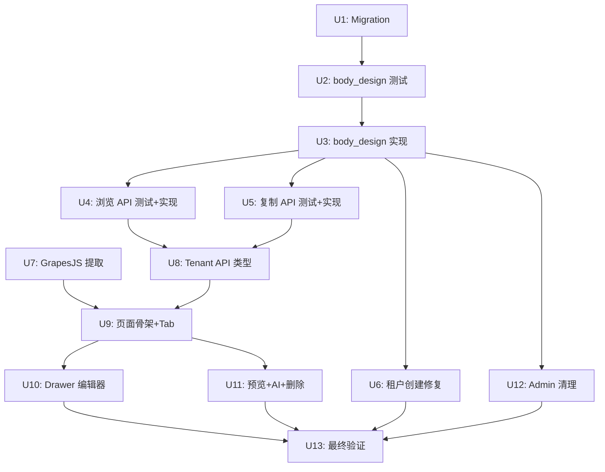

# feat: Tenant 邮件模板市场 + 页面重写

## Summary

基于已审查通过的 design.md 和 tasks.md，以 TDD 驱动实施 Tenant 端邮件模板市场功能。在 tasks.md 的 9 个 unit 基础上按 TDD 粒度细化为 13 个 unit（CRUD 拆分为 RED+GREEN、API 各自独立、前端分解为骨架+编辑器+交互组件）。后端部分严格 TDD（先写测试后实现），前端部分以浏览器功能验证驱动。每个执行步骤控制在 2-5 分钟。

---

## Problem Frame

Tenant 端邮件模板页面仅 72 行，只有基础创建+列表。后端 API 齐备（CRUD/clone/preview/ai-generate）但前端从未真正实现。现有 Admin 推送同步机制与租户端模板管理语义冲突，需改为模板市场模式。(see origin: `openspec/changes/tenant-email-template-marketplace/proposal.md`)

---

## Requirements

- R1. `email_templates` 表新增 `body_design jsonb` 列
- R2. 现有 CRUD 支持 body_design 存取（create/update/get/preview/serialize/sanitize）
- R3. Tenant 浏览平台模板库（按行业筛选）
- R4. Tenant 复制平台模板到自有模板（含行业校验）
- R5. 创建租户时自动复制包含 body_design
- R6. GrapesJS 编辑器提取到 @shared/ui 共享包
- R7. Tenant 页面重写：双 Tab + Drawer 编辑器 + 预览 + AI 生成
- R8. 废弃 Admin 同步功能（前后端）
- R9. 15 项后端测试覆盖

---

## Scope Boundaries

- 不做模板搜索、筛选、标签等高级管理
- 不做 AI 生成高级参数（tone/language/purpose）
- 不做模板使用统计或版本管理
- 不搭建前端测试基础设施（已在 TODOS.md backlog 中）
- 不做平台模板更新通知或差异对比

---

## Context & Research

### Relevant Code and Patterns

- **后端测试模式**：`backend/tests/test_admin_email_template_sync.py` — 异步测试 + ASGI 集成 + `login_admin`/`login_tenant` + `create_tenant_via_admin` 辅助函数
- **SQL 模式**：`text()` 原始 SQL + 命名参数 + `CAST(:var AS jsonb)` + `COALESCE` 选择性更新
- **迁移模式**：`20260522_0052` 为当前最新序号，使用 `op.execute("ALTER TABLE ... ADD COLUMN IF NOT EXISTS ...")`
- **API 工厂模式**：`emailTemplatesApi(client: AxiosInstance)` 返回方法对象
- **GrapesJS 组件**：65 行，forwardRef + dynamic import + `getHtml()`/`getDesign()` handle
- **路由权限**：读操作 `get_current_tenant_user`，写操作 `require_tenant_roles("admin", "operator")`

### Institutional Learnings

- Alembic 迁移用 `ADD COLUMN IF NOT EXISTS` 保证幂等（`docs/solutions/best-practices/admin-waimaotong-fullstack-display-rewrite-2026-05-19.md`）
- asyncpg 环境禁止 `:param::type` 语法，用 `CAST(:param AS type)`（`docs/solutions/runtime-errors/asyncpg-named-param-cast-syntax-error-20260507.md`）
- 迁移前查 FK 依赖图，本次仅加列无 FK 风险

---

## Key Technical Decisions

- **body_design UPDATE 不用 COALESCE**：直接赋值，支持前端传 null 清空设计数据（D7 审查决策）
- **list 不返回 body_design**：避免列表响应体膨胀（D4 审查决策）
- **copy API 校验行业**：`WHERE is_active = true AND industry = :industry`，防止跨行业复制（D6 审查决策）
- **sanitize 白名单扩展**：扩展 `html_sanitizer.py` 白名单加入 table/img/style/td/tr/th/thead/tbody 等邮件标签，始终执行清洗（D8 审查决策，安全审查修正：绕过清洗 → 扩展白名单）
- **iframe sandbox**：预览用 `sandbox=""`（空 sandbox，opaque origin），禁止脚本执行且隔离 origin，防止访问主应用 cookie/localStorage
- **TDD 执行姿态**：后端严格 TDD（先 RED 后 GREEN），前端浏览器功能验证

---

## Open Questions

### Resolved During Planning

- **前端 TDD 策略**：tenant 端无测试框架，前端以浏览器功能验证替代严格 TDD（D1）
- **迁移序号**：`20260522_0053`，down_revision 为 `20260522_0052`

### Deferred to Implementation

- GrapesJS 编辑器在 Tenant 端的高度是否需要调整（当前固定 640px）
- AI 生成返回数据结构的字段映射细节

---

## High-Level Technical Design

> *This illustrates the intended approach and is directional guidance for review, not implementation specification.*

**TDD 节奏**：后端每个 Unit 按 RED→GREEN→VERIFY 循环，每步 2-5 分钟。前端每个 Unit 按 CODE→VERIFY 循环。

---

## Implementation Units

### U1. Alembic 迁移：body_design 列

**Goal:** email_templates 表新增 body_design jsonb 列

**Requirements:** R1

**Dependencies:** None

**Files:**
- Create: `backend/alembic/versions/20260522_0053_email_template_body_design.py`

**Approach:**
1. *(3min)* 创建迁移文件：`revision = "20260522_0053"`，`down_revision = "20260522_0052"`，upgrade 执行 `ALTER TABLE email_templates ADD COLUMN IF NOT EXISTS body_design jsonb`，downgrade 执行 `DROP COLUMN IF EXISTS`
2. *(2min)* 运行 `alembic upgrade head`，用 psql 确认列已存在

**Patterns to follow:**
- `backend/alembic/versions/20260423_0006_email_template_design.py`（同类迁移）
- 使用 `op.execute()` 原始 SQL，`IF NOT EXISTS` 幂等

**Test expectation:** none — 纯 DDL，迁移成功即验证

**Verification:**
- `alembic upgrade head` 无报错
- `\d email_templates` 显示 `body_design jsonb` 列

---

### U2. RED：body_design CRUD 测试

**Goal:** 先写 body_design 相关的 7 个失败测试

**Requirements:** R9

**Dependencies:** U1

**Files:**
- Create: `backend/tests/test_tenant_email_templates.py`

**Approach:**
1. *(3min)* 创建测试文件骨架：导入 `create_app`、`ASGITransport`、`AsyncClient`、`helpers`；写第一个测试 `test_create_template_with_body_design`——创建租户→登录 tenant→POST 创建模板含 body_design→断言响应包含 body_design
2. *(3min)* 写 `test_create_template_without_body_design`——创建不含 body_design 的模板→断言成功且 body_design 为 None
3. *(3min)* 写 `test_update_template_body_design`——创建模板→PUT 更新 body_design→GET 确认更新
4. *(3min)* 写 `test_update_template_clear_body_design`——创建含 body_design 的模板→PUT body_design=null→GET 确认已清空
5. *(3min)* 写 `test_sanitize_preserves_email_tags`——创建含 table/img/style 的 body_html→断言这些邮件标签保留（白名单扩展后不被清洗）
6. *(3min)* 写 `test_sanitize_strips_dangerous_html`——创建含 script/iframe/on* 属性的 body_html→断言危险标签被清洗（无论 body_design 是否存在）
7. *(3min)* 写 `test_clone_template_preserves_body_design`——创建含 body_design 的模板→调 clone 接口→断言克隆模板包含 body_design
8. *(2min)* 运行 `pytest backend/tests/test_tenant_email_templates.py -x`，确认 7 个测试全部 FAIL（RED）

**Execution note:** 严格 TDD RED 阶段——所有测试必须失败，证明测试有效

**Patterns to follow:**
- `backend/tests/test_admin_email_template_sync.py` 的三层嵌套结构
- `login_admin` + `create_tenant_via_admin` + `login_tenant` 组合

**Test scenarios:**
- Happy path: 创建含 body_design 的模板，响应包含 body_design 字段
- Happy path: 创建不含 body_design 的模板，向后兼容
- Happy path: 更新 body_design 字段
- Edge case: 传 null 清空 body_design（直接赋值，非 COALESCE）
- Integration: 邮件标签（table/img/style）通过扩展白名单保留
- Integration: 危险标签（script/iframe/on*）始终被清洗，无论 body_design 是否存在
- Integration: clone 保留 body_design 字段

**Verification:**
- 7 个测试全部 FAIL，失败原因是功能未实现（非测试代码错误）

---

### U3. GREEN：实现 body_design CRUD 支持

**Goal:** 让 U2 的 7 个测试全部通过

**Requirements:** R2

**Dependencies:** U2

**Files:**
- Modify: `backend/app/services/tenant_messaging_service.py`
- Modify: `backend/app/utils/html_sanitizer.py`

**Approach:**
1. *(3min)* `create_email_template`：INSERT SQL 增加 `body_design` 列和 `CAST(:body_design AS jsonb)` 参数；参数字典增加 `"body_design": self._to_json(payload.get("body_design"))`
2. *(3min)* `update_email_template`：UPDATE SQL 增加 `body_design = CAST(:body_design AS jsonb)`（直接赋值，不用 COALESCE）；参数字典增加 body_design
3. *(2min)* `get_email_template`：SELECT 增加 `body_design`（`preview_email_template` 调用 `get_email_template`，无需独立修改）
4. *(2min)* `_serialize_template`：返回字典增加 `"body_design": row["body_design"]`
5. *(3min)* `html_sanitizer.py`：扩展 `ALLOWED_HTML_TAGS` 加入 `table, tr, td, th, thead, tbody, tfoot, img, style, span, div, a, h1-h6, center, hr`；扩展 `ALLOWED_HTML_ATTRIBUTES` 加入 `style, class, width, height, src, alt, align, valign, border, cellpadding, cellspacing, bgcolor, colspan, rowspan`。`_sanitize_template_content` 始终调用 `sanitize_html`，不再有 body_design 条件跳过
6. *(2min)* `clone_email_template`：payload 构建增加 `"body_design": row["body_design"]`（约第 254-278 行，当前遗漏 body_design）
7. *(2min)* 运行 `pytest backend/tests/test_tenant_email_templates.py -x`，确认 7 个测试全部 PASS（GREEN）

**Execution note:** TDD GREEN 阶段——最小改动让测试通过

**Patterns to follow:**
- 现有 `create_email_template` 的 INSERT 模式（约第 50-85 行）
- 现有 `update_email_template` 的 UPDATE 模式（约第 174-194 行）
- `CAST(:variables AS jsonb)` 的参数化 JSON 模式

**Test scenarios:**
- 由 U2 覆盖

**Verification:**
- U2 的 6 个测试全部 PASS
- `list_email_templates` 的 SELECT 未增加 body_design（确认不影响列表性能）

---

### U4. 平台模板浏览 API（TDD 循环）

**Goal:** 实现 list_platform_templates 方法和路由

**Requirements:** R3, R9

**Dependencies:** U3

**Files:**
- Modify: `backend/tests/test_tenant_email_templates.py`
- Modify: `backend/app/services/tenant_messaging_service.py`
- Modify: `backend/app/api/tenant/messaging.py`

**Approach:**
1. *(4min)* **RED**：写 3 个测试——`test_list_platform_templates_returns_matching_industry`（Admin 创建匹配行业的平台模板→Tenant GET /platform-templates→断言返回匹配模板）、`test_list_platform_templates_empty_when_no_match`（不同行业→空列表）、`test_list_platform_templates_excludes_inactive`（is_active=false→不返回）；运行确认 FAIL
2. *(4min)* **GREEN**：在 `TenantMessagingService` 新增 `list_platform_templates(conn, tenant_id)` 方法——查 tenants 表获取 industry→查 `platform_email_templates WHERE industry = :industry AND is_active = true ORDER BY updated_at DESC`→序列化返回（**列表响应排除 body_html 和 body_design**，仅返回 id/name/description/category/subject/variables/created_at/updated_at，与 list_email_templates 排除 body_design 的理由一致——性能+安全面缩小；platform_email_templates 仅 Admin 可写）
3. *(3min)* **GREEN**：在 `messaging.py` 新增 `GET /platform-templates` 路由，权限 `get_current_tenant_user`，调用 service 方法，返回 `paginated_response`
4. *(2min)* 运行测试确认 3 个全部 PASS

**Patterns to follow:**
- `list_email_templates` 的 SELECT + paginated_response 模式
- Admin API 中 `platform_email_templates` 的序列化方式

**Test scenarios:**
- Happy path: 返回匹配行业的活跃平台模板
- Edge case: 无匹配行业返回空列表
- Edge case: is_active=false 的模板被排除

**Verification:**
- 3 个测试全部 PASS
- `GET /t/{slug}/api/v1/platform-templates` 返回正确格式

---

### U5. 平台模板复制 API（TDD 循环）

**Goal:** 实现 copy_platform_template 方法和路由

**Requirements:** R4, R9

**Dependencies:** U3

**Files:**
- Modify: `backend/tests/test_tenant_email_templates.py`
- Modify: `backend/app/services/tenant_messaging_service.py`
- Modify: `backend/app/api/tenant/messaging.py`

**Approach:**
1. *(5min)* **RED**：写 4 个测试——`test_copy_platform_template_success`（复制含 body_design 的平台模板→断言新模板 source_type='platform_copy' + body_design 正确）、`test_copy_platform_template_industry_mismatch`（跨行业复制→403/400）、`test_copy_platform_template_inactive_returns_error`（复制未启用模板→400）、`test_copy_platform_template_not_found`（不存在→404）；运行确认 FAIL
2. *(5min)* **GREEN**：在 `TenantMessagingService` 新增 `copy_platform_template(conn, tenant_id, template_id, user_id)` 方法——查 tenants 获取 industry→查 platform_email_templates 验证 `is_active = true AND industry = :industry`→调用 `create_email_template` 复制所有字段→审计记录
3. *(3min)* **GREEN**：在 `messaging.py` 新增 `POST /platform-templates/{template_id}/copy` 路由，权限 `require_tenant_roles("admin", "operator")`
4. *(2min)* 运行测试确认 4 个全部 PASS

**Patterns to follow:**
- `admin_config_service.sync_platform_email_template` 的复制逻辑（被废弃但可参考模式）
- `create_email_template` 的 payload 构建方式

**Test scenarios:**
- Happy path: 正常复制含 body_design，source_type='platform_copy'
- Error path: 跨行业复制被拒绝
- Error path: 复制未启用模板报错
- Error path: 模板不存在返回 404

**Verification:**
- 4 个测试全部 PASS
- 复制后的模板 platform_template_id 指向源模板

---

### U6. 租户创建时 body_design 修复（TDD 循环）

**Goal:** 修复 `_copy_platform_email_templates` 遗漏 body_design 的 bug

**Requirements:** R5, R9

**Dependencies:** U3

**Files:**
- Modify: `backend/tests/test_tenant_email_templates.py`
- Modify: `backend/app/services/tenant_service.py`

**Approach:**
1. *(4min)* **RED**：写 `test_copy_platform_templates_on_tenant_creation_includes_body_design`——Admin 创建含 body_design 的平台模板→Admin 创建新租户→Tenant 登录→列出模板→断言模板包含 body_design；运行确认 FAIL
2. *(3min)* **GREEN**：在 `tenant_service.py` 的 `_copy_platform_email_templates`（约 349 行）——SELECT 增加 `body_design`→INSERT 增加 `body_design` 列和 `CAST(:body_design AS jsonb)` 参数
3. *(2min)* 运行测试确认 PASS

**Patterns to follow:**
- 现有 `_copy_platform_email_templates` 的 SELECT/INSERT 模式（第 349-387 行）

**Test scenarios:**
- Integration: 创建租户时自动复制包含 body_design 的平台模板

**Verification:**
- 测试 PASS
- 新租户自动获得含 body_design 的平台模板副本

---

### U7. GrapesJS 编辑器提取到 @shared/ui

**Goal:** 将 GrapesJS 编辑器从 Admin 移到共享包

**Requirements:** R6

**Dependencies:** None（纯前端，可与 U2-U6 并行）

**Files:**
- Create: `frontend/packages/shared-ui/src/components/grapes-email-editor.tsx`
- Modify: `frontend/packages/shared-ui/package.json`
- Modify: `frontend/packages/shared-ui/src/index.ts`
- Modify: `frontend/apps/admin/src/app/(dashboard)/email-templates/client-page.tsx`
- Modify: `frontend/apps/admin/package.json`
- Delete: `frontend/apps/admin/src/components/grapes-email-editor.tsx`

**Approach:**
1. *(2min)* 复制 `frontend/apps/admin/src/components/grapes-email-editor.tsx` 到 `frontend/packages/shared-ui/src/components/grapes-email-editor.tsx`
2. *(3min)* `shared-ui/package.json` 新增依赖 `grapesjs@^0.22.15`、`grapesjs-preset-newsletter@^1.0.2`；`shared-ui/src/index.ts` 导出 `GrapesEmailEditor` 和 `GrapesEmailEditorHandle`
3. *(3min)* `admin/client-page.tsx` 更新导入为 `import { GrapesEmailEditor, type GrapesEmailEditorHandle } from '@shared/ui'`；`admin/package.json` 移除 grapesjs 直接依赖
4. *(2min)* 删除 `admin/src/components/grapes-email-editor.tsx`
5. *(3min)* 运行 `pnpm install`；启动 Admin 端验证编辑器正常加载和保存

**Patterns to follow:**
- `shared-ui/src/index.ts` 的具名导出方式：`export { Component, type Handle } from './components/...'`

**Test expectation:** none — 纯文件移动+重导出，Admin 端浏览器验证

**Verification:**
- Admin 端邮件模板编辑器正常加载
- GrapesJS 可拖拽编辑并保存

---

### U8. Tenant API 类型扩展 + Admin API 清理

**Goal:** 前端 API 层支持新接口，移除废弃类型

**Requirements:** R3, R4, R8

**Dependencies:** U4, U5

**Files:**
- Modify: `frontend/packages/shared-api/src/tenant/email-templates.ts`
- Modify: `frontend/packages/shared-api/src/admin/email-templates.ts`

**Approach:**
1. *(3min)* Tenant API：`EmailTemplate` 接口增加 `body_design?: unknown`；新增 `PlatformTemplate` 接口（id/name/description/category/subject/body_html/body_design/variables/created_at/updated_at）
2. *(3min)* Tenant API：`emailTemplatesApi` 增加 `platformList()` → `client.get('/api/v1/platform-templates')` 和 `platformCopy(id)` → `client.post('/api/v1/platform-templates/${id}/copy')`
3. *(2min)* Admin API：移除 `sync` 方法和 `SyncEmailTemplateResult` 类型
4. *(2min)* 运行 `pnpm -r run typecheck` 确认 TypeScript 编译通过

**Patterns to follow:**
- 现有 `emailTemplatesApi` 的工厂函数模式
- `PaginatedResponse<T>` 和 `ApiResponse<T>` 泛型

**Test expectation:** none — 纯类型定义，TypeScript 编译验证

**Verification:**
- TypeScript 编译无错误
- 新方法签名与后端 API 契约匹配

---

### U9. Tenant 页面骨架：双 Tab 布局 + DataTable

**Goal:** 搭建页面框架，实现两个 Tab 的数据展示

**Requirements:** R7

**Dependencies:** U7, U8

**Files:**
- Modify: `frontend/apps/tenant/src/app/(dashboard)/templates/page.tsx`

**Approach:**
1. *(5min)* 重写页面：PageHeader（标题 + 「新建模板」按钮 + 「AI 生成」按钮）→ Tabs 组件（平台模板库 / 我的模板）→ 平台模板库 Tab 用 `useQuery(['tenant', 'platform-templates'])` 绑定 `platformList()`，DataTable 展示名称/分类/主题/更新时间/操作列
2. *(5min)* 我的模板 Tab 用 `useQuery(['tenant', 'templates'])` 绑定 `list()`，DataTable 展示名称/分类/主题/来源 Badge/更新时间/操作列；来源 Badge 逻辑：`source_type === 'platform_copy'` 显示「平台」
3. *(3min)* 平台模板库操作列：预览按钮 + 复制按钮（**注意**：mock 中有编辑按钮但 design.md 明确平台模板只读，以 design.md 为准）；复制用 `useMutation` 调用 `platformCopy(id)` → invalidate queries → 切换到「我的模板」Tab + toast
4. *(3min)* 我的模板操作列：预览/编辑/克隆/删除按钮（点击事件先写空处理）
5. *(3min)* 启动 dev server 验证：两个 Tab 切换正常、数据加载正常、复制操作成功

**Patterns to follow:**
- 现有 `page.tsx` 的 `useQuery`/`useMutation`/`DataTable`/`PageHeader` 用法
- Admin 端 email-templates 页面的 Tab 布局参考

**Test expectation:** none — UI 页面，浏览器验证

**Verification:**
- 两个 Tab 正常展示数据
- 平台模板复制操作成功并切换 Tab
- 来源 Badge 正确显示

---

### U10. Drawer 编辑器（表单 + 三模式切换）

**Goal:** 实现侧滑 Drawer 编辑器，支持可视化/HTML/纯文本三种模式

**Requirements:** R7

**Dependencies:** U9

**Files:**
- Modify: `frontend/apps/tenant/src/app/(dashboard)/templates/page.tsx`

**Approach:**
1. *(5min)* Sheet 组件（760px 宽）：表单字段——名称 Input、分类 Select（cold_outreach/follow_up/promotion/festival）、主题 Input；变量 chips（硬编码 VARIABLES 列表，点击复制 `{{变量名}}` 到剪贴板）
2. *(5min)* 编辑器模式 Tabs：可视化（GrapesJS from @shared/ui）/ HTML 源码（Textarea）/ 纯文本（Textarea）；`mode` 状态控制显示哪个编辑器；`editorRef: useRef<GrapesEmailEditorHandle>` 引用 GrapesJS；**模式切换时自动同步**：切离当前模式前从当前编辑器获取最新值，切入目标模式时用该值初始化（可视化→HTML：`getHtml()` 填充 textarea；HTML→可视化：textarea 内容加载到 GrapesJS）
3. *(5min)* 保存逻辑：**所有模式必须显式发送 body_design 字段**（直接赋值无 COALESCE，缺失会被置 NULL）。`mode === 'visual'` 时 body_design = `editorRef.current.getDesign()`、body_html = `getHtml()`；`mode === 'html'` 时 body_design = null、body_html = textarea 值；`mode === 'text'` 时 body_design = null、body_text = textarea 值。创建走 `create()`，更新走 `update()`
4. *(3min)* 编辑按钮联动：点击「编辑」→调 `detail(id)` 获取完整数据→打开 Drawer 填充表单
5. *(3min)* 启动验证：新建模板（三种模式各测一次）、编辑已有模板、保存后数据正确

**Patterns to follow:**
- Admin 端的 GrapesJS 集成方式（`design` 和 `html` 双向绑定）
- shadcn/ui 的 Sheet 组件用法

**Test expectation:** none — UI 交互，浏览器验证

**Verification:**
- Drawer 打开/关闭正常
- 三种编辑模式切换正常
- 可视化模式 GrapesJS 正确加载和保存 body_design
- HTML 模式保存后 body_design 为 null
- 变量 chips 点击复制到剪贴板

---

### U11. 预览 Modal + AI 生成 Modal + 删除确认

**Goal:** 补齐页面剩余交互组件

**Requirements:** R7

**Dependencies:** U9

**Files:**
- Modify: `frontend/apps/tenant/src/app/(dashboard)/templates/page.tsx`

**Approach:**
1. *(5min)* 预览 Dialog（860px 宽）：调 `preview(id)` 获取数据→iframe `srcdoc` 渲染变量替换后的 HTML（`sandbox=""`）→变量示例值提示栏
2. *(5min)* AI 生成 Dialog（520px 宽）：表单字段——名称（可选）、分类 Select、公司描述 Textarea、生成要求 Textarea、主题偏好（可选）→提交调 `aiGenerate(data)` → 关闭 Modal → 用返回的 subject/body_html/variables 打开 Drawer
3. *(3min)* 删除 AlertDialog：确认后调 `delete(id)` → invalidate queries → toast
4. *(2min)* 克隆操作：调 `clone(id)` → invalidate queries → toast
5. *(3min)* 启动验证：预览弹窗展示正确、AI 生成流程完整、删除和克隆操作成功

**Patterns to follow:**
- shadcn/ui 的 Dialog/AlertDialog 组件
- iframe `srcdoc` + `sandbox` 安全模式
- 现有 `aiGenerate` API 方法

**Test expectation:** none — UI 交互，浏览器验证

**Verification:**
- 预览 Modal 正确渲染 HTML（iframe sandbox）
- AI 生成表单提交→编辑器打开并填充
- 删除确认后模板移除
- 克隆操作生成副本

---

### U12. Admin 同步功能移除

**Goal:** 前后端同时废弃同步能力

**Requirements:** R8

**Dependencies:** U3（后端 body_design 支持已就绪）

**Files:**
- Modify: `frontend/apps/admin/src/app/(dashboard)/email-templates/client-page.tsx`
- Modify: `backend/app/api/admin/config.py`
- Modify: `backend/app/services/admin_config_service.py`
- Delete: `backend/tests/test_admin_email_template_sync.py`

**Approach:**
1. *(3min)* Admin 前端：移除 `syncing` 状态、`syncTemplate` 方法、同步按钮（`<RefreshCw>` 图标按钮约第 245 行）、移除 `RefreshCw` import
2. *(3min)* 后端路由：从 `config.py` 移除 `POST /email-templates/{template_id}/sync` 路由
3. *(3min)* 后端服务：从 `admin_config_service.py` 移除 `sync_platform_email_template` 方法（约第 681-760 行）
4. *(2min)* 移除测试文件 `backend/tests/test_admin_email_template_sync.py`
5. *(2min)* 验证：Admin 模板页面正常加载无同步按钮；`pytest backend/tests/` 无报错

**Patterns to follow:**
- 直接删除代码，不留废弃标记或兼容 shim

**Test expectation:** none — 纯删除操作，验证不破坏其他功能

**Verification:**
- Admin 端模板列表正常，无同步按钮
- 后端无 sync 路由
- 其他测试不受影响

---

### U13. 最终验证与收尾

**Goal:** 全面验证并完成 change 收尾

**Requirements:** R1-R9

**Dependencies:** U6, U10, U11, U12

**Files:**
- Modify: `openspec/changes/tenant-email-template-marketplace/tasks.md`

**Approach:**
1. *(3min)* 运行全部后端测试：`pytest backend/tests/ -x`，确认 15 个新测试 + 其他测试全部通过
2. *(3min)* 运行前端检查：`pnpm -r run typecheck && pnpm -r run lint`，确认无错误
3. *(3min)* 更新 tasks.md 勾选状态
4. *(3min)* 调用 `verification-before-completion` skill，输出「原始需求 → 已实现/未实现」对照
5. *(3min)* Tenant 端完整流程验证：平台模板库浏览→预览→复制→我的模板编辑（可视化+HTML+纯文本）→克隆→删除→AI 生成→编辑器微调→保存→预览

**Test expectation:** none — 验证步骤本身

**Verification:**
- 后端 15 个新测试 + 其余测试全部 PASS
- 前端 lint + typecheck 无错误
- tasks.md 全部勾选
- verification-before-completion 对照完成

---

## System-Wide Impact

- **Interaction graph:** `_sanitize_template_content` 被 `create_email_template` 和 `update_email_template` 调用——扩展白名单影响所有模板写入路径，但始终保留清洗防线
- **Error propagation:** copy API 失败（行业不匹配/模板不存在）返回 4xx，前端 toast 展示错误
- **State lifecycle risks:** body_design 与 body_html 必须保持一致——可视化模式两者同步更新；HTML 模式 body_design 置 null
- **API surface parity:** list 接口不返回 body_design（性能优化），detail/get/preview 返回 body_design——前端需用 detail 获取编辑数据
- **Unchanged invariants:** 邮件发送链路（SendingWorker）不受影响——发送只读 body_html/body_text，不依赖 body_design；现有 platform_email_templates CRUD 不变

---

## Risks & Dependencies

| Risk | Mitigation |
|------|------------|
| GrapesJS 在 Tenant 端动态导入失败 | 复用 Admin 端已验证的 dynamic import 模式 |
| body_design jsonb 大小影响数据库性能 | list 接口不返回，仅 detail/preview 返回 |
| GrapesJS HTML 被清洗破坏 | 扩展 sanitizer 白名单兼容邮件标签，始终清洗危险标签 |
| 迁移与线上 schema 不同步 | 使用 `IF NOT EXISTS` 幂等迁移 |

---

## Sources & References

- **Origin document:** [proposal.md](openspec/changes/tenant-email-template-marketplace/proposal.md)
- **技术设计:** [design.md](openspec/changes/tenant-email-template-marketplace/design.md)
- **任务清单:** [tasks.md](openspec/changes/tenant-email-template-marketplace/tasks.md)
- **审查报告:** 2026-05-22 /plan-eng-review 完成，8 项决策（D1-D8），5 issue 全部解决
- **前序 change:** [sync-platform-email-templates](openspec/changes/sync-platform-email-templates/)（被本 change 废弃的同步功能）
- **Mock 设计:** `docs/mock/tenant-templates.html`
