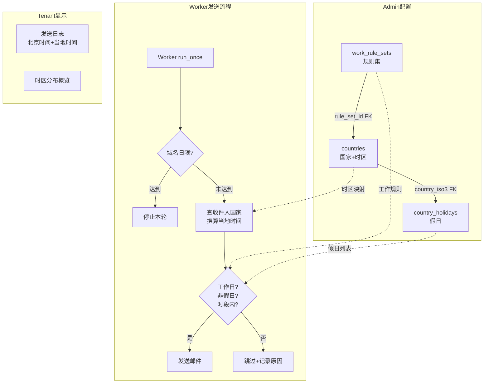

# feat: 按收件人当地时间智能发送

## Summary

新增国家工作时间配置体系和时区感知发送能力。Admin 端维护工作规则集（按工作模式分组关联多国）、国家时区与假日、全局默认规则；Worker 发送时按收件人所在国家当地时间判断是否在工作时段内；Tenant 端发送日志新增当地时间列和时区分布概览。

## Problem Frame

当前发送系统无时区感知，所有收件人不区分地理位置统一发送。国际客户开发场景下，邮件可能在收件人当地凌晨或深夜送达，影响打开率和专业形象。`send_strategy` 字段中预留的 `timezone_aware`、`preferred_hours` 从未被 Worker 实际使用。

---

## Requirements

**Admin 配置**

- R1. 系统内置 ISO 3166-1 国家列表，每国预置 IANA 主时区，admin 可改
- R2. Admin 可查看国家列表（搜索、筛选），显示时区和关联规则集
- R3. Admin 可修改国家主时区
- R4. Admin 可创建工作规则集（名称+工作日+多时段，支持跨天），时段不允许重叠
- R5. Admin 可编辑规则集
- R6. Admin 可删除规则集，关联国家自动解除
- R7. 规则集详情页管理关联国家，一国只属一个规则集
- R8. 规则集列表显示名称、工作日、时段、关联国家数
- R9. 系统为每国 AI 预填当年假日
- R10. Admin 可手动修改/添加/删除假日
- R11. 假日按日期排序，支持按年筛选
- R12. Admin 可配置全局默认规则（工作日+时段）
- R13. 默认规则初始预设为周一至周五 09:00-17:00
- R14. 默认规则入口与规则集列表同级
- R15. Admin 侧边栏新增一级菜单，页面用 Tab 组织（规则集/国家/默认规则）

**Worker 发送逻辑**

- R16. 逐封检查域名级日限，达到则停止本轮
- R17. 按收件人国家当地时间判断工作日+非假日+时段内，跨天时段工作日按开始时间所在日判定
- R18. 不满足条件的收件人跳过，下次轮询重新检查
- R19. 公司未填国家或国家未关联规则集时，走默认规则
- R20. 跳过时记录原因，在收件人 tab 展示

**Tenant 显示**

- R21. 发送日志新增当地时间列（前端实时转换），保留北京时间
- R22. 当地时间格式 `YYYY-MM-DD HH:mm TZ`
- R23. 计划信息 tab 增加收件人时区分布概览

**技术清理**

- R24. 清理 `send_strategy` 中未使用的 `timezone_aware`、`preferred_hours`、`daily_limit`

---

## Key Technical Decisions

- **IANA 时区标识，非固定 UTC 偏移：** 使用 `America/New_York` 而非 `UTC-5`，由 Python `zoneinfo` 标准库自动处理夏令时切换。（see origin: docs/brainstorms/2026-05-29-admin-country-work-schedule-requirements.md）

- **国家数据通过外部 JSON + migration seed：** 250+ 国家数据存放在 `backend/app/data/countries.json`，migration 读取后批量插入。避免 migration 文件过大，数据文件可复用。

- **规则集与国家为一对多关系：** `countries` 表通过 `rule_set_id` FK 关联 `work_rule_sets`，一国只属一个规则集。删除规则集时 `SET NULL`。

- **默认规则作为特殊的单例记录：** 在 `work_rule_sets` 表中用 `is_default = true` 标记，不单独建表。简化查询逻辑——未关联规则集的国家直接 fallback 到 `is_default = true` 的记录。

- **Worker 时区配置缓存：** Worker 每轮开始时一次性加载所有国家→时区→规则集映射到内存，避免逐封邮件查库。配置数据量小（~250 条国家 + 数个规则集），全量加载开销可忽略。

- **跨天时段语义：** 开始时间 > 结束时间表示跨天（22:00-06:00 = 当天 22:00 到次日 06:00）。工作日判定按开始时间所在日期。

- **当地时间前端实时转换：** 后端只存 UTC 时间戳，前端根据收件人国家的当前时区配置实时换算。无额外后端字段。需要后端在发送日志 API 返回收件人的 `country_iso3`，前端查询国家时区映射表做转换。

---

## High-Level Technical Design

---

## Scope Boundaries

- 发送计划创建流程不变
- 不支持城市/地区级子时区
- 假日由 AI 预填 + admin 手动修改，不对接第三方日历服务
- 不支持按个人行为数据优化发送时间（12月目标）
- 收件人 tab 不新增当地时间列（当地时间仅在发送日志 tab 显示），但会新增「跳过原因」列（R20 要求）
- Admin 端仅桌面端，不做移动端适配。保留基础无障碍：表单 label 关联、键盘可导航、对比度符合 WCAG AA

### Deferred to Follow-Up Work

- 假日自动年度更新机制
- 国家时区地图可视化

---

## Implementation Units

### U1. 数据库迁移——新建表和种子数据

- **Goal:** 创建 `work_rule_sets`、`countries`、`country_holidays` 三张表，种子 ISO 3166-1 国家数据和 IANA 时区映射
- **Requirements:** R1, R4, R12, R13, R20（skip_reason 字段）
- **Dependencies:** 无
- **Files:**
  - `backend/alembic/versions/20260529_0001_create_timezone_tables.py`（迁移文件）
  - `backend/app/data/countries.json`（国家+时区种子数据）
- **Approach:**
  - `work_rule_sets` 表：`id (UUID PK)`、`name (text NOT NULL)`、`work_days (int[] NOT NULL)`（0=周一…6=周日）、`time_segments (jsonb NOT NULL)`（`[{"start":"09:00","end":"17:00"}]`）、`is_default (boolean DEFAULT false)`、`created_at`、`updated_at`。`is_default` 加 partial unique index 保证最多一条默认记录
  - `countries` 表：`iso3 (char(3) PK)`、`name_zh (text NOT NULL)`、`name_en (text NOT NULL)`、`timezone (text NOT NULL)`（IANA 标识）、`rule_set_id (UUID FK → work_rule_sets ON DELETE SET NULL)`、`created_at`、`updated_at`
  - `country_holidays` 表：`id (UUID PK)`、`country_iso3 (char(3) FK → countries ON DELETE CASCADE)`、`date (date NOT NULL)`、`name (text)`、`created_at`。联合唯一约束 `(country_iso3, date)`
  - Migration 读取 `backend/app/data/countries.json` 批量插入国家数据
  - 在 `sequence_enrollments` 表新增 `last_skip_reason (text)` 和 `last_skip_at (timestamptz)` 字段，用于记录时区跳过原因
  - 插入一条默认规则集（周一至周五 09:00-17:00，`is_default = true`）
- **Patterns to follow:** `20260523_0100_add_sender_email_to_domain.py` 的 `conn.exec_driver_sql()` 模式，加 `IF NOT EXISTS` 幂等 guard
- **Test scenarios:**
  - 执行 `alembic upgrade head` 成功，三张表创建
  - `countries` 表包含 250+ 条记录，每条有合法的 IANA 时区标识
  - 默认规则集存在且 `is_default = true`
  - `downgrade` 成功回滚所有表
- **Verification:** 迁移执行后在开发数据库中确认表结构和种子数据数量

---

### U2. Admin 服务层——工作时间配置 CRUD

- **Goal:** 实现规则集、国家配置、假日、默认规则的完整业务逻辑
- **Requirements:** R2-R8, R9, R10-R14
- **Dependencies:** U1
- **Files:**
  - `backend/app/services/admin_work_schedule_service.py`（新建）
- **Approach:**
  - 新建 `AdminWorkScheduleService` 类，遵循 `admin_config_service.py` 的模式：async 方法 + `conn: AsyncConnection` 参数 + 原生 SQL
  - 规则集 CRUD：`list_rule_sets`、`get_rule_set`、`create_rule_set`、`update_rule_set`、`delete_rule_set`（删除为硬删除，FK ON DELETE SET NULL 自动解除国家关联）。**`delete_rule_set` 必须检查 `is_default`，禁止删除默认规则**
  - 国家管理：`list_countries`（支持搜索、筛选关联/未关联）、`get_country`、`update_country_timezone`
  - 规则集-国家关联：`assign_countries_to_rule_set`、`remove_country_from_rule_set`。分配时自动清除旧关联（UPDATE SET rule_set_id = NULL WHERE iso3 IN ... AND rule_set_id != target）
  - 假日管理：`list_holidays`（支持年份筛选）、`create_holiday`、`update_holiday`、`delete_holiday`。R9 的 AI 假日预填通过 admin 手动触发搜集实现，搜集结果写入 `country_holidays` 表
  - 默认规则：`get_default_rule`、`update_default_rule`——操作 `is_default = true` 的规则集记录
  - 时段验证逻辑：检查同一规则集内多个时段不重叠。跨天时段（start > end）展开为两段判断
  - 所有写操作通过 `AuditService.write()` 记录审计日志
- **Patterns to follow:** `admin_config_service.py` 的 `create_data_source` / `list_data_sources` 模式
- **Test scenarios:**
  - 创建规则集成功，返回完整数据
  - 创建规则集时时段重叠，返回验证错误
  - 分配国家到规则集，该国自动从旧规则集解除
  - 删除规则集后，关联国家的 `rule_set_id` 变为 NULL
  - 创建假日时日期重复，返回唯一约束错误
  - 按年份筛选假日只返回该年数据
  - 更新默认规则成功
- **Verification:** 所有 CRUD 操作在数据库中产生正确状态

---

### U3. Admin API 路由

- **Goal:** 暴露工作时间配置的 HTTP 端点
- **Requirements:** R2-R11, R15
- **Dependencies:** U2
- **Files:**
  - `backend/app/api/admin/work_schedule.py`（新建）
  - `backend/app/api/admin/router.py`（注册新路由）
- **Approach:**
  - 新建路由模块 `router = APIRouter(prefix="/work-schedule", tags=["admin-work-schedule"])`
  - 端点设计：
    - `GET /rule-sets` → 列表
    - `POST /rule-sets` → 创建
    - `GET /rule-sets/{id}` → 详情（含关联国家列表）
    - `PATCH /rule-sets/{id}` → 编辑
    - `DELETE /rule-sets/{id}` → 删除
    - `POST /rule-sets/{id}/countries` → 批量分配国家
    - `DELETE /rule-sets/{id}/countries/{iso3}` → 移除国家
    - `GET /countries` → 国家列表（支持 `?search=` 和 `?has_rule_set=true/false`）
    - `GET /countries/{iso3}` → 国家详情（含假日列表）
    - `PATCH /countries/{iso3}` → 修改时区
    - `GET /countries/{iso3}/holidays` → 假日列表（支持 `?year=`）
    - `POST /countries/{iso3}/holidays` → 添加假日
    - `DELETE /countries/{iso3}/holidays/{id}` → 删除假日
    - `POST /countries/{iso3}/holidays/ai-fill` → 触发 AI 搜集假日（单国）
    - `POST /countries/holidays/ai-fill` → 批量触发 AI 搜集假日（多国）
    - `GET /default-rule` → 获取默认规则
    - `PATCH /default-rule` → 修改默认规则
  - 所有端点使用 `Depends(get_current_platform_user)` 认证
  - 在 `router.py` 中注册 `include_router(work_schedule_router)`
- **Patterns to follow:** `backend/app/api/admin/config.py` 的路由和响应格式（`success_response` / `paginated_response`）
- **Test scenarios:**
  - 未认证请求返回 401
  - CRUD 操作返回正确响应格式
  - 搜索国家返回匹配结果
  - 分配不存在的国家返回 404
- **Verification:** 通过 API 客户端或 curl 调用所有端点确认正确响应

---

### U4. Admin API 客户端（前端）

- **Goal:** 前端 TypeScript API 客户端封装
- **Requirements:** R2-R15（前端调用基础）
- **Dependencies:** U3
- **Files:**
  - `frontend/packages/shared-api/src/admin/work-schedule.ts`（新建）
  - `frontend/packages/shared-api/src/admin/index.ts`（注册新模块）
  - `frontend/packages/shared-api/src/query-keys.ts`（新增 queryKey）
- **Approach:**
  - 定义 TypeScript 接口：`WorkRuleSet`、`Country`、`Holiday`、`TimeSegment`
  - 导出 `workScheduleApi(client)` 工厂函数，包含所有端点的方法
  - 在 `createAdminApi` 中注册 `workSchedule: workScheduleApi(client)`
  - 在 `query-keys.ts` 中新增 `workSchedule` 命名空间的 queryKey helper
- **Patterns to follow:** `frontend/packages/shared-api/src/admin/ai-config.ts` 的模块模式；`query-keys.ts` 的 `tenantScope()` 模式（admin 端无需 tenant scope）
- **Test expectation:** none — 纯类型定义和 API 封装，无业务逻辑
- **Verification:** TypeScript 编译通过，类型定义与后端 API 响应一致

---

### U5. Admin 前端——主页面骨架与规则集列表

- **Goal:** 实现发送时间配置的主页面框架（Tab 切换）和规则集 Tab 的完整功能
- **Requirements:** R4-R8, R12-R15
- **Dependencies:** U4
- **Files:**
  - `frontend/apps/admin/src/app/(dashboard)/work-schedule/page.tsx`（主页面 server 组件）
  - `frontend/apps/admin/src/app/(dashboard)/work-schedule/client-page.tsx`（主页面 client 组件，含 Tab 切换）
  - `frontend/apps/admin/src/components/layout/sidebar.tsx`（新增菜单项）
- **Approach:**
  - 全局交互模式：所有页面默认只读展示，点击「编辑」按钮切换到表单编辑态，保存/取消回到只读态。列表页纯只读，操作列统一用图标按钮（`>` 进详情、🗑 删除）
  - 主页面三个 Tab：「规则集」「国家」「默认规则」。U5 只建 Tab 骨架和规则集/默认规则两个 Tab 的完整实现，国家 Tab 仅渲染占位容器，由 U7 填充完整内容
  - 规则集 Tab：DataTable 只读列表。列：名称、工作日（badge）、时段（badge）、关联国家数。操作列：`>` 箭头进详情、垃圾桶删除。删除需 AlertDialog 确认，文案提示将解除 N 个关联国家
  - 默认规则 Tab：默认只读展示（工作日 badge + 时段 badge），右上角「编辑」按钮切换到表单态（工作日 checkbox + 时段编辑器），保存后回到只读态
  - 时段编辑组件：支持多时段添加/删除，每个时段为开始时间+结束时间 TimePicker
  - 工作日选择组件：7 个 checkbox（周一至周日）
  - 侧边栏「营销」分组下新增「发送时间配置」菜单项，icon 使用 `Clock`
  - 设计参考：`docs/mock/admin-work-schedule.html`
- **Patterns to follow:** `frontend/apps/admin/src/app/(dashboard)/ai-config/` 的 server/client 分离模式
- **Test scenarios:**
  - 页面加载时正确显示三个 Tab
  - 创建规则集后列表刷新显示新记录
  - 编辑规则集时段，添加重叠时段提示错误（inline 红色提示）
  - 删除规则集弹出确认弹窗，确认后列表刷新
  - 修改默认规则后保存成功
- **Interaction states:**

  | 功能 | Loading | Empty | Error | Success |
  |------|---------|-------|-------|---------|
  | 规则集列表 | 表格骨架屏 | 「尚未创建规则集」+ 新建按钮 | toast 提示加载失败 | 正常表格 |
  | 默认规则 | 「加载中...」文字 | 不会出现（系统初始化预设） | toast 提示 | 只读展示 |
  | 删除规则集 | AlertDialog 确认按钮 loading | — | toast 提示删除失败 | toast「已删除」+ 列表刷新 |

- **Verification:** 在 `next dev` 环境中 Tab 切换正常，规则集 CRUD 和默认规则编辑功能完整

---

### U6. Admin 前端——规则集详情页

- **Goal:** 实现规则集的只读/编辑切换和关联国家管理
- **Requirements:** R4-R8
- **Dependencies:** U5
- **Files:**
  - `frontend/apps/admin/src/app/(dashboard)/work-schedule/rule-sets/[id]/page.tsx`（规则集详情）
- **Approach:**
  - 默认只读展示（label-value 行式布局：名称、工作日、时段），右上角「编辑」按钮切换到表单态（名称 input + 工作日 checkbox + 时段编辑器）
  - 下方关联国家表格（国家名、ISO3、时区、操作），国家选择器使用带搜索的 Combobox，选中已归属其他规则集的国家时显示内联警告「该国当前属于 XX 规则集，保存后将自动移除」
  - 面包屑导航返回主页面
- **Patterns to follow:** 复用 U5 的时段编辑组件和工作日选择组件
- **Test scenarios:**
  - 详情页只读展示正确
  - 编辑后保存成功，回到只读态
  - 添加已归属其他规则集的国家，显示警告
  - 移除国家后表格刷新
- **Interaction states:**

  | 功能 | Loading | Empty | Error | Success |
  |------|---------|-------|-------|---------|
  | 规则集详情编辑 | 保存按钮 loading 态 | — | inline 红色错误提示 | toast「保存成功」+ 回到只读 |

- **Verification:** 规则集编辑和国家关联管理全流程可用

---

### U7. Admin 前端——国家详情页与假日管理

- **Goal:** 实现国家列表 Tab、国家详情页（时区编辑+假日管理）
- **Requirements:** R2-R3, R9-R11
- **Dependencies:** U5
- **Files:**
  - `frontend/apps/admin/src/app/(dashboard)/work-schedule/client-page.tsx`（国家 Tab 部分）
  - `frontend/apps/admin/src/app/(dashboard)/work-schedule/countries/[iso3]/page.tsx`（国家详情）
- **Approach:**
  - 国家 Tab：DataTable 只读列表，支持搜索。搜索框右侧加 Select 筛选「全部 / 已关联规则集 / 未关联规则集」+ 「AI 搜集假日」按钮（Tab 级别批量触发）。列：国家名、ISO3、时区、关联规则集（badge）、假日数（badge，0 为灰色）。操作列：`>` 箭头进详情
  - 国家详情页：默认只读展示（时区、关联规则集），右上角「编辑」按钮切换到表单态（时区用带搜索的 Combobox；规则集用 Select 下拉，含「不关联」选项）
  - 下方假日管理表格（日期、名称、来源、操作），支持年份筛选、添加/删除假日，保留单国「AI 搜集假日」按钮
  - 面包屑导航返回主页面
- **Patterns to follow:** 复用 U5 的 DataTable 和 Badge 模式
- **Test scenarios:**
  - 国家列表搜索和筛选正常
  - 修改国家时区后保存成功，列表显示新时区
  - 添加假日后列表显示新条目
  - AI 搜集假日触发后假日列表刷新
- **Interaction states:**

  | 功能 | Loading | Empty | Error | Success |
  |------|---------|-------|-------|---------|
  | 国家列表 | 表格骨架屏 | 不会出现（种子数据 250+） | toast 提示加载失败 | 正常表格 |
  | 国家详情编辑 | 保存按钮 loading 态 | — | inline 错误提示 | toast「保存成功」+ 回到只读 |
  | 假日列表 | 「加载中...」文字 | 「暂无假日数据，点击 AI 搜集」+ AI 搜集按钮 | toast 提示 | 正常表格 |
  | AI 搜集假日 | 按钮 loading + 「正在搜集...」 | — | toast 提示搜集失败 | toast「已搜集 N 个假日」+ 刷新 |

- **Verification:** 国家搜索/筛选、时区编辑、假日管理全流程可用

---

### U8. Worker 时区感知发送逻辑（原 U6）

- **Goal:** Worker 发送时按收件人当地时间判断是否在工作时段内
- **Requirements:** R16-R20
- **Dependencies:** U1, U2
- **Files:**
  - `backend/app/services/tenant_messaging_service.py`（修改 `claim_due_emails`）
  - `backend/app/workers/sending.py`（修改 `run_once`）
  - `backend/Dockerfile`（确保安装 `tzdata` 系统包）
- **Approach:**
  - 在 `run_once` 开头一次性加载所有时区配置：国家→时区映射、规则集数据、假日数据，缓存到内存 dict
  - 时区检查必须在 `claim_due_emails` 内部执行，位于 `_step_condition_satisfied` 检查之后、`email_send_locks` INSERT 和 `reserve_domain_quota` 之前。不满足时区条件的 enrollment 直接 `continue` 跳过——不锁定、不消耗配额、不创建 email 记录，确保下次轮询时该 enrollment 自然重新进入候选集（R18）
  - `claim_due_emails` 的 SQL 查询中 SELECT 追加 `cc.country_iso3`（现有 JOIN 链 `sending_plan_recipients → tenant_companies → waimaotong_clean_companies` 已包含该表，只需追加 SELECT 列）
  - 新增辅助函数 `is_sendable_now(country_iso3, tz_config)` → `(bool, skip_reason, next_sendable_at)`：
    1. 查国家时区，用 `zoneinfo.ZoneInfo` 转换当前 UTC 到当地时间
    2. **先匹配当前时间落入哪个工作时段**（包括跨天时段：`now < end` 可能属于前一天开始的跨天段）
    3. 如果匹配到时段，用该时段的**开始时间所在日**判定工作日和假日（非当前日期）
    4. 如果未匹配任何时段，判定为不可发送
    5. 未关联规则集或无国家时，使用默认规则；**无国家时固定使用 UTC 时区**（非服务器本地时区，避免随 Docker 环境漂移）
  - 不满足条件时，**计算 next_sendable_at**（下一个工作日+工作时段开始时间的 UTC 时间），UPDATE `sequence_enrollments` 设置 `next_step_due_at = next_sendable_at`、`last_skip_reason`、`last_skip_at`。这样跳过的 enrollment 不会在下一轮被重新 claim，避免忙轮询和 LIMIT 截断
  - 满足条件的继续走现有的 `reserve_domain_quota` → `send_email` 流程
  - **域名日限处理：** `reserve_domain_quota` 抛出 `QUOTA_EXCEEDED` 时需显式捕获，已处理的 enrollment 结果（skip_reason 更新、sent 标记）不应被回滚。确保配额检查的异常不会回滚同批次已有结果
- **Patterns to follow:** 现有 `claim_due_emails` 的 `FOR UPDATE SKIP LOCKED` 并发模式；`reserve_domain_quota` 的配额检查模式
- **Test scenarios:**
  - 收件人国家当地时间在工作时段内，正常发送
  - 收件人国家当地时间不在工作时段内，跳过并记录原因「当地非工作时间」
  - 收件人国家当天是假日，跳过并记录原因「当地假日」
  - 收件人国家当天非工作日，跳过并记录原因「当地非工作日」
  - 跨天时段（22:00-06:00）：当地 23:30 可发送，07:00 跳过
  - 多时段（9-12 + 14-18）：当地 13:00 跳过，15:00 可发送
  - 公司未填国家：走默认规则 + UTC 时区
  - 国家未关联规则集：走默认规则 + 该国时区
  - 夏令时边界：美国夏令时切换日前后，发送时间正确换算
  - 域名日限达到时停止本轮所有发送
- **Verification:** Worker 在开发环境执行一轮，日志中可见时区判断和跳过原因

---

### U9. Tenant 后端——发送日志和收件人 API 补充字段

- **Goal:** Tenant 端 API 返回时区和跳过原因数据，为前端显示提供数据基础
- **Requirements:** R20（数据部分）, R21, R23
- **Dependencies:** U1（countries 表）, U8（skip_reason 字段）
- **Files:**
  - `backend/app/api/tenant/messaging.py`（修改：发送日志和收件人 API 响应）
  - `backend/app/services/tenant_messaging_service.py`（修改：list_emails、list_recipients、get_sending_plan 查询）
- **Approach:**
  - `list_emails` SQL 追加 JOIN 链获取 `country_iso3` 和 `timezone`。完整路径：`emails → sequence_enrollments (enrollment_id) → sending_plan_recipients (plan_recipient_id) → tenant_companies (tenant_company_id) → waimaotong_clean_companies (clean_company_id) → LEFT JOIN countries (country_iso3)`，共 5 个额外 JOIN。需确认 `emails.enrollment_id` 是否有索引，无则需在 U1 迁移中补建
  - `list_recipients` SQL 追加返回 `last_skip_reason` 和 `country_iso3`
  - `get_sending_plan` 响应中新增 `recipient_country_distribution` 字段（SQL GROUP BY `country_iso3` 聚合，返回 `[{country_iso3, country_name, count, percentage}]`）
  - 无需新建公共接口，避免 Tenant 端跨越 Admin API 认证边界
- **Patterns to follow:** 现有 `list_emails` 的 JOIN 和响应格式
- **Test scenarios:**
  - 发送日志 API 返回 `country_iso3` 和 `timezone` 字段
  - 收件人 API 返回 `last_skip_reason` 字段
  - 发送计划详情 API 返回 `recipient_country_distribution` 字段
  - 无收件人时分布字段返回空数组
- **Verification:** curl 调用 API 确认新增字段存在且数据正确

---

### U10. Tenant 前端——当地时间显示和时区分布

- **Goal:** 发送日志新增当地时间列，收件人 tab 新增跳过原因列，计划信息增加时区分布概览
- **Requirements:** R20（显示部分）, R21-R23
- **Dependencies:** U9（后端字段就绪）
- **Files:**
  - `frontend/apps/tenant/src/app/(dashboard)/send-plans/[id]/page.tsx`（修改：发送日志+收件人+计划信息 tab）
- **Approach:**
  - 发送日志 tab 新增「当地时间」列：用 `dayjs.tz()` 根据后端返回的 `timezone` 字段实时转换，显示格式 `YYYY-MM-DD HH:mm TZ`
  - 收件人 tab 新增「跳过原因」列：显示 `last_skip_reason`，无值时显示 `-`
  - 计划信息 tab 新增时区分布概览统计区块，读取 `recipient_country_distribution` 字段
  - 前端使用 `dayjs` + `dayjs/plugin/timezone` 做时区转换
- **Patterns to follow:** 现有 `formatDateTime()` 函数（`frontend/apps/tenant/src/lib/format.ts`）；DataTable 列定义模式
- **Test scenarios:**
  - 发送日志中当地时间列正确显示转换后的时间和时区缩写
  - 公司未填国家的邮件，当地时间列显示 `-`
  - Admin 修改某国时区后，刷新页面当地时间列按新时区显示
  - 收件人 tab 跳过原因列正确显示
  - 时区分布概览正确显示各区域比例
  - 发送计划无收件人时分布概览显示「暂无收件人」
- **Interaction states:**

  | 功能 | Loading | Empty | Error | Success |
  |------|---------|-------|-------|---------|
  | 时区分布概览 | 「统计加载中...」占位 | 「暂无收件人」文字 | — | 分布图表 |

- **Verification:** 在 `next dev` 环境中查看发送日志页面，确认双时间列、跳过原因列和分布概览正确显示

---

### U11. 清理 send_strategy 未使用字段

- **Goal:** 移除 `sending_plans.send_strategy` 中的 `timezone_aware`、`preferred_hours`、`daily_limit` 历史遗留字段
- **Requirements:** R24
- **Dependencies:** U8（确认 Worker 已切换到新的时区配置体系）
- **Files:**
  - `backend/app/services/tenant_messaging_service.py`（移除默认值引用）
  - `backend/03_database/schema.sql`（更新 DEFAULT 值文档）
  - `backend/scripts/seed_demo_data.py`（移除旧字段引用）
  - `backend/alembic/versions/20260529_0002_cleanup_send_strategy.py`（迁移文件，更新 DEFAULT）
  - `frontend/packages/shared-types/src/models.ts`（移除 SendStrategy 接口中的旧字段）
- **Approach:**
  - 修改 `send_strategy` 的 DEFAULT 值，只保留 `interval_seconds`：`'{"interval_seconds":[30,120]}'`（注意：当前前端类型用的是 `interval_minutes`，需核实并对齐命名）
  - 在 `tenant_messaging_service.py` 的 `create_complete_sending_plan` 中更新默认值
  - 在 `frontend/packages/shared-types/src/models.ts` 的 `SendStrategy` 接口中移除 `timezone_aware`、`preferred_hours`、`daily_limit` 字段
  - 不删除已有数据中的旧字段值（JSON 字段中多余的 key 不影响功能）
  - 在 `seed_demo_data.py` 中移除旧字段
- **Patterns to follow:** 现有 migration 的 `ALTER TABLE ... ALTER COLUMN ... SET DEFAULT` 模式
- **Test scenarios:**
  - 新建发送计划的 `send_strategy` 不再包含 `timezone_aware`、`preferred_hours`、`daily_limit`
  - 已有发送计划的 `send_strategy` 中旧字段不影响功能
  - Worker 正常发送不受影响
- **Verification:** 创建新发送计划后检查 `send_strategy` 字段值

---

## Risks & Dependencies

- **`zoneinfo` 可用性：** Python 3.9+ 内置 `zoneinfo` 模块，项目使用 Python 3.11+，无额外依赖。Docker 镜像需确认包含 `tzdata` 包（Debian/Ubuntu 默认包含）
- **前端 `dayjs` 时区支持：** 需要安装 `dayjs` 的 `timezone` 和 `utc` 插件。检查 `frontend/` 是否已有 `dayjs` 依赖
- **国家数据质量：** ISO 3166-1 到 IANA 时区的映射需要手动维护（部分国家有多时区，需选择主时区）。种子数据准确性直接影响功能正确性
- **Worker 性能影响：** 时区检查为纯内存计算（Python `zoneinfo` + dict lookup），不增加数据库查询。每轮开头多一次配置加载查询，影响可忽略
- **`tzdata` 包验证：** 后端 Docker 镜像基于 `python:3.13-slim`，需在 Dockerfile 中显式安装 `tzdata`（`apt-get install -y tzdata`）或在 `pyproject.toml` 中添加 Python `tzdata` 依赖。不能假设 slim 镜像默认包含
- **R9 AI 假日搜集实现：** U3 已声明 AI 搜集 HTTP 端点（单国和批量），服务层实现搜集逻辑。具体的 AI 搜集逻辑（使用哪个 LLM、prompt 设计、失败重试、批量进度）在实施时根据项目 AI 集成模式决定
- **U8 前端类型清理：** 检查 `frontend/packages/shared-types/src/models.ts` 中是否有 `SendStrategy` 类型定义引用了 `timezone_aware`/`preferred_hours`/`daily_limit`，如有需同步清理

---

## Sources & Research

- 现有 Worker 发送流程：`backend/app/workers/sending.py` → `tenant_messaging_service.claim_due_emails` → `reserve_domain_quota` → `send_email`
- Admin API 模式：`backend/app/api/admin/config.py`（路由+认证+响应格式）
- Admin 服务模式：`backend/app/services/admin_config_service.py`（async + 原生 SQL + 审计日志）
- Admin 前端模式：`frontend/apps/admin/src/app/(dashboard)/ai-config/`（server/client 分离）
- API 客户端模式：`frontend/packages/shared-api/src/admin/ai-config.ts`（工厂函数+类型定义）
- 侧边栏注册：`frontend/apps/admin/src/components/layout/sidebar.tsx`
- Prior learning `[use-querykeys-helper]`：所有 React Query queryKey 使用 `query-keys.ts` helper
- Prior learning `[email-template-variable-mapping-drift]`：多路径调用同一函数时注意参数映射一致性，Worker 修改时需检查所有 `claim_due_emails` 调用路径

---

## GSTACK REVIEW REPORT

| Review | Trigger | Why | Runs | Status | Findings |
|--------|---------|-----|------|--------|----------|
| CEO Review | `/plan-ceo-review` | Scope & strategy | 1 | CLEAR | 3 proposals, 3 accepted, 0 deferred |
| Eng Review | `/plan-eng-review` | Architecture & tests (required) | 1 | CLEAR | 1 issue + outside voice 10 findings, 4 critical fixed |
| Design Review | `/plan-design-review` | UI/UX gaps | 1 | CLEAR | score: 7/10 → 9/10, 3 decisions |

- **UNRESOLVED:** 0
- **VERDICT:** CEO + ENG + DESIGN CLEARED — ready to implement
