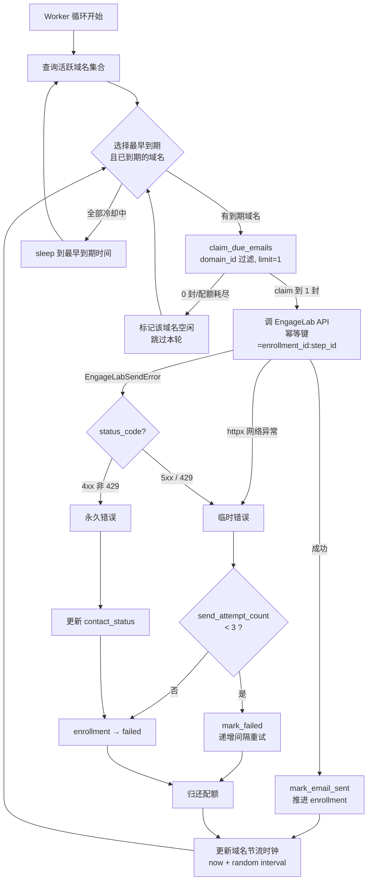

# feat: 逐封节流与发送可靠性

## Summary

在现有 SendingWorker 上补齐逐封节流（域名轮转 + 30-120s 随机延迟）、有限重试（临时/永久错误区分 + 3 次上限）、崩溃恢复（stale lock 清理）、配额回收、幂等性保护和结构化日志。改动集中在 4 个生产文件 + 1 个迁移 + 1 个新测试文件。

## Problem Frame

Worker 当前一次 claim 20 封并以最快速度连发，对冷邮件场景有域名信誉风险。同时失败后无限重试、崩溃导致永久死锁、配额不回收等可靠性缺口在规模化发送前必须堵住。(see origin: docs/brainstorms/2026-05-30-sending-throttle-reliability-requirements.md)

---

## Requirements

**逐封节流**

R1. 每次 claim 1 封，发完后按 `send_strategy.interval_seconds`（fallback `[30, 120]`）设置该域名的下次可发送时间。所有域名都在冷却中时才 sleep。
R2. 单 worker 按域名独立节流，内存状态，重启后重置。
R3. `claim_due_emails` 增加 `domain_id` 过滤，返回结果含 `domain_id` 和 `send_strategy`。

**失败重试**

R4. `sequence_enrollments` 加 `send_attempt_count`（默认 0）+ `status` 枚举加 `'failed'`。
R5. 临时错误（5xx、429、网络异常）重试 3 次，间隔递增（15min → 1h → 4h），耗尽标 `failed`。
R6. 永久错误（4xx 非 429）立即标 `failed`。前置：`EngageLabSendError` 携带 `status_code`。
R7. 永久错误时更新 `tenant_contacts.contact_status`（退信 → `bounced`，无效 → `invalid`）。

**崩溃恢复**

R8. 启动时释放 `locked` 超 30 分钟的 `email_send_locks`。
R9. 对应 `emails` 标 `failed(STALE_LOCK)`。

**配额与幂等**

R10. 失败后归还 `domain_daily_usage.reserved_count`。
R11. 用确定性幂等键 `enrollment_id:step_id`（需确认 EngageLab 支持）。

**可观测性**

R12. 关键操作输出结构化日志。

---

## Key Technical Decisions

**KTD1: 错误分类基于 HTTP 状态码，不依赖 EngageLab 特定错误码。** `EngageLabSendError` 新增 `status_code` 属性。Worker 用 `status_code` 判断：5xx/429 = 临时，其余 4xx = 永久，`httpx` 网络异常 = 临时。这比解析错误消息字符串更可靠，且不依赖 EngageLab 特定的 error code 文档。

**KTD2: 域名发现通过查询活跃 plan 的 domain_id 集合实现。** Worker 每轮循环前查询 `SELECT DISTINCT domain_id FROM sending_plans WHERE status = 'running'`，刷新内存中的域名列表。新增/停止的 plan 在下一轮自动生效。

**KTD3: 配额回收在 mark_email_failed 内原子执行。** 不新建方法，在现有 `mark_email_failed` 中增加 `UPDATE domain_daily_usage SET reserved_count = reserved_count - 1` 逻辑。同一个事务保证原子性。

**KTD4: `tenant_contacts.contact_status` 无 CHECK 约束，可直接写入新值。** R7 中的 `bounced` 已是现有值，`invalid` 为新增值。不需要迁移。收件人筛选已通过 `contact_status NOT IN ('unsubscribed', 'bounced')` 过滤，需扩展为包含 `'invalid'`。

**KTD5: 重试间隔通过数组映射实现，不用指数计算。** `RETRY_DELAYS = [timedelta(minutes=15), timedelta(hours=1), timedelta(hours=4)]`，按 `send_attempt_count` 索引。简单、可预测、可配置。

---

## High-Level Technical Design



---

## System-Wide Impact

**Enrollment 生命周期扩展。** `sequence_enrollments.status` 新增 `failed` 终态。所有读取 enrollment status 的查询（统计、列表、导出）需要处理新值。当前 `claim_due_emails` 只查 `status = 'active'`，不受影响。但 tenant 端发送计划详情页的 enrollment 统计（如"进行中 / 已完成 / 已退信"）需要新增"发送失败"类别的显示——这属于 Deferred to Follow-Up Work。

**Contact 质量信号传播。** 永久错误时 `tenant_contacts.contact_status` 可能被更新为 `bounced` 或 `invalid`。收件人筛选查询 `contact_status NOT IN ('unsubscribed', 'bounced')` 需扩展为包含 `'invalid'`，否则下次 plan 仍会选中无效联系人。此变更在 Deferred to Follow-Up Work 中跟踪。

**配额模型一致性。** 当前 `domain_daily_usage.sent_count` 只在 webhook `delivered` 回调中更新（不在 `mark_email_sent` 中）。本次只增加失败时的 `reserved_count` 回收（R10），不改变成功路径的配额流转。`reserved_count` 代表"已预扣但未最终确认"的数量，失败回收使其更准确。

---

## Scope Boundaries

- 不引入外部消息队列
- 不自动化预热曲线
- 不做发送优先级排序
- 不做发送速度的 UI 配置

### Deferred to Follow-Up Work

- 收件人筛选扩展 `contact_status NOT IN` 条件以包含 `'invalid'`（影响 plan 启动时的收件人选择，不影响本次发送逻辑改动）
- EngageLab idempotency key 支持确认（R11 fallback 已在 plan 中标注）

---

## Risks & Dependencies

- **EngageLab 幂等键支持未确认。** R11 需要 EngageLab API 支持 idempotency key。若不支持，降级为接受极低概率重复发送风险（worker 崩溃在 mark_email_sent 之前 + DB 写入失败的组合场景）。Plan 按"支持"路径设计实现，代码中标注 fallback 注释。
- **4xx 不全是收件人问题。** 400/401/403 可能是我们的配置错误而非收件人无效。实现时需在永久错误路径中只对特定 4xx（422 无效邮箱）更新 contact_status，其他 4xx 标 enrollment failed 但不改 contact。
- **Stale lock 与慢请求的竞争条件。** 若 EngageLab API 响应极慢（>30 分钟），旧 worker 仍在等待响应，新 worker 启动后释放 stale lock 并重发。两个 worker 都可能对同一 enrollment 回写结果。缓解方式：stale lock 超时（30 分钟）远大于 EngageLab 正常超时（`engagelab_timeout_seconds`，通常 30-60 秒）；若 API 真的卡了 30 分钟，原请求大概率已超时失败。此风险可接受但需在日志中记录 stale lock 恢复事件以便事后审计。

---

## Implementation Units

### U1. Schema 迁移

**Goal:** 为失败重试和崩溃恢复提供数据库基础。

**Requirements:** R4

**Dependencies:** 无

**Files:**
- `backend/alembic/versions/2026XXXX_add_send_attempt_count_and_failed_status.py`（新建）

**Approach:**
- 一个迁移文件完成两项变更
- `ALTER TABLE sequence_enrollments ADD COLUMN send_attempt_count int NOT NULL DEFAULT 0`
- 更新 `sequence_enrollments.status` CHECK 约束，追加 `'failed'` 到允许值列表
- 无数据回填，新列默认值 0

**Patterns to follow:** `backend/alembic/versions/20260529_0001_create_timezone_tables.py` 的迁移格式

**Test scenarios:**
- 迁移 upgrade 后 `send_attempt_count` 列存在且默认值为 0
- 可以写入 `status = 'failed'` 不报约束错误
- 迁移 downgrade 可回滚

**Verification:** `alembic upgrade head` 成功；手动 INSERT `status='failed'` 通过

---

### U2. EngageLabSendError 结构化改造

**Goal:** 让异常携带 HTTP 状态码，支持 Worker 做错误分类。

**Requirements:** R6（前置依赖）

**Dependencies:** 无

**Files:**
- `backend/app/integrations/engagelab.py`
- `backend/tests/test_sending_worker.py`（新建，U6 共用）

**Approach:**
- `EngageLabSendError.__init__` 增加 `status_code: int | None = None` 参数
- `send_email` 在 `raise EngageLabSendError(...)` 时传入 `response.status_code`
- 幂等键逻辑：在 `_build_request_body` 中消费 `payload.get("idempotency_key")`，添加到请求体（具体字段名待查 EngageLab 文档，若不支持则跳过此字段）

**Patterns to follow:** 现有 `EngageLabSendError` 类定义

**Test scenarios:**
- `EngageLabSendError` 实例可通过 `.status_code` 访问 HTTP 状态码
- `send_email` 对 4xx 响应抛出的异常携带正确的 status_code
- `send_email` 对 5xx 响应抛出的异常携带正确的 status_code
- 网络超时（`httpx.TimeoutException`）不被 `EngageLabSendError` 包裹，保持为独立异常类型

**Verification:** 所有现有 EngageLab 调用方行为不变（`status_code` 是可选参数）

---

### U3. claim_due_emails 域名过滤与数据扩展

**Goal:** 支持 Worker 按域名 claim，并返回 domain_id/send_strategy 供节流使用。

**Requirements:** R3

**Dependencies:** 无

**Files:**
- `backend/app/services/tenant_messaging_service.py`（`claim_due_emails` 方法）

**Approach:**
- `claim_due_emails` 新增 `domain_id: str | None = None` 参数
- 当 `domain_id` 非 None 时，SQL WHERE 加 `AND p.domain_id = :domain_id`
- SELECT 增加 `p.domain_id, p.send_strategy`
- 返回 items 中每项增加 `domain_id`、`send_strategy` 和 `enrollment_id` 字段（`enrollment_id` 当前 SELECT 有但未写入返回 dict，U6 构造幂等键需要它）
- 向后兼容：`domain_id=None` 时行为与当前完全一致

**Patterns to follow:** 现有 `claim_due_emails` 的参数扩展模式（如 `timezone_config`）

**Test scenarios:**
- `domain_id=None` 时行为不变（回归）
- `domain_id='xxx'` 时只返回该域名的 enrollment
- 返回结果每项包含 `domain_id` 和 `send_strategy` 字段
- `send_strategy` 为 null 时返回 null（不 fallback，fallback 由 Worker 侧做）

**Verification:** 现有 worker 不传 `domain_id` 时继续正常工作

---

### U4. mark_email_failed 增强

**Goal:** 支持有限重试（递增间隔）、错误分类（临时/永久）、配额回收和联系人状态更新。

**Requirements:** R4, R5, R6, R7, R10

**Dependencies:** U1（`send_attempt_count` 列和 `failed` 枚举）

**Files:**
- `backend/app/services/tenant_messaging_service.py`（`mark_email_failed` 方法 + `mark_email_sent` 方法增加 `send_attempt_count` 重置）

**Approach:**
- `mark_email_failed` 新增 `is_permanent: bool = False` 和 `domain_id: str | None = None` 参数
- `mark_email_sent` 中推进到下一步时增加 `SET send_attempt_count = 0`，确保重试计数不跨步骤累积
- 逻辑分支：
  - 临时错误（`is_permanent=False`）：`send_attempt_count += 1`，检查是否 <= 3。未到上限 → `next_step_due_at` 按 RETRY_DELAYS 数组设置；到上限（count > 3）→ `enrollment.status = 'failed'`
  - 永久错误（`is_permanent=True`）：直接 `enrollment.status = 'failed'`
- 永久错误时根据 `status_code` 判断 contact_status 更新：422（无效邮箱）→ `invalid`，其他特定 4xx（硬退信）→ `bounced`，400/401/403（配置错误）→ 不更新 contact
- 配额归还：`UPDATE domain_daily_usage SET reserved_count = GREATEST(reserved_count - 1, 0)` WHERE 匹配当日记录。用 `GREATEST` 防止负数。需要 `domain_id` 参数（从 claimed item 传入）
- 新增 `domain_id: str | None = None` 参数，配额回收时使用

**Patterns to follow:** 现有 `mark_email_sent` 中更新 `tenant_contacts.contact_status` 的模式（1884-1896 行）

**Test scenarios:**
- 临时错误第 1 次：`send_attempt_count` → 1，`next_step_due_at` = now + 15min
- 临时错误第 2 次：`send_attempt_count` → 2，`next_step_due_at` = now + 1h
- 临时错误第 3 次：`send_attempt_count` → 3，`next_step_due_at` = now + 4h
- 临时错误第 4 次：`enrollment.status` → `'failed'`
- Covers AE3. 递增重试：验证 4 次失败后 enrollment 终态为 failed
- 永久错误：`enrollment.status` 直接 → `'failed'`，不论 `send_attempt_count` 值
- Covers AE4. 永久错误：验证 enrollment 立即 failed + contact_status 更新
- 永久错误（邮箱无效）时 `contact_status` → `'invalid'`
- 永久错误（退信）时 `contact_status` → `'bounced'`
- 永久错误（401/403 配置问题）时不更新 `contact_status`
- 配额归还：`reserved_count` 减 1
- 配额归还边界：`reserved_count` 为 0 时不变为负数

**Verification:** `send_attempt_count` 在发送成功（enrollment 推进下一步）时重置为 0

---

### U5. Stale lock 恢复

**Goal:** Worker 启动时清理崩溃遗留的死锁。

**Requirements:** R8, R9

**Dependencies:** U1（`failed` 枚举）

**Files:**
- `backend/app/services/tenant_messaging_service.py`（新增 `recover_stale_locks` 方法）
- `backend/app/workers/sending.py`（启动时调用）

**Approach:**
- 新增 `TenantMessagingService.recover_stale_locks(conn, *, stale_minutes: int = 30) -> dict`
- SQL: `UPDATE email_send_locks SET status='released', released_at=now() WHERE status='locked' AND locked_at < now() - interval ':stale_minutes minutes' RETURNING enrollment_id, email_id`
- 对每个返回的 email_id: `UPDATE emails SET status='failed', error_code='STALE_LOCK' WHERE id=:email_id AND status='queued'`
- 返回 `{"recovered_count": N, "enrollment_ids": [...]}`
- Worker 在 `run_once` 首次调用前执行一次

**Patterns to follow:** `mark_email_failed` 中释放 lock 的模式

**Test scenarios:**
- Covers AE5. locked 超 30 分钟的锁被释放，email 标记 STALE_LOCK
- locked 未超 30 分钟的锁不被释放
- 无 stale lock 时返回 `recovered_count: 0`
- 释放后的 enrollment 可被重新 claim

**Verification:** 恢复后不存在 locked 超 30 分钟的 `email_send_locks` 记录

---

### U6. Worker 域名轮转与节流

**Goal:** 重写 Worker 循环，实现 claim-one-send-one + 域名轮转 + 逐封节流 + 结构化日志。

**Requirements:** R1, R2, R5, R6, R11, R12

**Dependencies:** U2, U3, U4, U5

**Files:**
- `backend/app/workers/sending.py`（重写 `run_once`，新增域名管理逻辑）
- `backend/scripts/run_sending_worker.py`（调整主循环）
- `backend/tests/test_sending_worker.py`（新建）

**Approach:**

Worker 内部状态：
- `domain_clocks: dict[str, datetime]` — 每个域名的下次可发送时间
- 启动时调用 `recover_stale_locks`（一次性）

每次循环迭代：
1. 查询活跃域名集合（`SELECT DISTINCT domain_id FROM sending_plans WHERE status='running'`）
2. 从 `domain_clocks` 中找到最早到期且已到期的域名
3. 如果没有到期域名，sleep 到最早到期时间
4. 对选定域名调用 `claim_due_emails(domain_id=..., limit=1)`
5. 如果 claim 结果为空（该域名无待发邮件），标记该域名下次检查时间为 now + 空闲轮询间隔（如 60s），回到步骤 2
6. 发送：调 EngageLab（传入 idempotency_key）
7. 根据结果调用 mark_email_sent 或 mark_email_failed（传入 `is_permanent` 和 `domain_id`）
8. 更新 `domain_clocks[domain_id]` = now + random(interval_seconds)
9. 输出结构化日志

错误分类逻辑：
- `except EngageLabSendError as exc`: 检查 `exc.status_code`
  - 5xx 或 429 → `is_permanent=False`
  - 其余 4xx → `is_permanent=True`
- `except (httpx.TimeoutException, httpx.ConnectError)` → `is_permanent=False`
- `except Exception` → `is_permanent=False`（兜底，保守当临时处理）

Runner script (`run_sending_worker.py`) 调整：
- 移除 `--limit` 参数（固定为 1）
- 移除 `--sleep-seconds` 参数（节流由域名时钟控制）
- 新增 `--idle-poll-seconds`（所有域名都冷却中时的 sleep 间隔，默认 5s）

结构化日志格式示例：
```json
{"event": "send_ok", "domain_id": "...", "email_id": "...", "elapsed_ms": 1234}
{"event": "send_failed", "domain_id": "...", "error_type": "temporary", "status_code": 503, "attempt": 2}
{"event": "throttle_sleep", "domain_id": "...", "sleep_seconds": 67.3}
{"event": "stale_lock_recovered", "count": 2, "enrollment_ids": ["...", "..."]}
```

**Patterns to follow:** 现有 `run_once` 的 claim → send → mark 流程

**Test scenarios:**
- Covers AE1. 单域名 5 封邮件：验证发送间隔在 [30, 120] 范围
- Covers AE2. 双域名轮转：域名 A 发完立即处理域名 B（如果 B 到期），A/B 各自保持独立间隔
- 所有域名冷却中时 sleep 到最早到期时间
- 域名无待发邮件时标记空闲并跳过
- 新域名（新 plan 启动）在下一轮循环自动发现
- plan 停止后域名从活跃列表消失
- `send_strategy.interval_seconds` 为 null 时 fallback 到 [30, 120]
- EngageLabSendError(status_code=503) 触发临时错误路径
- EngageLabSendError(status_code=422) 触发永久错误路径
- httpx.TimeoutException 触发临时错误路径
- 结构化日志包含 event、domain_id、elapsed_ms 等字段
- 启动时 stale lock 恢复被调用一次

**Verification:** Worker 循环在多域名场景下正确轮转，每个域名独立节流，错误分类和重试逻辑正确

---

## Acceptance Examples

从 origin document 携带，覆盖关系已在各 U 的 test scenarios 中标注。

- AE1. 单域名逐封节流 → U6
- AE2. 双域名轮转 → U6
- AE3. 临时错误递增重试 → U4
- AE4. 永久错误立即放弃 → U4
- AE5. 崩溃恢复 → U5 + U6

---

## Sources / Research

- Origin: `docs/brainstorms/2026-05-30-sending-throttle-reliability-requirements.md`
- 现有 worker: `backend/app/workers/sending.py`（123 行）
- 现有 claim 逻辑: `backend/app/services/tenant_messaging_service.py:1544`
- 现有失败处理: `backend/app/services/tenant_messaging_service.py:1954`
- EngageLab 集成: `backend/app/integrations/engagelab.py`
- `tenant_contacts.contact_status` 无 CHECK 约束，已用值: available / contacted / unsubscribed / bounced
- `domain_daily_usage` 配额模型: reserved_count / sent_count / failed_count / daily_limit
- CEO review Codex outside voice: 14 个发现，3 个关键问题已修复（schema 枚举、字段引用、R1/R2 歧义）

## Implementation Tasks
Synthesized from this review's findings. Each task derives from a specific
finding above. Run with Claude Code or Codex; checkbox as you ship.

- [ ] **T1 (P1, human: ~30min / CC: ~5min)** — worker — 401/403 错误分类为临时错误
  - Surfaced by: Architecture Review — D2: 401/403 是配置问题不是收件人问题，应当临时处理
  - Files: `backend/app/workers/sending.py`
  - Verify: 测试 EngageLabSendError(status_code=401) 走临时错误路径
- [ ] **T2 (P2, human: ~5min / CC: ~1min)** — plan — 修正 R4 描述为"失败时递增，成功时重置"
  - Surfaced by: Architecture Review — D4: R4 与 U4 语义不一致
  - Files: `docs/plans/2026-05-30-001-feat-sending-throttle-reliability-plan.md`
  - Verify: R4 文本与 U4 一致
- [ ] **T3 (P1, human: ~30min / CC: ~5min)** — tests — 补充 401/403 临时路径 + send_attempt_count 重置测试
  - Surfaced by: Test Review — D5: 3 个关键路径缺少回归测试
  - Files: `backend/tests/test_sending_worker.py`
  - Verify: pytest 通过
- [ ] **T4 (P1, human: ~1h / CC: ~10min)** — service — claim_due_emails 内部用较大 limit 避免队头阻塞
  - Surfaced by: Outside Voice — D7: limit=1 + condition check failure = 域名被卡死
  - Files: `backend/app/services/tenant_messaging_service.py`
  - Verify: 条件不满足的 enrollment 不阻塞同域名其他邮件
- [ ] **T5 (P1, human: ~10min / CC: ~2min)** — service — U5 SQL interval 改用 make_interval
  - Surfaced by: Outside Voice — D8: interval ':stale_minutes minutes' 无法被 SQLAlchemy 参数化
  - Files: `backend/app/services/tenant_messaging_service.py`
  - Verify: recover_stale_locks 执行不报 SQL 错误
- [ ] **T6 (P2, human: ~20min / CC: ~5min)** — service — mark_email_failed 增加 error_category 参数
  - Surfaced by: Outside Voice — D8: 接口只有 is_permanent 但 contact_status 更新需要 category
  - Files: `backend/app/services/tenant_messaging_service.py`
  - Verify: 422 → contact=invalid，退信 → contact=bounced，401/403 → 不更新 contact
- [ ] **T7 (P2, human: ~20min / CC: ~5min)** — service — U5 stale lock 恢复时回收 reserved_count
  - Surfaced by: Outside Voice — D8: recover_stale_locks 绕过了配额回收逻辑
  - Files: `backend/app/services/tenant_messaging_service.py`
  - Verify: stale lock 恢复后 reserved_count 正确递减
- [ ] **T8 (P2, human: ~30min / CC: ~5min)** — worker — Worker 注入 clock/sleep/random 依赖支持测试
  - Surfaced by: Outside Voice — D8: 随机延迟和 sleep 无法确定性测试
  - Files: `backend/app/workers/sending.py`, `backend/tests/test_sending_worker.py`
  - Verify: 测试不依赖真实 sleep/random，运行快且确定性

## GSTACK REVIEW REPORT

| Review | Trigger | Why | Runs | Status | Findings |
|--------|---------|-----|------|--------|----------|
| CEO Review | `/plan-ceo-review` | Scope & strategy | 1 | CLEAR | mode: HOLD_SCOPE, 0 critical gaps |
| Codex Review | `/codex review` | Independent 2nd opinion | 2 | ISSUES_FOUND | 14 findings, 3/14 fixed |
| Eng Review | `/plan-eng-review` | Architecture & tests (required) | 1 | CLEAR | 8 issues, 1 critical gap |
| Design Review | `/plan-design-review` | UI/UX gaps | 0 | — | — |
| DX Review | `/plan-devex-review` | Developer experience gaps | 0 | — | — |

- **CODEX:** 14 个发现，关键问题：队头阻塞（已修复）、SQL 参数化（已修复）、接口设计（已修复）、配额泄漏（已修复）
- **CROSS-MODEL:** 主审查发现 4 个问题（D2-D5），Codex 独立发现 5 个额外问题（D7-D8），无冲突，互补性强
- **UNRESOLVED:** 0 — 所有决策已由用户确认（D2-D9）
- **VERDICT:** CEO + ENG CLEARED — ready to implement
