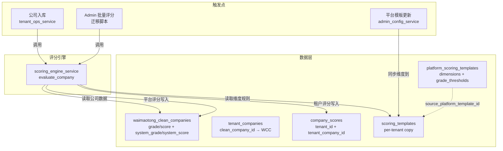

# feat: 双评级体系统一与系统评分引擎

## Summary

将 AI 大模型评级（X/A/B）和评分模板评级（S/A/B/C/D）统一命名为「大模型评级/评分」和「系统评级/评分」，在 admin 和 tenant 端四列并排展示。构建基于 `scoring_templates` 维度规则的评分引擎，增强两端模板管理，实现平台→租户自动同步，并对存量数据一次性回填。

---

## Problem Frame

系统中两套评级体系命名混乱、功能不完整（see origin: `docs/brainstorms/2026-06-13-dual-rating-system-unification-requirements.md`）。大模型评级已有数据但缺少统一命名；评分模板体系 DB 就绪但评分引擎从未运行（`company_scores` 和 `scoring_jobs` 均为空）。前端 `GRADE_COLORS` 散落 5 处且颜色不一致。Tenant 端评分设置只能改第一个维度权重。

---

## Requirements

**命名与展示统一**

R1. 所有公司列表页中现有「评级/评分」列重命名为「大模型评级/大模型评分」。
R2. 新增「系统评级」（S/A/B/C/D）和「系统评分」（总分）两列并排展示。
R3. 涉及页面：admin 客户数据页、tenant 公司列表页、精选客户页、添加公司弹窗。
R4. 评级颜色收拢到 shared-ui `RatingTag`，各页面不再自定义 `GRADE_COLORS`。

**评分计算引擎**

R5. 逐维度匹配公司数据，绝对分制求和（不乘权重），按阈值映射为 S/A/B/C/D 等级。
R6. 只处理 `type=rule` 维度，`type=llm` 跳过计分。
R7. 租户评分结果写入 `company_scores`。Admin 平台评分写入 `waimaotong_clean_companies.system_grade/system_score`。
R8. 公司入库时自动触发评分。
R9. 部署时对存量 27,011 家 `tenant_companies` 一次性回填。

**评分模板管理增强**

R10. Admin DimensionEditor 正确读取和保存完整条件类型结构（`condition`、`value`、`min`、`max`）。
R11. Tenant 端只可编辑等级阈值（S/A/B/C/D 分数线），不能编辑维度权重、不能增删维度或改条件规则。后端强制校验只接受 grade_thresholds 更新。
R12. 平台模板更新时自动同步维度结构到关联租户，保留租户自定义权重/阈值。
R13. 同步后递增租户模板版本号并写入版本记录。

**数据清理**

R14. 替换刘辉租户的「电路板 默认评分模板」为平台模板副本。

---

## Key Technical Decisions

**KTD1: Admin 平台评分存储在 `waimaotong_clean_companies` 表。** 新增 `system_grade char(1)` 和 `system_score integer` 列，与现有 `grade`/`score`（大模型评级）并列。避免 `company_scores` 表的 `tenant_company_id` 外键约束问题——admin 数据不属于任何租户。

**KTD2: 评分引擎作为服务层同步函数。** 27k 公司纯规则计算（7 维条件匹配 + 加权求和）耗时可忽略，无需异步队列。在 `tenant_ops_service` 入库流程中直接调用。`scoring_jobs` 表暂不使用，留给未来 LLM 维度评分。

**KTD3: 绝对分制，不使用权重乘法。** 维度得分 = `condition.score`，直接求和。Tenant 端不再编辑维度权重，只编辑等级阈值。`tenant_scoring_weights` 表不使用。

**KTD4: 平台同步保留租户自定义阈值。** 同步时按 `dimension.key` 匹配：用平台的维度结构（conditions/name/hint）覆盖租户的维度结构。阈值完全保留租户自定义。同步后自动对该租户所有公司重新评分。

**KTD5: 存量回填用 Alembic 迁移脚本，内嵌评分逻辑。** 迁移脚本自包含一份精简的评分计算代码，不导入应用层服务，保证迁移幂等性。

**KTD6: Tenant 端后端只接受 grade_thresholds 更新。** `update_scoring_template` 对 tenant 调用者只处理 `grade_thresholds` 参数，忽略 `dimensions` 参数，防止租户绕过前端只读限制篡改条件规则。

**KTD7: 未知条件类型记录警告，得分为 0。** 评分引擎遇到未知 condition 类型时 log warning 并返回该维度得分 0，不静默走 default 条件。

**KTD8: company_scores 每公司一条当前评分。** 评分写入使用 UPSERT（ON CONFLICT DO UPDATE），模板版本变更时更新 `template_version_id` 和评分结果，保证 LEFT JOIN 不会返回多行。

**KTD9: company_scores 需增加完整索引。** 现有唯一索引是 partial index（WHERE is_retry=false），LEFT JOIN 场景下可能不被使用。新增 `CREATE INDEX idx_company_scores_tc_id ON company_scores(tenant_company_id)` 完整索引。

---

## High-Level Technical Design



**评分计算流程：**

```
对每个维度 dimension in template.dimensions:
  if dimension.type == 'llm': skip (score = 0)
  if 未知 condition 类型: log warning, score = 0
  遍历 dimension.conditions:
    匹配条件类型 (factory_type_in / employee_num_range / ...)
    → 首个命中的 condition 取其 score（绝对分制，不乘权重）
total_score = sum(dimension_scores)
grade = 按 grade_thresholds 降序匹配首个 ≤ total_score 的等级
```

---

## Scope Boundaries

- LLM 维度评分不在本次范围（遇到跳过，得分 0）
- 不修改大模型评级计算逻辑，只做前端命名统一
- 不新增系统评级筛选器（后续迭代）
- 不涉及评分对业务流程的影响（如按评级分配发送优先级）
- `scoring_jobs` 表暂不使用

### Deferred to Follow-Up Work

- 系统评级筛选器（前端 filter 面板增加 S/A/B/C/D 多选）
- LLM 维度评分引擎（启用 `scoring_jobs` 队列 + worker）
- 评分结果驱动业务逻辑（发送优先级、自动分组）

---

## Implementation Units

### U1. 数据库迁移 — 加列 + 数据清理

**Goal:** 为 `waimaotong_clean_companies` 新增系统评分列，替换刘辉租户的废弃模板。

**Requirements:** R7, R14

**Dependencies:** 无

**Files:**
- `backend/alembic/versions/20260614_0001_add_system_scoring_columns.py` (新建)

**Approach:**
- `ALTER TABLE waimaotong_clean_companies ADD COLUMN IF NOT EXISTS system_grade char(1), ADD COLUMN IF NOT EXISTS system_score integer`
- `CREATE INDEX IF NOT EXISTS idx_company_scores_tc_id ON company_scores(tenant_company_id)` — 确保 LEFT JOIN 命中完整索引
- 替换刘辉租户模板：DELETE 旧记录 + INSERT 从平台模板复制（复用 `_copy_platform_scoring_template` 的 SQL 逻辑）
- 使用 `exec_driver_sql` 执行原生 SQL（参考历史经验：避免 Alembic 高级 API 的约束检查问题）

**Patterns to follow:** `backend/alembic/versions/20260519_0044_sync_waimaotong_online_columns.py` 的 `ADD COLUMN IF NOT EXISTS` 模式

**Test scenarios:**
- 迁移 upgrade 后 `waimaotong_clean_companies` 有 `system_grade`/`system_score` 列，默认 NULL
- 刘辉租户的 `scoring_templates` 记录 `source_platform_template_id` 指向平台模板，dimensions 为 7 维规则型

**Verification:** `alembic upgrade head` 成功；查询确认列存在和模板已替换

---

### U2. 评分引擎核心服务

**Goal:** 实现基于评分模板维度规则的公司评分计算函数。

**Requirements:** R5, R6

**Dependencies:** 无（纯逻辑，不依赖数据库变更）

**Files:**
- `backend/app/services/scoring_engine_service.py` (新建)

**Approach:**
创建 `ScoringEngineService` 类，核心方法：
- `evaluate_company(dimensions, grade_thresholds, company_data) -> {total_score, grade, dimension_scores}` — 纯计算函数，不涉及 DB
- `_evaluate_dimension(dimension, company_data) -> {key, score, matched_condition}` — 逐维度匹配
- `_match_condition(condition, company_data) -> bool` — 条件匹配器，支持已知的 8 种条件类型

条件类型映射：
| condition 类型 | 匹配逻辑 | 数据字段 |
|---|---|---|
| `factory_type_in` | `company.factory_type in condition.value` | factory_type |
| `employee_num_range` | `min <= employee_num <= max` | employee_size |
| `trade_amount_3y_usd_range` | `min <= trade_amount <= max` | trade_amount_3y_usd |
| `trade_count_range` | `min <= trade_count <= max` | trade_count |
| `has_contact` | `contacts_count > 0` | contacts_count |
| `source_table_contains` | `source_table in data_source_tags` | data_source_tags |
| `has_china_pcb_supplier` | `pcb_suppliers 含中国供应商` | pcb_suppliers |
| `default` | 始终匹配（兜底） | — |

每个维度取首个命中条件的 score。维度最终得分 = `condition.score`（绝对分制，当前模板无权重乘法）。等级映射按 `grade_thresholds` 降序遍历，首个 `total_score >= threshold` 的等级即为结果。

**Execution note:** 先写条件匹配器的单元测试，再实现计算逻辑。

**Test scenarios:**
- 7 维全匹配的公司（如大型 PCB 制造商）得分 ≥ 90，评级 S
- 全部不匹配的公司（只命中 default 条件）得分接近 0，评级 D
- `type=llm` 的维度被跳过，该维度得分为 0
- 单个维度有多个条件时，匹配首个命中的条件
- `employee_num_range` 边界值测试（min=51, max=499 的边界）
- `grade_thresholds` 映射：score=90 → S，score=89 → A，score=70 → A，score=69 → B
- `company_data` 字段缺失时（None），该维度走 default 条件

**Verification:** 所有单元测试通过；用生产模板数据手工验算几家公司的评分结果

---

### U3. 租户评分写入与入库触发

**Goal:** 公司入库时自动调用评分引擎，结果写入 `company_scores`。

**Requirements:** R7, R8

**Dependencies:** U2

**Files:**
- `backend/app/services/scoring_engine_service.py` (修改 — 添加 DB 写入方法)
- `backend/app/services/tenant_ops_service.py` (修改 — 入库后触发评分)

**Approach:**
- `ScoringEngineService.score_tenant_company(conn, tenant_id, tenant_company_id)` — 查询租户 active 模板 + 公司数据 → 调用 `evaluate_company` → INSERT INTO `company_scores`
- 在 `tenant_ops_service.create_company()` 末尾调用（INSERT `tenant_companies` 成功后）
- 在 `tenant_ops_service.batch_import_companies()` 中批量调用
- 评分失败不阻塞入库（try/except 记录日志，公司入库成功但评分为空）

公司数据查询：通过 `tenant_companies.clean_company_id` JOIN `waimaotong_clean_companies` 获取评分所需字段。

**Test scenarios:**
- 手动添加公司后 `company_scores` 有对应记录，grade 和 total_score 正确
- 批量导入 N 家公司后 `company_scores` 有 N 条记录
- 租户无 active 模板时跳过评分（不报错）
- 评分引擎异常时公司入库成功但 `company_scores` 无记录（降级）
- 同一 `tenant_company_id` 重复评分时 UPSERT（更新旧记录）

**Verification:** 手动添加一家公司，确认 `company_scores` 自动产生评分记录

---

### U4. Admin 平台评分写入

**Goal:** 为 admin 端的 `waimaotong_clean_companies` 数据使用平台模板评分。

**Requirements:** R7, R9

**Dependencies:** U1, U2

**Files:**
- `backend/app/services/scoring_engine_service.py` (修改 — 添加平台评分方法)
- `backend/app/services/admin_collection_service.py` (修改 — 列表查询返回 system_grade/system_score)

**Approach:**
- `ScoringEngineService.score_clean_company(conn, clean_company_id)` — 查询平台 active 模板 + 公司数据 → 调用 `evaluate_company` → UPDATE `waimaotong_clean_companies` SET `system_grade`, `system_score`
- `admin_collection_service.list_wmt_clean_companies()` 的 SELECT 已包含 `grade, score`，追加 `system_grade, system_score`

**Test scenarios:**
- 评分后 `waimaotong_clean_companies.system_grade` 和 `system_score` 非 NULL
- 无 active 平台模板时跳过评分
- 评分结果与手工按模板规则计算一致

**Verification:** 对几家已知公司调用评分，对比 system_grade 与手工计算结果

---

### U5. 平台模板→租户自动同步

**Goal:** Admin 更新平台模板时，自动将维度结构同步到所有关联租户。

**Requirements:** R12, R13

**Dependencies:** 无

**Files:**
- `backend/app/services/admin_config_service.py` (修改 — `update_platform_scoring_template` 末尾追加同步逻辑)

**Approach:**
在 `update_platform_scoring_template()` 方法末尾：
1. 查询 `SELECT id, tenant_id, dimensions, grade_thresholds, version FROM scoring_templates WHERE source_platform_template_id = :platform_template_id`
2. 对每个租户模板执行同步：
   - 新 dimensions 按 `key` 匹配旧 dimensions
   - 已有维度：保留租户的 weight，用平台的 conditions/name/hint 覆盖
   - 新增维度：整个维度从平台复制（含 weight）
   - 平台删除的维度：从租户移除
   - grade_thresholds 完全保留租户自定义
3. UPDATE `scoring_templates` SET dimensions, version=version+1
4. INSERT INTO `scoring_template_versions` 记录变更（change_reason='platform sync'）

**Test scenarios:**
- 平台新增维度后，关联租户的 dimensions 包含新维度，weight 为平台默认值
- 平台修改维度条件后，租户的条件更新但 weight 保留原值（包括 weight=0 的情况）
- 平台删除维度后，租户的 dimensions 不再包含该维度
- 无关联租户时（`source_platform_template_id IS NULL`）不受影响
- 版本号递增且版本记录已写入

- 同步后，租户的 `company_scores` 记录已更新为基于新模板版本的评分

**Verification:** 修改平台模板，查询租户模板确认维度结构已同步；查询 company_scores 确认评分已基于新模板重新计算

---

### U6. Admin DimensionEditor 修复

**Goal:** 使 Admin 端维度编辑器能正确处理完整的条件结构。

**Requirements:** R10

**Dependencies:** 无

**Files:**
- `frontend/apps/admin/src/app/(dashboard)/scoring-templates/client-page.tsx` (修改)

**Approach:**
当前 `DimensionEditor` 的 `Dimension` 类型只有 `{key, name, weight, conditions: {label, score}[]}`，丢失了 `condition`、`value`、`min`、`max`、`hint` 字段。

修改方案：
- 扩展 `Dimension` 类型：`conditions` 项增加 `condition: string`、`value?: any`、`min?: number`、`max?: number`
- `normalizeDimensions()` 函数保留源数据的所有字段（不只取 label/score）
- 编辑器 UI 中条件行增加 `condition` 类型选择和 `value`/`min`/`max` 输入
- 保存时序列化完整结构回传后端

**Patterns to follow:** 现有 `normalizeDimensions()` 的映射逻辑，扩展而非重写

**Test scenarios:**
- 加载现有 PCB 模板时，每个条件显示完整的 condition/value/min/max
- 编辑条件的 score 后保存，condition/value/min/max 不丢失
- 新增条件时可选择 condition 类型并填写对应参数
- 预览 JSON 显示完整结构

**Verification:** 编辑平台模板保存后，重新加载确认条件类型结构完整

---

### U7. Tenant 评分设置增强

**Goal:** Tenant 端可编辑等级阈值。

**Requirements:** R11

**Dependencies:** 无

**Files:**
- `frontend/apps/tenant/src/app/(dashboard)/settings/scoring/page.tsx` (修改)
- `backend/app/services/tenant_settings_service.py` (修改 — 对 tenant 调用限制只接受 grade_thresholds)

**Approach:**
前端：
- 移除维度权重编辑区（绝对分制下无意义）
- 展示所有维度名称和条件规则为只读列表（让租户了解评分依据）
- 新增等级阈值编辑区（S/A/B/C/D 五个数字输入框）
- mutation 只提交 `{grade_thresholds: {...}}`

后端：
- `update_scoring_template` 对 tenant 调用者只处理 `grade_thresholds` 参数
- 忽略传入的 `dimensions` 参数（防止篡改条件规则）

**Patterns to follow:** admin 端 `scoring-templates/client-page.tsx` 的等级阈值编辑 UI

**Test scenarios:**
- 等级阈值输入框可见且可编辑
- 修改等级阈值 A 从 70 到 75 后保存，刷新页面阈值为 75
- 维度名称和条件规则为只读展示
- 后端拒绝 tenant 调用者修改 dimensions（传 dimensions 参数无效果）

**Verification:** 修改阈值后刷新，确认值已持久化；用 curl 直接发 dimensions 修改请求确认被忽略

---

### U8. 前端评级展示统一

**Goal:** 四列并排展示，颜色统一收拢到 shared-ui。

**Requirements:** R1, R2, R3, R4

**Dependencies:** U9（后端 API 返回 system_grade/system_score 字段）

**Files:**
- `frontend/packages/shared-ui/src/RatingTag.tsx` (修改 — 增加大模型评级色系)
- `frontend/packages/shared-types/src/enums.ts` (修改 — 如需更新类型)
- `frontend/packages/shared-api/src/tenant/companies.ts` (修改 — Company 类型增加 system_grade/system_score)
- `frontend/packages/shared-api/src/admin/collection.ts` (修改 — 响应类型)
- `frontend/apps/admin/src/app/(dashboard)/collection/customers/client-page.tsx` (修改)
- `frontend/apps/tenant/src/app/(dashboard)/companies/page.tsx` (修改)
- `frontend/apps/tenant/src/app/(dashboard)/curated-customers/page.tsx` (修改)
- `frontend/apps/tenant/src/app/(dashboard)/curated-customers/add-company-modal.tsx` (修改)

**Approach:**
1. `RatingTag` 组件扩展：新增 `variant` prop（`'system' | 'model'`），分别使用不同色系
   - system（S/A/B/C/D）：沿用现有 `RatingTag` 颜色（amber/emerald/sky/orange/slate）
   - model（X/A/B）：新增色系（red/green/blue 或类似）
2. 删除各页面的本地 `GRADE_COLORS` 定义，改用 `<RatingTag>`
3. 列名更改：「评级」→「大模型评级」，「评分」→「大模型评分」，新增「系统评级」「系统评分」
4. 后端 API 已返回 `grade`/`wmt_score`（大模型），新增返回 `system_grade`/`system_score`

**Test scenarios:**
- Admin 客户数据页显示四列：大模型评级(X/A/B) | 大模型评分 | 系统评级(S/A/B/C/D) | 系统评分
- Tenant 公司列表页同样四列展示
- 大模型评级和系统评级使用不同色系，视觉可区分
- 评分为 NULL 时显示 `-`
- 精选客户页和添加公司弹窗同步更新
- 各页面不再有本地 `GRADE_COLORS` 定义

**Verification:** 启动 dev server，在 admin 和 tenant 端各页面确认四列展示正确、颜色统一

---

### U9. 后端 API 返回系统评分字段

**Goal:** 公司列表 API 返回 `system_grade` 和 `system_score` 字段。

**Requirements:** R2, R7

**Dependencies:** U1

**Files:**
- `backend/app/services/tenant_query_service.py` (修改 — 公司列表查询 JOIN company_scores)
- `backend/app/services/admin_collection_service.py` (修改 — 已在 U4 涉及，追加 system_grade/system_score 到响应)
- `backend/app/api/tenant/ops.py` (可能需修改 — 筛选器选项增加 system grades)

**Approach:**

Tenant 端：`tenant_query_service.companies_page()` 的 SQL 新增 LEFT JOIN：
```
LEFT JOIN company_scores cs ON cs.tenant_company_id = tc.id AND cs.is_retry = false
```
SELECT 追加 `cs.grade AS system_grade, cs.total_score AS system_score`。

Admin 端：`admin_collection_service.list_wmt_clean_companies()` 的 SELECT 已直接读 `waimaotong_clean_companies` 列，追加 `system_grade, system_score`（U1 加的列）。

**Test scenarios:**
- Tenant 公司列表 API 返回 `system_grade` 和 `system_score` 字段
- 未评分的公司返回 `system_grade: null, system_score: null`
- Admin 公司列表 API 返回 `system_grade` 和 `system_score`
- LEFT JOIN 不影响已有查询性能（`company_scores` 有 `tenant_company_id` 唯一索引）

**Verification:** curl 调用公司列表 API，确认响应中包含新字段

---

### U10. 存量数据回填

**Goal:** 部署时对所有存量 tenant_companies 和 waimaotong_clean_companies 一次性评分。

**Requirements:** R9（回填对应原 R10）

**Dependencies:** U1, U2, U3, U4

**Files:**
- `backend/alembic/versions/20260614_0002_backfill_system_scores.py` (新建)

**Approach:**
迁移脚本分两步：

1. **平台级回填**：用平台 active 模板对所有 `waimaotong_clean_companies`（约 10,747 条有 grade 的记录）执行评分，写入 `system_grade`/`system_score`
2. **租户级回填**：遍历所有租户，用各自 active 模板对其 `tenant_companies` 执行评分，写入 `company_scores`

迁移脚本内嵌一份精简的评分计算逻辑（自包含，不导入 `scoring_engine_service`），保证迁移幂等性。使用 Python 循环逐条评分。分批 commit（每 1000 条 commit 一次）避免长事务。

**Test scenarios:**
- 迁移后 `waimaotong_clean_companies` 中所有行的 `system_grade`/`system_score` 非 NULL（有平台 active 模板时）
- 迁移后每个租户的 `company_scores` 行数等于其 `tenant_companies` 行数
- 评分结果与 U2 单条评分一致（随机抽查几条）
- 无 active 模板的租户跳过（不报错）

**Verification:** 迁移完成后统计 `company_scores` 行数与 `tenant_companies` 总数一致；抽查评分正确

---

## Risks & Dependencies

| 风险 | 缓解措施 |
|------|---------|
| `company_scores` 表有 RESTRICT FK 到 `tenant_companies`——批量操作需注意依赖顺序 | 回填使用 INSERT（不涉及 DELETE/UPDATE 父表），无 FK 冲突风险 |
| `waimaotong_clean_companies` 不在 schema.sql 管理，加列可能与外部管道冲突 | 使用 `ADD COLUMN IF NOT EXISTS` 幂等模式 |
| 回填 27k 条评分的迁移执行时间 | 纯规则计算预估 < 30s，在 `alembic upgrade head` 窗口内完成 |
| asyncpg 参数语法陷阱（`:param::type` 不工作） | 使用 `CAST(:param AS type)` 替代（参考历史经验） |
| Admin DimensionEditor 保存后结构变化导致评分引擎不兼容 | 评分引擎对未知条件类型 log warning + 该维度得分 0（不静默降级） |
| `company_scores` partial index 在 LEFT JOIN 中不被使用 | U1 迁移中新增完整索引 `idx_company_scores_tc_id` |
| 模板同步后旧评分过时 | 同步逻辑末尾自动触发该租户所有公司重新评分 |
| Tenant 端可能绕过前端只读限制篡改 dimensions | 后端 `update_scoring_template` 对 tenant 调用者只接受 `grade_thresholds` |

---

## Open Questions

- 评分引擎的条件匹配中，`has_china_pcb_supplier` 需要从 `waimaotong_clean_companies.pcb_suppliers` 字段判断——需确认该字段的数据格式（JSON array? text array? 含 "China" 关键词？），实现时按实际数据适配
- `source_table_contains` 条件匹配 `data_source_tags`——需确认该字段实际存储的值与条件 `value` 的对应关系

---

## Sources / Research

- 评分模板维度定义（新格式 7 维）：`backend/alembic/versions/20260507_0030_scoring_dimensions_new_format.py`
- 租户创建时模板复制：`backend/app/services/tenant_service.py:285-347`
- 公司入库触发点：`backend/app/services/tenant_ops_service.py:115-252`
- 平台模板更新入口：`backend/app/services/admin_config_service.py:424-492`
- Admin 公司列表查询：`backend/app/services/admin_collection_service.py:1876-1909`
- Tenant 公司列表查询：`backend/app/services/tenant_query_service.py:142-422`
- `company_scores` 表结构（含 RESTRICT FK）：`backend/03_database/schema.sql` L794-815
- FK 清理模式经验：`docs/solutions/database-issues/alembic-non-cascade-fk-chain-blocks-tenant-delete-2026-05-19.md`
- asyncpg 参数陷阱：`docs/solutions/runtime-errors/asyncpg-named-param-cast-syntax-error-20260507.md`

---

## NOT in scope

- LLM 维度评分引擎（`scoring_jobs` 队列 + worker）——当前只有一个租户模板含 LLM 维度且是废弃模板
- 系统评级筛选器（前端 filter 面板增加 S/A/B/C/D 多选）——后续迭代
- 评分结果驱动业务逻辑（发送优先级、自动分组）——只做展示
- OpenAPI 自动类型生成——已在 TODOS.md backlog 中，不在本次捆绑
- `tenant_scoring_weights` 表的使用——绝对分制下无意义

---

## What already exists

| 已有组件 | 计划复用方式 |
|---------|------------|
| `company_scores` 表（完整结构，含 RESTRICT FK） | 直接使用，新增完整索引 |
| `scoring_templates` 表（租户级，3 条数据） | 直接使用，存储评分模板 |
| `platform_scoring_templates` 表（1 条 PCB 模板） | 直接使用，作为评分源 |
| `_copy_platform_scoring_template()` SQL 逻辑 | U1 数据清理复用 |
| `tenant_settings_service.update_scoring_template()` | U7 后端已支持，只需限制参数 |
| shared-ui `RatingTag` 组件 | U8 扩展 variant prop |
| 公司列表 API 已返回 `grade`/`wmt_score`/`score` | U9 追加 system_grade/system_score |

## GSTACK REVIEW REPORT

| Review | Trigger | Why | Runs | Status | Findings |
|--------|---------|-----|------|--------|----------|
| CEO Review | `/plan-ceo-review` | Scope & strategy | 0 | — | — |
| Codex Review | `/codex review` | Independent 2nd opinion | 0 | — | — |
| Eng Review | `/plan-eng-review` | Architecture & tests (required) | 1 | CLEAR | 7 issues found (D1-D7 resolved), 0 critical gaps |
| Design Review | `/plan-design-review` | UI/UX gaps | 0 | — | — |
| DX Review | `/plan-devex-review` | Developer experience gaps | 0 | — | — |

**CODEX:** 16 findings from Codex outside voice; 3 already resolved by prior review (D1-D3); 4 new findings accepted (D8-D10 + dependency fix); 9 acknowledged but out of scope or already addressed.

**VERDICT:** ENG CLEARED — ready to implement.

NO UNRESOLVED DECISIONS
