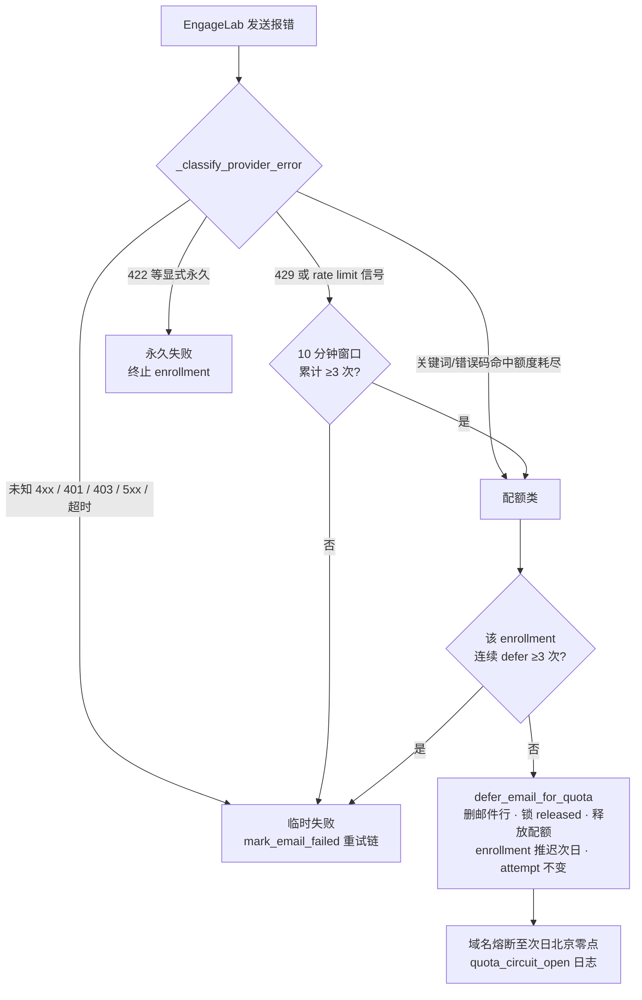
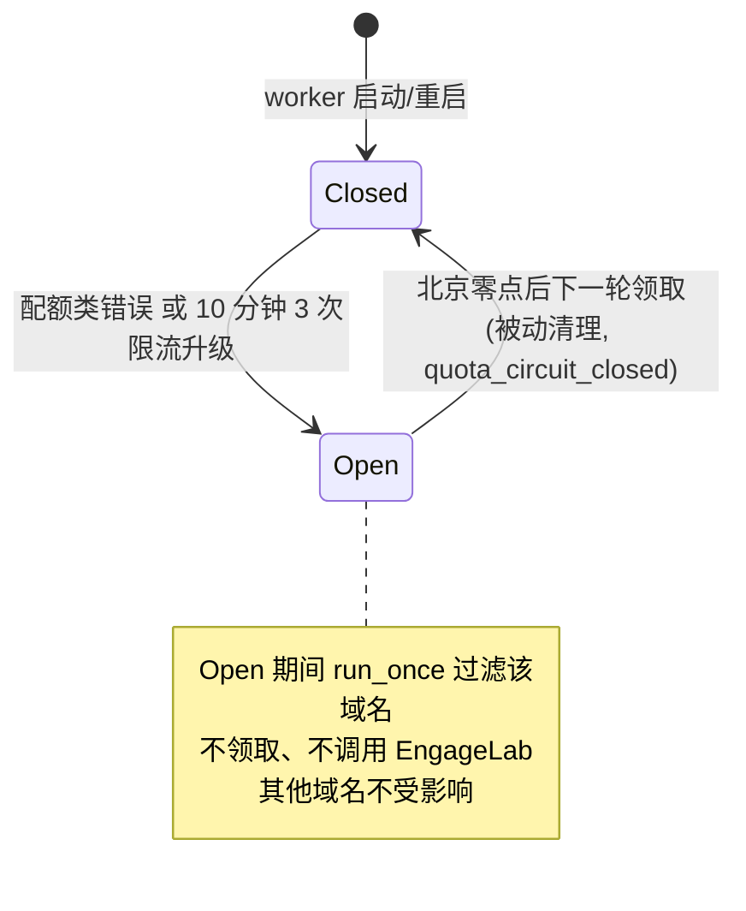

# 配额级联故障修复（熔断+分类+口径+窗口对齐） - Plan

## Goal Capsule

- **目标**：在 2026-07-06 到期波峰（2,857 封）之前，把 OpenSpec change `fix-quota-exhaustion-cascade` 实现到**可部署状态**：全部验收场景有先行失败再通过的测试、`uv run pytest -q` 与 `uv run ruff check` 全绿、Neon 开发库冒烟通过、openspec tasks 勾选完毕。
- **权威层级**：openspec specs（行为契约）> openspec design（实现决策）> 本计划（执行细节）。发现冲突或歧义时停下询问用户，不自行补完。
- **执行姿态**：TDD——每个实现单元先写映射 spec GIVEN/WHEN/THEN 的失败测试，再实现到通过。
- **停止条件**：需要生产库写操作或部署动作时停（用户触发）；触碰 `email-status-reconciliation` 未归档代码的交界且无法绕开时停。
- **收尾归属**：实现完成后运行 verification-before-completion 输出「原始需求 → 已实现/未实现」对照；镜像构建与 Sealos 部署由用户触发（openspec tasks 第 7 组）。

---

## Product Contract

### Summary

修复 2026-07-02 生产配额级联事故的四个根因：发送 worker 对 EngageLab 额度耗尽错误增加按域名熔断（当天停发、次日北京零点自动恢复）；错误分类区分「额度耗尽/瞬时限流/未知 4xx」，不再把配额错误判为永久失败；配额错误改为删除未发出邮件行并由 enrollment 推迟驱动次日重建；仪表盘三处「已发送/计费」口径剔除 `failed`；本地配额窗口对齐北京自然日。

### Problem Frame

2026-07-02 晚 EngageLab 账户余额耗尽（HTTP 400 + code 30877 "your account balance is not enough"）后，worker 因「失败释放本地配额」整夜空转，把 13,950 封排队邮件逐封发送、逐封被拒、全部打成 `failed` 且误判永久失败终止了 13,913 个 enrollment；仪表盘把这批未发出的邮件计入「已发送/计费」（显示 22,679，实发 8,729）。事故数据、错误签名、时区错位均已在生产库与日志实证，设计决策已在 origin change 定案并经三视角评审加固。

### Requirements

**错误分类**

- R1. worker MUST 区分额度耗尽与瞬时限流：错误信息命中已校准关键词（`balance is not enough`、`recharge soon`、`"code": 30877`，兜底 `daily quota`/`quota exceeded`/`配额`/`余额不足`/`已达上限`）或命中 `QUOTA_STATUS_CODES` → 配额类（临时、触发熔断）。
- R2. 单次 HTTP 429 或 `rate limit`/`too many requests` MUST 走既有重试链不熔断；同一域名 10 分钟窗口内限流+配额判定累计达 3 次 MUST 升级为当天熔断。
- R3. 未知 4xx MUST 默认临时失败（走 15m/1h/4h 重试链）；422 维持永久 invalid、401/403/5xx 维持临时，行为不变。

**熔断**

- R4. 识别到额度耗尽后该域名 MUST 当天熔断停发（北京自然日），次日由领取循环被动自动恢复（空闲轮询秒级）；熔断状态为进程内存态，重启丢失后首封配额错误即重新熔断（至多多一次探测调用）。
- R5. 熔断 MUST 只影响触发域名，其他域名正常发送。

**配额错误的邮件处理**

- R6. 配额类错误 MUST NOT 产生失败记录：删除未发出的邮件行（`sent_at`/`engagelab_message_id` 为 NULL），锁置 `released`，释放本地预留配额，enrollment 保持 `active`、`next_step_due_at` 推迟到次日北京零点、不消耗 `send_attempt_count`；次日由领取流程按原步骤重新生成。
- R7. 同一 enrollment 连续配额 defer 达 3 次后，后续配额类错误 MUST 降级为临时失败处理（消耗 attempt、走重试链）。

**配额窗口**

- R8. `domain_daily_usage` 全部读写（配额门、预留、释放、今日统计）MUST 以北京自然日为窗口；单个北京日放行量不得因窗口错位翻倍，熔断恢复不得被前一窗口余量阻塞。

**仪表盘口径**

- R9. 仪表盘全部三处「已发送」（发送统计、计划概览、每日配额）与「计费数」MUST 剔除 `status='failed'`；`targets` 维持 `COUNT(*)`；百分比分母联动；口径为查询时过滤、历史区间自动适用。

**质量约束**

- R10. 全部验收场景 MUST 有对应测试（TDD 先行）；不新增数据库 schema；不引入新测试依赖（无 freezegun/testcontainers）。

### Acceptance Examples

验收场景的事实源是 origin change 的两个 spec 文件，GIVEN/WHEN/THEN 原文不在此复述；下表建立 AE 索引供测试场景 `Covers` 引用。

| AE | spec 场景 | 来源 |
|----|-----------|------|
| AE1 | 命中额度耗尽关键词识别为配额类（2026-07-02 实测签名） | specs/sending-quota-circuit-breaker/spec.md |
| AE2 | 单次 429 瞬时限流走重试链不熔断 | 同上 |
| AE3 | 短窗内连续限流升级为熔断 | 同上 |
| AE4 | 普通业务错误（422）不误判为配额类 | 同上 |
| AE5 | 熔断后停止领取邮件 | 同上 |
| AE6 | 次日自动恢复 | 同上 |
| AE7 | 熔断只影响触发域名 | 同上 |
| AE8 | worker 重启后熔断状态重建 | 同上 |
| AE9 | 熔断恢复时本地窗口同步翻转 | 同上 |
| AE10 | 单个北京日不跨窗口翻倍放行 | 同上 |
| AE11 | 配额类错误不留失败记录、次日重新生成 | 同上 |
| AE12 | 本地预留配额正确回退 | 同上 |
| AE13 | 连续第 4 次配额类错误降级为临时失败 | 同上 |
| AE14 | 未知 4xx 走重试链 | 同上 |
| AE15 | 显式永久错误（422）维持原判 | 同上 |
| AE16 | failed 不计入已发送与计费 | specs/dashboard-email-stats/spec.md |
| AE17 | 百分比分母联动新口径 | 同上 |
| AE18 | 全部失败时不除零 | 同上 |
| AE19 | 同屏各卡片口径一致 | 同上 |

### Scope Boundaries

**Deferred to Follow-Up Work**

- 事故数据修复（13,940 个被终止 enrollment 的恢复补发）——已立项 `openspec/changes/restore-quota-incident-enrollments`，后置于本 change 上线。
- 熔断的运营可见性（管理端事件/通知 + 积压暴露）——用户已决策暂不立项，挂在 origin design 的 Open Questions。
- EngageLab 主动配额查询 API 的评估。

**非目标**

- 不修改 webhook 处理与对账逻辑（active change `email-status-reconciliation` 负责）。
- 不调整 `daily_limit` 取值与域名预热策略（窗口时区对齐除外）。
- 不新增数据库 schema、不引入分布式协调。
- 不包含镜像构建与 Sealos 部署动作（用户按 openspec tasks 第 7 组触发）。

---

## Planning Contract

### Key Technical Decisions

- KTD1. **分类判定顺序与常量已用生产日志校准**（origin design D1）：日配额关键词 → `QUOTA_STATUS_CODES`（保持为空，额度错误走 HTTP 400 太泛）→ 429/限流信号走重试链 → 10 分钟 3 次升级 → 未知 4xx 临时。`_classify_provider_error` 保持纯同步函数、扩展签名接收 `error_message`。
- KTD2. **三个计数/状态均为 worker 进程内存态**（origin design D2/D3）：`domain_quota_paused`（域名→恢复时间）、限流升级滑动计数（域名→近 10 分钟命中时刻）、连续 defer 计数（enrollment→次数）。重启丢失可接受（首封错误即重建，defer 计数重启最多多一轮）。
- KTD3. **删除重建载体**（origin design D3）：配额错误删除未发出邮件行，恢复完全由 `sequence_enrollments.next_step_due_at` 驱动次日重新生成——与 `claim_due_emails`「每次领取新建行」同构。`emails` 无任何外键引用（已在开发库 `pg_constraint` 验证），DELETE 安全；emails 为分区表，DELETE 必须带 `WHERE id = :email_id AND created_at = :created_at` 双条件（仓库既有 UPDATE 同款）。
- KTD4. **北京日窗口在 Python 端计算后传参**（origin design D5，本计划落定）：模块级 helper 以 `ZoneInfo("Asia/Shanghai")` 从可注入的 `now_utc` 求当日（先例 `backend/app/services/admin_collection_service.py` 的 `_BEIJING_TZ`），替换 SQL 端 `CURRENT_DATE` 与 Python 端 `date.today()`。理由：纯 mock 测试体系下 SQL 表达式不可测、参数可直接断言；asyncpg 对 `:param::type` 有已知陷阱（docs/solutions/runtime-errors/asyncpg-named-param-cast-syntax-error-20260507.md）。**Compute-once 不变量**：每个逻辑配额操作（一轮 claim、单次预留、单次释放、单次 defer）在入口处调用一次 helper，同一个 `usage_date` 贯穿该操作内全部 SQL 语句——禁止同一事务的配额流中多次独立取值（原 SQL `CURRENT_DATE` 锚定事务开始时刻天然稳定，Python 端必须显式保住这一语义，否则跨 16:00Z 的 claim 批次会把预留分裂到两个北京日、留下幽灵预留）；`claim_due_emails` 在循环外取一次日期传入逐封 reserve。helper 对 naive datetime 一律抛 `ValueError` 拒绝（与可注入 `now_utc` 的显式契约一致）。
- KTD5. **口径修改点共五处 SQL**（origin design D4）：`backend/app/services/tenant_query_service.py` 的 summary（~834）、daily（~867）、plan_overview 两处（~920/933）、daily_quota（~990），FILTER 统一为 `status NOT IN ('draft','pending','queued','failed')`；`targets`/`billing`/百分比公式不动。
- KTD6. **测试策略沿用仓库纯 mock 惯例**：分类用纯同步测试；service 用 FakeConn 按 SQL 文本分发（样板 `backend/tests/test_webhook_service_engagelab_provider_event_id.py`）；worker 用注入 `_Clock`/`_Provider`/`_Service`/`_Engine`（样板 `backend/tests/test_sending_worker.py`）；统计用 AsyncMock side_effect 链（样板 `backend/tests/test_dashboard_email_stats.py`）。SQL 真实语义由 U6 的 Neon 开发库冒烟兜底（AGENTS.md 要求真实链路验证）。
- KTD7. **配置读取用 patch 不改 env**：`get_settings` 是 `@lru_cache`（backend/app/core/config.py），测试改配置必须 `patch(...get_settings)`（样板 `backend/tests/test_worker_instance_isolation.py` 的 autouse fixture）。

### Assumptions

- EngageLab 档位额度为账户级预付费余额型，充值由用户负责（2026-07-03 已决策）；若余额未恢复，熔断每天一次探测即重开，属预期行为。
- sending worker 为**每实例一个进程**（多实例部署阶段 2 已在生产落地：`instance_id` 迁移已应用，现有 3 租户均属 `default`/Instance A）；worker 按 `t.instance_id` 过滤域名，A/B 域名集合互斥——每个域名的熔断/计数状态只存在于其所属实例的 worker 内存，正确性不受多实例影响。同实例内仍为单进程；若未来单实例扩多副本，熔断按进程独立、代价有界。
- Instance B 的 EngageLab 账号是否与 A 共用由其部署环境变量决定（`ENGAGELAB_API_USER/KEY`）：共用则余额为两实例共享，各实例 worker 各自熔断自己的域名（design 账户级分析自动覆盖），充值/提档需按 A+B 总量评估；独立账号则完全隔离。B 当前无租户，接入前需确认。

### Sequencing

U1（分类）、U2（defer 服务）、U3（窗口对齐）无相互依赖，但 U2 与 U3 都触碰 `_release_reserved_quota`，按 U2 → U3 顺序落避免自我冲突；U4（熔断）依赖 U1+U2+U3；U5（口径）完全独立可穿插；U6 收尾验证在最后。

### High-Level Technical Design

发送错误处理决策流（实现后的完整路径）：

熔断状态机（域名粒度、worker 内存态）：

---

## Implementation Units

### U1. 服务商错误分类修正

- **Goal**：`_classify_provider_error` 能区分额度耗尽/瞬时限流/未知 4xx/显式永久四类，常量按生产日志校准值落码。
- **Requirements**：R1、R2（分类部分）、R3。
- **Dependencies**：无。
- **Files**：`backend/app/workers/sending.py`（改）、`backend/tests/test_provider_error_classification.py`（新建）。
- **Approach**：签名扩展为 `(status_code, error_message)`；新增模块级常量 `QUOTA_KEYWORDS`（含实测值与兜底词）、`RATE_LIMIT_SIGNALS`、`QUOTA_STATUS_CODES`（空）；判定顺序按 KTD1；保持纯同步函数（返回 dict 增加 `error_type='quota'|'rate_limit'|...`）。10 分钟升级计数是有状态逻辑，归 U4，不在本单元。调用点传参改动（`str(exc)` 作为 error_message）随本单元一并落。
- **Execution note**：TDD——先写纯同步失败测试再实现（先例：`backend/tests/test_email_send_interval.py` 直接同步调私有方法）。
- **Test scenarios**：
  - Covers AE1. HTTP 400 + 实测响应体（含 `"code": 30877` 与 "balance is not enough"）→ `error_category='quota'`、`is_permanent=False`。
  - Covers AE2（分类部分）. HTTP 429、无配额关键词 → 临时、`error_type='rate_limit'`、不判 quota。
  - Covers AE4/AE15. HTTP 422 → 维持 `is_permanent=True`、`error_category='invalid'`。
  - Covers AE14. HTTP 456 未知码、无关键词 → 临时失败。
  - 边界：关键词大小写混合命中；中文兜底词（`余额不足`）命中；`error_message=None`/空串不崩溃走状态码分支；`status_code=None`（网络异常路径）→ 临时；5xx → 临时（行为不变回归断言）。
- **Verification**：`uv run pytest tests/test_provider_error_classification.py -q` 全绿；既有 `tests/test_sending_worker.py` 不回归。

### U2. defer_email_for_quota 服务方法

- **Goal**：新增配额 defer 服务方法：删行、放锁、退配额、推迟 enrollment，四表联动一个事务内完成。
- **Requirements**：R6。
- **Dependencies**：无（建议先于 U3 落，见 Sequencing）。
- **Files**：`backend/app/services/tenant_messaging_service.py`（改）、`backend/tests/test_quota_defer_service.py`（新建）。
- **Approach**：结构参照同文件 `mark_email_failed`（`_load_email` → 邮件操作 → 锁 → `_release_reserved_quota` → enrollment）。差异点：防御校验 `sent_at`/`engagelab_message_id` 必须为 NULL 才可删（已发出的邮件拒绝 defer 并报错）；`DELETE FROM emails WHERE id = :email_id AND created_at = :created_at`（分区表双条件，KTD3）；锁 `UPDATE email_send_locks SET status='released', email_id=NULL`（与 claim 复用逻辑一致）；enrollment `next_step_due_at = :resume_at`、不动 `send_attempt_count`、状态保持 `active`。
- **Execution note**：TDD——FakeConn 按 SQL 文本分发（`"DELETE FROM emails"`/`"email_send_locks"`/`"domain_daily_usage"`/`"sequence_enrollments"`），录制 executions 逐条断言。
- **Test scenarios**：
  - Covers AE11. 正常 defer：四表语句齐发、DELETE 带双条件参数、enrollment 参数含 `resume_at` 且无 attempt 变更、返回值状态标记 deferred。
  - Covers AE12. `_release_reserved_quota` 被调用且 `reserved_count` 递减语句参数正确（domain_id 解析含 plan 回查分支）。
  - 错误路径：邮件已有 `sent_at` → 拒绝并抛错、无任何写操作；邮件不存在（`_load_email` 空）→ 明确报错；锁行不存在 → 不影响其余步骤（语句仍发出，0 行受影响可接受）。
- **Verification**：`uv run pytest tests/test_quota_defer_service.py -q` 全绿。

### U3. 配额窗口对齐北京自然日

- **Goal**：`domain_daily_usage` 全部读写与每日配额统计按北京日窗口，日期由 Python 端计算传参。
- **Requirements**：R8。
- **Dependencies**：U2（同文件 `_release_reserved_quota` 交集，避免并行改动冲突）。
- **Files**：`backend/app/services/tenant_messaging_service.py`（改：配额门/预留/释放）、`backend/app/services/tenant_query_service.py`（改：daily_quota 的 `date.today()`）、`backend/tests/test_domain_quota_window.py`（新建）。
- **Approach**：新增模块级 helper（如 `beijing_today(now_utc: datetime | None = None) -> date`，默认 `datetime.now(UTC)`，naive datetime 抛 `ValueError`；签名模式沿用 `is_sendable_now` 的可注入 `now_utc` 先例；`ZoneInfo("Asia/Shanghai")` 参照 `admin_collection_service._BEIJING_TZ`）；所有 `usage_date = CURRENT_DATE` SQL 改为 `usage_date = :usage_date` 传参，并遵守 KTD4 的 compute-once 不变量（每个逻辑操作入口取一次、贯穿全部语句；claim 循环外取一次传入逐封 reserve）。**daily_quota 单列处理**：该卡的 used 查询对象是 `emails.created_at`（timestamptz）范围而非 `domain_daily_usage`——只换日期取值仍会把边界落在「北京日期标签的 UTC 零点」（北京 00:00–08:00 恒为 0、其余时段每天漏计前 8 小时）；必须传**北京日零点/次日零点的带时区 datetime 瞬时**（`datetime.combine(beijing_today(now_utc), time.min, tzinfo=ZoneInfo("Asia/Shanghai"))` 与次日同式，asyncpg 按 timestamptz 绑定、与会话时区无关）。
- **Execution note**：TDD——注入 `now_utc` 断言 execute 参数，覆盖 UTC 16:00（北京零点）边界两侧。
- **Test scenarios**：
  - Covers AE9. `now_utc = 2026-07-02T16:30Z`（北京 7 月 3 日 00:30）→ 配额门/预留/释放的 `usage_date` 参数均为 `2026-07-03`。
  - Covers AE10. `now_utc = 2026-07-02T15:59Z`（北京 23:59）→ `usage_date=2026-07-02`；`16:01Z` → `2026-07-03`——同一北京日内窗口不因 UTC 翻转拆分。
  - Compute-once：同一次 claim/defer 流程内多条配额语句的 `usage_date` 参数完全一致（模拟入口时刻恰在 15:59:59Z、语句执行跨越 16:00Z，断言不分裂）。
  - daily_quota 边界瞬时：`now_utc = 2026-07-03T01:00Z`（北京 09:00）→ `:today = 2026-07-02T16:00:00Z`、`:tomorrow = 2026-07-03T16:00:00Z`（等值的北京零点 aware datetime）；北京 00:30（`16:30Z`）时窗口起点为当日 16:00Z 前一日——两侧各一例。
  - helper 防御：naive datetime 抛 `ValueError`。
  - 回归：`reserve_domain_quota` 超限仍抛 `AppError(code="QUOTA_EXCEEDED")` 行为不变。
- **Verification**：`uv run pytest tests/test_domain_quota_window.py -q` 全绿；既有涉及配额的测试不回归。

### U4. 发送 worker 熔断机制

- **Goal**：worker 识别配额类错误后按域名熔断至次日北京零点，配额错误走 defer 而非 mark_email_failed，含升级计数、defer 上限、结构化日志。
- **Requirements**：R2（升级部分）、R4、R5、R7。
- **Dependencies**：U1、U2、U3。
- **Files**：`backend/app/workers/sending.py`（改）、`backend/tests/test_sending_worker.py`（扩展）。
- **Approach**：`SendingWorker.__init__` 新增 `domain_quota_paused: dict[str, datetime]`、限流滑动窗计数 `dict[str, list[datetime]]`、defer 连续计数 `dict[str, int]`（KTD2）。
  - **过滤位置与全熔断分支**：`run_once` 在构建候选域名后、**现有空列表检查之前**过滤 `now < paused_until`（过期条目顺手清理、记 `quota_circuit_closed`）；过滤后候选为空走**显式分支**——记 `all_domains_quota_paused` 结构化日志 + 按 `idle_poll_seconds` 睡眠后返回空结果，**空列表绝不允许流入 `_select_due_domain` 之后的 `min()` 调用**（`sending.py:81` 对空列表抛 `ValueError`，主循环无 try/except，进程会直接退出——共享额度耗尽时全熔断是常态路径而非边角）。
  - **异常路由**：发送异常分支按 U1 分类结果路由——`quota` 且 defer 计数 <3 → `service.defer_email_for_quota` + 置 `paused_until=次日北京零点`（用注入 `clock` 计算，复用 U3 helper）+ 记 `quota_circuit_open`；`quota` 且计数 ≥3 → 走既有 `mark_email_failed` 临时分支（**降级时不置 `paused_until`、不熔断域名**——AE13 的显式取舍，与流程图 DC→是→T 一致）；`rate_limit` → 记滑动窗，满 3 次视同 quota，否则走既有临时分支。
  - **内存态生命周期**：defer 计数在每次成功调用 `defer_email_for_quota` 后 +1；该 enrollment 出现 `send_ok` 时删除条目（即清零）；**非配额临时失败不清零**（「连续」仅被成功发送中断，最大化防毒药语义）；enrollment 走到永久终止分支时删除条目。滑动窗 list 在每次判定时先裁剪掉 10 分钟以前的时间戳再计数。配额事件即时熔断、不入滑动窗（以代码注释固定，防按 R2 字面重构）。
  - 注意：`run_once` 现有 `domain_clocks` 重建逻辑对新 dict 的清理交互；熔断代码不得抛未捕获异常（主循环每 120 轮内联跑 ReconciliationWorker，见 Risks）。
- **Execution note**：TDD——沿用既有 `_Clock`（`advance` 推进跨天）/`_Provider(error=EngageLabSendError("...", status_code=400))`/`_Service`/`_Engine` fakes 与 `log_sink` 断言；重启场景 = new 一个 SendingWorker 实例。
- **Test scenarios**：
  - Covers AE5. 域名 A 熔断后下一轮 `run_once` 不领取 A、不调 provider，`log` 含 `quota_circuit_open`（domain_id/paused_until/错误摘要）。
  - Covers AE6. `_Clock.advance` 跨过北京零点后下一轮恢复领取，首轮记 `quota_circuit_closed`。
  - Covers AE7. A 熔断、B 正常：B 照常领取发送。
  - Covers AE8. 重启（新实例）后 A 的第一封被配额错误拒绝 → 立即重新熔断且走 defer（不标 failed、enrollment 不终止）。
  - Covers AE2（worker 部分）. 单次 429 → 走 mark_email_failed 临时重试链，域名不熔断。
  - Covers AE3. 10 分钟内第 3 次限流 → 升级熔断；窗口滑出（第 3 次距首两次 >10 分钟）→ 不升级。
  - Covers AE13. 同一 enrollment 连续 3 次 defer 后第 4 次配额错误 → 走临时失败分支（attempt+1）且**不置 `paused_until`、域名不熔断**；`send_ok` 后计数条目删除（清零）；非配额临时失败（如一次 5xx）**不清零**，第 4 次配额错误仍降级。
  - 全部熔断：A、B 两域名均熔断 → `run_once` 不抛异常、不调 provider，记 `all_domains_quota_paused` 并按 idle 睡眠返回空结果。
  - 异常安全：`defer_email_for_quota` 自身抛错时 worker 不崩溃（降级记日志走临时失败）。
- **Verification**：`uv run pytest tests/test_sending_worker.py -q` 全绿（既有 20+ 用例零回归）。

### U5. 仪表盘「已发送」口径三处剔除 failed

- **Goal**：五处 SQL FILTER 统一剔除 failed，三个接口同屏口径一致。
- **Requirements**：R9。
- **Dependencies**：无（可与 U1-U4 并行）。
- **Files**：`backend/app/services/tenant_query_service.py`（改）、`backend/tests/test_dashboard_email_stats.py`（扩展）、`backend/tests/test_dashboard_sent_scope.py`（新建，承载 plan_overview 与 daily_quota 的口径断言）。
- **Approach**：KTD5 五处 FILTER 加 `'failed'`；`targets`/`billing`/百分比公式与 `EXPECTED_SUMMARY_KEYS` 不动；测试沿用 `_make_summary_row`/`_mock_conn(side_effect=[...])` 工厂样式 + SQL 文本断言（五处均含 `'failed'`）+ 参数断言。
- **Execution note**：TDD——先在既有测试文件加失败用例（新口径断言），实现后转绿。
- **Test scenarios**：
  - Covers AE16. summary 与 daily 的 sent FILTER SQL 文本含 `'failed'`；mock 行数据下 `sent`/`billing` 返回值与新口径一致。
  - Covers AE17. `delivered_percent` 以剔除 failed 后的 sent 为分母（mock: sent=80、delivered=60 → 75.0）。
  - Covers AE18. sent=0（全 failed）→ 各百分比为 0 不除零（既有除零测试对齐新口径）。
  - Covers AE19. `plan_overview` 两处 `emails_sent` 与 `daily_quota` 已发送的 SQL 文本均含 `'failed'`，三接口口径一致。
  - 回归：13 字段完整性断言（`EXPECTED_SUMMARY_KEYS`）不变。
- **Verification**：`uv run pytest tests/test_dashboard_email_stats.py tests/test_dashboard_sent_scope.py -q` 全绿。

### U6. 全链路验证与 openspec 收尾

- **Goal**：mock 测不到的 SQL 真实语义在 Neon 开发库冒烟验证；openspec change 收尾对照。
- **Requirements**：R10（验证面）。
- **Dependencies**：U1-U5。
- **Files**：无生产代码改动；冒烟脚本临时化（不入库）或记录执行过程于 PR 描述。
- **Approach**：**脚本化三组断言**（脚本放 scratchpad 或 change 目录、不入生产代码库，执行输出存档进 change 或 PR 描述），连 `CLIENTGET_DEV_DATABASE_URL`（Neon）执行——
  - (a) **口径组**：插入覆盖 delivered/bounced/failed/queued 的样例 emails 行，调用 `email_stats_by_date_range`、`plan_overview` 的**计划级与租户级两条分支**、`daily_quota`，断言 targets/sent/billing 与百分比；补一条跨 16:00Z 的样例行归属断言（验证 daily_quota 的 aware datetime 边界）。
  - (b) **窗口组**：以边界 `now_utc` 调用配额预留/释放，读回 `domain_daily_usage.usage_date` 验证北京日归属；增加「前一北京日行已满额时，新日首次预留经 INSERT 回退分支正常放行」断言（AE9『恢复不被前一日余量阻塞』的强覆盖）。
  - (c) **defer 回路组**（全 change 唯一全新 SQL 写路径，mock 只能证文本、组合语义必须在真实 SQL 前跑过）：插入样例 enrollment/lock/email，调用 `defer_email_for_quota` 断言四表落库（email 行确实删除、锁 `released` 且 `email_id` 置 NULL、`reserved_count` 回退、`next_step_due_at` 推迟且 attempt 不变）；再把 `next_step_due_at` 拨到过期后调用 `claim_due_emails`，断言重新上锁并重建邮件行（次日重建回路闭环）。
  - 前置条件：emails 表启用 RLS——用 owner 角色连接或先经 `app/db/rls.py:set_current_tenant` 设定租户上下文；样例行复用既有 dev 租户/联系人 id，避免另造外键链。结束清理样例数据。**明确不做**真实发送（不触发 EngageLab）。
  - 随后勾选 `openspec/changes/fix-quota-exhaustion-cascade/tasks.md` 第 2-6 组任务，运行 verification-before-completion 输出对照，`openspec status` 确认可进入 /opsx:verify。
- **Test expectation**: none —— 验证性单元，无新增生产行为。
- **Verification**：冒烟三组断言通过并留存记录；`uv run pytest -q` 全量与 `uv run ruff check` 全绿；对照输出无「未实现」项（或明确列出理由）。

---

## Verification Contract

| 检查 | 命令/方式 | 适用 | 通过标准 |
|------|-----------|------|----------|
| 单元测试全量 | `cd backend && uv run pytest -q` | U1-U5 每单元完成时 + U6 收尾 | 全绿，既有 241 例零回归 |
| Lint | `cd backend && uv run ruff check` | 每单元完成时 | 0 违规（I 规则含 import 排序，行宽 100） |
| 场景追踪 | 人工核对 AE 索引 | U6 | AE1-AE19 每项至少一个 `Covers` 测试且先红后绿 |
| SQL 真实语义冒烟 | Neon 开发库脚本化三组断言（U6 Approach：口径/窗口/defer 回路） | U6 | 三组断言全部通过，执行输出存档 |
| 需求对照 | verification-before-completion skill | U6 | 「原始需求 → 已实现/未实现」逐条对照输出 |
| 部署后正反核对 | openspec tasks 7.2（不在本计划 DoD） | 用户触发 | 正向见 `quota_circuit_*` 日志；反向无「连续 4xx 而无熔断」 |

---

## Definition of Done

- AE1-AE19 全部有先失败后通过的测试；新测试文件遵循平铺 `backend/tests/test_<主题>.py`、中文 docstring、显式 `@pytest.mark.asyncio`（异步用例）惯例。
- `uv run pytest -q` 与 `uv run ruff check` 全绿。
- Neon 冒烟三组断言（口径/窗口/defer 回路）通过，执行记录留存（PR 描述或 change 内）。
- `openspec/changes/fix-quota-exhaustion-cascade/tasks.md` 第 2-6 组勾选完毕；verification-before-completion 已运行且无未解释的「未实现」。
- origin design 与实现一致（含 D5 的 Python 端传参修订）；无残留实验代码、调试输出或死代码。
- 明确不含：镜像构建、Sealos 部署、生产数据操作（均由用户触发）；数据修复与运营可见性（独立 change）。

---

## Risks & Dependencies

- **与 `email-status-reconciliation` 的交界**：该 change 代码已落地未归档（`backend/app/workers/reconciliation.py`、`email_reconciliation_service.py`），且 `run_sending_worker.py` 主循环每 120 轮内联调用 ReconciliationWorker。本计划只新增方法与内存态、不触碰 webhook/对账路径；U4 的异常安全场景防止熔断异常拖垮对账节奏。发现无法绕开的冲突即停（Goal Capsule 停止条件）。
- **mock 测不出 SQL 语义**：五处 FILTER 与窗口参数的单测只能断言 SQL 文本/参数，语义正确性由 U6 Neon 冒烟兜底——跳过 U6 视为未完成。
- **参数穿透的涟漪**：U3 把 `usage_date` 从 SQL 端挪到参数，涉及配额语句的调用链签名需要小幅穿透；用默认值参数控制改动面，若发现扩散超出 `tenant_messaging_service.py` 内部则停下重估。
- **时间约束**：07-06 有 2,857 封到期波峰，部署窗口在 07-05 前最稳；07-03/04/05 各有 72/276/266 封按旧逻辑发送（余额已由用户安排充值，不依赖本计划）。
- **多实例部署交叠**：修复上线时 backend 与 sending worker 镜像必须 **Instance A、B 两套都更新**（Sealos 各自服务），否则未更新实例的 worker 在配额耗尽时按事故行为空转（域名互斥不产生数据错乱，但防护缺口敞开）；main 与生产基线已对齐（`20260625_0100` 已应用），本修复不捆绑迁移。

---

## Sources & Research

- Origin：`openspec/changes/fix-quota-exhaustion-cascade/`（proposal/design/specs/tasks，经三视角文档评审 15 项发现加固）。
- 生产日志校准：2026-07-02 15:10Z 起风暴日志（HTTP 400、EngageLab code 30877、"your account balance is not enough,please recharge soon"；1000 行样本 `send_attempt_count=0` 与库内 13,913 封吻合）。
- 生产/开发库实证：事故数据分布（8,729 实发 / 13,950 failed）；`emails` 无外键引用（`pg_constraint`）；会话时区 UTC；active enrollment 到期分布（07-06 波峰 2,857）。
- 测试基建研究：`backend/tests/` 全内存 mock（241 例）、conftest 仅 env 兜底、三种 mock 样板（`test_sending_worker.py`/`test_webhook_service_engagelab_provider_event_id.py`/`test_dashboard_email_stats.py`）、无 freezegun、CI 不跑测试（验证全靠本地）。
- 机构知识：`docs/solutions/runtime-errors/asyncpg-named-param-cast-syntax-error-20260507.md`（KTD4 依据）；`docs/solutions/database-issues/alembic-non-cascade-fk-chain-blocks-tenant-delete-2026-05-19.md`（删除链路先查 `pg_constraint` 的方法，已执行）。
